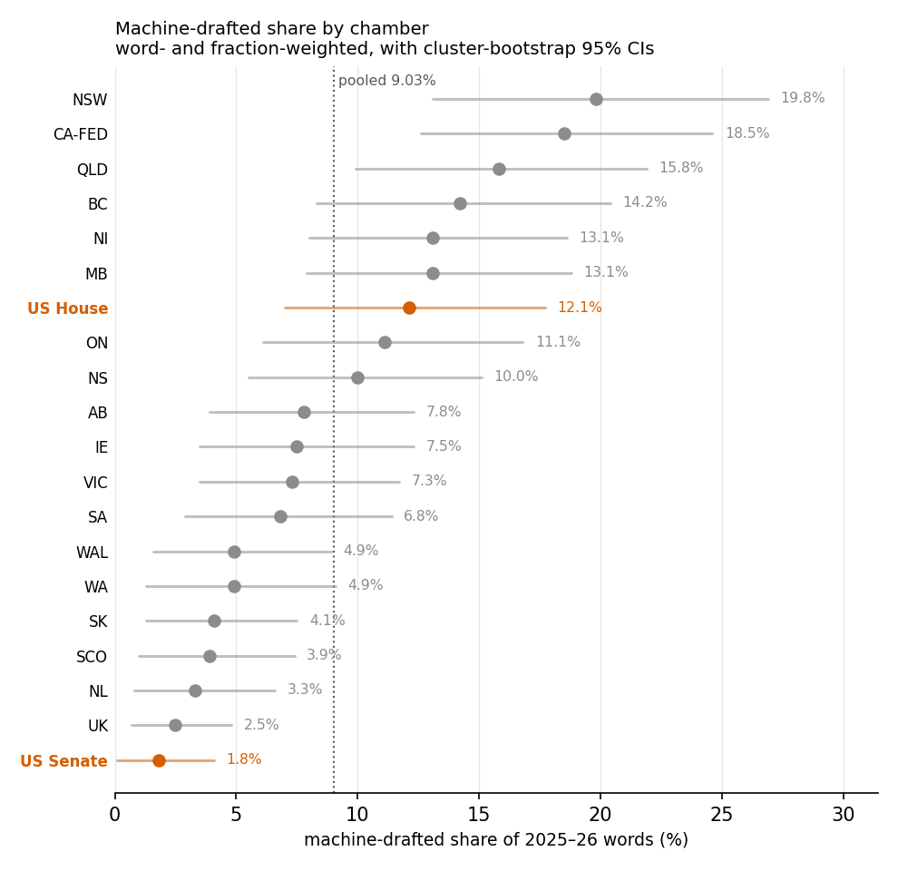
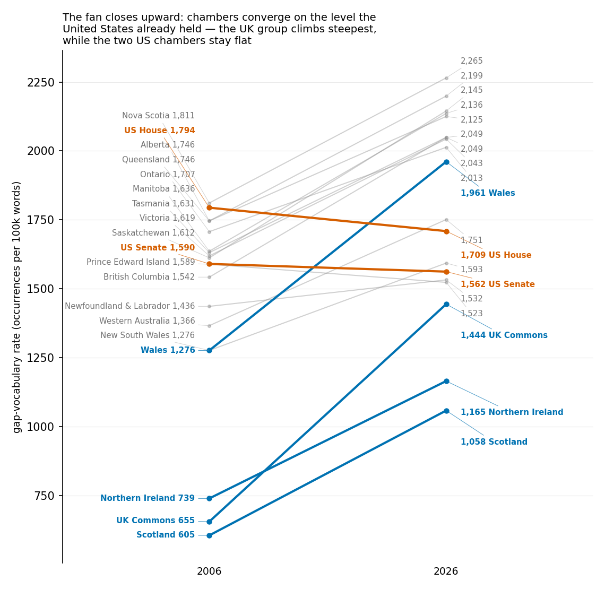
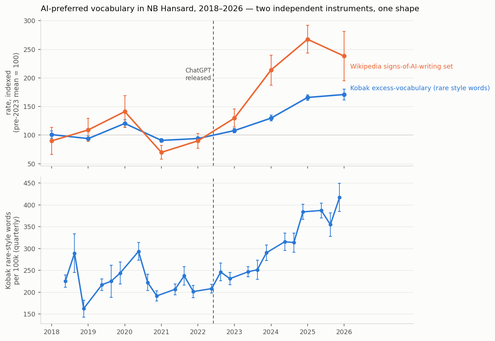
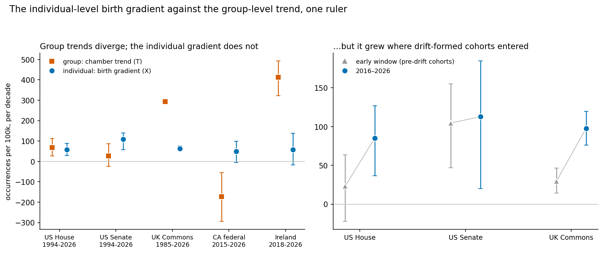
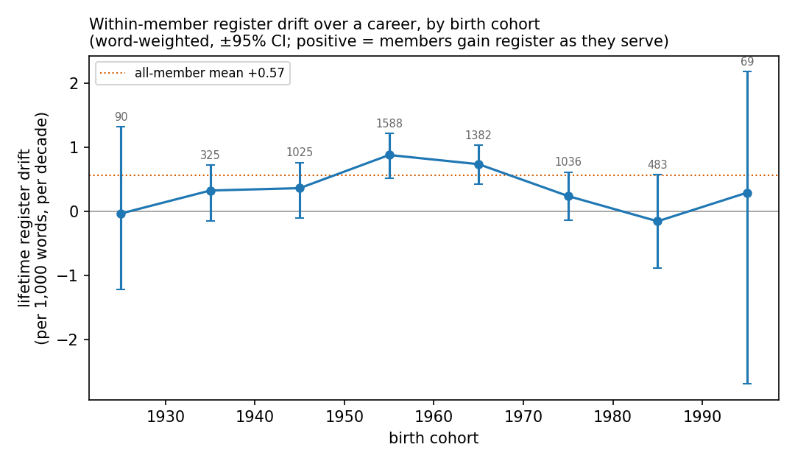
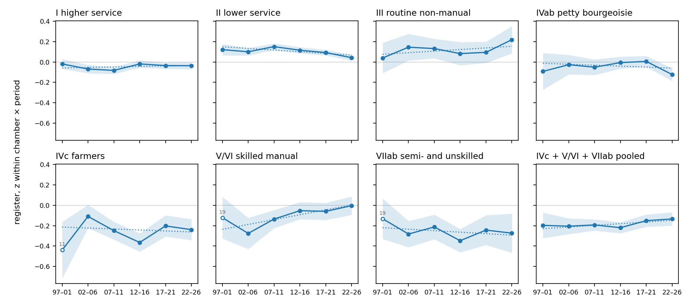
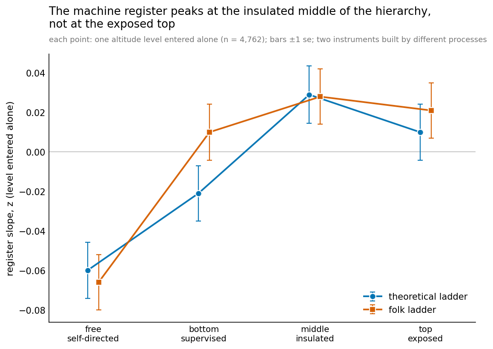
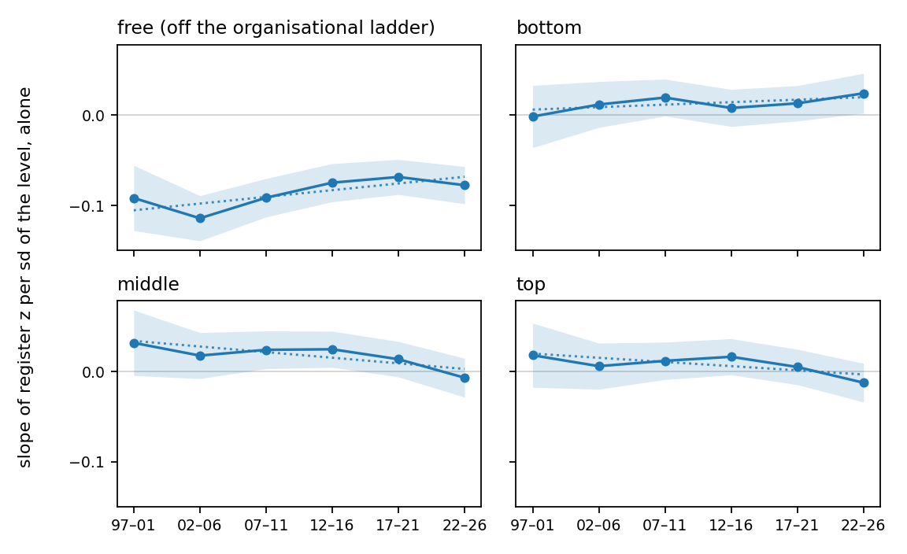
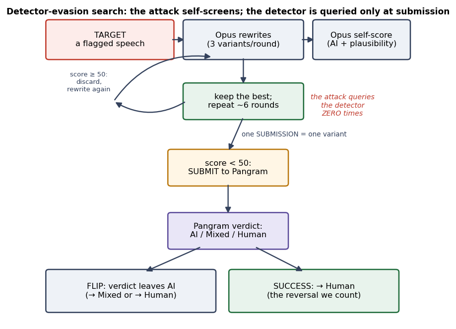
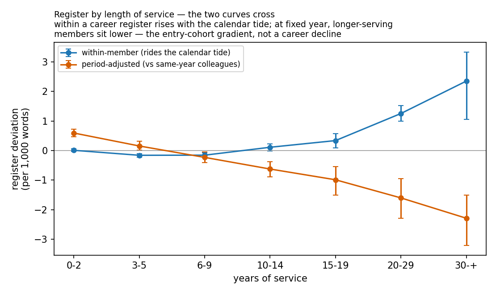

# Machine-drafted speech in legislatures: prevalence, concentration, and a register that predates the machines

## Abstract

We measure machine-drafted speech across 22 legislative chambers in five countries with two independent instruments. The first is a commercial AI-text detector (Pangram), calibrated against each chamber's own pre-2022 record (specificity 1,260/1,260). The second is a detector-independent lexical *register* — the excess vocabulary language models overuse, derived in prior work from the post-2022 jump in scholarly text — run here as a fixed ruler across four decades of the parliamentary record. In current speech, **9.03% of words [8.00%, 10.08%]** are machine-drafted. That figure averages a series that is still rising, from 7.36% [6.13%, 8.62%] in 2025 to 11.70% [9.86%, 13.67%] in 2026. It is a floor: directed effort evades the detector. The share spreads fourfold across chambers — 4.3% to 18.3% once each noisy chamber estimate is pulled toward the pool — and concentrates in scripted genres. Flagged speech is better-formed and, once genre or chamber is held fixed, no less engaged. Detection should measure a norm, not police it.

The register, however, **predates the models by decades**. That history is invisible to the excess-vocabulary designs that found the jump, which measure acceleration against a local trend in corpora reaching back roughly a decade. Run as a level series, the register's rise spans three decades and appears on two independently built word-lists, dated to 1994–96 on the longest-reaching series. The climb is concentrated in a few common function words over a broad shallow widening.

A juniority gradient predates even that, steepening as cohorts formed inside the drift arrive. Prior occupation leaves a small, replicated signature that absorbs the class schema: a preregistered organisational-altitude measure peaks at the insulated middle and sits lowest at free work, off the hierarchy. The machine register is one visible edge of an older, human process — a register of accountability without authorship — that machine intelligence exposes rather than creates.

## 1. Introduction

Institutions speak in a register. Legislative speech has carried one as long
as official reporters have transcribed it — measured, procedural, deliberately
impersonal — and any regular reader of Hansard knows it on sight. When the
conditions of production change, the register can move. This study began with
a clip: a Canadian provincial member reading a speech that still carried
traces of the prompt used to generate it. The first question was the obvious
one — how much legislative speech is now drafted by a machine? The question it
ended on was unplanned: where did the register the machines write in come
from?

With the release of ChatGPT in November 2022, fluent drafting became free to
every legislative office at once. What that did to the record matters in a way
it does not for most text: a floor speech is the official act of
representation, consulted by constituents, journalists and historians, and it
enters the record under the member's own name. Yet a 22-chamber policy scan
finds no chamber requiring machine drafting to be disclosed and none
forbidding it — the record is silent exactly where the change is happening.

Attempts to measure machine text in institutional corpora fall into three
families. *Instance detectors* score one text at a time, and applied naively to
parliamentary speech they have produced two unsatisfying results: off-the-shelf
detectors, run over 124,000 Australian federal speeches, found no post-ChatGPT
rise (Rice), and a phrase-spike claim in the UK Commons came with no prevalence
estimate behind it (Pimlico Journal). *Population-level methods* estimate the
machine-modified fraction of a whole corpus distributionally, and put post-2022
figures between 6.5% and 17.5% on peer reviews and scientific papers (Liang et
al.). *Marker-vocabulary instruments* track the words models overuse — excess
vocabulary in biomedical abstracts (Kobak et al.) and in scholarly writing at
large (Gray). Closest to this study, Suvanto et al. detect undisclosed LLM
text in UK and Swedish parliamentary motions with a glass-box classifier and
find a steady rise from 2022 — two chambers, written motions rather than
transcribed speech.

Each family answers part of the question. The parliamentary studies cover one
or two chambers, and the detector and classifier approaches need ground
truth — labelled or synthetic training text — and inherit its blind spots.
The deeper gap is what all of this work assumes: that the machine register is
a new arrival, something to detect, dating from 2022. None asks whether the
register the detectors key on existed before the machines, or which speakers
already used it.

The question splits in two. *Prevalence* — how much of the record a machine drafted — needs a calibrated detector. *Permeation* — whether human speech drifts toward the machine register independent of drafting — needs an instrument independent of the detector, because the human baseline is itself moving. Conflating the halves is the main error available here.

We therefore measure both, separately, across 22 chambers in five countries (twenty of them in the prevalence arm), on a corpus reaching back three decades — the depth that makes the second question askable at all. Pangram, a commercial detector calibrated against each chamber's own pre-2022 record (specificity 1,260 of 1,260), measures prevalence. A lexical register instrument built from the vocabulary language models overuse, run against each chamber's own placebo-matched counterfactual, measures permeation.

The two instruments differ in what they can be trusted with. The detector is a black box with a measured false-positive floor. The register is transparent, cheap at corpus scale, and robust to the light editing that defeats detectors, but coarse. The claims therefore rest on a division of labour rather than on the two instruments agreeing on one number: the calibrated detector carries prevalence, the register carries history and social structure. They meet at one point, the genre ladder, where both face the same confound — drift in what kind of business the record contains. Each meets it in the open: the detector's flags are audited inside the unscripted genre, and the register's trend is post-stratified against the drift.

The question we came with gets its answer. At least 9.0% of words in current legislative speech are machine-drafted — a floor, because directed effort evades the detector. The share spreads fourfold across chambers and concentrates in scripted genres; against a deliberation rubric, flagged speech is better-formed and, once genre or chamber is held fixed, no less engaged, in the cross-chamber arm and in controlled model continuations alike.

The finding we did not come for is the paper's centre of gravity. The register instrument, borrowed to cross-check the detector, turned out to have a history: a rise spanning three decades, dated 1994–96 on the longest series. On the machine side the register itself is a post-training artifact, installed by the stages trained on human demonstrations and preferences and not by the stage trained on verifiable math and code.

When we went looking for who carried it, the dominant simple correlate is birth year — a juniority gradient older than the drift itself, steepened by the cohorts formed inside it. A pre-registered occupational model adds weaker but real structure — the register peaks at the insulated middle of organisational hierarchies, the rungs that answer upward without the final say — and social class traces the same inverted-U at coarser grain. These correlations locate the rise without yet explaining it; together they cover about a sixth of member-level variation, most of that birth year. Machine intelligence did not invent this register of accountability without authorship; it inherited it, automated it, and made it measurable.

The two halves of the study meet at one measurable point. Post-training elevates the same marker vocabulary that, among humans, peaks at the insulated organisational middle — a shared rate on one word list, not a shared mix, and a weak effect. That overlap is a quantitative handle on what Brynjolfsson calls the Turing trap: the worry that human-imitating AI is developed to substitute for workers rather than augment them. We do not argue the case. We supply a way to measure it, and a template for the oversight measurements the worry calls for.

That template is the study itself. Essentially every measurement in it — extraction, scoring, coding, grading, across 22 chambers and three decades — was executed by machine intelligence, cheaply enough to repeat on any open record. The null results, replications and superseded analyses that usually go unreported are kept in the record rather than discarded, and pervasive logging supplies the substance of pre-registration: timestamped predictions verifiably preceding the data, without the formal document as sole witness. Detection is better used to measure a norm than to police it, and the measuring is now nearly free.

## 2. Data

The corpus is twenty-two chambers across five countries, extracted from
official Hansard and the Congressional Record.

| group | chamber (code used in tables and figures) |
|---|---|
| Canada | federal House of Commons (CA-FED); Alberta (AB), British Columbia (BC), Manitoba (MB), New Brunswick (NB), Newfoundland & Labrador (NL), Nova Scotia (NS), Ontario (ON), Saskatchewan (SK) |
| Australia | New South Wales (NSW), Queensland (QLD), South Australia (SA), Tasmania (TAS), Victoria (VIC), Western Australia (WA) |
| UK/Ireland | UK House of Commons (UK), Scotland (SCO), Wales (WAL), Northern Ireland (NI), Dáil Éireann (IE) |
| US | US House, US Senate |

The table above fixes the 22 covariate-arm chambers. Two arms use different
subsets. The prevalence arm covers 20 of the 22: New Brunswick was the pilot
and has no uniform prevalence sample, and Tasmania's transcription regime
shifted mid-corpus, leaving no usable control (§2.1). The nineteen-chamber
constant-window register series of §4.4a is a different set again: it adds
Prince Edward Island, which is not in the table, and omits New Brunswick, the
discovery corpus of §4.4b.

Per chamber, two strata:

- **control** — 60 segments dated on or before **2022-06-30**. Not
  2022-12-31: ChatGPT shipped 2022-11-30, and a "pre-AI" control dated
  December 2022 is not pre-AI. Every chamber had ample earlier material, so
  the tighter cutoff cost nothing. One sampling difference across chambers,
  disclosed: the four-chamber dashboard rescore that supplies the UK and
  Ireland long-band controls drew to 2022-11-17, so seven of its 120 control
  rows sit past the 2022-06-30 rule — all pre-ChatGPT, all reading Human.
  CA-FED's seven late controls were redrawn to the rule (§4.2a);
  every other chamber obeys 2022-06-30 as stated.
- **prevalence** — segments dated 2025-01-01 or later, sampled uniformly at
  random with no detector-screen stratification.

Segments are member-authored, English-original, non-chair, and 50 words or
longer — the whole of the record Pangram will read. Segments are drawn at a
uniform rate across lengths, so the sample reproduces the corpus's own length
mix, and rates are then word-weighted. That ratio estimator, applied after the
uniform draw, is what corrects the length/drafting bias, and it needs no
band-reweighting constants (§4.2). Sampling is seeded per cell and
reproducible.[^s-sampling]

[^s-sampling]: `build_pangram_expansion.py`, `build_shortband.py`.


### 2.1 Two contamination hazards, both found by looking

**Invisible characters.** Manitoba's 2025-26 files carry soft hyphens
(U+00AD) in 81.6% of segments against 0.04% of tokens in 2006-19. Left in,
that is period-correlated noise a detector could latch onto with nothing to
do with drafting. Stripped at build time.

**Transcription regime.** A chamber that moved from edited Hansard to verbatim or ASR-assisted transcription will shift on exactly the surface features a detector reads, with nobody having drafted anything by machine. A transcript-regime check[^s-regime] measures two markers that track editorial convention rather than content, random-sampled per chamber-year: words per sentence, and contraction density (traditional Hansard expands "don't" to "do not"; verbatim transcription does not).

[^s-regime]: `transcript_regime_check.py`.

Findings, and they cut against the received story:

- The Aug-2026 policy scan named **NSW and WA** as ASR users. Both are
  **flat across 2006–2026** on both markers. Whatever they procured has not
  visibly changed the text.
- **Tasmania** — named by nobody — moved: contraction density **3.4 → 15.9
  per 1,000 words, +364%**, with the step falling *between* the control and
  prevalence windows. No pre-AI text exists in Tasmania's current regime, so
  no control can calibrate it. **TAS is reported but excluded from pooled
  estimates.**
- **NL (2016), WAL (2015), MB (2007)** step *inside* the control window,
  which is what makes them repairable. On the raw pool NL and WAL trip the
  same "across the windows" banner as Tasmania (NL +770%, WAL +238%
  full-series), but only because the pre-window being averaged straddles the
  step itself: draw the control from after the step and the same chambers
  read NL +8%, WAL +11%, MB +9%. Their controls were therefore floored to the
  current regime — still comfortably pre-AI, so nothing was lost. Tasmania has
  no such floor available, because its step falls between the control and
  prevalence windows rather than inside the control window.

---

## 3. Method

### 3.1 Calibration makes every estimate conservative

Prevalence is only meaningful against a measured false-positive rate.
**Specificity is therefore measured in-domain at two grains at once**: each
chamber carries its own 60-segment pre-AI control — a check that
chamber-specific editorial registers do not manufacture false positives —
while the pooled 1,260 carries the statistical weight (§4.1). The
per-chamber controls are a heterogeneity check, not an independence claim:
no 60/60 cell could stand alone, and none is asked to.

That two-grain calibration is the study's most consequential design choice,
and the reason its result differs from published comparators (§5). The
comparators calibrate more coarsely: the closest parliamentary study
measures false positives on one pre-LLM hold-out per parliament, in two
parliaments; population-level studies validate per venue against
semi-synthetic ground truth; and commercial-detector exercises have leaned
on a single fifty-speech calibration or on vendor benchmarks alone.
Twenty-one chambers with in-domain controls each is the same idea carried
to the grain this corpus allows.

With specificity `Sp` and sensitivity `Se`, an observed flag rate `π` relates
to true prevalence `τ` by Rogan–Gladen:

```
π = τ·Se + (1−τ)(1−Sp)      ⇒     τ = (π − (1−Sp)) / (Se − (1−Sp))
```

When `Sp = 1`, the expression reduces to `τ = π/Se`. **`Se` is not estimated.** Because detector sensitivity cannot exceed 1, `τ = π/Se ≥ π`: under the specificity measured in §4.1, every flag is genuine machine text and some machine text goes unflagged, so the observed flag rate is a conservative floor on true prevalence — the detector's misses lower the reading and never inflate it.

That floor assumes specificity measured on pre-2022 speech still holds for human speech in 2025–26, while the permeation result shows contemporary human speech drifting toward the register the detector reads. §4.1 bounds that assumption on the audited hits at no more than about 0.2 points; the Limits return to it.

### 3.2 Detector, and a defect worth recording

All verdicts are **Pangram 4**. This is not a detail. The Pangram API's
default model is **Pangram 3** (version 3.3.2), while the web dashboard runs
Pangram 4. On a 20-segment sample deliberately enriched for AI and Mixed, the
two agreed on **11/20** — the default called Human on 3 of 8 web-AI segments
and 5 of 6 web-Mixed, and never returned Mixed at all. Passing
`model: "pangram-4"` gave **20/20 exact agreement including all six
Mixed**.[^s-route]

[^s-route]: `api_route_check.py`.


So the API and dashboard routes are interchangeable *only when the model is
named*, and the failure to name it is silent: you get verdicts, they just
aren't the same instrument. Billing corroborates the diagnosis independently
— the dashboard's `ceil(words/100)` credit rule is exactly Pangram 4's
$0.05-per-100-words, while the defaulted API billed per document at Pangram
3's 1,000-word unit.

The 2026-07 New Brunswick run passed no model parameter and silently took
Pangram 3. It was rescored: specificity is identical under the two models, and
the defect ran net in the conservative direction — an undercount, not a
false-positive problem (Appendix F item 19).

**UK Commons and Dáil Éireann are scored entirely on Pangram 4**, verified
rather than assumed: all 360 of their segments from the four-chamber arm, which
recorded no model version, were rescored through the dashboard and agree with
the original verdicts **360 out of 360**.

### 3.3 Why the register instrument is descriptive, not inferential

The register instrument fails an in-time placebo test, so it cannot identify LLM causation. For that reason it is descriptive, not inferential: it tracks the level of machine-overused vocabulary over time, which is what the history and social-structure results require.

The Kobak et al. excess-vocabulary approach (arXiv:2406.07016; *Sci Adv*
11(27):eadt3813, 2025) compares observed word frequencies against a
counterfactual built from prior years. Applied naively to Hansard it produces
a large, confident-looking post-2022 signal.

**It has no trend control.** An in-time placebo[^s-placebo] runs the identical estimator on *pre-LLM* window pairs, where the true effect is zero by construction. It fires there too. An estimator that reports a large effect on a period when nothing happened is measuring drift, not treatment.

[^s-placebo]: `in_time_placebo.py`.

The arm is therefore reported as a **descriptive series** — which is what lets
the 1994–96 onset (§4.4) count as a result: the register was already moving
decades before the machines.

**The register instrument is not a detector, and a direct test is why the
roles are divided.** A simple threshold on the register score — the study's
own occurrence rate for Kobak's 407 style words — separates Pangram-flagged
from unflagged legislative segments at **AUC 0.61** (0.60 on the 2025–26
prevalence sample alone, where both classes are drifted contemporary speech).
The study's Opus screen, a separate model-based judge of the same distinction,
reaches 0.95 (Appendix D.4). On ground-truth evasion rewrites the register
threshold falls to **0.535**, barely above chance — but that set is
adversarially quietened text, not ordinary model output, which runs far hotter
on these words (§4.8). One thin lexical rate carries population-level history
well and instance-level detection barely above chance: the division of labour
the study uses.[^r44auc]

[^r44auc]: `python register_auc_check.py`: 5,439 text-resolved
    Pangram-scored legislative segments (prevalence, controls, the genre
    arm) plus the 292 final-run bypass variants; AUC by Mann–Whitney.
    Everything pooled: 0.57. Medians per 100k: controls 3,150; unflagged
    2025–26 prevalence 3,226; flagged 3,869; LLM variants 3,327.

### 3.4 The occupational classification, in full

Each legislator's prior occupation was coded to an O\*NET-SOC code by two
independent Claude passes over a shared rubric, blind to each other (96.4%
raw agreement; disagreements adjudicated; the coding record is a committed
artifact[^m34a]). The classification is then built on O\*NET's element
universe — all 295 rated descriptors — in two semi-independent
constructions, both **blind-derived**: the coders who produced them were
never shown the register, the hypothesis, or any outcome.

**The folk ladder** is the measure's primary form. It is named for its origin:
it starts from the folk image of a corporate hierarchy — the ladder as
everyday speech has it — and asks machine coders to concretize that stereotype
into measurable elements. Eighteen blind coding passes each nominated the
elements that mark the **free / bottom / middle / top** of a corporate
hierarchy. The rule is multi-label, so one element may mark several levels,
and the elements nominated by more than one coder form the consensus
signature: 85 elements — 11 free, 13 bottom, 27 middle, 34 top — each with a
consensus sign. A level score is the mean of its consensus elements'
standardised per-occupation values under the consensus sign. Rating scales are
resolved per element family, and two special cases are recorded: one Work
Context item rated CT rather than CX, and element 3.A.1, a category
distribution collapsed to its expectation, whose missing ratings for farmers
are the subject of a committed sensitivity run.[^m34b] The complete signature
— every element id, name, level, sign and coder count — is the first table of
Appendix D.8.

**The theoretical ladder** is the semi-independent check, named for the
opposite origin: it is built from the registration's theory of
accountability relations, composed rather than pictured. Three independent
blind coding workflows assigned elements to four accountability components — **U** upward (advising without the final say, discretion
reverse-scored), **L** lateral (external service), **D** downward
(command), **N** undirected (organisational account-giving and contact) —
yielding 71 consensus elements (the second table of Appendix D.8); the free /
bottom / middle / top levels are composed from the components. The two
ladders' levels correlate +0.75 to +0.92, which is why the registration's
never-together rule treats them as near-twins; where both enter a model the
widened errors are shown rather than hidden (§4.6d).

**Registration.** The ordering **free < front-line < corporate** and the
apex delta (middle − top, "insulated command tracks more register than
exposed command") were committed before any element was joined to the
register; the timeline, to the minute, is in Appendix F
item 24.

[^m34a]: `provinces/OCCUPATION_CODING.md` and
    `provinces/occupation_coding.json`.

[^m34b]: The nomination workflow and consensus are `element_levels.json`
    (built by `workflows/element_levels.js`); scoring is
    `level_scores.py`, including the scale-family resolution and the
    `--drop-3a1` sensitivity; the component construction is
    `element_audit_4col.json`.

### 3.5 Instruments retired, and why

Five candidate instruments were tested and retired:

| instrument | outcome | why dropped |
|---|---|---|
| Zero-shot detectors (Binoculars/Falcon, Fast-DetectGPT, Qwen pairs) | 2025-26 flag rates sat **below** their own pre-LLM false-positive floors | edited AI is invisible to them; retro-explains every pilot null |
| Corpus-wide likelihood delta | triple-replicated null | no signal at corpus scale |
| Frequency-weighted secondary | fired in 4/30 cells | indistinguishable from noise |
| Content-word control | orthogonal to the claim | words rising elsewhere says nothing about here |
| Mistral synthetic sensitivity corpus | deleted | too few words to carry variance; sensitivity not estimated |

---

## 4. Results

Two instruments, run separately, carry the results. *Pangram*, calibrated
against each chamber's own pre-2022 record, answers the prevalence question
segment by segment. The *register instrument* — Kobak's excess-vocabulary
style words, counted against each chamber's own placebo-matched
counterfactual — is detector-independent and cheap enough to run across three
decades, and it carries the historical and social results. The section runs in
that order: calibration and prevalence (§4.1–§4.2) and the genre ladder
(§4.3); the register's thirty-year history and its cross-chamber convergence
(§4.4–§4.4b); the people who carry it — birth year, then social structure
(§4.5–§4.6); permeation into human speech (§4.7); the machine side of the
register (§4.8); deliberative quality (§4.9); and directed evasion (§4.10).
Estimators are specified alongside each result below; every number reproduces
from a committed script.

### 4.1 The detector makes zero false positives on 1,260 pre-2022 speeches

**Zero false positives across every chamber's own pre-AI control.** None of
the 1,260 pre-2022 control speeches is flagged: observed specificity is
**100% — 1,260 of 1,260** [99.7%, 100.0%] (Wilson).

Sensitivity is not estimated from our own data. The prevalence estimates use
`Sp = 1` and `Se = 1`; under the zero-false-positive transfer assumption, any
real sensitivity `Se ≤ 1` makes the observed flag rate a **conservative
floor** on true prevalence, so the §4.2 figures understate machine text when
the detector misses it. The strongest external anchor is Pangram's
independently measured 99.3% recall on the RAID benchmark (Dugan et al.,
COLING shared task), which would raise every figure by about 0.7%. Our pilot
points in the same direction: Pangram flagged **all 40** synthetic legislative
speeches generated by an open model, a 100% hit rate that is underpowered but
consistent with the published recall. Sensitivity on *edited* machine text
remains the central unknown and is discussed in §6.[^s-prev]

[^s-prev]: `prevalence_report.py`.


**Contemporary specificity cannot be measured directly — no 2025–26 ground
truth exists — but it can be bounded from the hits.** The one contemporary
stratum with near-certain human authorship is genuinely spontaneous exchange:
answers engaging a question's specific words, heckle responses, repair and
deixis to the room. We audited **all 316 flagged prevalence segments** in two
blind votes, classifying each hit prepared / spontaneous / unclear from its
text and re-voting every non-prepared call blind. The hits are overwhelmingly
confined to prepared text: **277 prepared, 21 unclear, and 18 spontaneous** on
the first vote, **11 of the 18 still spontaneous on the re-vote** — and §4.3's
genre audit finds the same pattern within a genre, every flag landing on parts
written in advance.

Of the 11, nine are Mixed verdicts at fractions 0.11–0.58, consistent with
spontaneous speech surrounding a machine-drafted fragment — which is what Mixed
asserts — and two carry near-full fractions with visible spoken repair, the two
best candidates for contemporary false positives in the study. Treating **all
eleven** as false positives moves the headline from 9.03% to **8.86%**
fraction-weighted (8.65% discounting their every word). Tested on the stratum
where contemporary authorship is near-certain, the floor's transfer assumption
costs at most about a fifth of a point.[^r41cs]

[^r41cs]: `python build_flagged_hits_pool.py` assembles the 316 hits with
    text (316/316 resolved); the two-vote classification is the committed
    workflow output `flagged_hits_audit.json`; `python flagged_hits_bound.py`
    prints the dissection and both bounds.

### 4.2 At least 9.0% of current words are machine-drafted, with a fourfold spread

**Pooled 9.03% of words [8.00%, 10.08%]** — 65,795 machine-written words of
728,998 across 3,519 segments in 20 chambers, excluding regime-flagged TAS (a
transcription-convention shift caught by §2.1's diagnostic).
The estimate is population-level throughout: it describes the corpus, not
any individual speech or speaker — a segment verdict is an instrument
reading, not an attribution.

The window is not one regime. Measured the same way, the rate rises from
**7.36% [6.13%, 8.62%] in 2025 to 11.70% [9.86%, 13.67%] in 2026**.[^ryearsplit]
The 9.03% figure therefore averages a still-rising series, not a steady state;
comparisons against it should say which year they mean.

[^ryearsplit]: `python prevalence_robustness.py` — the year split at the
    banded headline estimand, the speaker-clustered bootstrap, and the
    random-effects fit behind the shrunken spread below.

Every estimate that follows is the share of *what was said* that is
machine-drafted, over the whole of the record Pangram will read.



*The twenty chamber rates: each point is the chamber's word-weighted, fraction-weighted machine-drafted share of 2025–26 words; whiskers are the cluster-bootstrap 95% CIs; chambers sorted by rate, direct-labelled, with the two US chambers emphasised — their contrast recurs in §4.4a and Appendix C — and the pooled 9.03% marked as a reference line. Axis starts at zero. Exact values and intervals are tabulated in Appendix F item 21.*

The spread is the finding, not noise around a mean. A random-effects fit
across the twenty chambers puts their rates at **4.3% to 18.3%, a
better-than-fourfold range**, after every chamber is pulled toward the pool in
proportion to its own noise. The fit's own diagnostics say the spread is real:
logit-scale τ = 0.56, and I² = 0.78 — 78% of the observed between-chamber
variance is true heterogeneity rather than sampling noise. The per-chamber
table reports the raw estimates; the shrunken range is the honest spread
claim, since the extremes of twenty noisy cells overstate their own separation
(the raw-extremes version is retired to Appendix B). What drives a chamber's
position is not established here — even two chambers of one legislature can
sit far apart (Appendix C item 8), and the study does not attribute the
between-chamber differences to any measured cause.

*Rates are weighted by words because a segment is not a natural unit.* The
segmenter packs speaker turns into windows of at most 360 words, so a long
speech becomes three segments and a short interjection becomes one.[^s-seg] A
segment rate therefore partly measures the packer; a word rate is invariant to
where the text was cut.

Length also predicts drafting. In the pooled prevalence sample, the longest
quartile of segments is 11.3% machine-drafted by words against 0.7% for the
shortest; as binary segment rates, the same comparison is 15.2% against 1.0%.
Every rate in this study is therefore word-weighted; what that choice is worth
against the segment-weighted alternatives is in Appendix F item 9.

No one large chamber drives the result: the equal-weight mean of the twenty
chamber rates is 9.12%, against the 9.03% word-weighted pooled rate. Uniform
rather than length-proportional sampling costs a little variance, already
carried by the bootstrap interval, and no measurable bias
(Appendix F item 2).[^s-banded]

[^s-seg]: `segment.py`.

[^s-banded]: `banded_prevalence.py`.


*Weighted by AI fraction, because a flagged segment is not uniformly flagged.*
The flagged segments are not one kind: of the estimator's 316 flagged
prevalence segments, **182 are full AI verdicts and 134 (42%) are Mixed** —
Pangram reporting that part of the segment is human. Counting a Mixed
segment's words as fully machine over-states the rate by a third — **12.03%
against 9.03%** — so the split is not cosmetic, and folding Mixed in at full
weight (as a naive AI+Mixed count would) is the single largest upward bias
in the headline. Every flagged segment is therefore weighted by its own AI
share: recorded directly for the API-scored rows, and read off the dashboard
result by result for all 132 Mixed segments the API did not cover. Those
harvested Mixed segments average **0.435** machine (n=132, sd 0.219, range
0.11–1.00); AI verdicts are effectively a constant at 0.9965. Human verdicts
are 0.0 in every one of the 1,246 recorded cases. The 9.03% headline is thus
already the split-corrected figure, not an AI-or-Mixed count.[^r42f]

**This is a correction, not a refinement.** Every rate this study reported
before 2026-08-13 counted a Mixed segment as wholly machine-written. The error
is a factor of 1.33 on the headline and is not uniform across the study: it is
largest where Mixed verdicts cluster, which is the mixed-format business in the
middle of §4.3's genre ladder.

Intervals are cluster bootstraps over segments, not Wilson intervals: the
estimator is a ratio of two random sums whose numerator and denominator move
together, so a chamber whose one flagged segment happens to run 900 words
should read as less certain than one whose flag is 130 words, and a binomial on
segment counts cannot express that.[^r42]

The interval is robust to the clustering unit: the 2,340 long-band segments
come from 1,089 chamber-speaker clusters, and resampling speakers instead of
segments moves the pooled interval imperceptibly (design effect 1.23).[^ryearsplit]

The low rows carry a second caveat, about calibration rather than sampling. No
chamber's rate below ~6% is calibration-exact on its own 60/60 control alone,
because that control's Wilson lower bound is 94%. Under the pooled floor
(≥99.7%), false positives contribute at most 0.3 points to any chamber's
rate — slack that matters only for the lowest rows (US Senate 1.8%, UK 2.5%),
not for the spread.

[^r42f]: Fractions live in `fraction_ai_harvested.json` (151 harvested
    individually) and in the `fraction_ai` column of
    `pangram_p4_verdicts.csv` (1,431 recorded by the API). The 154 AI verdicts
    not harvested individually are carried at the measured constant; two
    independent samples put it at 0.9965 (n=148) and 1.0000 (n=19), and the
    lowest AI value anywhere is 0.81, so clicking them would move the pooled
    figure by under 0.01pp. The 182/134 split is computed on the same sample
    the headline uses; an earlier draft quoted a 364-segment count that mixed
    in the genre-arm rows and a superseded Manitoba draw.

[^r42]: `python -c "import banded_prevalence as B; B.table(B.load())"`.

#### 4.2a Estimate-specific audits

**Federal Canada's row comes from its own uniform draw**, not from the
genre-stratified sample that answers §4.3. The genre arm takes 60 segments
each from Statements by Members, Government Orders and Oral Questions, which
imposes a genre mix rather than observing one and leaves 25.6% of the chamber's
in-band record — Private Members' Business, Adjournment Proceedings, Routine
Proceedings, the Throne Speech reply — in no stratum at all. Read as a chamber
rate it gives 16.5%; the uniform draw of 120 prevalence segments gives **18.5%**,
and the uniform draw is what the table in Appendix F item 21 reports. Dropping CA-FED entirely leaves
the pool at 8.50% against 9.03%, so the chamber contributes about half a point
to the headline and neither makes nor breaks it.[^r42ca]

[^r42ca]: `pangram_ch_verdicts.csv`, rows `caprev*`/`cactl*`. Its short band
    already matched this draw: 120 × 15,236/18,029 = 101, and 101 short
    segments were scored at the matched rate. Seven controls dated after the
    2022-06-30 cutoff — one of them after ChatGPT shipped — were replaced on
    2026-08-13 from the same 2018–2022 window the survivors occupy
    (`build_cafed_ctl_redraw.py`); all seven replacements scored Human, as had
    all seven originals, so specificity is unchanged at 60/60 and only the
    design claim is repaired.

**Manitoba's 13.1% depends on a repaired extractor**, and without it the
chamber reads 5.3%. The original extraction lost 42% of the record, and the
loss was not neutral: what went missing were the formatted, prepared speeches,
which is exactly where drafting concentrates (§4.3). The chamber's controls are
clean before and after the repair, **0 of 18,342 words**. The extraction
defect, the 275-segment redraw and the checks on both are in Appendix F item
22.

### 4.3 Drafting concentrates in scripted business

Machine drafting concentrates where the procedure permits advance
preparation. Federal Canada is the only corpus carrying a business rubric,
which makes the test possible at all.

The three genres form a ladder in **how much advance preparation the
procedure permits**, which is the mechanism under test:

- **SO31 — Statements by Members.** Under Standing Order 31 a non-minister
  may address the House for up to one minute on any subject, immediately
  before Question Period. Not debatable, no reply. Written ahead and read.
- **Government Orders.** Government bills and motions. Covers both prepared
  speeches (20 minutes for early slots, 10 later) **and the spontaneous
  questions-and-comments periods that follow each one** — a genuinely mixed
  category, not pure prepared debate.
- **Oral Questions.** The 45 minutes after SO31. **Questions are not placed
  on notice**, so neither question nor answer can be fully drafted in
  advance; both sides are held to roughly 35 seconds.

| genre, 2025–26 | share of words, AI-fraction weighted | 95% CI | share of segments flagged | share of words, Mixed counted whole |
|---|---:|---:|---:|---:|
| **SO31** — one-minute scripted set-pieces | **32.3%** | [21.5, 44.1] | 36.7% | 35.8% |
| Government Orders — mixed prepared and spontaneous | 19.9% | [10.5, 30.5] | 23.3% | 25.7% |
| **Oral Questions** — not on notice | **9.8%** | [2.2, 19.1] | 8.3% | 11.8% |
| *ratio of the two rungs above* — **SO31 ÷ Oral Questions** | **3.29×** | — | 4.40× | 3.03× |

*The first rate column is the study's estimand throughout — word-weighted and
weighted by each flagged segment's own AI fraction. The last two columns are the
alternatives: the share of segments flagged, and the share of words with every
Mixed segment counted as wholly machine. They are shown side by side because the
weighting choice matters more in this table than anywhere else in the study: the
genres differ sharply in how long their segments are — SO31 is a one-minute set
piece, a Government Orders slot runs twenty — so a segment-weighted comparison
measures the packer's behaviour across genres alongside the drafting. The
ordering of the three rungs is the same under all three weightings.*

All three pre-AI controls, pooled across genres: 0/180, **0.0%** [0.0, 2.1].

**SO31 vs OQ: 3.29×, +22.5pp, permutation p = 0.0025.** The test is a label
permutation rather than Fisher exact, because Fisher takes segment counts and
the estimator is a ratio of summed words.[^r43w]

**Weighting by the AI share widened this ladder rather than flattening it**,
which was not the expected direction: Mixed verdicts are commoner in the
mixed-format Government Orders than in the scripted SO31 set pieces, so
counting Mixed segments as wholly machine had been flattering the middle rung.

[^r43w]: `python prevalence_report.py` for the rates and bootstrap intervals;
    the SO31-vs-OQ permutation is 50,000 label shuffles of the pooled
    prevalence segments. Reported here rather than the old Fisher p = 0.00034,
    which tested a quantity the study no longer reports. The same script prints
    the Cochran–Armitage trend statistic on the segment counts (doses
    OQ < DEBATE < SO31); the adjacent-rung Fisher exacts are computed from the
    3×2 segment table.

The monotone trend across all three rungs is the ladder's proper test, and it
holds: a Cochran–Armitage trend test on the segment counts (5, 14 and 22 flags
of 60) gives z = 3.70, p = 2.2 × 10⁻⁴.[^r43w] The adjacent steps are thin on
their own at 60 segments per cell — SO31 vs Government Orders p = 0.16, and
Government Orders vs OQ p = 0.043, which clears the nominal bar but would not
survive a correction for the two looks — so the claim rests on the trend
across the ladder rather than on either step alone.

The more preparable the format, the more machine drafting — exactly what the
mechanism predicts. It is also the one place the two instruments face the
same confound: the genre-and-length mix this ladder measures is exactly the
drift §4.4 post-stratifies away, and the register's thirty-year climb
survives that test.

**The Oral Questions cell is not Question Period, and reading its flags
individually says more than the rate does.** The 120–360-word filter retains
95.2% of SO31 segments but only a small fraction of Oral Questions, because
QP utterances are short. What survives is the long tail: procedural and
ceremonial business filed under the QP rubric rather than question-and-answer
exchange.

Not one of the five flagged segments is spontaneous exchange.[^r43] Two are
**eulogies** for a former member. One is a **question of privilege**
responding to a matter raised the previous day. One is a **unanimous-consent
motion** — text negotiated between parties beforehand and read verbatim, the
most pre-written thing that happens in the chamber. The fifth is a backbench
question of the routinely staff-written kind. The genre claim therefore holds
segment by segment and not only in aggregate: within the genre nominated as
unscripted, the flags land exactly on the parts that were written in advance.

The Oral Questions rate is **mislabelled rather than wrong** — 9.8%
word-weighted, 8.3% on segments. It estimates the long-tail business carrying
the QP heading, not Question Period itself; the rate for genuine exchange is
lower, possibly zero.

Extraction is paragraph-level throughout, so no genre loses whole speeches to
the length cap; the differential retention above is a property of natural
utterance length, not of truncation. Flag rate itself rises with segment length
(§6), which cuts the same way: the filter keeps Oral Questions' longer segments,
so the surviving cell is biased *up*, and true Question-Period exchange sits
lower still.

**One flag type has no control, and it should not be leaned on.** Two of the
five are tributes, both at `fraction_ai` 1.0, and **no pre-AI tribute exists
anywhere in the control set**. Tribute register — elevated, cadenced, parallel
construction, abstract virtue nouns — is exactly what a detector keys on. Those
two are either strong evidence of drafting or the most interesting false
positive in the study, and nothing here separates the two readings. What the
controls do establish is that formal prepared *procedural* speech does not trip
the detector: the six pre-AI privilege and Business-of-the-House segments among
the CA-FED controls all read Human, inside the 1,260/1,260 overall.

[^r43]: `python genre_oq_audit.py`, which prints the five flags with their
    order-of-business headings, the control composition, and the unmet tribute
    control. It also retires an argument this section previously made — that
    the length floor leaves "prepared ministerial answers", the sub-population
    "most likely to be machine-drafted". Both halves are false: ministerial and
    parliamentary-secretary segments flag **0 of 28**, all five flags coming
    from non-ministers, and the floor selects *away* from ministers rather than
    toward them (ministerial share of Oral Questions falls 46.3% → 36.1% across
    the filter; median ministerial utterance 89 words against 95). The
    conclusion that the cell is biased upward survives; that mechanism does
    not.

### 4.4 The register shift starts in 1994–96, decades before the machines

The register's rise begins around **1994–96** — before the consumer web,
and long before any language model. Only one series reaches far enough back
to date it: UK Commons, extended to 1985, where the register *declines*
through the late 1980s and then turns upward at that window. The date is
therefore that series' property rather than a pooled one — only three
chambers reach 1994 at all, and the cross-chamber evidence for the drift
itself is the nineteen-chamber comparison of §4.4a. Whatever this measures,
LLMs did not start it.[^r45]

[^r45]: `python long_trend.py --seg uk/segments_uk_deep.jsonl` for the annual
    series; the turning point is the minimum of the annual
    instrument-minus-placebo gap (the script fits no curve), and it lands on
    1994. A day-clustered bootstrap (`python long_trend_bootstrap.py`, 2,000
    resamples of sitting days within year) puts the minimum at 1994 in 84.8% of
    resamples, 1995 in 13.0% and 1996 in 2.1% — so "1994–96" is a genuine
    [1994, 1996] interval, not a hedge.

**The ruler, audited — what the thirty-year rise is made of.** We selected the marker list on the post-2022 jump and then ran it backwards. That design invites two objections: a few words may carry the rise, or selection on the endpoint may create a trend by construction. We tested both.[^raudit]

A few words do carry most of the level change. **Ten common function words carry 92.5% of the 1994–96 → 2024–26 climb** (`this` alone 35%); with those ten removed, the aggregate is nearly flat (×1.03 pooled, ×1.10 UK). Beneath that concentration lies **breadth**: the expected number of distinct style words per 1,000 tokens climbs ×1.26 on the UK series (14.4 → 18.2), while 60.4% of the 407 words trend positive (z = +4.2) at a median of only +0.5%/yr. The result is a shallow, broad widening beneath a few surging function words, not a 407-word chorus.

Composition does not produce the rise. Post-stratifying every chamber-year to a fixed segment-length distribution — the measurable proxy for the genre drift §4.3 makes threatening — leaves the onset in place and slightly *strengthens* the UK climb (×1.49 → ×1.54). Nor does one ruler produce it. The independent Wikipedia signs-of-AI-writing patterns, built by different people for a different purpose, rise across the whole pre-LLM record and *faster* (+2.7%/yr against +1.4%/yr, UK 1994–2019). Their UK trough sits in 1987, however, so the decades-long pre-LLM rise is a cross-instrument fact while the specific 1994–96 date belongs to this ruler's UK series.

Matched donors separate two questions, and the answers differ. Did the register's own level turn upward in 1994? Against donors matched on frequency and dispersion, the UK series' interior minimum at 1994 survives. Did the register pull away from ordinary vocabulary of the same shape? Against donors also matched on pre-2010 trend — a control that by construction absorbs any onset inside its own window — that *distinctive* excess dates to roughly **2014–2018**, and the style words remain below their matched donors in level throughout the record until 2025. Both answers stand together: the drift is real, broad-based, composition-robust and instrument-robust; its dated 1994–96 turn belongs to the UK ruler; and its excess over matched controls is younger than the turn.

[^raudit]: `python build_word_year_counts.py` (one scan, 1.62B tokens;
    reproduces the committed series to 0.00 per 100k at the worst year)
    then `python ruler_audit.py`, `python donor_series.py` (trend-matched
    donors, 389/407 matched, 99.7% exact on all three deciles; the
    freq+dispersion variant is `donor_series_fc.json`) and
    `python length_poststrat.py`. The audit also caught a defect in the
    committed placebo builder: its top-120-frequency exclusion leaves
    eight style words — `this` among them — matched far below their own
    frequency; the donor pool here does not exclude them.

#### 4.4a Other chambers converge on the level the United States already held

Running the same series on every chamber turns the thirty-year drift into a
comparison. The instrument and the 200 matched placebo sets are built once, on
UK Commons 2010–12, and applied unchanged everywhere, so the chambers are
measured with the same ruler.[^r45a]

On the longest window most of the corpus shares — 2006 to 2026 — nineteen
chambers hold both endpoints, and on that single ruler the pattern is
convergence: **the lower a chamber started, the faster it climbed** (Spearman
between 2006 level and growth −0.56, n = 19; taking the baseline from
2006–08 means and measuring growth on the disjoint 2010–2026 span — the
split that removes regression-to-the-mean coupling — gives −0.51, n = 18).
And the convergence sits on a shared direction, not a see-saw: sixteen of
the nineteen chambers rise on the constant window. The four lowest 2006 starters —
UK Commons, Scotland, Northern Ireland, Wales — are the four fastest
climbers; only three chambers decline at all (US House, US Senate, Prince
Edward Island), and none of the nineteen approaches the UK's +4.0%/yr.[^r45cw]



*The convergence, drawn as a slopegraph: one line per chamber from its 2006 to its 2026 gap-vocabulary rate (occurrences per 100k words; values exactly as in the table in Appendix E.1), direct-labelled at both ends, the UK-group climbers and the two flat US chambers emphasised. The fan closes upward: the lowest 2006 starters climb steepest toward the level the United States already held.*

A US series that starts in 2006 cannot distinguish "the United States was always there" from "the United States got there first and stopped." Extending the Congressional Record to its 1994 beginning settles it.[^r45c] Three chambers reach that far, and the US point rests on the longer window:

| chamber | gap 1994, per 100k words | gap 2026, per 100k words | 1994→2026 ratio | annual change |
|---|---:|---:|---:|---:|
| UK Commons | 380 | 1,444 | ×3.80 | +4.3%/yr |
| **US House** | 1,515 | 1,709 | ×1.13 | +0.4%/yr |
| **US Senate** | 1,314 | 1,562 | ×1.19 | +0.5%/yr |

Only the UK and the two US chambers hold 1994 (the UK's own series extends
to 1985, §4.4), and on that longest window the contrast sharpens: the US
chambers *start* above where the UK still sits two decades later — US House
at 1,515 per 100k in 1994 against the UK's 1,444 in 2026. Ireland and
federal Canada, excluded from both windows for entering late (2018, 2015),
enter high at 1,603 and 1,865, and move like chambers already near the
ceiling (+2.6%/yr and −0.7%/yr). The picture is therefore not a common
shift. It is chambers converging upward on a level the United States
already held before the consumer web, while the United States barely moves.

[^r45cw]: `python constant_window_trend.py`, reading
    `occurrence_trends.json`; endpoints 2006 and 2026, growth as the
    geometric rate over the twenty years. South Australia is excluded for
    missing the 2026 endpoint (its series ends 2025); Ireland and federal
    Canada for entering late. Tasmania carries §4.2's regime flag; its row
    in Appendix E.1's table is descriptive.

**They caught up; they did not pass.** A single recent year appears to
contradict that: in 2026 the Canadian provinces, Ireland, the Australian states
and federal Canada all sit above US House. The comparison does not survive
contact with the variance. US House swings between 1,660 and 2,074 across the
series — a 25% range, the widest here — and 2026 catches it at 1,709, near its
own floor. On 2020–26 means, with the gap to US House scaled by US House's own
variability and each series' standard deviation in the last column:

| group | mean, per 100k | gap to US House, per 100k | gap ÷ US House's sd (121) | sd of own series |
|---|---:|---:|---:|---:|
| CA provinces | 2,054 | **+155** | **+1.28** | 61 |
| Ireland | 1,901 | +2 | +0.02 | 52 |
| **US House** | **1,899** | — | — | **121** |
| AUS states | 1,861 | −39 | −0.32 | 36 |
| CA federal | 1,816 | −84 | −0.69 | 134 |
| US Senate | 1,591 | −309 | −2.55 | 60 |
| UK Commons | 1,415 | −484 | −4.00 | 61 |

Only the Canadian provinces are meaningfully above, and they are a standing
exception this study does not explain. Ireland is at parity to within a
fiftieth of a standard deviation; the Australian states and federal Canada are
below. Three of the four apparent overshoots are US House having a low year.

**Exported machine text does not account for the rest, and cuts the wrong
way.** The natural rescue — that AI drafting, American-inflected, is pushing
the others past — fails on the arithmetic. The shares here are of *instrument
occurrences*, not of words, so they do not sit on the same scale as §4.2's
prevalence figures: US House is **14.3% machine by instrument occurrences**
against Ireland's 9.0% and the Australian states' 11.3%, so removing machine
text lowers the American benchmark by more than it lowers the challengers.
Federal Canada is the one case it does explain, at 21.7% the most
machine-written of the national chambers (second only to New South Wales,
§4.2), dropping from apparently-above to clearly-below once corrected.[^r45f]

[^r45f]: `python convergence_check.py`, with shares from
    `ai_share_of_instrument.py`. Machine-written text carries the instrument at
    4,231 occurrences per 100k words against human text's 3,470, a ratio of
    1.22×, so a chamber that is 9.0% machine by words is 10.6% machine by
    occurrences. Note this is an overlap between two instruments and not a
    causal decomposition: a high instrument rate inside flagged text is part of
    why the detector flagged it. The correction also applies only to 2025–26,
    the detector's window, so it is anachronistically absent from 2023–24 where
    some machine text certainly exists unmeasured.

**The climb has a floor.** Even in the chambers that are flat over time, the register is strongly present in *level*: applied against each chamber's own pre-2022 counterfactual, the machine-overused vocabulary is elevated in every confirmatory chamber, and Fisher's method over the 47 corpus specifications combines to **p ≈ 1.3×10⁻⁸³** (the discovery corpus, New Brunswick, is held out and reported separately, at excess +0.55). The effect is not a relabelling of formality: where a data-defined formality control exists — Ireland, federal Canada, the UK — the register excess exceeds the formality gap in every case (for instance UK Commons +0.26 against +0.09). The instrument measures something more specific than "this chamber speaks formally."[^r45cc]

[^r45cc]: `python cross_corpus.py`, reading each chamber's frozen `*_protocol.json` and `*_formality.json`; Fisher's method combines the per-corpus p-values over the confirmatory corpora only, per `replication_protocol.md`. The discovery corpus is excluded from the combination and reported separately.

[^r45a]: `python occurrence_trends.py --build --report`. Word-weighted, pooled
    into fixed-composition panels; a pooled line whose membership changes
    between years is a picture of the download schedule, not a trend. Chamber
    coverage and every gap are tabulated in the output. 2023 is missing from
    most chambers because the study design excluded it as a washout year
    between the 2018–22 and 2024–26 windows.

[^r45c]: `python us/fetch_us_hist.py --years 1994-2005,2023 --per-year 60
    --tag US_DEEP_DONE`, then re-extract with `us/us_extract.py zips
    segments_us.jsonl` and rebuild. 780 sitting-day zips at 60 days/year;
    both chambers are now unbroken 1994-2026 with no missing year. The
    extraction nearly doubled the US corpus — House 66.0M to 108.2M words,
    Senate 74.4M to 144.7M. Rates are per 100k words, so uniform within-year
    sampling costs precision and not validity.


#### 4.4b The recent acceleration

The machines then accelerated the register's rise. In New Brunswick — the one corpus sampled densely enough to resolve quarters — an interrupted time series with the break pre-set at ChatGPT's release finds a flat pre-2023 slope (−1.2%/yr) turning to **+23.7%/yr** afterward, significant against 1,000 frequency-matched placebo word sets (p = 0.007; Mann–Kendall p = 0.014).

But the two instruments then part ways: the *obvious* tells — the Wikipedia "signs of AI writing" set — peak around 2025 and fall back, while the subtler Kobak rare-style set keeps climbing. The natural reading is that the conspicuous words became notorious and were trained or edited away while the register underneath kept rising; scholarly text supplies the precedent, where Gray documents distinctive marker words dropping in frequency once publicised.

How far that pattern travels is a separate question. The peak-and-fall of the obvious tells shows in some other chambers too — UK Commons and the US House both turn down after 2024 — though it is not universal, since Ireland's keep rising. So this is a suggestive cross-chamber pattern rather than a law, and the clean two-instrument contrast is sharpest in the densely-sampled discovery corpus.[^rits]



*The recent acceleration, New Brunswick Hansard. Panel A: yearly rates on both instruments — the Wikipedia "signs of AI writing" set and Kobak rare-style words — each indexed to its own pre-2023 mean = 100. The obvious tells peak around 2025 and fall back; the subtler set keeps climbing. Panel B: the quarterly Kobak rare-style rate per 100k with Poisson 95% whiskers, ChatGPT's release marked and the interrupted-time-series break set there. The decades-long rise established above predates this jump.*

[^rits]: `python fig_trend.py` for New Brunswick — the interrupted time series is weighted least squares on log quarterly rates with a break pre-specified at 2023.0, and the empirical p for the slope change comes from 1,000 frequency-matched placebo word sets run through the identical fit. The cross-chamber comparison is `python build_trend_cache.py && python plot_trend_from_cache.py`; indexed yearly rates for six chambers are in `trend_multichamber.csv`.

Read together with §4.8, the interesting reading is not "LLMs changed
parliamentary register" but that **human register had been moving, for thirty
years, toward what instruct-tuning later selected for.** †[^dag]

[^dag]: Daggered numbers are carried from earlier in the study and were
    re-derived from their artifacts; the full key and per-number sources are
    in the provenance note in Appendix D.

### 4.5 Birth year predicts the register: decomposing a juniority gradient across space and time

Every member-year of speech carries two clocks: the year the words were **spoken** and the speaker's **birth year**. We regressed the member-year register rate on both clocks together, with chamber fixed effects, across all 22 chambers (60,186 member-years, 6,913 members). Both clocks predict, net of each other:

| clock | slope, instrument occurrences per 100k words per decade | t, clustered on member | within-chamber correlation |
|---|---:|---:|---:|
| **birth year** | **+86** | **14.7** | +0.325 |
| spoken year | +126 | 13.4 | +0.302 |

A legislator born a decade later uses about +0.86 per 1,000 words more of the register in the same year and chamber, and birth is the stronger of the two clocks in 15 of the 22 chambers. The per-100k column restates the same slopes in §4.4a's unit; the birth clock's unclustered member-year t is 31.9, and the two correlations are computed on identical rows. †[^r46a]

That single slope is where the question starts, not where it ends. What we want from it is a **decomposition — across space, and across time.** Across space: is one gradient shared by every legislature, or is it an average over chambers that behave differently? Across time: is "born later, uses more" about *when a person was born* (cohort), *what year it is* (period), or *how long they have served* (career)?

The time question runs into a wall no data removes. Because age = year − birth, age, period and cohort cannot be jointly separated: a birth-plus-period model and an age-plus-period model reproduce each other's fits exactly. No number in this section therefore depends on which of the two is fitted, and there is no single conclusive estimate to report.

What there is instead is a family of **views** — weighting members equally or by words, following people within their own careers or comparing across them, restricting to the chambers or the cohorts where one clock happens to be pinned. None settles the age/cohort split on its own; taken together they locate the gradient. The rest of this section is that family, each view named for what it is interesting for.

**Across legislatures, the individual gradient is steady where the chamber trend is not.** Group trends diverge enormously across chambers — −173 to +413 occurrences per 100k per decade — while the within-year birth gradient sits in one narrow band on that same per-100k scale, +49 to +109, in every chamber, including the two whose group trend is flat. The headline gradient, +86 per 100k, sits inside that band. That contrast is the low-variance signature of an individual-level effect: the thing that swings wildly at the chamber level barely moves at the person level. †[^r46apc]

**Restricted to cohorts formed before the register moved, the gradient is already there.** The sharpest cell is the US Senate before any drift: among cohorts born 1917–1964, observed 1994–2004 — every one formed decades before the register began moving anywhere — the gradient is already full size, **+105 [+47, +155] per decade of birth**. *A juniority gradient in this register predates the drift, the machines, and the web.*

The same cell reads a second way. Because cohort is pinned pre-drift, those cohorts' gradient IS the age profile, which fixes the age slope at **−0.88/decade** (clustered t −3.5). Propagating that slope along the identification line bounds the *linear* cohort slope to **−0.03 [−0.52, +0.46]**; the line's invariant is the same-age decade-on total of period + cohort, **+2.11/decade**. So the view is interesting twice over: it answers "did the models create this?" (no), and as a bound it says the standing *level* of the gradient reads as an age-or-career clock, not a birth-cohort one. †[^rapcid]

**The one time-statement that needs no assumption is that the cohort profile bends.** The linear age/period/cohort split is unidentifiable, but the *curvature* is not, and it rejects linearity outright (Wald p ≈ 10⁻⁷). The constraint-invariant contrasts put cohorts born **1975 onward +0.46 above the linear profile (z = 5.1)** and those born 1985 onward +0.65 (z = 2.6), with a late-minus-early local slope difference of **+0.70/decade (z = 2.7)**. This is the steepening claim in identification-free form, and it lands exactly where drift-formed cohorts arrive — the register roughly tripling among them (UK Commons +30 → +98, US House +23 → +85, and in the House against a flat chamber mean, so if the growth is formation it is formation in the ambient written culture rather than the chamber).

The bend's complication is stated rather than hidden. The deviation profile rises at *both* ends: the 1920s–30s cohorts also sit above the line, on the panel's thinnest cells. So the identified fact is "nonlinear, rising at the recent end," not "rising only there." †[^rapcid]



*Group-level against individual-level gradients, one ruler (instrument occurrences per 100k words, per decade). Left: chamber trends diverge across legislatures while the within-year birth gradient sits in one band — full-size even where the trend is flat (the space view). Right: the birth gradient by era — full-size among pre-drift cohorts in the US Senate, roughly tripling in the UK Commons and US House as drift-formed cohorts enter (the pre-drift and nonlinear views). Error bars are member-cluster bootstrap 95% intervals.*

[^rapcid]: `python apc_solution_line.py` (re-derives the committed two-stamp fit exactly, prints the solution line and the Senate-cell bound: n = 1,107 member-years, 160 senators, ages 31–100), `python apc_i.py` (the Luo–Hodges APC-I estimator with a synthetic recovery-and-size check run first: recovery passes, and a pure-linear null yields p = 0.46, no false rejection; the aligned 5-year grouping is exactly collinear, so the reported curvature is constraint-free), and `python tenure_within_cells.py` (the between-member tenure test: −0.95/decade of tenure within birth-year × year × chamber cells, clustered t −8.3, which is algebraically the entry-cohort term and so does not separate career stage from cohort). The identification-free contrasts are projections off the span of the linear cohort term, so they do not depend on the constraint choice.

[^r46apc]: `python apc_chamber_decomposition.py`, on the five chambers with exact member birth years (37k member-years, ≥2,000 words each, member-cluster bootstrap CIs); units are instrument occurrences per 100k words per decade throughout — the same ruler as §4.4a. The all-22-chamber figures are the story-neutral accounting at birth-decade resolution; the five-chamber comparison is what separates the components.

[^r46a]: `python cohort_vs_period.py`. The headline pair is the two-stamp fit: member-year register rate on spoken year and birth year together, chamber fixed effects, word-weighted, with errors both ways — member-year HC, and clustered on member, the honest form since member-years are repeated draws of the same 6,913 people. All 22 chambers carry member birth years (60,186 member-years after tier-1 keys flagged ambiguous — two members sharing a surname — are excluded from the birth join, a filter added 2026-08-26 that also removed 49 impossible-age rows); within-chamber correlations are on the same rows. The script's three-stamp fit adds entry year — a second cohort clock, not a confounder — and it splits the cohort credit rather than removing it (birth +0.69, t 19.3, on the 37,255 entry-censored rows); reported once here and not as the headline, because a career clock absorbing part of a birth clock is re-description, not explanation.

#### 4.5a Careers within the drift

**Following members over their own careers, the register rises — but that is the calendar tide, not aging.** With member fixed effects, so only a member's own movement counts, the register rises **+0.51 per 1,000 per decade** within member (t = 6.0, clustered on member, 8,600 members with three or more years) — roughly **40% of the total calendar rise happens inside continuing careers**, the rest arriving with the composition of the chamber. Sitting members' rates rise, then; they are not merely replaced. †[^r46c] The tenure view of that movement is in Appendix F item 10.

**When the career drift is split by birth cohort, every cohort rides the tide up — but not in every chamber.** Running the same within-member estimator separately within each birth cohort — so the cohort numbers decompose that estimator's own pooled slope of +0.57 on the birth-known subset (against +0.51 on the full three-or-more-years sample above), rather than averaging noisy per-member slopes — gives a positive-or-flat lifetime drift for every cohort, a shallow hump peaking at the 1950s-born (+0.88) and tapering at both thin tails. So the gain a member makes over their career barely depends on when they were born — nearly everyone absorbs the drift they serve through. The caveat this forces: the drift is **positive within members in only 10 of the 22 chambers**, carried by the two largest (UK +1.9, US House +0.5) while most of the smaller chambers — the Canadian provinces especially — run negative, so "sitting members convert" is a pooled, large-chamber statement rather than a universal one. And it is calendar drift ridden inside a career, not proven personal conversion: a member serving 2006–2026 gains register partly because the register rose under everyone. †[^r46life]



*Within-member (lifetime) register drift by birth cohort, per 1,000 words per decade — the paper's within-member estimator run inside each 10-year cohort, word-weighted, ±95% member-bootstrap CI. Positive means members gain register as they serve. The drift is positive or flat for every cohort and barely depends on birth year; the dotted line is the all-member pooled mean (+0.57, reproducing the committed within-member figure). Not uniform across legislatures — see text.* †[^r46life]

**What the gradient is not.** It is not ministerial office: in the chambers whose record marks rank it *strengthens* when office years are removed, and office-holders use less of the register than backbenchers, not more (Appendix E.6). It holds within year and province at **+1.05 per 1,000 per decade** (t ≈ 8.5, clustered on member), unmoved by occupation and education controls — which *strengthen* it rather than explain it away (§4.6d). And the mechanism behind any component stays open: three exposure tests failed to isolate one (Appendix A). †[^r46b]

**What the family supports, and what it cannot.** No view settles the age-versus-cohort split; the identification wall stands, and the paper does not pretend otherwise. But the views are consistent and mutually reinforcing: a juniority gradient that is steady across legislatures at the individual level (space), exists before the models (pre-drift), bends upward exactly as drift-formed cohorts arrive (the one identification-free time statement), and is one members ride up within their own careers rather than only through replacement. The single citable figure — stated as the identified cohort−age combination, not a pure cohort effect — is birth-decade **+0.92 (t = 12.5)** in the member-year panel with year fixed effects, carried in §4.6d beside the other member-level predictors.

[^r46life]: `python lifetime_drift_by_cohort.py`. The committed within-member estimator (`cohort_vs_period.within_member`) restricted to each birth cohort's members — demean rate and spoken year within each member, word-weighted, pool, per decade — so each cohort is a decomposition of the pooled slope, not a mean of per-member slopes. Members need ≥3 years at ≥2,000 words; member-bootstrap CIs, seed 29. Pooled +0.57 reproduces the committed within-member figure; positive within-member drift in 10 of 22 chambers (per-chamber tally in the script output).

[^r46b]: `python formation_window.py`, clustered on member (CR1): birth-decade coefficient +1.05 per 1,000 words per decade, t = +8.46 unadjusted and +9.23 with occupation and education controls. The controls *strengthen* the cohort term (coefficient +1.05 → +1.14), which is why they are reported as running the wrong way for a selection story. The member-year HC1 errors the script also prints inflate the t to +17.7 — a third instance of the unclustered-inference pattern flagged in Appendix A, though here, with 888 member clusters, the conclusion is unmoved.

[^r46c]: `python cohort_vs_period.py`, final block. Within-member (member fixed effects) regression of the register rate on spoken year, word-weighted, over every chamber in the panel; members need three or more years to contribute. Standard errors cluster on member. Because the estimate is identified only off a member's own change, cohort, chamber, seat safety and every other fixed attribute of the member drop out by construction.

### 4.6 Social structure

The final specification governs every subsection below: one observation per legislator
at equal weight, register z-scored within each legislature against its full
member population, HC1 errors, and a joint Wald beside every table. The
reasoning for each choice is recorded with the estimator.[^s-mle]

[^s-mle]: `member_level_estimation.py`; each choice's reasoning is in its
    docstring.


#### 4.6a Class and education: the same shape at coarser grain

Class predicts the register as a joint block — an inverted U, peaking one rung below the top. It is the same shape as the altitude measure at coarser grain, and in the joint model below the measure absorbs it. The apparent education gradient does not survive its controls.

Why joint tests rather than category-by-category ones: on the eight provinces, class, education and prominence had each appeared to predict the register at t = 3–4, and clustering the standard errors by member, then replicating, removed every individual certainty in that provincial panel. What follows therefore reports joint tests under the member-level specification above.

**Class is an inverted U, peaking one rung below the top.** At member level
across 22 chambers (n = 4,896, joint Wald **p < 10⁻⁴**), reading the raw
within-chamber means so that every class stands on its own rather than against
a baseline:

| EGP class | mean register z, raw within chamber | members |
|---|---:|---:|
| I higher service | −0.088 | 1,767 |
| **II lower service** | **+0.020** | 2,049 |
| III routine non-manual | +0.036 | 147 |
| IVab petty bourgeoisie | −0.092 | 425 |
| V/VI skilled manual | −0.200 | 222 |
| VIIab semi- and unskilled | −0.403 | 109 |
| IVc farmers | −0.439 | 177 |

*The mean column above and the contrast sentences below are different
estimands: the means are each class's raw within-chamber average, the contrasts
are regression coefficients against class I, and the chamber-fixed-effects
variant on raw rates is a third specification again. They need not agree in
size — read the contrasts for the tested differences, as with the education
table below.*

Class II sits above class I, and everything below the service classes falls
away sharply. Against class I the contrasts are II **+0.073 (t = 2.49)**, IVc
−0.260 (t = −3.82), V/VI −0.161 (t = −2.63), VIIab −0.252 (t = −2.99); under
chamber fixed effects on raw rates the crossover is larger still, +0.650
(t = 5.17). III is nominally the highest cell but rests on 147 members and is
not distinguishable from II.

**The II-over-I crossover is established, by the test that needs no normalization at all.** Comparing class II to class I WITHIN each chamber — each legislature its own control, cohort-adjusted, equal member weights — the contrast is positive in 9 of 12 chambers, individually significant in each of the three with the power to detect it (UK +0.68, t = 2.48; US House +0.82, t = 2.10; Manitoba +2.26, t = 2.21), and the inverse-variance meta-analysis across chambers gives **+0.59 per 1,000, z = 3.50**. Teachers, nurses and journalists out-use lawyers, physicians and professors, within their own chambers, on both sides of the Atlantic. A full-population-z-scored variant reads positive and short of significance (Appendix F item 20).

**Who the peak actually is.** The classes are coded from members' own prior
occupations, so the peak has a concrete membership: class II is teachers (about
300 of them once the variants are pooled), journalists (73), social workers
(47), nurses (63). Class I, below it, is lawyers (roughly 500 across the four
national vocabularies), physicians, accountants, dentists, professors. The
petty bourgeoisie — businessmen, small proprietors, realtors, insurance and
stock brokers — is not elevated at all. The register is heaviest among the
**salaried, credentialled semi-professions**: the teaching, caring and
communicating occupations, credentialled but not elite-credentialled, employed
but not propertied. That is a description of who speaks it, not a claim about
where it came from — §4.4 dates the shift to 1994–96, before anything measured
here could have produced it.

**Replication on the tier-1 panel** (US House, US Senate, UK Commons, federal
Canada, Dáil Éireann — 18,178 member-years, 2,742 members, clustered) finds
the same qualitative shape at smaller magnitude — II +0.24 and IVab +0.28
above class I, VIIab −0.51 below — with nothing individually significant
except class III, which is significant with the OPPOSITE sign to its
provincial estimate, i.e. noise behaving like noise.

**The shape holds in every period, and does not migrate.** A chase-and-flight
cycle predicts that the originating tier abandons the form first, so the peak
should slide downward across eras. It does not. In six equal five-year bins
anchored at the data's end — 1997–2001 through 2022–2026, so the machine era
arrives whole as the final bin and the two years cut are the earliest, not
the newest — class II sits above class I in every bin, the machine-era bin
included (II +0.04 against I −0.04), and the pooled manual-and-farm tail
stays below the pack throughout, visibly from 1997 once the thin early cells
are drawn rather than filtered.

**And the stable profile hides a renewal engine.** Decomposing each
class's movement across the six bins into continuing members against
composition, **sitting members drift down relative to their chamber-and-
period peers in every transition** (the within term is negative in all ten
class-transitions, CIs excluding zero; class II stayers −0.75 summed
across the series) **while entrants arrive above the stayers**, almost
exactly offsetting — the register's class profile is renewed by entry, not
maintained by incumbents. What II-over-I compression exists is a
within-member movement (−0.18 [−0.32, −0.03]); its composition term is
indistinguishable from zero.[^rfhk]

[^rfhk]: `python build_member_cache_panel.py` (the panel-wide member ×
    word × year cache, validated cell-for-cell against the committed
    member-year panel) then `python peak_decomposition.py` — both gap
    series with member-bootstrap CIs and the Firebaugh within/composition
    split, seed 7.



*The class profile of the register, 1997–2026, one panel per class plus
the pooled tail, in six equal five-year bins whose last is the machine era
(2022–26): member-level
means over 22 chambers, z-scored within chamber × period, so the overall
era rise is removed and each panel reads as that class's position against
its chamber-and-period average — a rising panel is a class gaining relative
to its peers, not the register rising absolutely. Every cell with any
members is drawn; open markers carry fewer than 25 members (count
annotated). Error bars are ±1 se, narrower than the 95% intervals used
elsewhere and not directly comparable to them; the dotted line is each panel's
member-weighted linear trend. Class II holds above class I in every
bin; farmers and VIIab hold the floor; III — thin at 26–85 members — stays
elevated and tilts higher; V/VI climbs slowly toward zero, the one tail
series that moves; and the pooled tail (last panel) sits below the pack in
every bin.* †[^r46cls]

The era test cannot say who originated the form. Class I is never at the top,
not even in 1997–2001 — but class coding only becomes substantial around 2005,
and §4.4 dates the register's turn to 1994–96. We are looking at a cycle
already in progress, with the crossover established before the first frame. The
study that would discriminate is class-coded Commons speech from 1985–1996,
where the deep archive reaches and occupations are recoverable (Appendix C).

[^r46cls]: `python build_class_by_era.py` — the committed generator:
    member-year panel rates z-scored against all member-years
    of their chamber × half-decade, word-weighted to one value per member
    per bin, cells over the 5,391 class-coded members with any 1997+ speech;
    writes `class_by_era_all.csv` (every cell) and the complete-bin paper
    files — then `python plot_class_by_era_panels.py`. A member-**year**
    aggregation of the same data was checked directly
    (`peak_decomposition.py`): the peak is II or III in every bin under
    member-level and member-year weighting alike — class I is never the
    peak — so the shape claim is aggregation-proof; the two weightings
    disagree only about how much the machine-era gap narrows, and that
    disagreement is reported in Appendix F item 11.

The exact location of any peak remains a non-claim: if the form is in flight the peak should migrate, so peak location is dynamics, not structure.

**Education makes the same inverted U, and it is the same people.** Read as
levels rather than as a ladder (22 chambers, n = 4,820 — every member with
an education level, a birth year and a register score; cohort controlled,
baseline bachelor), with the graduate rung split by recorded degree — master's versus
doctorate — where any source names one (61% of graduate codings; the rest
stay a "graduate, degree unrecorded" level rather than being guessed or
dropped):[^redusplit]

| level | mean z, raw | n | vs bachelor, cohort-controlled (t) |
|---|---|---|---|
| none | −0.256 | 14 | −0.232 (t = −1.27) |
| secondary | −0.289 | 287 | **−0.157 (t = −2.81)** |
| college | −0.174 | 478 | **−0.153 (t = −3.25)** |
| **bachelor** | **+0.048** | 1,517 | baseline |
| master | +0.037 | 659 | −0.029 (t = −0.68) |
| doctorate | +0.010 | 194 | +0.043 (t = +0.65) |
| graduate, degree unrecorded | −0.032 | 625 | +0.053 (t = +1.31) |
| **professional** | −0.134 | 1,046 | **−0.081 (t = −2.16)** |

*The two numeric columns are different estimands: the mean is that level's raw
within-chamber mean, the contrast is its regression coefficient against
bachelor with cohort controlled. They need not agree in sign — the doctorate
and graduate-unrecorded rows are the cases where they do not.*

The plateau at the top is three levels wide — bachelor, master and
doctorate sit within 0.05σ of one another, so the graduate null is not an
artifact of lumping two credentials — and both arms fall away
significantly: secondary and college by ~0.15σ, and on the descending side
the **professional** degree — law and medicine, the most elite credential
in the table — at −0.081 on 1,046 members. Read as a straight line, this
would pass for an ascending "academic ladder" — but only by excluding the
professional degree as off the ladder, the one category that breaks
monotonicity. The block is jointly significant on its own (Wald p = 0.0002
as level dummies).

[^redusplit]: `python edu_split_graduate.py` — degree markers (PhD/DPhil/
    EdD/ScD/ThD versus MA/MSc/MS/MBA/MEd/MPA/MPP/MSW/MPhil/LLM/MDiv/STM)
    regex-matched in each member's recorded evidence quotes, education
    field and styled name, honorary-degree sentences stripped first;
    doctorate wins where both appear. A JD is deliberately not a doctorate
    here — law belongs to the professional level. The script also prints
    this table.

It is not, however, an independent channel. Put class and education in one
model and the education block goes to **p = 0.27** while class holds at
**p < 10⁻⁴** — because the two instruments name the same stratum. Teachers,
nurses and social workers hold bachelor's and master's degrees; lawyers and
physicians hold professional ones. "Class II, not class I" and "bachelor or
graduate, not professional" are two descriptions of one group, so whichever
enters the model first absorbs the other. Education's shape is real and
independently measured; its apparent separate effect is not.

One cell, too small to lean on, points the other way: scored AI use itself
runs *highest* in class I (11.3% vs II's 5.7%, 27-segment cell, suggestive
only). If that held at power, then of the two service classes the one using
less of the register would be the one more likely to have a machine draft for
it — the two instruments reading different things about the same people, which
is the division of labour §3.3 sets out rather than a contradiction of
it.[^s-vec]

#### 4.6b Socioeconomic position as organisational altitude: the register peaks at the insulated middle, and free work sits lowest

The register peaks at the insulated middle of the organisational hierarchy and sits lowest among occupations that stand outside it. Each legislator's prior occupation, coded to O\*NET, is scored on an organisational-**altitude** ladder — bottom, middle, top — plus **free work**, the off-ladder level categorical class schemas do not carry. The ordering **free < front-line < corporate** was preregistered before any occupational element was joined to the register, and found.

The measure descends from Weeden and Grusky's case for measuring class at the disaggregated occupation, and from Kohn and Schooler's occupational self-direction, where closeness of supervision explained class differences in psychology. What the measure adds to that line is distance from the hierarchy, not only altitude within it. What follows is the U over those levels, the off-ladder level's stability across three decades, and, in the joint model below, the absorption of the class label the measure refines.

**The measure follows the discovery.** The register's
occupational shape was first seen through the class coding (§4.6a): an
inverted U, peak one rung below the top, with no mechanism attached. This
arm registered one, built the instrument to measure it, and ran — the
registration carries every revision and amendment dated,[^s-prereg] and every
number below reproduces from a committed script on a single member table
(one join; n = 4,762 members with register and
instrument, 3,594 with every covariate).

[^s-prereg]: `plans/PREREG-occupational-accountability.md` is the
    registration; `METHODOLOGY.md` §6.1c is the method record; the member table
    is `prereg_member_table.json`.

**The instrument, in one paragraph.** §3.4 gives the construction in full.
In brief: each legislator's prior occupation, double-blind coded to an
O\*NET-SOC code, joins 64 O\*NET elements assigned by blind coders to four
accountability components — **U** upward (advising without the final say;
discretion reverse-scored), **L** lateral (external service), **D** downward
(command), **N** undirected (organisational account-giving and contact). The
registered structure is **four levels, built two semi-independent ways**: the
*theoretical ladder* (free / bottom / middle / top composed from the
components) and the *folk ladder* (the same four levels scored from the
element signatures of coders asked to concretize the everyday image of a
corporate hierarchy, never told the register or the hypothesis existed) —
plus the **apex delta** (MIDDLE − TOP), registered in words as "insulated
command tracks more register than exposed command."

**The four-level U is the result.** Each level entered alone
(standardised; n = 4,762, full-covariate slopes at n = 3,594):

| level | theoretical ladder | folk ladder |
|---|---|---|
| free | −0.060 (t −4.2) | −0.066 (t −4.7) |
| bottom | −0.021 (t −1.5) | +0.010 (t +0.7) |
| **middle** | **+0.029 (t +2.0)** | **+0.028 (t +2.0)** |
| top | +0.010 (t +0.7) | +0.021 (t +1.5) |

Middle peak, top below it, free at the floor, bottom indistinguishable from
zero — the II-over-I crossover in occupational form, from two instruments
built by different processes, whose middle slopes differ by 0.001.
Both middles survive the full covariate set (+0.041 and +0.042, t 2.6
each); under covariates the shape sharpens (bottom mildly negative, top
close behind middle), and the middle-over-top gap's powered test is the
delta. The registered *continuous* form of the interior peak — the altitude
quadratic — found nothing (Appendix A item 18); the discrete levels and the
relative contrast carry the claim.



*The occupational register profile. Each legislator's prior occupation, coded to O\*NET, is scored on a four-level altitude ladder (free / bottom / middle / top of an organisational hierarchy) two semi-independent ways — the theoretical ladder and the folk ladder — and both peak at the insulated middle, dipping at the exposed top. Points are each level's base slope entered alone (standardised, n = 4,762); bars ±1 se, about half the width of the 95% intervals used elsewhere and not directly comparable to them. The levels are individually noisy but jointly significant; the powered claim is the apex delta (middle − top), +0.049 (t 3.3), rising to +0.067 (t 3.9) under full covariates.*

**Its registration is a timeline.** The middle-peak prediction — free and
the top low, the middle the peak — was stated in the session log an hour
before the first fit; the folk ladder and
the apex delta entered the committed pre-registration twelve minutes before
it; the theoretical ladder's explicit sign declarations were formalised in
the post-Stage-1 amendment. The exact record, to the minute, is in Appendix F item 24.

**The delta is the study's most covariate-robust occupational number.**
Registered in words, it reads +0.049 (t 3.3) raw and **+0.067 (t 3.9)** with
cohort, class, education and prominence all present; it is right-signed and
nominally significant in 16 of 16 covariate specifications, and it absorbs
the theoretical middle entirely when both enter. Dropped from the grand
model it costs as much adjusted R² as the entire six-dummy class block
(.0033 vs .0038); education is spent once class and the delta are present
(.0004). Its group form — members split by relative inwardness, insulated
against exposed — puts the insulated cell above the rest (t 2.1 on the gap),
with one leg farmer-driven and reported as such: the 199 members the
instrument reads as agricultural managers sit in the exposed cell and drag
it, exactly the headwind the registration's prediction 5 named in advance.

**The coarsest cut is the strongest single correlate: the register is the
language of the office.** O\*NET's *Indoors, Environmentally Controlled* —
planted in the element pool as a deliberately atheoretical marker of office
work — carries more register per standard deviation than any single
instrument component (+0.101, t +7.4); *Spend Time Sitting*, the other
planted marker, is null (t +0.4). This is the occupational finding at its
coarsest resolution, a restatement rather than a rival: office work carries
the register wholesale, and the structure this section measures is the shape
inside the office — the insulated middle over the exposed top, both of them
office rungs, and free work lowest.

In the joint model the office cut adds
little that the existing covariates do not already carry (+0.039 per sd,
t +1.9, ΔadjR² +0.0007), and the apex delta stays the strongest occupational
term in that model (t +2.4, ΔadjR² +0.0011) — birth decade remains the
overwhelming axis (t +24.5, carrying 0.144 of the model's 0.165).[^rnc]

[^rnc]: `python prereg_negative_controls.py`; n = 4,762, estimator
    parity-guarded against stage 1 (reproduces MIDDLE +0.028, t 2.0).
    Entered jointly with Indoors, the apex delta reads +0.033 (t +2.2) and
    free −0.062 (t −4.4). The pre-registration had planted these two
    elements as negative controls with an office-job interpretation rule;
    the adjudication (2026-08-24, logged in the prereg) rejects that rule's
    implication — office language is the finding restated, not a control on
    it — and the result is reported here as description. Joint-model numbers:
    `python prereg_indoors_joint.py` (n = 3,594, the covariate panel; the
    grand model mirrors `prereg_covariate_strength.py`).

**Era-resolved, the instrument's carrying level is stable.** The joint
model's surviving occupational block is the folk ladder, and its standing
term is the free level. Asked era by era — each level's slope entered alone,
the figure above's own estimand, on the same member-bin values and six equal
bins as §4.6a's class-era panels — free professionals sit below their
chamber-and-period peers in every half-decade (−0.07 to −0.11 per sd,
individually significant in all six bins), with no trend into the machine era.
Bottom, middle and top stay small and flat: no level's era trend approaches
significance (free z +1.2, middle −1.0, top −0.8, apex delta −0.2). Like the
class shape, the occupational shape was in place decades before the
machines.[^s-ladderera]



*The coded altitude ladder across eras: each level's slope entered alone
(per sd, HC1 errors), on the same member-bin values and six equal five-year
bins as the class panels; ±1 se bands — narrower than the 95% intervals used
elsewhere in the paper and not directly comparable to them — and dotted
member-weighted linear trends. The free level — professionals off the
organisational ladder — carries the instrument in every half-decade; the three
on-ladder levels stay small and flat.*

[^s-ladderera]: `python build_ladder_by_era.py`, then
    `python plot_ladder_by_era_panels.py`.

**And it holds chamber by chamber, by the test that needs no
normalization.** The class arm's crossover claim rests on a within-chamber
meta-analysis; the measure gets the same test. Within each chamber — each
legislature its own control — the member-level slope of the register on the
free level is **negative in 21 of 22 chambers** (individually significant
in Queensland and Scotland), and the inverse-variance meta across chambers
is **−0.070 per sd, z = −5.0**; the apex delta pools at **+0.059, z =
+4.2**. Split by chamber group the replication is a sweep — negative in every
group: the nine 2026 additions (meta z −4.1), the eight Canadian provinces
(z −2.5), and the five tier-1 national chambers (z −2.2).[^s-lmeta]

**Against the market-fitted measures.** The classical anchors join at
occupation level through the study's existing SOC coding — no new member
placement anywhere — via the BLS crosswalk to ISCO-08 for Ganzeboom's ISEI
and Treiman's SIOPS prestige scale, OES national median wages, and O\*NET's
Job Zone and required-education categories.[^rmarket] Convergently, the
ladder sits inside the socioeconomic family without being any member of
it: member-weighted Cramér's V between the folk argmax level and each
anchor runs 0.31 (wage quartiles) to 0.47 (SIOPS quartiles). Discriminantly,
it is not the old ingredients recombined: regressing each level score on
occupational education and log wage leaves R² at 0.32–0.45, so more than
half of every level's variance lies off the education–earnings plane — and
the free level is not self-employment in disguise (free-argmax members are
petty bourgeois or farmers at 6%, against the panel's 14%). The extremes
are face-valid and occasionally sharper than the schemas: painters and
craft artists score free-high while actors and dancers — performers, who
work under direction — score free-low, a distinction no market category
draws.

In the joint model the asymmetry is complete. Entered as
member-weighted quartile dummies beside the committed blocks, **ISEI and
wage collapse (block p = 0.31 and 0.35) while the folk ladder stands
(p = 0.017, its free level −0.089, t −3.08, with both anchors in)** —
alone on the same 3,276 members all three are strong (folk p < 10⁻⁷, ISEI
p < 10⁻⁶, wage p = 0.003). The fitted scales are absorbed by the study's
covariates; the blind measure is not absorbed by the fitted
scales.[^rmjoint]

[^rmarket]: `python build_market_join.py` then
    `python market_convergence.py`; source files and fetch provenance in
    `market_anchors/PROVENANCE.md`. Coverage: 351 of 401 study occupations
    carry level scores; ISEI misses 15% of codes because the official
    crosswalk is 2010-SOC-vintage against the study's 2018-based O\*NET
    codes; SOC codes mapping to several ISCO-08 codes (63) take the mean
    of the mapped scores.

[^rmjoint]: `python market_joint.py` — the committed member-level spec
    (z within chamber, equal weight, HC1, block Walds) on the 3,276
    members carrying every block, with ISEI and log-wage entered as
    member-weighted quartile dummies, Q1 baseline.

[^s-lmeta]: `python ladder_chamber_meta.py` — per-chamber OLS slope of
    member z on the folk free level (per sd within chamber, HC1),
    inverse-variance pooled; the apex-delta meta from the same cells.

**The gradient nests inside class, which is what "the class U was
occupation all along" requires.** The delta's slope within class II alone is
+0.076 (t 3.3) — the class peak's own interior carries the occupational
gradient — and +0.066 (t 4.0) with class fixed effects. Prediction 1 (the
occupational block adds to EGP) confirmed in 16 of 16 paired
specifications.

**Era restriction** (2025–26 speech only, n = 1,000): cohort deflates to
its period-purged size (+0.138/sd, t 4.3 — the career figure of +0.383 was
mostly period mixing), the class-II contrast doubles to +0.203 (t 3.0), and
the delta persists directionally at era power (+0.061, t 1.7; the career
effect predicts t ≈ 2.0 at this n). In the spike window, class II is the
strongest social-position covariate; the insulation contrast holds its size
without independent confirmation.

One drafting generation of the registration expressed the peak claim as a
linear three-profile rank; that operationalization failed its own test and
the framing is retired — Appendix B item 14 preserves its numbers, and the
registration's post-run amendment records the oversight and the provenance
ruling. Failed registered predictions are in Appendix A (the altitude
quadratic, the autonomy asymmetry, nominal-vs-effective autonomy). Scale
for all of it: §6's calibration — small effects by any benchmark,
reliably estimated, structurally replicated, floors rather than
ceilings.[^r46f]

[^r46f]: `python prereg_stage1.py`, `prereg_stage2.py`,
    `prereg_synthesis_check.py`, `prereg_covariate_strength.py`,
    `prereg_strength_2526.py`; results snapshots
    `prereg_stage1_results.txt`, `prereg_stage2_results.txt`. The join and
    its drift guard: `prereg_join.py` (`METHODOLOGY.md` §6.1b addendum for the
    two join facts). Instrument derivation artifacts:
    `element_audit_*.json`, `element_levels.json`,
    `instrument_final_cells.json`.

#### 4.6c Prominence: a gradient in the provinces, an arc in the national chambers

Each member's Wikipedia article length is the third status marker available
here, alongside class and office — a measured page property (wikitext bytes via
the MediaWiki API), not a judgement. Read in buckets rather than as a
single slope, it splits the chambers into two shapes (Appendix E.5; all 22
chambers, 6,896 members, 99% coverage):

| quintile of article length | CA provinces (n 1,286) | AU + UK-devolved (n 2,257) | national chambers (n 3,353) | all 22 pooled (n 6,896) |
|---|---|---|---|---|
| Q1 (least written about) | +0.001 | **+0.111** | −0.151 | +0.003 |
| Q2 | −0.125 | +0.010 | −0.023 | −0.067 |
| Q3 | −0.169 | +0.035 | **+0.154** | −0.070 |
| Q4 | −0.269 | +0.006 | +0.104 | +0.023 |
| Q5 (most written about) | **−0.401** | **−0.171** | −0.057 | −0.059 |

*Cells are that quintile's mean within-chamber register z; group sizes are in
the column headers. Standard errors on the pooled buckets run ±0.026–0.027, so
the last column's flatness is measured rather than merely noisy
(Appendix E.5).*

The **seventeen sub-national chambers decline**: the more written about a
member is, the less of the register they use. The eight Canadian provinces do
so steeply, and the nine Australian and UK-devolved chambers reproduce the
direction more weakly — a replication in chambers collected afterwards, not a
restatement. The **five national chambers arc** instead, peaking in the middle
and falling at both ends. Pooled over all 22 the buckets are flat — the
table's last column — so the two shapes cancel and no single slope describes
them; the buckets are the result.

Depth was collected as a control on notability bias in the education covariate
— members whose education we know have **1.80× the median article length** of
those we do not, so that bias is real and measured — and it survived as a small
result in its own right. WP:NPOL gives essentially every elected member an
article, so existence discriminates nothing; depth is the usable instrument.

Article length is measured once, in 2026, and applied to every year of a
member's career. A backbencher who later became premier carries their eventual
prominence backwards through the series. That biases toward finding nothing
rather than something, since it adds noise to the regressor, but it means the
prominence estimate is not a clean within-career one.

#### 4.6d All four predictors at once

Every member-level predictor enters one regression — every category of every
block, none folded into a baseline for being small or dropped from the table
for being null. Four blocks fit on the full panel (n = 4,056 complete cases
across 22 chambers): cohort, all seven EGP classes, all education levels,
and prominence as article-length quintiles — the bins, not a line, because
Appendix E.5 shows the shape is not linear. Each block is also fitted alone
on the same sample, so attenuation is read against its own baseline; t in
parentheses. The last column converts jointly-significant effects into years
of cohort, one unit throughout: years per category against that block's own
baseline. †[^r46joint]

| term | n | alone | joint | + occ. blocks | ≈ yrs per category |
|---|---|---|---|---|---|
| **cohort** (per decade) | 4,056 | +0.276 (27.7) | **+0.272 (26.9)** | +0.266 (24.5) | *the scale* |
|  — block Wald (1 df) | | p < 10⁻⁷⁰ | p < 10⁻⁶⁷ | p < 10⁻⁵⁹ | |
| **class** (baseline I, *n* 1,660) | | | | | |
|  · II lower service | 1,691 | +0.122 (3.63) | **+0.084 (2.44)** | +0.018 (0.41) | +3 |
|  · III routine non-manual | 116 | +0.084 (0.95) | +0.036 (0.42) | +0.024 (0.22) | — |
|  · IVab petty bourgeoisie | 280 | +0.005 (0.08) | +0.002 (0.03) | +0.009 (0.12) | — |
|  · IVc farmers | 109 | −0.339 (−3.48) | **−0.201 (−2.10)** | −0.089 (−0.75) | −7 |
|  · V/VI skilled manual | 130 | −0.229 (−2.79) | **−0.235 (−3.02)** | −0.204 (−1.90) | −9 |
|  · VIIab non-skilled manual | 70 | −0.384 (−3.70) | **−0.286 (−2.60)** | −0.037 (−0.23) | −11 |
|  — block Wald (6 df) | | p < 10⁻⁴ | **p < 10⁻⁴** | **p = 0.56** | |
| **education** (baseline bachelor, *n* 1,190) | | | | | |
|  · none | 14 | −0.301 (−1.70) | −0.161 (−0.95) | −0.103 (−0.53) | — |
|  · secondary | 231 | −0.318 (−4.61) | −0.049 (−0.78) | −0.047 (−0.70) | — |
|  · college | 367 | −0.207 (−3.67) | −0.062 (−1.16) | −0.088 (−1.52) | — |
|  · master | 552 | −0.042 (−0.85) | −0.066 (−1.42) | −0.043 (−0.87) | — |
|  · doctorate | 173 | −0.054 (−0.65) | +0.017 (0.24) | −0.016 (−0.20) | — |
|  · graduate, unrecorded | 541 | −0.097 (−1.93) | +0.015 (0.32) | +0.008 (0.17) | — |
|  · professional | 988 | −0.174 (−4.11) | −0.088 (−1.98) | −0.094 (−1.92) | — |
|  — block Wald (7 df) | | p < 10⁻⁴ | **p = 0.27** | p = 0.45 | |
| **prominence** (article-length quintile, baseline Q1) | | | | | |
|  · Q2 | 812 | −0.018 (−0.37) | −0.069 (−1.62) | −0.059 (−1.31) | — |
|  · Q3 | 812 | +0.228 (4.68) | **+0.163 (3.70)** | +0.170 (3.62) | +6 |
|  · Q4 | 812 | +0.210 (4.39) | **+0.146 (3.24)** | +0.184 (3.82) | +5 |
|  · Q5 | 812 | +0.131 (2.77) | **+0.145 (3.22)** | +0.164 (3.36) | +5 |
|  — block Wald (4 df) | | p < 10⁻⁴ | **p < 10⁻⁴** | **p < 10⁻⁴** | |

The occupational blocks enter on the members with occupational-score coverage
(n = 3,631): §4.6b's two altitude ladders, each with all four levels per sd,
plus Indoors. The occ-coverage sample is thinner than §4.6b's (3,631 against
4,762), and the level slopes below are that sample's slopes, not row-for-row
restatements of §4.6b's table. They are tabled apart because their terms are per standard
deviation, which is not the same unit as a category contrast and does not
belong in the same column. The fit is the same simultaneous one — the
"+ occ. blocks" column is the identical model in both tables; the
occupational blocks have no "joint" column because "joint" names the fit
they are absent from:

| term | alone | + occ. blocks | ≈ yrs per sd |
|---|---|---|---|
| **theoretical ladder** (per sd, n 3,631) | | | |
|  · free | −0.243 (−4.80) | −0.123 (−1.21) | — |
|  · bottom | +0.084 (2.18) | +0.082 (0.97) | — |
|  · middle | −0.136 (−2.64) | −0.166 (−1.53) | — |
|  · top | +0.008 (0.21) | +0.130 (2.09) | +5 |
|  — block Wald (4 df) | p < 10⁻⁴ | **p = 0.28** | |
| **folk ladder** (per sd, n 3,631) | | | |
|  · free | −0.109 (−4.70) | **−0.090 (−3.07)** | −3 |
|  · bottom | +0.115 (3.21) | −0.039 (−0.61) | — |
|  · middle | −0.156 (−1.35) | +0.151 (0.72) | — |
|  · top | +0.356 (2.72) | −0.164 (−0.75) | — |
|  — block Wald (4 df) | p < 10⁻⁴ | **p = 0.0008** | |
| **Indoors** (per sd, n 3,631) | +0.091 (5.88) | +0.033 (1.50) | — |
|  — block Wald (1 df) | p < 10⁻⁴ | p = 0.13 | |

Two robustness reads, both on the same 3,631 members. First, the +
occupational column's changes come from the blocks, not the thinner
sample: refit without them, the four blocks are essentially unchanged
(cohort +0.266, II +0.084, class block p = 0.0004) — except VIIab, which
thins to 53 members and −0.183 (t −1.43) before the blocks ever enter.
Second, no block's fate hangs on which ladder twin entered — the fit is
simultaneous, not sequential, and the leave-one-out variants confirm it:
with only the theoretical ladder present, class is p = 0.62 (ladder
p = 0.037, Indoors +0.056, t 2.77); with only the folk ladder, class is
p = 0.54 (ladder p < 10⁻⁴, Indoors +0.047, t 2.30). Either ladder alone
retires class; Indoors stays marginally alive beside either single ladder
and is absorbed only by the pair; the folk ladder is the stronger carrier
and takes the credit when both enter.

**They do not deserve equal billing, and the full model says which is
which.** Cohort is untouched by anything and an order of magnitude better
resolved than the rest. Prominence, entered as the bins Appendix E.5 says it is,
survives everything at p < 10⁻⁴ in every column, and the hump sits inside the
joint model: flat through Q2, positive across Q3–Q5 in both fitted columns, the
top quintile easing off the Q4 peak in the specification with the occupational
blocks. Entered as a line instead, the block prints +0.020 per log-unit,
t 2.05, and the shape disappears — the line was the wrong form, not the
predictor.

Class shows a wider floor than the headline contrast: all three
manual-and-rural categories sit significantly below the service classes
jointly (V/VI −0.235, VIIab −0.286, IVc −0.201). The block survives cohort,
education and prominence, but not its own finer measurement — beside the
altitude ladders it falls to p = 0.56, and either ladder alone retires it
(the leave-one-out fits above), because the EGP label is a coarse coding of
the occupational content the ladders measure directly. That is the joint
model repeating what destination-not-origin already said: the register tracks
what the work was, not what the label says.

The same absorption runs inside the occupational blocks themselves: the folk ladder
takes the credit from its theoretical near-twin (p = 0.0008 with both in,
its FREE level −0.090 per sd). That the folk ladder beats the theoretical
one is itself a datum for the introduction's classification point: take the
stereotype — the everyday picture of a corporate ladder — have machine
coders concretize it blind, and the concretized folk category measures
better than the theory-built alternative.

Education survives nothing, in any column — and with the graduate rung split,
master's and doctorate both sit at the bachelor plateau, so the null is not a
lumping artifact. What the full model keeps, then, is cohort, the prominence
bins, and one occupational ladder; what it retires is education, whose stratum
the class label already names, and the class label itself, whose content the
ladders measure directly — along with the theoretical twin and the office
marker, which are absorbed only once both ladders are present.

Class needs the panel's full power: restricted to the thirteen
pre-expansion chambers (n = 2,989), the II-over-I contrast falls to t = 1.26
and the block to p = 0.0074 — cohort is collinear with both class and
education, and the smaller sample cannot separate them.

[^r46joint]: `python joint_predictors.py`. Canonical member-level spec — one
    observation per legislator, equal weight, register z-scored within chamber
    against the chamber's full member population, HC1 errors, block Wald over
    every block's term vector (1-df blocks included, where it is the t test).
    "Alone" is the block fitted by itself on the same sample (no other
    covariates), so the columns read raw association → survives the other
    blocks → survives the occupational content too. Education enters as
    level dummies with bachelor baseline — the education table's coding,
    graduate rung split by recorded degree (`edu_split_graduate.py`) —
    and every category present enters as a dummy, education's "none" and
    every EGP class included. Prominence quintiles are cut on each estimation sample's log article
    lengths (Q1 baseline). The occupational blocks are §4.6b's two altitude
    ladders — directional and coded, all four levels each, standardised per
    sd on the occ panel — plus Indoors. The prereg's apex delta is
    identically lvl MIDDLE − lvl TOP (verified to machine precision), so the
    coded-ladder block subsumes it and must not enter beside it; the
    prereg's never-together rule for the twin ladders is deliberately
    relaxed here, and the price is visible in the widened joint SEs on the
    twinned levels.

**Origin is null, and robustly so.** Parental class, 704 members, tested
under both the panel and member-level specifications: joint p = 0.53–0.59,
group means within 0.1σ of each other. **The register tracks class
destination, not class origin** — what a legislator did, not where they came
from — which favours occupational practice over inherited-status accounts of
the gradient, stated as interpretation.

**The juniority gradient towers over all of it.** Birth decade is
**+0.92 per 1,000 words per decade (t = 12.5)** in the member-year panel with
year fixed effects on the current 22 chambers — the citable figure, since
career-level specifications absorb era of service into the term — read
throughout as the identified cohort−age combination (§4.5: its level is an
age-or-career clock under the Senate bound; its post-1985 bend is cohort) —
and survives every covariate this study has measured, in three countries and
22 chambers. For scale: the whole class gradient — II down to VIIab, jointly —
spans ~0.37σ; cohort covers that in about fourteen years of birth date.

**Together they explain about a sixth of the variance.** The grand member-level model — cohort, class, education, prominence, with §4.6b's occupational ladder and office cut added — reaches adjusted R² ≈ 0.16, and 0.14 of it is cohort alone; no other block contributes more than a few thousandths.[^r46var]

A composition check normalises each member's style-word vector to its own sum
and z-scores it across 1,356 members.[^s-vec] No prior-free clusters emerge
(silhouettes fall monotonically in k; PC1 carries 71% of variance), and class,
education and cohort correlate with the mix at |r| ≤ 0.20 — **the standing
effects above are about how much register a member uses, not which words**.

[^s-vec]: `vector_analysis.py`; methodology and full results in
    `VECTOR-ANALYSIS.md`.

So this is not a discovered instrument for identifying machine text, or for reading a person's history off their vocabulary, and the study should not be cited as one. What it is, is evidence that such structure exists. One borrowed 407-word ruler, built from a different corpus for a different purpose, carries a juniority gradient across forty years and five legislatures, an occupational shape built twice by blind processes, and a post-training signature — through a probe thin enough that five-sixths of member-level variation never enters it. The full register, and the web of relationships it participates in, has gone untracked. It is the kind of object machine intelligence turns searchable, which is why the register itself is queued as a search target rather than a fixed list (Appendix C items 29–30), and why the Limits read the small shares as floors of one thin probe rather than ceilings of the phenomenon.

[^r46var]: `python prereg_covariate_strength.py` and `python
    prereg_indoors_joint.py` (n = 3,594, the full-covariate member panel):
    grand adjusted R² 0.1639 without and 0.1646 with the office cut; adjR²
    lost if dropped — birth decade 0.1444, apex delta 0.0011, Indoors
    0.0007, EGP 0.0006, prominence 0.0005, education 0.0003, dir middle
    −0.0001 (the one block the model fits marginally better without).

#### 4.6e Chase and flight: an exploratory interpretation of the social gradients

**What the four markers share is not a peak but a retreat at the top.** Class
peaks at II with class I below it. Education plateaus at bachelor and graduate
with the professional degree below. Office-holders — the highest-status
*positions* — use less than backbenchers (Appendix E.6). Prominence arcs in the
national chambers and declines outright in the sub-national ones, but in both
the most-written-about members are below the middle of their own distribution.
Four markers, measured in completely different ways, agreeing that the top of
each pulls back from the form; whether a distinct interior peak also appears
varies by marker and by chamber, and should not be over-read.

The shape resembles Labov's crossover pattern — the second-highest status
group out-using the highest — with the middle tier's described disposition
matching his linguistic insecurity. After clustering it is a recurring
direction in two panels, not a demonstrated effect: the enlarged panel did not
confirm it at conventional thresholds. It stays as a hypothesis because the
shape recurred independently and the flight result below is measured on pooled
text rather than member-level inference.

Jhering set out the diffusion mechanism in *Der Zweck im Recht* (1883);
Durkheim's summary supplied the phrase — fashion, once universally adopted, is
"condemned by its very nature to renew itself continuously" — and Veblen
(1899) and Simmel (1904) gave the mechanism its standard form.

Lieberson is the closest parallel to our case, because his markers are discrete
lexical items: first names diffuse down the status ladder and are abandoned by
higher-status parents once they become common.[^r46e]

**Flight: the groups at the top avoid the words that became common.**
What distinguishes the top strata is *which* words they avoid. **The lift is
decoupled by construction**: a word's rise is computed from the classes
outside both comparison strata, so a word cannot be high-lift *because* the
compared groups moved it.[^rdecouple] Under that spec, the correlation
between a word's rise and class I's relative use of it against class II is
negative at every volume threshold. Class I under-uses `primary` (2.35×
lift), `advocating` (1.85×), `advocates` (1.57×), `outcomes` (1.54×); it
over-uses `remarkable`, `individuals`, `broader`, `ultimately` — words that
barely moved.

These are **group-level** signatures — which strata's pooled speech moved
away from which words — not individual adoption histories. Over a cycle this
long, careers are shorter than the trend, so composition is the phenomenon;
the within-member evidence of §4.5a shows sitting members do move, at about
half the pace of replacement. Run identically for the top of each ladder
against its peak, the sign reproduces wherever the top is a status-top, and
fails at exactly the one top that is not one. These are not independent
replications — the same corpus, the same words, and the tops overlap heavily
— but as a robustness family they say the avoidance belongs to status-tops
generally, not to one coding of class.[^rladders]

| contrast (top vs peak) | ≥100 | ≥300 | ≥800 | ≥1,500 |
|---|---:|---:|---:|---:|
| class I vs II | −0.13 | −0.13 | −0.23 | −0.23 |
| professional vs bachelor | −0.11 | −0.22 | −0.39 | −0.46 |
| executive vs middle | −0.24 | −0.29 | −0.36 | −0.15 |
| office vs backbench | −0.14 | −0.14 | −0.20 | −0.20 |
| folk top vs middle | −0.12 | −0.14 | −0.26 | −0.23 |
| **folk bottom vs middle (chase)** | **+0.11** | **+0.25** | **+0.43** | **+0.28** |

*Spearman ρ between a word's rise and the first-named group's relative use of
it, by the minimum occurrence count a word must clear to enter. Negative is
flight — the higher group avoiding the risen words; the one positive row is
chase from below.*

Graduate degrees, not a status-top, run flat to positive (+0.02 to +0.11).
Free work against the middle runs −0.07 to −0.10, far shy of any
status-top's avoidance — mostly out of the game, which is what sitting
outside the hierarchy predicts: its low register level (§4.6b) is closer to
uniform abstention than to word-selective avoidance. That is a directional
reading — at these word counts, equivalence within |ρ| < 0.15 is not
formally establishable. The folk-bottom series is the battery's only
positive one, strengthening with volume. Chase below the peak, flight above
it, near-indifference off the ladder: the full fashion-cycle geometry, read
from one instrument's levels, at group level.

The chase-and-flight correlation strengthens as the volume cut rises, and that
cut was chosen before the pattern was seen but not pre-registered. Two readings
are consistent with the monotonicity — flight genuinely concentrates on the
common forms, as the theory says, or low-volume words are noisier and
attenuate the correlation — and this data cannot separate them. What argues
against an artifact is that the sign is negative at all six thresholds,
including the widest and least significant.

**Calibrated, and checked within members at the horizon where that makes
sense.** Because the compared groups differ in size, even the decoupled
statistic needs a calibrated null: shuffling the class labels across the
682 class-I-and-II members within their provinces, text held fixed, the
null runs mildly negative on its own — and the observed member-aggregated
series clears it at **p = 0.021 / 0.022 / 0.002** for the 300+/800+/1500+
thresholds (not at 100+, p = 0.12), with split halves agreeing in
sign.[^rperm] The within-member check is scoped to the takeoff window —
over a thirty-year cycle careers are shorter than the trend, so the
standing claim is compositional — and at that horizon it sharpens the
geometry: among members speaking in both 2018–22 and 2023–26, everyone's
share of style usage on high-lift words rose (the era rise), classes I and
II indistinguishably (+0.011 against +0.012 — the class contrast at this
horizon is composition, not individual switching), while the folk ladder
shows a within-member **chase gradient**: sitting bottom members moved
toward the risen words at nearly twice the top's rate (+0.019 against
+0.010), middle and free between.

**The word level adds the first direction-of-diffusion evidence.** Fitting
each word's adoption-crossing date per tier, **the top tier's crossing
precedes the bottom's** — by +0.27 years on the class coding (Wilcoxon p <
10⁻⁴ over 282 words; +0.15 on the folk ladder, p = 0.003) — the order a
top-originating cascade predicts. Held to its measurement: the lead is
fractions of a year, the member-bootstrap interval on the median spans zero,
and only seven of eleven individually-qualifying chambers agree — a consistent
direction, not yet a diffusion measurement.[^rleadlag]

[^rleadlag]: `python leadlag.py`, on the panel member cache: takeoff =
    first year a word's three-year moving average exceeds twice its
    2006–2019 mean; crossing dates per tier from cumulative adoption;
    paired Wilcoxon across words; per-word dates in `leadlag_words.csv`.

[^rperm]: `python build_flight_member_cache.py` then
    `python flight_permutation.py` (seed committed). The member-aggregated
    universe (members with class coding and 2023–26 speech) runs somewhat
    stronger than the group-cache series quoted above (−0.17/−0.28/−0.34/
    −0.46); the permutation p-values are computed within that universe,
    observed against its own null. The takeoff check is the change in each
    member's share of style-word usage falling on top-tercile-lift words,
    2018–22 → 2023–26, ≥200 style tokens in each window, member-bootstrap
    CIs.

[^rdecouple]: The original specification computed lift from the all-class
    pooled corpus, which contains the compared strata: a word risen through
    class II is then mechanically both high-lift and low-I/II, so part of a
    negative ρ is built in. Decoupling — lift from III/IVab/IVc/V/VI/VIIab
    only — roughly halves the class series at depth (−0.13/−0.22/−0.42/
    −0.46 becomes the values above) and *strengthens* the professional and
    folk-top series, whose comparison groups had sat inside the old lift
    pool. The coupled values are reproduced by `flight_correlation.py`,
    kept as the record of the earlier spec.

[^rladders]: `python build_ladder_word_year.py` (one provincial scan;
    education and rung membership from `prereg_member_table.json`, office
    from the rank-marked speaker form as in `office_split.py`, folk-ladder
    levels by each member's highest-scoring level — a display grouping of
    the continuous scores) then `python flight_ladders.py` — same lift,
    same thresholds, same estimator as the class test throughout.

That is what a chase-and-flight cycle looks like from four angles at once, and
it is recorded as a hypothesis rather than a finding. The static pattern fits
the mechanism: as a marker is copied, the group that holds it abandons the
most conspicuous forms first. *Flight* appears here in class I's avoidance of
words that became common, and dynamically at the word level, where the most
conspicuous machine tells peak and then recede (§4.4b). The class cycle itself
is **not** observed in motion. Neither sufficient signature is present: the
profile holds its shape in every half-decade rather than migrating, and the
II-over-I separation narrows rather than widens, from +0.141 in 1997–2001 to
+0.079 in 2022–2026, its smallest value in the machine-era bin (weighted trend
−0.022 per half-decade, t −1.67; short of significance; the same gap under
member-year weighting is in Appendix F item 11).[^rgap] A cycle
already in progress before our first frame would look the same, which is why
the discriminating study is class-coded Commons speech from 1985–1996 — the
deep archive reaches that far, and occupations are recoverable (Appendix C).

[^rgap]: `python class_gap_trend.py`, from `class_by_era_grouped.csv` (the
    era data's own per-period means within chamber × period z, regenerated by
    `build_class_by_era.py`); the gap's inverse-variance-weighted trend
    across the six equal five-year bins, 1997–2026.

[^r46e]: `python flight_correlation.py` computes the threshold series from
    `class_word_year.json` (built by `build_class_word_year.py`) and
    reproduces it to the digit; the recovered spec is documented in the
    script (lift over 2006–2022 vs 2023–26, I-vs-II relative use, thresholds
    on I+II post-era occurrences). `python class_markedness.py` is the
    separate cross-sectional test. An earlier
    version of this test used the *most-risen* words rather than the
    *most-used* ones and found nothing; the theory predicts flight from gross
    forms, so rare risers are the wrong test set. A separate cross-sectional
    result — class I holding the lowest share of marked words overall — did
    not survive a year control and is not reported. **Citations in this
    subsection were web-verified 2026-08-24** (Simmel 1904, Veblen 1899,
    Jhering 1883 with the quote traced to Durkheim's 1887 summary, Lieberson
    2000, Labov 1972); the Labov year/publisher error the file flagged is
    corrected. See `CLASS-REGISTER-LITERATURE.md`.

### 4.7 Permeation: detector-independent and small but positive

**The drift predates the models.** In a window where no machine text is
possible in either cell, 2018–19 against 2021 to November 2022, the register
moves **+0.0150** (positive in 7 of 10 chamber × family cells, permutation
p = 0.017) on the identical scored occurrences.[^r48pre] That is permeation
without machine-drafted contamination. The instrument is the self-normalised,
in-context likelihood of the Kobak style words within Hansard traces — no
placebo word list, no external control. The full pre-vs-post contrast is
**+0.0099** (9 of 10 cells, permutation p = 0.022)†[^r48], but its post-era
cells contain machine-drafted text (~9% of words) and cannot separate continued
human drift from that contamination.

[^r48pre]: `python word_context_prellm.py`, reusing the committed occurrence
    log-probs (a parity guard reproduces the published +0.0099 from the same
    code path first). Early = 2018–19; late = 2021-01 to 2022-11-29
    (December 2022 excluded as post-ChatGPT); 2020 dropped as a buffer.
    Per family: qwen 4 of 5 cells positive, mistral 3 of 5; the one chamber
    negative in both families is the US House, consistent with §4.4a's
    at-the-ceiling reading. Per year the pre-LLM rate (~+0.0045/yr) runs
    about twice the pre-to-post rate (~+0.0022/yr).

The ten cells are five chambers scored by two model families, not ten
replications: both families score the *identical* segments at the *identical*
word positions, so they are two scorers of one text sample rather than two
samples. The sign count is therefore a statement of consistency — the effect is
not carried by one chamber or one scorer — and the permutation test, which
shuffles era labels within each chamber × family cell, is what carries the
inference. The two families agree on sign, on magnitude (+0.0118 Qwen3 against
+0.0081 Mistral) and on 9 of 10 cells, which is the useful thing they establish:
the result does not depend on which model judges likelihood.

The interval is reported as approximately **[0.000, +0.020]**. The point
estimate and sign count are exact, and the inferential routes agree: P(≤0) is
0.017 to 0.024 and permutation p is 0.015 to 0.022 across seeds. The bootstrap
lower endpoint sits near enough zero to move with the resampling seed (+0.0001
to +0.0009 over five seeds at B = 2,000), so four-decimal precision there would
overclaim and the permutation test leads.

[^r48]: `python word_context_delta.py pooled`, which prints the pooled figure,
    the ten chamber × family cells, the clustered bootstrap and the permutation
    test. Defaults are B = 2,000 (at B = 400 the 2.5%
    percentile carries roughly one Monte-Carlo standard error, which is the
    whole distance of the lower bound from zero) and a recorded seed. The
    permutation test shuffles era labels within each chamber × family cell,
    3,000 draws. Per-model cell table at `METHODOLOGY.md:1009`.

**People, or replacement of people?** The era contrast pools sitting
members with turnover, and §4.5 makes turnover a live rival. Both
instruments now separate the two. For the in-context instrument, the
committed traces make speakers recoverable for 14,644 of the 15,000 scored
segments without new scoring. On the stronger family, **the change is
carried within sitting members**: pooled post−pre +0.0053, within-member
+0.0054, composition ≈ 0. The within-member estimate, however, is imprecise:
with 280 stayers, its interval is [−0.028, +0.046]. Turnover is not the
driver at the point estimate; member-level power limits the standalone
claim.[^rmemlp]

The frequency instrument gives a more resolved decomposition. Panel-wide
across all 22 chambers, the post-2022 rise in the arm's own subtler subset
(the 350 rare style words) is **within-member 26% [17, 35], composition 58%,
interaction 16%**. A quarter to a third is genuine permeation into sitting
members, entry is the largest single term, and the within share is positive
in 16 of 22 chambers. The pooled 407-word rate differs: its within term is
*negative*. Stayers' use of the instrument's common-word bulk falls while
entrants carry the rise, and §4.5's member-level regressions run on exactly
that pooled rate.[^rfhk2]

[^rmemlp]: `python permeation_member_logprob.py` — the seg-id join, the
    instrument-minus-placebo item deltas, and the stayers/entrants/leavers
    split; the weaker family's contrast is near zero throughout, as its
    committed per-family result already showed.

[^rfhk2]: `python permeation_decompose.py`, on the panel member cache.
    Two measurement caveats bound the within shares LOW: Hansard
    speaker-name formats break mid-series in two chambers (Victoria at
    exactly 2022/23, Western Australia at 2024/25), splitting sitting
    members across the join — a conservative surname reconciliation and a
    clean-chambers-only arm move the within share by under four points —
    and the Irish stores carry no 2023 sittings at all, a hole flagged for
    the data appendix.

The effect is small, but it is the only permeation evidence independent of a
detector, and it passes the in-time test that demoted the lexicon arm: the
movement is measured in a window with no machine-drafted contamination, so it
is pre-existing human drift, not an LLM effect.

### 4.8 Post-training moves the register into default generation

The register is installed at post-training: by the stages tuned toward human
demonstrations and preferences, and not by the stage tuned toward verifiable
correctness — the design's placebo. The evidence is an OLMo-2 ladder run on
the same prompts at each post-training stage.

The stage values below are bias-corrected. As first shipped, the estimator
carried a pedestal at every transition: run as a null calibration on random
word lists it returned +0.45/+0.56/+0.31 per stage, largest at DPO only
because DPO's generations are longest. Three independent corrected routes
agree on the picture below; the exact stratified estimator is the one shown.
Corrected, the stage shifts are **SFT +0.32, DPO +0.27 and RLVR +0.06** — the
RLVR figure with a confidence interval straddling zero.

SFT and DPO contribute **indistinguishably** (paired
bootstrap over 800 shared prompts: DPO − SFT = −0.08, 95% CI [−0.31, +0.15]),
so no stage ordering is supported — "largest at the preference stage" was the
control pedestal's artifact, not the data (Appendix B).[^r47]

The bias correction strengthens the arm's design claim. **RLVR was designed as the
placebo stage** — a design intent contemporaneous with the run, though not
registered in a dated document — on the reasoning that tuning for verifiable
math and code correctness should not install a speech register. Corrected, it
behaves as that placebo; the shipped +0.37 (p = 0.000) had it failing its own
manipulation check. The end-to-end base→instruct shift (+1.24) is untouched by
the correction.

The split is by training data: the stages trained on human demonstrations and
preferences install it, and the stage trained on verifiable math and code does
not. That is a data claim, not an objective claim. On this ladder the two are
confounded — the SFT and DPO stages train on chat while RLVR trains on a
different domain — so "the RLVR objective doesn't install it" and "the RLVR
data isn't chat" cannot be separated here. Three checks bound what can be
said.[^rptchecks]

[^rptchecks]: `python ladder_length_control.py` (reproduces the shipped
    +1.2412 exactly, then re-runs every stage delta under three truncation
    rules with paired word-bootstraps) and `python pref_pairs_register.py`
    (the full public OLMo-2 and Tulu-3 preference mixtures, 601k pairs;
    pair-bootstrap CIs; the length regression puts the equal-length
    intercept at −0.11 (t −1.7) and +0.05 (t 0.6) on the two mixtures, and
    the within-pair log-length slope explains the raw gap in full; the
    reversal is on 19k same-model pairs and carries its own caveat, being
    the constraint-compliance subset). The prompting arms are
    `python olmo_urial_arms.py`.

The stage pattern is **length-robust**: truncating
every generation to its prompt-group's common length shaves 13–40% off the
two real stages and nothing off the placebo, leaving RLVR ~5× smaller at
every truncation, and under prompt fixed effects log-length carries none
of the signal (t = 0.2) while stage carries all of it — with one honest
flag, that on the strictest fixed-length panel the DPO stage's log-ratio
metric becomes indistinguishable from the placebo's, and only the rate
metric keeps it clearly ahead.

The **prompting arms** bound the surface share directly. The committed ladder
used raw prompts at every stage, so its end-to-end base→instruct shift (+1.24)
was never a chat-template artifact. But conditioning alone elicits more
register than post-training installs: a three-shot stylistic prefix on the
*raw base model* reaches 46.7 per 1,000, against base 27.2 → instruct 44.0 on
identical raw prompts — **116% of the base→instruct span**. The instruct model
under its own chat template, with no stylistic exemplars, runs at 75.0, nearly
twice its raw-prompt level. The register is a mode the base model already
carries; post-training moves the *default* of unconditioned generation, and
deployment conditions select far above that default. The ladder measures the
default's installation; the ceiling was always promptable.

The tempting stronger story — *that the preference data itself prefers the
register* — **does not survive its controls**. Across 601k chosen-vs-rejected
pairs in the two public mixtures, the chosen response does carry the higher
register (+1.08 and +0.70 per 1,000), but that tilt is fully accounted for by
chosen responses being longer and coming from stronger models: at equal length
the gap is statistically zero, and within same-model pairs it reverses. The
labels-read-the-register mechanism is therefore unsupported, and the on-model
ladder carries the stage claim alone. §4.4b's reading — that alignment
concentrates something humans already favoured — stays consistent with this as
an association rather than an identified mechanism, and the section's argument
no longer rests on it.

A separate experiment pools the same measurement over three other model
families: **+0.387** on the scaled generation — 1,600 prompt pairs each, 1.19M
base words.

**Quote the well-measured figure, not the pooled one.** The same run reports
+0.6311 pooled over every style word present and +0.3872 restricted to the 82
words with at least 20 base occurrences. Doubling the data separates them: the
well-measured estimate is flat (+0.3881 → +0.3903, a move of +0.0022 from 800
to 1,600 prompts on the same families) while the pooled estimate keeps climbing
(+0.6074 → +0.6235, and on Qwen3 alone +0.6776 → +0.7481 from 1,600 to 3,200).
A quantity that grows with sample size is not converging on anything. The
pooled figure includes style words with zero or near-zero base occurrences,
where the 0.5 pseudocount sets the value, and more data keeps pulling in more
of them.

**All four families are positive on their own** — +0.356 to +0.749 pooled —
which matters more than the pool, since it is four independent replications
rather than one estimate. The 30B mixture-of-experts model is the weakest at
+0.067 well-measured, but it is also the only family whose instruct side never
passed 800 prompts, with just 37 style words clearing 20 occurrences. That is
an unresolved flag, not a counter-result.

[^r47]: Ladder stages: `python olmo_ladder.py report`, which prints the
    end-to-end base→instruct row (**+1.2412**) alongside the three adjacent
    transitions. Note the three uncorrected stages sum to +1.99 against that +1.24;
    the gap is the per-transition control pedestal described below, and closes
    to about 0.03 under the bias-free estimator — which is why the stages are
    reported as three separate measurements and not as a decomposition of one
    path. The **+0.387** is a *separate* experiment on other model
    families: `python rlhf_pref_compile.py`, reading the generation built by
    `rlhf_pref_scale.py` at 400 new tokens over 3 families at 1,600 prompt
    pairs each and 1.19M base words. It is not a pooling of the three OLMo
    stages, and it is not produced by `align_ratio.py report`, which prints the
    Hansard-drift arm instead.

    Controls are drawn from the union of the base and instruct vocabularies and
    bucketed on the combined count. Both details are load-bearing. Drawing only
    from words the base model emitted makes a control absent from base output
    impossible while 27% of the style words are exactly that, and bucketing on
    the base count alone selects controls on the ratio's own denominator. An
    estimator with either flaw returns **+0.45** on 30 random
    frequency-matched word lists — a pedestal for lists with no special
    property at all. The estimator used here returns +0.003 on those same
    nulls, so the +0.387 sits on nothing.

    The run stopped at 1,600 prompts rather than its planned 6,400. The 30B MoE
    pair cost about six times its estimate, because a mixture-of-experts model's
    active-parameter advantage does not survive batching — at batch 48 the
    sequences route to different experts and the union touched per step
    approaches the whole model. Active-parameter arithmetic describes batch 1.

#### 4.8a Coverage: post-training moves the model's vocabulary onto Hansard's

§4.8's excess runs over Kobak's 407 style words, and only about half appear in
the generated corpus. The standing answer was a presence count — real Hansard
covers barely more of the list at the same volume, so the list is partly
out-of-domain and 407 is the wrong denominator. That is a summary of a
distribution, and the distribution says something the summary hides.

At matched volume the shapes differ, so the defence only half holds. The
generated corpus has by far the fatter zero bin — **158** style words never
occur in base generation and **118** in instruct, against **86** in pre-2023
Hansard and **85** in 2025–26 Hansard — so part of the missing coverage is a
property of the generation rather than of the word list. The full distribution
over occurrence bins is in Appendix F item 25.[^r47a]

**The overlap is the result, because it says which words are missing rather
than how many.** Partitioning the 407 against Hansard 2025–26:

| generated corpus | absent from both | absent from generated only | absent from Hansard only | present in both |
|---|---:|---:|---:|---:|
| base | 72 | **86** | 13 | 236 |
| instruct | 63 | **55** | 22 | **267** |

Only **72 words are absent from both** — that is the genuine out-of-domain
share, well under what a presence count implied. And post-training moves the
model onto Hansard's vocabulary: the words real legislators use that the model
does not fall from **86 to 55**, and the words both use rise from 236 to 267.

This is §4.8's claim arriving by a different route. It needs no control
matching, no frequency bucketing and no pseudocount — it is a count of which
words appear — so it is not exposed to the estimator defect that cost §4.8 its
original +0.88. Two measurements of the same shift, one of which cannot fail in
the way the other did.

**What the models never produce is the reason to be careful.** The words
present in 2025–26 Hansard and absent from our generations are the archetypal
ones: *transformative, unlocking, enhances, groundbreaking, leveraging,
pioneering, pivotal, amid*. Our 8B open models do not emit that register;
whatever is putting it in the record is not them. So the base-versus-instruct
contrast is a **directional proxy for what post-training does**, not a model of
the register actually appearing in Hansard, and §4.8 should not be read as
reproducing the thing §4.2 detects.

[^r47a]: `python style_word_frequency.py`. Three families at 1,600 prompts;
    every corpus truncated to 1,187,489 words, base and instruct counted
    separately — pooling them doubles the generated volume against a
    volume-matched human corpus and manufactures parity, which an earlier
    version of `style_coverage.py` did.

#### 4.8b Post-training aligns weakly with pre-model American usage

**What post-training does resembles what already distinguished American
usage.** If the two processes select for the same thing, the vocabulary shift
instruct-tuning induces should line up with the difference that already
separated American from British legislative speech before any model existed.
Measured on 4,823 words in a 2006–10 window, it does, weakly and
specifically:[^r45b]

| contrast | Spearman | partial, holding frequency |
|---|---|---|
| post-training preference vs log(US/UK) | **+0.081** | **+0.086** |
| vs log(Canada/UK) | +0.012 | +0.012 |
| vs log(Australia/UK) | +0.018 | +0.004 |
| vs log(US/Canada) | +0.083 | +0.088 |

Permutation p < 0.005. The **discrimination** carries more than the coefficient:
Canada and Australia are anglophone parliamentary democracies too, and
post-training moves models toward none of what distinguishes *them* from
Westminster. It is not drift away from British usage; it is drift toward
American usage specifically, and Canada — nearest neighbour to the United
States — shows nothing.

The effect is small: r = 0.081 is under one percent of variance. And the design
establishes compatibility, not cause. A shared cause predicts the same
correlation — both the models and the global drift could be downstream of an
American-dominated written corpus, with no common optimization involved. Appendix C
names the instrument that would separate those two.

[^r45b]: `python alignment_vs_american.py`. Three families at 1,600 prompts;
    reference corpora US 37.6M, UK 44.2M, CA 74.8M, AU 88.8M words over
    2006–10 — pre-transformer, and early enough that the UK's own climb has
    barely begun, so the ratio compares two human traditions rather than two
    stages of one drift. Reported on all words. US/UK spelling pairs and
    one-word orthographic forms (`percent` for "per cent") are reported as a
    separate stratum, along with two harsher filters, as robustness only.

#### 4.8c Model lineage in the word mix

Machine-flagged speech resembles no class tier (peak z-cosine +0.12 against a
human control's +0.47), and in the one clean base/instruct pair available,
post-training moves the model's mix **out of the human class geometry**:
Sonnet 5, Opus 5 and Fable 5 traces are negative against every human class
and education centroid and are the only text sets positively similar to the
machine-flagged legislature pool. qwen3's move *up* (class II/bachelor to
I/graduate) is the outlier among five measurable families. Extending the
comparison to the older Claude versions still serving (Sonnet 4.5, Opus 4.1,
Opus 4; 300 audited continuations each) sharpens this into a **family
signature**: all six Claude models are positive against the flagged pool
(+0.016 to +0.186) and all five open-model sets negative (−0.024 to −0.063),
stable across three model generations. Within-family ordering is not
interpretable at these sample sizes, but the family split is clean — the
flagged text shares distinctive vocabulary with one lineage and not the
other. This is register lineage, not attribution (Appendix C item 3).[^s-vec]

Register *rate* is also a lineage property: Opus sits at base-model rate
across three generations (2,696–2,837 per 100k), Sonnet runs hot in both
versions
(4,639–5,116), and Fable 5, at 3,369, is the first model measured that lands
inside the human class range at all.

### 4.9 Quality: better-formed, not worse-engaged

Machine-involved speech is better-formed and no less engaged once genre or
chamber is held fixed. The grading is against the Discourse Quality Index
(Steenbergen, Bächtiger, Spörndli & Steiner 2003), using the original
authors' own codings of a 1998 UK Commons debate as in-context anchors. Two
of the seven dimensions carry a `-1` inapplicable code — no other demand, or
no counterargument, on the table — which is **excluded from means rather than
scored as zero**. Folding it in would score "nothing to engage with" as worse
than "engaged badly", and manufacture an engagement penalty wherever machine
text is more monologic.

That exclusion conditions on something the treatment moves, so applicability
and engagement are carried as two separate outcomes throughout.

Two pools were graded, on 2026-08-10, under two different labels — stages 1 and
2 of the study's one grading campaign, whose later stages grade the evasion arms
(§4.10b, stages 3–5) and the never-reviewed continuations (§4.9b, stage 6).
**Stage 1** is 840 genre-balanced federal-Canadian segments labelled by a
blinded, date-blind LLM screen of 37,801 segments; on the 618 segments where
that screen overlaps Pangram it separates Pangram's classes at AUC 0.954 [0.934,
0.971] (Appendix D.4), so its score reads as a machine-involvement signal where
no Pangram verdict exists. **Stage 2** is 682 segments across 22 chambers
labelled by the **Pangram verdict** itself, with chamber fixed effects.
Different populations, different label sources, same answer — and one half of
the original answer does not survive the controls below.[^r49q]

The grading instrument holds up under repetition. Repeat-pass
reliability sits at Spearman 0.68–0.91 per dimension, at or above the
instrument's own published inter-coder bar (justification r = 0.716), and the
claim-bearing gaps keep their signs on independent re-runs.

| dimension | stage 1, per sd of screen score (n = 840; continuous contrast) | stage 2, AI/Mixed vs Human verdict (n = 682; binary contrast; different unit from stage 1) |
|---|---:|---:|
| justification | **+0.173** (t +4.1) ✱ | **+0.290** (t +4.4) ✱ |
| common_good | **+0.089** (t +3.3) ✱ | **+0.229** (t +4.5) ✱ |
| respect_groups | **+0.044** (t +2.0) (✱)[^r49m] | **+0.220** (t +6.1) ✱ |
| respect_demands | −0.027 (t −0.5) | −0.029 (t −0.4) |
| respect_counterargs | +0.022 (t +0.4) | +0.073 (t +1.0) |
| constructive | −0.002 (t −0.1) | −0.041 (t −1.0) |
| evidence | +0.054 (t +1.4) | +0.065 (t +1.1) |

*Stage 1 reports effects per sd of the blinded screen score (sd 15.3 on the 0–100 scale, observed maximum 70), the comparison commensurable with stage 2's binary contrast; unscaled fitted differences are in Appendix F. Six cells carry the claim — justification, common_good and respect_groups in each stage. ✱ marks the five that hold q < 0.003 under Benjamini–Hochberg across the table's fourteen cells; (✱) marks the sixth, which does not survive correction and is disclosed in its footnote.*

**The revised claim: AI-assisted legislative speech is better-formed — more
justified, more common-good framed, more positive toward the groups a policy
would help — and shows no engagement penalty once genre or chamber is held
fixed.** The engagement half is an equivalence, not just a null. By TOST
against ±0.22, the study's own smallest substantive effect, the four null
dimensions (respect toward demands and counterarguments, constructiveness,
evidence) are formally equivalent to zero at that bound (p = 0.008, 0.029,
<0.0001, 0.005). The three claimed positives fail equivalence, as they
should.[^rtost]

[^rtost]: `python tost_equivalence.py` — SESOI fixed at ±0.22 raw points,
    the low end of the stage-2 headline range, chosen once and applied to
    every equivalence statement in the paper; two one-sided tests on the
    committed estimators.

**"Deliberation down" was genre.** Uncontrolled, stage 1 gives respect_demands
−0.662 (t −2.4)✱ and respect_counterargs −0.695 (t −2.4)✱ — the original
finding. Holding genre fixed sends both to null, and counterargs flips sign.
The genre-balanced pool existed to run exactly this test, and it answers
negatively. **This supersedes "form up, deliberation down"** (Appendix B).

One further observation, because it changes how the justification result
reads. **Justification is a suppression effect, not a new result.** It is null
uncontrolled (t −0.2) and strongly positive within genre (t +4.1), because
machine drafting concentrates in SO31 and **SO31 has the lowest justification
of any genre** (1.10, against 2.09 for government business; full-sample genre
means). Pooling across genres hides an effect that is plainly there inside
each.

**Length, stated as a channel rather than adjusted away.**
Stage 2's AI/Mixed segments run about 29 words longer within chamber
(t +5.4), and length predicts justification, so part of the form lift may
travel through longer speech. We report that rather than partialling it out: if the
tool puts in more words and more complete inferences than the member would
have, that is a quality increase, not a confound — and the strongest stage-2
dimension, respect_groups, has a *negative* length slope, so the lift is not
length wearing a costume.

The within-segment control decomposes the lift rather than retracting it. With
a within-chamber log-length term, justification is **+0.290 raw → +0.157 (t 2.4)
at fixed length** — about half the lift travels through longer speech and half
survives without it; **respect_groups is length-free** (+0.220 → +0.222);
common_good barely moves (+0.229 → +0.199, t 3.8); and evidence's marginal
+0.065 is entirely length (→ −0.017), so flagged text has more checkable
specifics only by being longer, consistent with stage 6's
humans-keep-evidence result.

Speaker-clustered errors change nothing that carries a claim: stage 2 is
nearly one-segment-per-speaker (respect_groups t 6.1 → 5.8), and in stage 1
(418 speakers) the only casualty is the already-quarantined respect_groups
cell (t 2.0 → 1.8).[^s-q2q8]

[^s-q2q8]: `q2_q8_controls.py`; the id-keyed grades were recovered from the
    grading machine's transcripts, 2026-08-20.

The composite weights the seven DQI dimensions equally — the index's conventional additive form — rather than by any measured optimum, and weighting turns out to matter. The seven dimensions are not one factor: the first principal factor of their polychoric matrix carries 32–33%, and it loads on the respect dimensions rather than on the well-formedness dimensions that carry the machine advantage.

Re-run on the factor-weighted latent score, the stage-2 contrast falls from +0.195 (t 5.65) to +0.076 (t 1.71) — still positive, no longer significant. So "better-formed" is dimension-specific, justification and evidence carrying it, and any weighting that emphasises engagement over form puts the composite contrast at the margin. That is one more reason the paper's claims are stated per dimension rather than from the index.[^rlatent]

[^rlatent]: `python quality_latent.py` — polychoric matrix on the seven
    dimensions (two-step: thresholds from the marginals, pairwise ρ by ML
    over bivariate-normal rectangle probabilities; sentinel −1s as
    missing; the Spearman version is printed alongside and agrees), first
    principal factor, latent = loading-weighted mean of available
    standardised dimensions, contrasts re-run with the committed columns'
    own estimators (stage 1 per sd of screen score, where the factor
    weighting flips the weak positive to a weak −0.038, t −1.71; stage 2
    AI/Mixed vs Human with chamber FE, HC1). A full graded-response IRT
    is the remaining refinement.

[^r49m]: The one starred cell that does not survive multiple-testing
    correction: Benjamini-Hochberg across the fourteen cells of this table
    (Benjamini & Hochberg, *JRSS-B* 57, 1995, 289–300) leaves every other
    starred cell at q < 0.003 and this one at **q = 0.106**. It is also the
    cell that moves under the judge-suspicion diagnostic (Appendix E.4) and
    under speaker clustering (t 2.0 → 1.8). The star is retained with this
    disclosure; the conjunct's weight rests on stage 2's version — t +6.1,
    q < 0.0001, external label, length-free — and on stage 6's independent
    check that the blind judge does *not* award this dimension to text it
    believes is machine, which argues the wild lift is real rather than
    judge leakage.

[^r49q]: Stage 1: `cd quality_expansion && python analyze.py`. Stage 2:
    `python analyze_stage2.py` — the column's own script,
    reproducing it to three decimals. Coding disclosed at the table: stage
    2's regressor pools **Mixed verdicts with AI**;
    `--drop-mixed` is the sensitivity, and the three starred cells barely
    move under it (justification +0.263, common_good +0.283, respect_groups
    +0.231). The applicability table below reproduces with
    `python applicability_by_band.py`. Per-grade id-keyed rows for both
    stages are committed (`stage{1,2}_grades_by_id.json`, recovered
    2026-08-20 with exact multiset match to these tables), and
    `q2_q8_controls.py` re-estimates every cell with speaker-clustered
    errors — no claim-bearing t moves by more than 0.3.

#### 4.9a Applicability: less to engage with

**Applicability itself collapses at high screen
scores** — the share of segments on which each sentinel dimension can be
scored at all, by band of the blinded screen score:[^s-appband]

| screen score (0–100) | segments | respect_demands applicable | respect_counterargs applicable |
|---|---:|---:|---:|
| < 10 | 498 | 61.4% | 50.8% |
| 10–49 | 297 | 63.0% | 51.2% |
| **≥ 50** | **45** | **31.1%** | **28.9%** |

The engagement null of §4.9 is conditional: AI-flagged speech *engages no worse
when there is something to engage with*. Applicability is a separate outcome,
and there the groups differ: AI-flagged speech is about **half as likely to
contain anything to engage with**. Stage 6, using never-reviewed
continuations, locates that collapse in raw text from weaker models; it
vanishes at the frontier. In the wild, the collapse therefore points to the
tools actually in use rather than to machine text as such.

[^s-appband]: `applicability_by_band.py`.

#### 4.9b Unreviewed continuations reveal a capability ladder

**Stage 6 inverts the question: machine text no human ever reviewed.** The
in-the-wild finding — AI-flagged speech better-formed — is consistent with
two stories: machine text is better-formed, or the humans deploying it vet
what they submit, reviewing a machine draft harder than their own words.
Stage 6 separates them with text that skipped every human: 60 pre-2023
prompts (45-word openings of real segments), each with its member's actual
continuation and three cached model continuations (mistral-instruct,
qwen3-instruct, mistral-base) that no person read before grading — blind,
length-matched within prompt, frozen v2b rubric, two passes, judge pinned to
the stage-1/2 model.[^r49s6]

**The answer is a capability ladder, not a constant.** The open-weight arms
lose to their human twins on every form dimension (mistral-instruct
justification −0.34, t −3.2; qwen3-instruct −0.84, t −7.7), which alone would
say the wild form lift is made in the human-machine pipeline. But the Claude
arms — the study's existing audited generation caches (the §4.8c
family-signature traces), graded blind under the identical flow — invert that
at the frontier:

| arm | justification difference vs human twins (points) | demands applicable share (level) | counterarguments applicable share (level) |
|---|---:|---:|---:|
| *(human twins — the reference)* | — | 0.66 | 0.53 |
| claude-opus-4.1 | **+0.67 (t +4.3)** | 0.63 | 0.80 |
| claude-opus-5 | **+0.53 (t +4.5)** | 0.65 | 0.67 |
| claude-fable-5 | **+0.53 (t +4.3)** | 0.56 | 0.58 |
| claude-opus-4 | **+0.48 (t +2.9)** | 0.63 | 0.76 |
| claude-sonnet-5 | −0.03 (t −0.2) | 0.55 | 0.61 |
| mistral-instruct | −0.34 (t −3.2) | 0.59 | 0.42 |
| claude-sonnet-4.5 | −0.72 (t −4.5) | 0.57 | 0.52 |
| qwen3-instruct | −0.84 (t −7.7) | 0.34 | 0.33 |
| old haiku | −1.22 (t −4.6) | 0.17 | 0.26 |

**Frontier models produce better-formed text than the member's own next
words, unreviewed** — so the wild form lift does not require human vetting;
frontier tooling alone can produce it.

**The applicability collapse is a capability artifact, not a machine
constant**: opus-class arms carry as much to engage with as the humans (and
engage counterarguments *more*, 1.96–2.17 against the human 1.39), while weak
models collapse exactly as the wild AI-flagged text does. That leaves a live
tension, recorded rather than resolved: wild flagged text shows the collapse
(the applicability result above) while frontier raw text does not — weaker
tools in actual use, instruction-mediated drafting differing from
continuation, or selection.

**Respect-toward-groups has no raw-machine counterpart at any tier** —
frontier arms tie the human 1.31 (fable +0.12, opus −0.12, n.s.) while every
open-weight arm sits below — which cuts twice: against the judge-leakage
reading of that dimension (the judge knows these arms are machine and still
does not award it), and toward a deployment origin for the wild +0.220 lift —
explicit group-praise is what members *ask* a drafting tool for, not what the
tool volunteers under bare continuation. Both cuts support carrying that
conjunct on stage 2.

**Evidence is the dimension humans keep**: every machine arm sits below the
human 2.07 on checkable specifics (opus-5 1.62) — formally competent,
experientially hollow survives in the evidence channel only.

**Post-training creates form** within a fixed model (mistral instruct-minus-base
+0.34, t +3.5), the quality-side echo of §4.8.

Three limits remain unresolved. First, the judge is Opus grading its own
family blind. Pure family favoritism does not fit sonnet-5 tying the human
continuation while sonnet-4.5 loses badly, but only replication with a
cross-family judge can remove that concern. Second, bare continuation is not
deployed drafting: there is no drafting instruction and no member editing.
Third, the protocol differs across families — the Claude arms are
instruction-mediated continuations from chat models while the open-weight arms
are raw completions. The comparison therefore identifies a capability ladder
under these generation conditions, not the effect of a single standardized
drafting protocol.

[^r49s6]: `quality_expansion/pool6.json` (blind), `key6.json` (never left
    the grading machine's counterpart — the key stayed local),
    `results_stage6.json`, `analyze_stage6.py`;
    `workflows/stage6_grade.js`; design registered before grading in
    `plans/S10-stage6-unreviewed-continuations.md`. Run 2026-08-19.

### 4.10 Directed effort evades the detector

**How far above the floor the truth sits is set by what directed effort can
hide.** Prevalence counts only the machine text a detector can see, so every
figure in §4.2 — the 9.0% headline included — is a floor. This arm measures
the price of hiding, using two clean search runs — one per chamber (New
Brunswick and federal Government Orders) — each attacking a fixed set of
flagged speeches. Two earlier first attempts, one per chamber,
were biased samplings and are reported in Appendix B; the figures here are
the two final searches only.[^r49a]

[^r49a]: `python bypass_report.py` reads the verdict files and prints every
    figure in the bypass arm — the per-run split (final vs superseded), the
    cluster-bootstrap intervals, the per-target rates, the Fisher test, and the
    exploratory band check. Strict re-scores in `nb_reflip_fractions.json`,
    `bp_reflip_fractions.json`, `go_reflip_fractions.json`; the figure is
    `bypass_figure.py`. **Reproducibility gap, stated plainly:** the two Government Orders searches have committed scripts
    (`gov_bypass_v3.js`, `gov_bypass_all.js`), but the New Brunswick searches
    and the contrast-pair builders were run ad hoc and survive only as their
    outputs (`bypass_v3.json`, `bypass_contrast.json`, …) — so NB v3, the
    largest single contributor to the per-variant rate, is documented by its
    outputs and `BYPASS_METHODOLOGY.md`, not by a re-runnable script. The GO
    scripts were adapted from the NB ones (paths, seed count, one field name;
    verified by structural diff, `BYPASS_METHODOLOGY.md`). Rewritten variant
    text is held locally and excluded under the corpus-licence policy. The two
    superseded first attempts are in Appendix B.

**The threat model, stated precisely.** The attacker rewrites a flagged speech
with a general-purpose model (Opus), in a loop, keeping the best of several
rewrites each round. The one access the attacker is denied is the one that
matters: **the search never queries the detector it is trying to beat, at any
point during the attack.** It self-screens each rewrite on the model's *own*
AI-score, and a variant reaches the detector only to *record whether the
attack worked*, never to steer it. There is no fine-tuning, no gradient, and
no evasion product. The detector's one contribution is confirming that
pre-2022 text it has already scored is genuinely human, which builds the
contrast exemplars — a property obtainable from any archive of old text
rather than from querying the target. The figure below lays out the loop.



*The detector-evasion search loop: the attack self-screens on the model's own score and queries the detector only at submission; a **flip** is any verdict leaving AI, a **success** is a verdict reaching Human.*

**Three verdicts, and the two events we count.** Pangram returns one of three
labels, and the search can move a speech between them: **AI**, the flagged
starting state; **Mixed**, "not confidently AI"; and **Human**, "a person wrote
this". "Success" throughout means **reaching a clean Human verdict** — the
strict bar — counted per submitted variant and, for the per-target rate, over
the best method only (the final search in each chamber). A "flip" is the weaker
event of leaving AI for either of the other two labels, so Mixed counts as a
flip and not as a success; the two are different rates and are never quoted
interchangeably. The flip rate runs higher throughout and rose with effort in
the same direction (Appendix F item 7).

**The headline: a general-purpose model never shown the target detector beats
purpose-built humanizers, and the gap widens if the attacker can retry.** On
one blind submission, **11.1%** of this search's variants reach Human, against
**2.31%** of documents for the 13 commercial "humanizer" services in Pangram's
own technical report — products built and tuned *against* detectors — so the
blind search runs **4.8×** the purpose-built products. With query-and-retry
(≤18 attempts), **22.5%** of targets go past the detector: **9.8×** the
humanizers and 66× Pangram's clean-conditions false-negative rate of 0.34%.
Which rate applies depends on one thing — whether the attacker can submit to
the detector and retry: the per-variant rate (**11.1%** [5.5, 17.6]) prices a
fire-and-forget attacker who cannot check their work; the per-target rate
(**22.5%** [14.4, 33.5]) prices one who submits, sees the verdict, and tries
again. Both are realistic; they bracket the exposure. The gap between them is
about **2×**. Both rates are tabled with their vendor comparators in §4.10a.

#### 4.10a Evasion accounting and robustness

The result does not arise from a weak detector. Pangram produced 0 false positives in 1,260 pre-2022 controls (§4.1), so the reversals are movements *into* a class the detector otherwise reaches zero times in 1,260 — not boundary noise, but a hard specificity floor that a directed search nevertheless walks text across. Those multiples describe the attacks actually run, not the attack class, and the experiment does not estimate how far either attack improves from here.

Everything below computes on the same two final runs.

**Naming the quantity precisely, because the comparison is easy to get wrong.**
Ours is an **induced false-negative rate** under attack, and it is *not* the
same measurement as a vendor's published FNR, for two reasons that must travel
with the number. First, ground truth is a Pangram verdict on the *original*,
not known authorship — a "false negative" here means the detector reversed
itself on text it had flagged, not that a machine demonstrably wrote it.
Second, the variants are the surviving output of a search that optimised
against a correlated proxy, so this is a rate under adversarial pressure
rather than under clean conditions.
The false-negative rates in play, and what each one is measured on:


| measurement | rate | 95% CI | submissions per document | conditions |
|---|---:|---:|---:|---|
| Pangram 4, clean | 0.34% | not reported | 1 | known-AI text, vendor-reported |
| Pangram 4, 13 humanizer services | 2.31% | not reported | 1 | commercial evasion, vendor |
| Pangram 4, BLADER de-AI agent | 0.43% | not reported | 1 | agentic evasion, vendor |
| Pangram 4, Epoch AI Style Imitation | 2.86% | not reported | 1 | document-level adversarial benchmark, vendor[^r49x2] |
| **this study, per variant** | **11.1%** | **[5.5, 17.6]** | **1** | **induced FNR, one blind submission; no attacker detector access — 4.8× the humanizers** |
| **this study, per target** | **22.5%** | **[14.4, 33.5]** | **≤18** | **induced; attacker may query and retry — 9.8× the humanizers** |

**The per-variant rate is the one commensurable with the vendor rates**, which are also document-level FNRs on one adversarially prepared submission. The difference is method, not accounting: our submissions are the survivors of an Opus self-screen, a stronger attack than a single humanizer pass, which is why 11.1% exceeds the 2.31% commercial rate. This is a comparison of point estimates: the adversarial vendor figures at 2.31–2.86% sit below our estimate but inside its lower tail — the ordering is secure, its margin less so.

The per-target rate is tabled apart for a different reason: it allows up to eighteen attempts per document, and no published benchmark grants that. It is the right number for exposure, the wrong number for a detector comparison.

Rice 2026's Australian-Hansard ~8% is deliberately not tabled: that figure is a false-positive rate on 50 pre-ChatGPT speeches, measured on an LLM judge rather than on Pangram (§5, Appendix F item 12), so it belongs in neither a false-negative benchmark nor a retry-enabled exposure comparison. The vendor rates are vendor-reported on undisclosed test data and should be read as such; independent evaluations (RAID, Dugan et al. 2024; Weber-Wulff et al. 2023) consistently find detectors fail toward false negatives under obfuscation, which is the direction our result also points.

**The per-variant figure — 11.1%.** How often a single submitted variant
defeats the detector, for an attacker with no way to test candidates against
it first. On the two final searches, 38 of 341 submitted variants came back
Human; restricted to unambiguously AI-seeded originals it is 33/280 = 11.8%.

**The intervals are clustered on text, and they are wide.** The 341 variants
are up to eighteen rewrites of each of 65 originals, so they are nowhere near
independent: treating each rewrite as its own trial gives a Wilson interval of
[8.2, 14.9], about half the width it should be. The intervals quoted above
come instead from a cluster bootstrap over texts (20,000 draws), whose
**design effect of 3.40** puts the effective sample at about 100 variants
rather than 341. That correction says only that repeated rewrites of one text
add little new information; it rests on no hypothesis about *which* texts are
evadable, a question that stays exploratory (Appendix B). The per-target
figures need no such correction, since they already carry one observation per
text.

**The operational figure — 22.5% per target, best method only.** An adversary
does not care how many drafts they discard; they care whether the speech they
wanted through got through. Taking only the **final search in each chamber**
and asking on what fraction of *targets* at least one variant reached a clean
Human verdict:

| run | searched | zero-yield | ≥1 Human | Human rate | ≥1 at `fraction_ai = 0.0` | strict-zero rate |
|---|---:|---:|---:|---:|---:|---:|
| NB v3 contrastive | 40 | 2 | 10 | 25.0% | 10 | 25.0% |
| GO all-31 uniform | 31 | 4 | 6 | 19.4% | 5 | 16.1% |
| **pooled** | **71** | **6** | **16** | **22.5%** [14.4, 33.5] | **15** | **21.1%** [13.2, 32.0] |

**Roughly one flagged speech in five can be walked past the detector**, at a
budget of six rounds and three variants per round. One caveat on reading it as
a replication target: the NB v3 contrastive protocol was designed by watching
the blind attempt fail on the same texts, so its 25.0% (n = 40) is partly
in-sample; the clean out-of-sample point is GO all-31's **19.4%** (n = 31), a
different chamber under a uniform draw. The two land close, but the intervals
are far too wide to establish that they agree: the 5.6-point gap carries a 95%
interval of roughly [−17, +25] points, equally compatible with one chamber's
rate being half or double the other's, so the honest single replication
expectation is "≈19–22%, wide interval".

More than a restatement of that interval: the two chambers' *humanising
playbooks* flatly contradict each other — they agree on repetition and
unglossed idiom and disagree on sentence rhythm — so if the rates do turn out
to transfer, the edits that produce them do not. The in-sample element is left
in deliberately: an iterating attacker who learns from failed attempts is the
realistic threat,
and the v3 protocol was specified from the mechanism, not from per-text
outcomes.[^s-bmeth]

[^s-bmeth]: `BYPASS_METHODOLOGY.md`.

**The denominator is targets searched, not targets that yielded a variant.**
The search submits a rewrite to Pangram only when its Opus proxy score drops
below 50, and six of these 71 targets ran four to six full rounds without ever
producing one. Those are attack failures — an adversary who cannot produce a
candidate their own proxy will submit has not got that speech past anything —
so they belong in the denominator. Counting only targets that yielded makes
the rate conditional on the attack having already half-succeeded, and gave
24.6% where the answer is 22.5%.

Those six are not evidence that the text cannot be disguised. They establish
that *this* search, at this budget, did not manage it — and the search had
converged, so further draws from the same process would probably not have
helped either. Whether a **different method** would is a separate question and
an untested one: better contrastive exemplars, a rewriter fine-tuned against
the detector, or a human editor are all outside what was tried.

**Pangram-evading variants also pass the available alternative detectors,
although those detectors are weak on this genre.** The 341 final variants and
their 65 originals were scored by three untargeted open detectors —
Fast-DetectGPT, Binoculars, and the DetectLLM log-rank ratio — each
thresholded at a 5% false-positive rate on 1,255 pre-2022 human controls.
**Seventy-nine percent of the Pangram-evading variants evade all four
detectors at once**, and each open detector flags only 6–10% of them. This
near-complete transfer has a two-sided explanation: on the unrevised machine
text Pangram flagged, the open detectors catch only 26% (Fast-DetectGPT), 17%
(log-rank), and 6% (Binoculars), reproducing the collapse §5 documents for
this register. The test therefore does not demonstrate a strong evader
defeating strong alternative detectors. It shows that Pangram's reversals are
not rescued by any detector available here: variants that pass Pangram
generally pass the weaker alternatives as well.[^strans]

[^strans]: `python score_multistat.py` (Fast-DetectGPT, Binoculars and LRR
    from one committed Falcon-pair pass) on the assembled variants and
    controls, then `python detector_transfer.py`. Thresholds are each
    detector's 95th control percentile; the per-run split is in the output
    (the uniform GO run evades harder — 1–4% open-detector flags — than the
    contrastively-seeded NB run at 9–14%).


**One firm negative stands where the exploratory questions do not.** Whether
borderline originals — those the detector was least sure about — evade more is
exploratory: the seed-verdict split and the band gradient both point that way
weakly and neither survives a test, and Appendix B carries the numbers and the
retracted first version. What survives here is the firm negative: 28% of
Mixed-seeded variants moved the *wrong* way, to AI — a directed search against
this detector is not monotone.

**The label and the score disagree at the boundary, and the interface hides
it.** Of the 9 Government Orders reversals, one (`ga033`) came back **Mixed at
`fraction_ai` 0.67** on re-scan rather than Human at all, and another
(`ga092`) was Human at 0.10 rather than 0.0 — about 11% verdict instability on
the same text and the same model. New Brunswick showed none: all 30 of its
Human labels re-scanned at exactly 0.0. The dashboard reports a categorical
label, so a user reads "Human" as "a person wrote this"; the continuous score
underneath sometimes says something weaker. Both numbers are therefore reported
throughout this study, and the gap between them — half a percentage point
pooled — changes no conclusion here.

**What this means for the prevalence number.** Evasion is real and clears the
detector on roughly one flagged speech in five under directed search, so 9.0%
is a floor on *use*: it measures undisguised machine drafting, and disguised
drafting exists above it.

The evasion is not free in effort. It took a frontier model, contrastive
exemplars mined from matched human text, and a multi-round search scoring
three replicates per variant. A single "make this sound human" prompt does the
opposite — instructed rewriting *raises* Pangram's score, and human text
pushed through the same ladder went from 11.7 to 60.2. The gap between "a
detector can be beaten" and "a detector is easy to beat" is the whole of that
apparatus.

[^r49x2]: 2.86% (17/594) is Pangram 4's
    document-level false-negative rate on the **Epoch AI Style Imitation**
    benchmark (the Pangram 4 report's own Table 23). The Perkins benchmark
    (their Table 22) reports mean accuracy — a different unit, with Pangram at
    ~5.9% miss on the manipulated set — which is not FNR-comparable and is not
    tabled here.

#### 4.10b Evasion rewriting does not measurably change deliberative quality

**Two paired arms price the evasion edit.** 63 within-text pairs, blinded and
interleaved, graded on the same v2b DQI rubric: stage 3 is 38 New Brunswick
pairs (the v3 ladder variants), stage 4 is 25 Government Orders pairs from the
**GO Opus-selected run** — not the GO all-31 arm of the bypass section above,
with which it shares no segments. What these arms measure is the effect of
rewriting *under an evasion instruction*, not of successful evasion: selection
was by the Opus proxy, not the Pangram outcome, so the graded set is not
conditioned on failure — and in the event **61 of the 63 graded rewrites did
not clear the detector** (stage 3: AI 29 / Mixed 7 / Human 2; stage 4: AI 23 /
Mixed 2). The complementary arm, graded ON the Pangram outcome (the successful
reversals), is stage 5 below.

**Every dimension is null on both.**[^r49b] Within-text pairing holds content,
speaker and occasion fixed by construction, so these are the raw paired
differences — the design's own estimand, needing no covariate. What the pairs
can exclude is bounded and stated: detectable effects run roughly ±0.12–0.26
per dimension for stage 3 — commensurate with the study's own headline effects
(+0.22 to +0.29, stage 2) — so these nulls say the evasion edit produces
nothing dramatic, not that it produces nothing at the scale the study
elsewhere reports. Made formal, the bound holds where the n does: stage 3
shows TOST equivalence within ±0.22 on five of seven dimensions (the two
applicability-gated respect dimensions run too thin at n = 12), stage 4 on
three of seven — the rest are bounded only at headline scale, exactly as the
MDE statement says.[^rtost] None of the 28 paired cells reaches nominal
significance, which is how a true null behaves under many looks.

**Stage 5 grades the successful evasions themselves, and finds the same
null.** Conditioning on the outcome — the complement of stages 3/4 — every
rewrite that reached a Human verdict (39 variants across 15 targets, one
target's original text unavailable and dropped) was graded blind against its
original on the same v2b rubric, two independent passes (inter-pass exact
agreement 79–100%). No dimension moves at either level. The paired cells,
dimension by dimension, are tabled in Appendix F item 15.

The lone lean — justification at variant level (t −1.7) — collapses on
aggregation to targets (t −0.2), a within-target artifact of multiply-graded
targets, not a cost. So the two arms bracket the claim: **evasion-directed
rewriting is null (stages 3/4) and evasion-achieving rewriting is null (stage
5).** The DQI judge's own `ai_guess` adds a note worth its own sentence. It rated the
successful evaders 36/100 against 40 for the human originals — barely less
AI-like — so the two instruments disagree about this set even as neither finds
a quality difference in it.[^s-st5]

[^s-st5]: `stage5_scores.json`, `PREREG-stage5-successful-evasion.md`.

The paper's quality conclusion does not rest on stages 3 and 4 in any case. It
is carried jointly by stages 1 and 2 (wild text, two label sources), stage 5
(successful evasions), and stage 6 (never-reviewed continuations, where
frontier models *beat* the human twins on form) — four different contrasts
agreeing.

The quality clause is a separate claim from the prevalence floor of §4.10,
and one-directional. No measured arm shows a deliberative-quality *cost* to
the evading rewrite — the paired nulls bound only headline-scale effects
(their minimum detectable effects), but every powered result runs favourable
— which is what the norms argument needs; it does not claim the edit adds
nothing.

[^r49b]: `cd quality_expansion && python analyze_stage3.py [RUNDIR]` and
    `python analyze_stage3.py --key4 [RUNDIR]`; values cached in
    `results_stage34.json`, which now also caches `r_words` per dimension (reported in Appendix F).
    The grading transcripts (stage 3 run `wf_b9bbcff8-1a7`, stage 4
    `wf_7516f16c-386`, on the grading machine) were recovered 2026-08-20 and
    their id-keyed rows are committed as `stage3_grades_by_id.json` /
    `stage4_grades_by_id.json` beside the raw archives, with the stage-3
    table verified to reproduce digit-for-digit; the script needs a run
    directory, so pass one (or rebuild from the committed rows). Quoted column is the **raw paired difference**,
    humanized − original, within text. `-1` (inapplicable) pairs are excluded,
    which is why the two sentinel dimensions have smaller n (12 and 12 in
    stage 3; 18 and 16 in stage 4).

---

## 5. Related work

Three literatures set up the measurements here, and this study extends each on
one axis. The parliamentary detection work established that the phenomenon
exists; we add scale — 22 chambers against two in the next-largest
parliamentary study. The instance-detector and population-level literatures
established what a calibrated instrument buys; we cross a calibrated commercial
detector with a detector-independent register. The excess-vocabulary literature
established the post-2022 jump; we run its ruler back over a thirty-year
baseline rather than the field's post-2020 windows. Where the estimates meet
they agree: the 9.0% floor falls within the 6.5–17.5% range Liang et al. and
Gray report for professional prose.

The relationship to the excess-vocabulary work is complementary by
construction. Kobak et al. measure excess against a counterfactual
extrapolated from each word's local pre-trend, so a steady drift produces
zero excess in every year — the design sees the jump *through* the drift,
and its corpus begins in 2010. Run instead as a level series across four
decades of legislatures, the same vocabulary yields the history the jump
detector cannot: the 1994–96 onset, the cross-chamber convergence on the
American level, and the juniority and cohort structure of §4.5. Their
history was the control; here it is the finding.

**The closest prior work is parliamentary and recent, and we differ from it
by instrument and scope, not conclusion.** Suvanto, McGlinchey, Barclay &
Wahde (arXiv:2606.14209, 2026) detect undisclosed LLM use in the UK and Swedish
parliaments and find, as we do, a steady rise from 2022 — but on *written*
motions rather than transcribed speech, in two chambers, with a bespoke
glass-box classifier trained on pre-2022 text rather than a calibrated
commercial detector, and without the register, cohort, occupational or quality
arms here. ParliaBench (Koniaris et al., LREC 2026) is a generation-and-
evaluation benchmark for parliamentary LLM text, not a prevalence study. Our
contribution is not the existence of the phenomenon — that is now independently
established — but measuring it at scale (22 chambers) with a detector whose
specificity we verify chamber by chamber (0 in 1,260), calibrating prevalence,
and separating the machine signal from a human register that predates the
machines. Where Suvanto answers "is it happening" with a purpose-built
classifier, we answer "how much, where, and what is it" with a calibrated
detector and the controls the answer needs.

Two prior efforts ran comparable designs on chambers in this corpus and
reached opposite conclusions. **Neither used a calibrated commercial
detector, and neither is peer-reviewed** — one is a Substack post, the other a
pseudonymous magazine piece.[^s-prior]

[^s-prior]: Details and primary-source verification in `PRIOR_ART.md`.

The two studies side by side:


| | Rice 2026 (Australian federal) | Pimlico Journal 2025 (UK Commons) |
|---|---|---|
| instrument | Binoculars, Fast-DetectGPT, LLM judge, per-MP stylometry | z-score excess vocabulary |
| corpus | 124,734 speeches, 2018– | UK Commons |
| result | **no** post-ChatGPT inflection | increase asserted |
| calibration | 50 pre-ChatGPT / 50 Claude-written | none reported |

**Rice does not claim evidence of absence, and should not be cited as
though he does.** He measures his LLM judge at **20% sensitivity** against
known-AI speeches, and his own calibration script prints a verdict string for
that case — *detector blind*. His stated reading is that no threshold
separates the classes in parliamentary register, and that
"it is inconceivable that only three or four federal politicians have used AI
to draft a speech in the past three years." His null is a sensitivity failure
he diagnoses himself. His calibration is thin on specificity as well, at a
threshold that does not match his headline rate (Appendix F item 12), but that
is not what carries his null.

The substantive answer to Rice is therefore about **sensitivity, not
specificity**, and it generalises beyond his study. Binoculars (Hans et al.
2024) and Fast-DetectGPT (Bao et al. 2024) are sound published methods that
degrade severely on formal institutional prose. On the Sem-Detect peer-review
benchmark reprinted in the Pangram 4 report (its Table 27), both fall to
roughly 6% true-positive rate at 1% FPR — false-negative rates above 90% —
where a calibrated commercial detector holds above 95%. That is one named
benchmark rather than several, and on the easier Saha split Fast-DetectGPT does
far better, so the claim is about hard institutional prose specifically.
Hansard is the same kind of register. A null recovered with those instruments
on this genre is close to uninformative, and Rice's own numbers (Binoculars
flagging 0.4% of everything) look like exactly that.

Pimlico's agreement is **not** corroboration. Its method is the same family as
the arm we demoted in §3.3 for lacking a trend control, it reports no
prevalence estimate, and its own author hedges the finding as
"LinkedIn-ification" rather than drafting. A method that agrees with us while
sharing the defect we found in our own version of it is weak support, and
should be treated as a third result to explain.

Both the lexical and detector literatures may be measuring something real and
different. §4.7 predicts exactly this split: lexical methods fire on permeation
that is not drafting, while detector methods get ambiguous because the human
baseline is moving toward the thing being detected.

---

## 6. Limits

- **Prevalence is a floor.** Detectors see undisguised machine text. A
  directed search clears the detector on 11.1% of variants and **22.5% of
  targets** (§4.10), so 9.0% is a lower bound. How much of a lower bound is
  not estimable from this design: we can measure how often evasion succeeds
  when attempted, not how often it is attempted.
- **The evasion rates are what two days of directed effort bought, not the
  adversary's ceiling.** Four runs over two days with a frontier model. A staff
  tool refined over months, or a local model fine-tuned against the detector,
  is a different adversary and we did not test one.
- **No chamber requires AI disclosure**, so no ground truth exists anywhere;
  every number rests on detector calibration rather than admission.
- **Single detector.** Specificity is measured, but Pangram 4 is one vendor.
- **Specificity is measured pre-2022, on the genres the controls happen to
  contain.** The floor claim needs `Sp = 1` on contemporary human speech;
  1,260/1,260 is strong, but it is qualified in two ways. Temporally: the
  controls end at 2022, and §4.4/§4.7 say the human baseline is moving toward
  the detected register; §4.1's audit of every hit bounds the worst case at
  about 0.2 points; the assumption is stated rather than silent. Generically:
  no tribute or eulogy is among the controls, and tributes produced two of the
  five Oral Questions flags at maximal confidence (§4.3); until a pre-AI
  tribute control exists (Appendix C item 12), the specificity claim does not
  extend to that register.
- **Mixed verdicts are fractional, and not every analysis can use the fraction.** Prevalence weights each Mixed segment by its reported AI fraction. Analyses that require a binary label instead pool Mixed with AI, so they rest on a coarser label than the prevalence figures do; the fractions themselves are reported separately in the CSV.
- **Tasmania is uninterpretable** and excluded. The transcription-regime
  diagnostic runs on all twenty-one screened chambers, and twenty pass into
  the pool — CA-FED flat, the US House and US Senate on gradual multi-decade
  climbs with no discrete step. Tasmania, the twenty-first, is the sole
  exclusion. What bounds the check is its resolution: it reads two
  convention-tracking markers, not all of them.
- **Genre cells are not equally representative.** The length filter retains
  95% of SO31 but 6% of Oral Questions (§4.3). Flag rate also rises with
  segment length within a chamber, so the filter — which keeps the longer
  tail of each cell — works in the same conservative direction for the
  reported gradient, but it means the OQ figure is not an estimate of
  Question Period as a whole.
- **The permeation effect is small**, and it rests on one word list: its two
  instruments — in-context likelihood and frequency — are two ways of scoring
  the same Kobak register, so no detector-independent evidence outside that
  list supports it.
- **This study measures register, not substance.** Whether machine assistance
  changes *what* is argued, which evidence is cited, or which framings are
  reached for is not measured anywhere in §4, and the frequency instrument
  cannot measure it — the Kobak style/content split is PubMed's content and
  does not transfer to a legislature. The quality arm (§4.9) is the closest
  thing here, and it grades form rather than position. A domain-native
  substance arm is buildable from materials we already hold (Appendix C item 1);
  until it exists, no claim in this study should be read as being about the
  content of legislative argument.
- **The birth-year gradient's components are separated; its mechanism is
  not.** §4.5 splits a standing juniority gradient from a cohort component
  arriving with drift-formed cohorts, under an era-stable juniority profile
  (stated there). Why either component exists is open — three exposure tests
  null, and the informative next evidence is a different kind rather than a
  fourth operationalisation of the same kind (Appendix C items 9–11).
- **Judge leakage.** Screen and grading-judge AI guesses correlate at
  r = +0.758. Controlling the judge's own `ai_guess` (Appendix E) leaves the
  largest external-label conjuncts standing but over-attenuates others; the
  only clean fixes are a human-coded subsample or grading style-normalised
  text, neither yet done.
- **The quality arm is LLM-graded.** Repeat-pass reliability sits at or above
  the published human inter-coder bar, but self-agreement is not inter-coder
  agreement; the human-coded subsample remains the real validation and is not
  done.

### Calibration of small effects

**The covariate effects are small, and small is what this kind of work
finds.** In the field's common currency the study's member-level effects
are correlations of r ≈ .07 (the insulation delta), r ≈ .10 (the class
block), r ≈ .14 (cohort in current speech), with a class-II era contrast
of d ≈ 0.2. Those sit at or below the typical published effect in
individual-differences research: Gignac & Szodorai's pool of 708
meta-analytically derived correlations puts the 25th/50th/75th percentiles
at r = .10/.20/.30 (*Personality and Individual Differences* 102, 2016).
Funder & Ozer's guidelines read the same numbers forward: r = .05 is "very
small" for single events "but potentially consequential in the not-very
long run," r = .10 "small… but potentially more ultimately consequential,"
r = .20 "medium" (*Advances in Methods and Practices in Psychological
Science* 2, 2019).

Three properties of these estimates matter more than their size. They are
reliably estimated — at n ≈ 3,600–4,800 the delta carries t ≈ 4 and holds
in 100% of covariate specifications, which is the "critical
consideration" Funder & Ozer's guidance is conditioned on. They are
floors, not ceilings — the register index is one thin lexical probe of
the behavior, and measurement error in a single index attenuates every
correlation toward zero. And the study's claim is structural, not
variance-explained: the same peak-below-the-summit shape appears in
class, in education, and in two occupational ladders built by
semi-independent processes, with the occupational gradient nesting inside
the class rungs — replication across instruments of the kind
variance-share statistics do not measure.

One benchmark cuts against us and is kept: Funder & Ozer flag r ≥ .40 as "likely to be a gross
overestimate," and our career-outcome cohort estimate (R ≈ .39) was
exactly that — period mixing inflated it, and the era-restricted r ≈ .14
is the defensible number. Individual style is dominated by idiolect;
roughly five-sixths of within-chamber member variation stays unexplained
by everything we measure, which is the expected result in stylistic
variation, not a defect of the instrument.

---

## 7. Discussion

This study set out to count machine-drafted speech and found, behind the count, a register with a thirty-year human history. The count stands, and it belongs to the calibrated detector alone: **at least 9.0% of words** in current legislative speech are machine-drafted, spread fourfold across chambers and concentrated where procedure permits preparation. The transparent lexical register corroborates it where the two instruments' inferences overlap — the genre ladder — and carries what the detector cannot: the history and the social structure.

That register is the older finding: rising since 1994–96, strongest in later-born members, shaped like the office — peaking at its insulated middle — and installed, on the machine side, at exactly the post-training stages tuned toward human demonstrations and preferences. Machine intelligence did not invent this register of accountability without authorship — it inherited it, and this study measures the inheritance.

What follows from that depends on what detection can actually do. The
obvious reading of §4.10 is that one detector was beaten. The more useful
reading is that it is an instance of a general limit, and the generalisation
changes what the rest of the study is for.

### 7.1 Any check the attacker can score against is an optimisation target

A check becomes an optimisation target as soon as an attacker can query its output — or a correlated proxy — while satisfying the quality constraint. §4.10 demonstrates the weak form of that adversary: a general-purpose model repeatedly rewrote its own output against a proxy and cleared the target detector on 22.5% of texts. That result is a lower bound on the tested adversary class, not a defeat theorem for fixed checks or a claim specific to Pangram.

What makes ours the weak instance is access: the search optimised against an
Opus proxy and tested on Pangram only at the end, with **no query access to
the detector during the attack** and no fine-tuning or gradients (§4.10).
22.5% of targets cleared is what that buys. An adversary who can query the
check directly is hill-climbing the actual objective, and there is no reason
to expect the ceiling to be near where we stopped.

**Two scoping notes, because the argument can be overextended.** Inferring
*future* checks is weaker than defeating present ones — you cannot optimise
against features you cannot anticipate. And the limit applies to **post-hoc
statistical detection of unmarked text**, which is a different problem from
provenance asserted at generation time.

### 7.2 Where the norms argument actually lands

The 9.0% in §4.2 exists precisely because nobody currently bothers to evade:
if they did, the undisguised signature would not be there to find. Detection
therefore fails against adversaries and works against everyone else. It raises
the cost of casual undisclosed use and does nothing against motivated use,
which is a coherent thing for a chamber to want. That distinction lets 9.0%
stand as a measurement of the undisguised default while conceding the limit
above entirely: **detection is a norms instrument, not a security
instrument** — locks, not vaults.

The better version of the norms instrument is not a sharper detector but a
**signature the generator puts there on purpose**. Anthropic began embedding
"an imperceptible watermark directly into the text itself" in Claude models
launched on or after **2 August 2026**, and is retrofitting existing models.
Detection is not yet public — the company says it is
"working to enable users and other third parties to detect Claude's embedded
watermarks", with technical documentation forthcoming. Google DeepMind's
SynthID-Text (Dathathri et al., *Nature* 2024) is the deployed precedent.

Hiddenness matters because it leaves the text untouched, not because it
resists attack. A secret-keyed mark is harder to hill-climb without query
access to the verifier — the situation our search was in, and the reason it
needed eighteen tries. That advantage erodes once the detector is public,
which a transparency measure requires. Anthropic's own documentation concedes
the robustness limit: marks may not survive text that is "heavily edited,
paraphrased, translated, or mixed", and short passages may carry no reliable
signal.

The property that never goes away is that an invisible mark **costs the reader
nothing even after the detector is public**. A visible disclosure label
degrades the artifact, invites removal, and is trivially stripped; an
imperceptible one imposes no cost on the text and survives ordinary copying
between applications. Image watermarking is the settled analogy: easy to crop
or inpaint away, universally deployed anyway, and useful precisely as a norm
rather than a lock.

**Bypassability is therefore not a defect here — it is the category.** Zhang
et al., *Watermarks in the Sand*, give an impossibility result for strong
watermarking against an attacker with a quality oracle and a perturbation
budget, close to the setting we ran; paraphrase degrades token-level marks
(Sadasivan et al. 2023, with Kirchenbauer et al. 2023b making survival a
function of marked-token count). None of that refutes the instrument. It
establishes that a watermark is a norms instrument and not a security
primitive, which is the same thing §4.10 establishes about detection, and both
are still worth having for the same reason locks are.

Two limits that do bite, and neither is about robustness:

- **It requires the generator to cooperate.** Open-weight models will not mark
  their output, so this prices casual frontier-API use and does nothing about a
  local model.
- **A mark attests presence, never absence.** Unmarked text proves nothing,
  which means watermarking can support a disclosure norm but can never
  underwrite an accusation.

#### 7.2a Gut judgment fails exactly where detection does

When no detector is available, readers fall back on their own sense of whether a text "reads like a person". The one measurement of that fallback in this study — a frontier model reading for AI-likeness — is anti-correlated with the truth on adversarial input: it flagged 13 of 35 genuine human floor speeches and only 5 of 35 machine rewrites that had been optimised against a detector (§4.10b stage 5). Adversarial optimisation removes exactly the tells such judgment keys on, so a vibes-based adjudicator concentrates its errors on the *unoptimised* — ordinary speakers who ran their words through nothing.

As machine-assisted text spreads, register stops carrying authorship information, and an institution still adjudicating authenticity by feel is grading noise. That the errors then fall hardest on the unassisted — that machines will overtake humans at seeming human to humans — is a conjecture resting on one unblinded, lineage-correlated judge on 35 texts, and it stays a conjecture until it happens; the confirmatory design is Appendix C item 5. We state it because, after watching machines overtake human performance at task after task, we do not expect this one to be the exception.

### 7.3 Check the work, not the author

Provenance is the wrong thing to spend effort on. The alternative available
from this study is: **check the work directly.**

The case rests on §4.9's primary finding and is independent of evasion: speech classified as machine-involved grades **better-formed, not worse-engaged** on the DQI. Policing authorship therefore does not protect quality, because the text flagged for machine involvement is not where this rubric finds a quality deficit. The DQI associations with the machine label are real but small, partly exposed to judge leakage, and positive where they survive; they neither identify authorship nor support treating machine involvement as a quality failure. The narrower conclusion is the useful one: **quality assessment is not a usable proxy for provenance, and provenance is not a usable proxy for quality.**

Two dimensions do run lower on the machine side, and they are targets for improvement rather than counterexamples. Wild flagged speech is about half as likely to contain anything to engage with — the applicability split of §4.9a, a raw contrast rather than a genre-adjusted one — and machine text sits below humans on checkable specifics (stage 6). The continuation evidence attributes the first of those to the weaker tools in use rather than to machine assistance as such: opus-class continuations carry as much to engage with as the humans do. Both deficits are visible only because the work is checked directly, which is the argument. The seven dimensions are not one factor, and a weighting that emphasises engagement over form puts the composite contrast at the margin (§4.9) — which is why the claims here are read per dimension rather than off the index.

The reliability statistics cannot carry this claim by themselves — a consistently biased judge would also reproduce itself perfectly. What carries it is validity evidence: the rubric's calibration anchors are the instrument authors' own published codings, so the scale is theirs rather than the judge's; the one dimension where judge-suspicion moves the result is identified and quarantined rather than averaged in (respect_groups; Appendix E.4, §4.9); and across stages the judge's AI-guess and its quality scores move independently in both directions — higher form under suspicion in the wild pools, lower for weak models and higher for frontier ones in stage 6.

The paired evasion arms add a separate, secondary reassurance for anyone worried about the arms race specifically: rewriting under evasion pressure did not move any of the seven dimensions across 63 within-text pairs, and neither did the 39 rewrites that actually cleared the detector when graded on their own (§4.10b stage 5). A body that measures quality directly need not fear that evasion — attempted or achieved — degrades the metric it watches.

Direct quality measurement is now cheap in a way it was not before. The
instrument's repeat reliability sits at or above the published human
inter-coder bar, and its rubric is anchored to published human codings.
Twenty years ago the Discourse Quality Index required trained coders and
limited studies to a few hundred speeches; the main arms here graded 1,522
without trained coders. The same technology that weakens post-hoc provenance
detection therefore makes quality assessment feasible at corpus scale.

Deliberation is judged on the artifact, so checking the artifact suffices.

### 7.4 The measure against the market's measure

On the measurement of position itself, the classification of §4.6b sits in
a short lineage. Erikson and Goldthorpe's EGP schema is the categorical
standard the class arm uses; Weeden and Grusky argued class is better
measured at the disaggregated occupation level, where it outpredicts the
big-class schemas; Kohn and Schooler located the class–psychology link in
occupational self-direction, closeness of supervision above all. The
measure here keeps that direction of travel — position read from
occupational content — and differs in two ways: it is blind-derived from
the full descriptor universe by coders never shown the outcome, and it
scores a level the categorical maps do not draw, distance from the
organisational hierarchy itself — the free-work level whose preregistered
ordering was confirmed (§4.6b).

The classification result carries a point beyond stratification. The
classical scales are the market's own summaries of occupational position —
ISEI is fitted to the education–income path by construction, and the
categorical schemas were validated against employment relations — while
the folk ladder was built blind: model-elicited from aggregated human
expression, no outcome visible, its ordering registered before any join.
On this outcome the blind measure absorbs the categorical schema in the
joint model (§4.6d) — and, with the anchors joined, holds against the
fitted continuous scales too: beside the study's covariates, ISEI and wage
quartiles collapse while the folk block stands, and more than half of each
level's variance lies off the education–earnings plane entirely (§4.6b).
A classification built blind recovered social-structural information the
market-fitted scales demonstrably do not carry. That
is the live instance of the change this paper keeps meeting — structure
that institutions summarised lossily, because tracking it was uneconomic,
becoming directly measurable.

What the comparison does not establish should be stated with the same
care. Whether the recovered structure is *more useful* than what the market
prices is an open question that rests on an assumption: that position, as the
register instruments it, is the referent the market's scales summarise
lossily. The lossy-summary reading supports it: a market has no physical
existence of its own; it is itself an aggregation mechanism whose claim is to
reflect the social structure, which the register instruments directly. The
paper's own hypothesis is the counter-reading: social structures — spoken
registers among them — often function to **mask** disparities in productivity,
so the register instruments the veil rather than the referent, and the measure
and the market are pricing different things.

The two readings disagree about what was measured and agree that it was
measured, and the check that discriminates them is already registered
(Appendix C, item 28): tie register intensity to productivity and success
measures. Signaling drag — register predicting *worse* real outcomes —
favours the masking reading; register tracking outcomes the market's
summaries miss favours the lossy-summary reading. Either way, the
measurement point survives: the structure was there, untracked, and a
blind machine measure picked it up.

### 7.5 Policy context

A 22-chamber scan found **zero chambers requiring AI-drafted text to be
disclosed in the record, and none forbidding AI drafting.** Where rules
exist they are IT-security instruments issued by Clerks and CIOs, not rules
of authorship. The structural pattern: **where a Clerk governs staff, rules
are detailed; where members govern themselves, there is nothing.**

Strictest is the US House (HITPOL 8). The UK is the only chamber to address
the question directly, and resolves it permissively — AI-generated content in
proceedings is the member's own, "protected by privilege regardless of the
tools used to produce that material." The only Speaker's ruling anywhere in
scope is Alberta, 2 December 2025: asked to extend the anti-staff-written-
speeches rule to AI, Speaker Cooper ruled **"ChatGPT is not staff."**

Coverage is partial for NI, Manitoba, PEI and South Australia — absence of
evidence, not evidence of absence. Among the six chambers where the scan is
high-confidence, Saskatchewan, Nova Scotia and Newfoundland & Labrador are
equally solid nulls — no AI-specific rule found.[^s-policy]

[^s-policy]: `ai_policy_scan.md`; figures unverified against primary
    sources.


## 8. Conclusion

The rules will lag; the measurement need not. What this study prototypes —
a standing, machine-executed audit of an open record, cheap enough to rerun
every sitting — is the natural complement to whatever disclosure rule a
chamber does adopt. And it generalises: the same instruments that measure
how much machine text enters a record can measure whose register a model
was tuned to reproduce, which is the form of oversight the substitution
worry (§1) actually calls for. Because register and prevalence can now be
measured explicitly, a legislature with a stated goal of fair representation
can control for them — a fairness mechanism independent of the social
dynamics §4.6e documents, which are expected to persist.

The count stands: at least 9.0% of words in current legislative speech are
machine-drafted, spread fourfold across chambers, concentrated where procedure
permits preparation, and no chamber in the 22-chamber scan yet requires its
disclosure. Flagged speech grades better-formed than its neighbours and no less
engaged once genre is held fixed, so policing authorship does not protect the
quality this rubric can measure. Behind the count sits the older finding: a
register of accountability without authorship, rising since 1994–96, carried by
birth cohort and the insulated organisational middle, which machine
intelligence inherited, automated, and made measurable. Detection should
measure that norm, not police it — and the standing audit this study prototypes
is cheap enough to rerun every sitting.

---

## Appendix A — Null results

Reported because they bound what the study can claim.

**Unclustered inference produced a hypothesis-flattering result more than once
in this study, and each instance is recorded as cautionary.** Item 3 below is
one; §4.6a's provincial estimates were unclustered (items 16 and 17 below;
Appendix B item 3); and so is the cohort t-statistic itself (§4.5): member-year
HC1 errors report t ≈ 17.7, clustering on member gives t ≈ 8–9. That last one
does not flip — 888 member clusters, not 10 provinces — but it is the same
failure mode and is corrected the same way.

1. **District technology-adoption gradient during tenure** — null.
2. **Cohort × service-province adoption** — null.
3. **Cohort × birth-province adoption** — null. Spec B initially showed
   t = +2.20; clustered on 10 birth provinces the CI is [−0.22, +0.33].
4. **Corpus-wide likelihood delta** — triple-replicated null.
5. **Kobak counterfactual on 2024 and 2026** — null (fires on COVID 2020-21,
   validating the estimator on a known shock).
6. **Frequency-weighted secondary** — 4/30 cells.
7. **Provincial AI prevalence** — the Canadian provinces average 9.1% machine
   by words against US House 12.1%, so removing machine text *widens* the gap
   they were supposed to explain. Wrong sign, not merely small.
8. **Skilled-immigration share** — ρ = +0.26 on levels, +0.09 on growth, n = 6.
9. **Province-level post-secondary share** — ρ = −0.04 on levels, +0.11 on
    growth, n = 7. Note this is the *aggregate* null; the member-level
    education ladder in §4.6a does predict, which is the difference between
    seven data points and three thousand.
10. **Graduate/professional as a binary** — null in every province (BC −0.25,
    MB −0.26, NL −0.24, ON −0.30, SK +0.23, none significant; PE +2.19 on 87
    member-years is one hit in six). The binary fails because it pools a
    graduate degree (+0.01) with a professional one (−0.79); the ordered
    ladder in §4.6a is what recovers the effect.
11. **Cross-province education composition** — ρ = 0.00 against graduate
    share, and ρ = 0.00 against source tier. Not usable in any case: coverage
    runs 5% to 81% across provinces and the two best-covered provinces are the
    two sourced from Wikipedia, so a province-level regression would be
    fitting a source dummy.
12. **Markedness as pre-AI rarity** — null. Rare-word share of instrument use
    is 0.22–0.25% in every class, differences within ±0.02pp. The class effect
    is a uniform scaling of the instrument, not a re-weighting, when
    "conspicuous" is defined as rare *before* the machines. Defining it
    instead as *risen* and *common* is what produces §4.6e's result.
13. **Class I avoiding marked words, cross-sectionally** — did not survive a
    year control. Pooled, class I held the lowest share of the most-risen
    words (−1.76pp against VIIab); within era it is level with class II
    (1.48% vs 1.49% in 2023–26) and higher in 2020–22. The pooled table was
    class I's year distribution. **Recorded because it was reported before the
    control was run** — the same failure mode as item 3, with an uncontrolled
    rather than an unclustered comparison producing the flattering result.
14. **Wikipedia article depth as a confounder of the education effect** — null,
    and only in that narrow sense. The notability selection is real: members
    whose education is known have 1.80× the median article length of those
    whose is not. But controlling for depth moves the education coefficients by
    0.00 to 0.11, so the education results are not artifacts of who has a long
    article. Depth's own strong negative effect on the register is **not** a
    null and is reported in §4.6c.

15. **Class origin (parental EGP) against register** — first measurement,
    704 members with a coded parental class across thirteen chambers:
    intermediate-origin +0.09, working-origin +0.12 against
    professional-origin, t ≈ 0.2. Nothing.
16. **The education ladder at panel scale** — provincial +0.32/rung fell to
    +0.26 (t = 0.78) under member clustering and to −0.13 (t = −1.4) on the
    tier-1 chambers. The §4.6a provincial ladder was unclustered inference.
17. **Class contrasts at panel scale** — every §4.6a class coefficient loses
    conventional significance under clustering except VIIab (−0.79,
    t = −1.99). Point estimates keep their signs in both panels; magnitudes
    halve out of sample.

18. **The altitude quadratic (registered)** — null. Within the top tercile of
    embeddedness (E = U+D), register on altitude (A = D−U) and A²: both terms
    null (A −0.036, t −1.2; A² −0.003, t −0.2), implied peak outside the
    observed range, concave-with-interior-peak in only 44.1% of 2,000 member
    resamples. The registered interior-peak claim fails in its continuous
    form; the middle-peak result is carried by the discrete level slopes and
    the apex delta (§4.6b), not by this test.
19. **The autonomy asymmetry test (registered)** — failed, informatively. The
    registration predicted a negative slope on the high-autonomy half and a
    flat low half (autonomy sufficient to suppress, not necessary). Observed:
    high half +0.075 (t 1.9), low half +0.024 (t 1.0) — no negative anywhere.
    Discretion alone is also dead (+0.001, t 0.1); U's carry is Consultation
    (+0.031, t 2.2). The instrument's autonomy story did not survive contact.
20. **Nominal vs effective autonomy (registered)** — both null (nominal
    −0.009, t −0.6; effective −0.016, t −1.1). The registration's own clause
    applies: the distinction is dropped, not rescued.
21. **The ladder middles in the 2025–26 era window** — null at era power
    (directional +0.006, coded −0.014, n = 1,000), while the career-panel
    versions hold at t 2.6 under full covariates. Labelled power, not
    reversal: the era window predicts t ≈ 1.2–1.4 for effects this size.

Together these results show that the cohort effect is real while its
**mechanism is not exposure as we can measure it.** Items 8, 9 and 11 reject
the tested composition explanations at the *chamber* level:
skilled-immigration share, post-secondary share and cross-province education
composition do not explain why a legislature climbs. The effects that do carry
are measured on individuals, not chambers.

## Appendix B — Superseded analyses

1. **The elevenfold spread.** Earlier versions stated the cross-chamber
   spread as the raw range of the twenty per-chamber rates, 1.8% to 19.8% —
   elevenfold. Superseded by the random-effects treatment in §4.2: the
   extremes of twenty noisy estimates are extreme partly by sampling luck, so
   a raw max/min ratio overstates true separation. Under empirical-Bayes
   shrinkage (logit τ = 0.56, I² = 0.78) the range is 4.3% to 18.3% —
   better than fourfold — which is the figure the paper now
   reports.[^rshrink]

2. **§4.8's stage ordering** — The claim that "the shift is largest at the
   preference stage" rested on a per-transition estimator pedestal (M9; the
   M3 defect applied separately at each stage). The shipped stage values that
   claim rested on were SFT +0.76, DPO +0.86, RLVR +0.37. Three corrected
   routes agree:
   SFT ≈ DPO, RLVR ≈ 0. The association with §4.4 remains, but no inference
   now depends on ordering the stages: preference and demonstration stages
   install the register while the correctness stage does not, and the RLVR
   placebo passes its own manipulation check.

3. **§4.6a, twice** — first written as "standing predicts the register
   downward" at t = 3–4 (unclustered provincial estimates, the study's third
   unclustered-inference incident); then over-corrected to "did not survive
   its own checks" on per-term t-tests alone. The joint Wald (p = 0.029
   pooled) and the cross-panel shape replication showed the over-correction
   wrong within a day (Matthew caught it from the preserved ordering). The
   standing version reports all three layers: jointly significant class,
   dead education/origin, dominant cohort. Both superseded framings are part
   of the record.

4. **Protocol v1.0** — superseded by v1.1 (present-in-both restriction,
   frequency × dispersion-matched placebos).
5. **Pilot zero-shot detector arm** — six detectors, none lifting 2025-26
   above its own floor; bound ≤ ~0.4% at measured Se. Superseded by Pangram;
   retained because it explains why edited AI needs a commercial detector.
6. **New Brunswick on Pangram 3** — superseded by the Appendix F item 19
   rescore. Kept
   because the comparison is itself a result.
7. **Deciles as frequency control** — inadequate; redone with 2.0-wide
   absolute-density calipers (conclusion survived: +10.18 matched vs +9.85
   unmatched). †
8. **"Form up, deliberation down"** — the pre-2026-08-10 headline. The
   "form up" half survives and strengthens; the "deliberation down" half was
   genre, and collapses to null under genre or chamber fixed effects (§4.9).
   Retained here because it was the operating claim for ten days and appears
   in the work log, and because *how* it failed — an artifact visible only
   once genre was balanced by construction — is the argument for having built
   the balanced pool at all.
9. **Content-word control** and **Mistral synthetic corpus** — cut (§3.5).
10. **Pre-per-year prevalence point estimates** — superseded by the per-year
    series and then by the 19-chamber panel.
11. **Two arrival-premium measures of cohort** — the pre-2026-08-17 basis for
    "cohort replacement, not incumbent conversion". Both are replaced by the
    birth-vs-spoken-year split in §4.5, which reads the generational gradient
    directly instead of through arrival.
    - *The one-shot decomposition premium* (+1.88 per 1,000, CI [+1.26, +2.49],
     positive in 15/16 chambers) compared members who entered after 2010
     against the pre-2010 old guard, both measured in 2015–19. It is a
     cumulative early-vs-late contrast, so its size depends on the two window
     choices, and it cannot separate arriving-with-more-register from
     having-served-less-long.
    - *The rolling premium* (each year's fresh intake against sitting members)
     was the version that could speak to change over time, and its trend is a
     null: pooled ≈ 0 across 21 chambers, chamber-heterogeneous, with no rise
     during the 1994–96 onset (`panel_arrival_premium.py`). An earlier claim
     that the premium "grows" across intakes is not supported. It also carries
     a confound the replacement avoids — the newest members have their own
     reasons to write differently, so a marginal newcomer gap is not cleanly a
     cohort measure.
    - *The ~60% arithmetic closure* (mean birth year advancing 13.8 years at
     +0.093/yr predicting +1.28 of an observed +2.06) rested on those windows
     and on a province-only panel; the regression in §4.5 supersedes it.
    Retained here because the cohort claim itself survived all three and is now
    carried by a cleaner instrument — what changed is the measurement, not the
    finding.
12. **"Incumbents are flat"** — reported as a null (within-member change −0.42,
    CI [−1.32, +0.49]) on the same retired window contrast, over 16 chambers.
    The full panel with member fixed effects contradicts it: sitting members'
    own register rises **+0.51 per 1,000 per decade (t = 6.0)**, about 40% of
    the total calendar drift (§4.5a). The null was an underpowered window
    comparison, not a flat trend, and "cohort replacement, *not* incumbent
    conversion" was the wrong frame — both mechanisms operate.

13. **Retired framings behind §4.6b, with their numbers.** Three instrument
    generations: the six-element account-giving composite and the 2×3
    six-cell grid were superseded by the blind element audit (documentation
    items proved undirected and moved to N; Letters and Memos, zero votes in
    two audit arms, was re-admitted by the four-cell arm; the 64-element
    four-component instrument replaced both).

14. **The three-profile linear rank, retired with its numbers.** The fourth
    retirement behind §4.6b: the three-profile linear rank (free / front-line /
    corporate as signed component weightings) that one drafting generation of
    the registration elevated to the primary. Its numbers, preserved: entered
    alone, front-line +0.047 (t 3.3) above corporate +0.029 (t 2.0), free
    −0.073 (t −5.2); corporate on top in 24% of 2,000 member resamples — the
    linear rank failed its own registered clause. The individually-normalised
    check computed at Matthew's challenge agreed (top decile of each
    profile's own continuum: front-line +0.095, corporate −0.019, free
    −0.145, no farmers involved), while the argmax group display ran the
    other way (corporate −0.025 > front-line −0.045 > free −0.165) because
    its corporate/front-line boundary is algebraically sign((D−L)/2) — a
    relative inwardness test, the delta's cousin, not absolute corporate
    position. Per the registration's post-run amendment, the design intent
    was always the four-level middle-peak U (pre-registered in the hierarchy
    section and the conversation record), the linear rank was the drafting
    oversight, and §4.6b reports the U as the registered result with this
    entry holding the retired form's numbers.
15. **Lattice B, first draft** — superseded same-day. Each hierarchy ladder
    was entered as a four-score joint block; the within-block partials were
    suppression artifacts (the coded pair correlate .99; the directional
    middle showed −0.102 conditional on its own siblings). Redesigned to
    each-level-alone before anything was reported; the rule — a ladder's
    levels are contrasts over one space and never enter together — is now recorded in
      `METHODOLOGY.md`.

16. **The two bypass first attempts** (Matthew 2026-08-24). Each chamber's
    search had a biased first sampling, now excluded from the §4.10 per-variant
    denominator: **NB v2 blind** (40 variants, badly-seeded, 1 Human = 2.5%)
    and **GO Opus-selected** (80 variants, targets chosen by Opus score rather
    than uniformly, 0 Human). Combined they produced **1 reversal in 120
    variants (0.8%)**; keeping them in was the old pooled **8.5%** per-variant
    figure, which averaged two failed samplings into the rate. The §4.10 rates
    (per-variant 11.1%, per-target 22.5%) are the two final searches — NB v3
    contrastive and GO all-31 uniform — which is also the subset the per-target
    figure always used. `bypass_report.py` prints both groups.

17. **The bypass seed-verdict / band hypothesis** (exploratory; first
    version retracted below). *Do borderline originals evade more?* An
    earlier draft reported "22% for AI seeds against 76% for Mixed" — computed
    on the first 100 of 129 variants and, worse, counting "not confidently AI"
    as success, which scores a Mixed-seeded text that *stayed* Mixed as an
    evasion. Corrected like-for-like on the full GO all-31 run, using the one
    outcome that is a genuine state change for both seed types:

    | seed verdict | variants | → AI | → Mixed | → Human | Human rate [95% CI] |
    |---|---:|---:|---:|---:|---:|
    | AI | 68 | 54 | 10 | 4 | 5.9% [2, 14] |
    | Mixed | 61 | 17 | 39 | 5 | 8.2% [4, 18] |

    Fisher exact **p = 0.735**. The band version — evadability against the
    original's own Opus score, over the NB v3 run — is directionally similar
    and no firmer: banded into quartiles the clean-Human rate runs 34% / 2% /
    13% / 6% (lowest-scoring originals most evadable), a suggestive but
    **non-monotone** gradient on ~53 variants per band with no surviving test
    (`bypass_report.py`, band check). The hypothesis that borderline originals
    are the vulnerable ones remains plausible and unestablished; it is not a
    finding and is stated nowhere in the register of §4.10's rates.

[^rshrink]: `python prevalence_robustness.py`, the random-effects section.

## Appendix C — Future work

Grouped by what they would settle. Five groups stay inside this study's own
question: the measurement it does not make (A, items 1–8), the evidence that
requires leaving the parliamentary archive (B, items 9–11), the corpora and
arms already within reach (C, items 12–16), the rivals for the register trend
that remain live (D, items 17–20), and the detector and evasion arm (E, items
21–26). One group extends what this study measured without turning the panel
on a different question (F, items 27–32), and two reach past it: court
transcripts and the expert-witness problem (G, items 33–35), and what the
legislator panel enables on its own (H, items 36–37). Several items were designed during the study
and deferred rather than invented here; where a design was set aside
deliberately, that is recorded.

**A. The measurement this study does not make.**

1. **The substance channel.** §4 measures *register*. Whether machine
   assistance changes what legislators argue, which evidence they cite, and
   which framings they reach for is unmeasured, and the Kobak instrument cannot
   answer it — its style/content split is PubMed's content, not a legislature's,
   and does not transfer. The materials for a domain-native version already
   exist: the base-versus-instruct generation that produced §4.8's +0.387 yields
   an empirically derived list of what post-training adds *to legislative text
   specifically*. Split that list into register-like and substance-like by an
   independent rule and run both through the frozen protocol as separate arms,
   giving "did the register shift" and "did the substance shift" as two
   measurements instead of one. Estimated at a few hours. This is the single
   most valuable unrun item, and it is also a limit on the present study rather
   than merely an extension (§6).

2. **A register-feature instrument, and the test that would settle §4.8b.**
   Every arm in this study measures register through a *word list*, which is
   why §4.8b's American result can be read two ways: the correlation is carried
   partly by managerial and topical vocabulary, and a word list cannot separate
   "models adopt American subject matter" from "models adopt the American way
   of arguing". The features that would are syntactic and stance-bearing, not
   lexical: hedge and modal density (*may, might, tends to, somewhat*),
   first-person plural rate, concessive construction (*while X, nonetheless
   Y*), agentless passives, subordination depth, and a balance marker for
   on-the-one-hand structure. None of them can be carried by *senator* or
   *dollars*.

   Run that instrument on two contrasts at once — base against instruct, and
   US against UK in the pre-transformer window — and the thesis behind §4.8b
   becomes falsifiable. **If both contrasts move the same features in the same
   direction, alignment and the American public tradition are selecting for the
   same thing.** If post-training raises hedging and inclusiveness while the
   US–UK difference sits somewhere else entirely, the lexical correlation was
   subject matter and the soft-power reading fails. Either outcome is
   informative, which the present measurement is not.

   This pairs directly with item 4. A register-feature profile is a measurable
   *automated counterpart*: it says what an aligned model's stance profile
   looks like on the same task, so a speaker's distance from it is the residual
   item 4 asks for — and unlike a detector score it decomposes into named
   features rather than one number. It also gives item 1's register/substance
   split a principled rule, since the two lists are constructed by different
   criteria rather than by splitting one list in half.

3. **Vendor attribution for the family signature.** §4.8c's vector result —
   every Claude model positive against the flagged legislature pool, every
   open model negative, across three Claude generations — is *consistent
   with* Claude drafting but cannot attribute, because the discriminative
   controls are missing: no GPT, Gemini or Llama-instruct-served traces exist
   on the same prompt pool. The design is already fixed and cheap: the same
   800-prompt continuation protocol (45-word Hansard openings, ~300 words,
   no styling instructions, thinking off), run through each major vendor's
   API, audited for uniqueness and degeneracy before entering any table
   (the audit is not optional — two of nine Claude trace sets failed it in
   ways that specifically corrupt this measurement). If the flagged pool's
   similarity peaks on one vendor's family and is flat or negative on the
   others, the signature becomes evidence *about* usage rather than
   consistency with it; if several vendors' models all match, the signature
   is a frontier-register commons and attribution is off the table — which
   would itself bear on §4.4a's homogenization reading. Two caveats bound
   even the positive outcome: models train on one another's output, so
   lineage blurs with each generation, and the flagged pool (126 segments,
   1,495 instrument occurrences) should be enlarged first — the §4.2 sample
   grows it mechanically as more chambers are scored.

4. **Measuring the human contribution against an automated counterpart.**
   The most ambitious item here, and the least developed. Generate what a fully
   automated system would produce given the same task and context; the human
   contribution is the residual. This is the marginal-product definition done
   properly, and it is measurable today.

   **The baseline must move.** A fixed model vintage would repeat the current
   debate's error: work relative to dumb computers counts as obviously
   legitimate, work touching an LLM as obviously suspect. The goalpost should
   move by construction, always incorporating the best available alternative,
   because contribution means what was added over that alternative. A shrinking
   residual is correct measurement, not measurement decay. Nobody credits long
   division done by hand.

   What has to be recorded is *which* baseline a given measurement was taken against. That is metadata, not a fixed target: it is what keeps an old measurement interpretable once the alternative it was taken against has been superseded. The baseline moves because the alternative keeps improving — the same force that is collapsing measured imitation lags, though the residual and those lags are not the same quantity.

5. **The anti-correlation of gut judgment, measured properly.** §7.2a's
   sharpest claim — that register-based human judgment of authorship is
   anti-correlated with the truth on adversarial text, flagging real humans
   more than optimised machine rewrites — currently rests on one unblinded,
   lineage-correlated judge (the DQI grader shares a family with the search's
   own Opus proxy) over 35 texts, where the paired effect is directional but
   not significant (−4 points, t = −1.15). The confirmatory design is cheap
   and pre-registerable: recruit human raters (or at minimum a
   non-Claude-family model, so the judge is independent of the optimisation
   target), give them a balanced blind mix of genuine floor speech, ordinary
   machine drafts, and detector-optimised rewrites, and record whether the
   false-positive rate on real humans exceeds the miss rate on optimised text.
   If it does, "detection cannot underwrite an accusation" strengthens from a
   statement about detectors to a statement about human judgment itself, with
   a measured false-accusation rate attached — the number a disclosure-norm
   policy would actually need.

6. **A search that targets the human judge, to measure the vulnerability's
   ceiling.** The bypass arm (§4.10) optimises rewrites against a *statistical*
   detector; item 5 shows human register-judgment is already anti-correlated
   with truth on that output as a side effect. The complement is a search whose
   objective *is* a model of the human reviewer — rewrite to minimise a
   held-out human-proxy's AI-likeness rating (and, in the strong form, to
   maximise its rated authenticity above the genuine-human baseline). This
   measures how far "more human than human" can be pushed when it is the
   explicit target rather than a by-product, i.e. the ceiling of the
   false-accusation problem a disclosure regime would face. Framed and run as
   *measurement* of an adversary's reachable frontier, not as a deployable
   deception tool: the deliverable is the reachable rating gap and what text
   features drive it (pairing with the register-feature instrument in item 2, so
   the output is named features rather than a black-box rewrite), reported so
   that reviewers and disclosure policies can be built against the ceiling
   rather than the current floor. The obvious dual-use tension is real and is
   the reason to publish the ceiling openly rather than leave it to be found
   privately.

7. **The detection game — items 5 and 6 as one self-generating instrument.**
   Human and AI participants each continue a shared prompt (legislative, or an
   Apples-to-Apples card for reach); humans rate each submission's
   LLM-likelihood under a proper scoring rule, blind to the human:AI mix. The
   independent variable is how much human-review feedback each AI generator
   sees — none / own aggregate / others' games only / full transcripts — a
   dose-response ladder for the value of human-review signal to an adversary.
   One apparatus yields three curves: human detection accuracy over rounds
   (does it fall as models adapt?), the AI pass-rate ceiling by condition
   (item 6, under consent), and the false-accusation rate on real humans
   (item 5, at scale and with real raters rather than the single
   lineage-correlated judge behind §7.2a). The game frame is what makes it
   practical — participation is intrinsic — and it is the ethical form of
   item 6, since the human-targeting search runs inside a disclosed,
   consented frame.[^s-game]

[^s-game]: Design detail in `plans/S10-detection-game.md`.


8. **What drives the between-chamber spread — currently unexplained.** Chamber
   prevalence ranges better than fourfold (shrunken 4.3% to 18.3%), and the gaps are
   not attributed to any measured cause. The sharpest case is within one
   legislature: US House 12.1% vs US Senate 1.8%, same country, same era, same
   authorship-and-disclosure rules, differing sevenfold. The leading untested
   candidate is genre composition — the House runs far more one-minute floor
   speeches, the SO31-type format §4.3 measures at ~37% machine — but US genre
   metadata was never recovered, so it cannot be netted out; chamber culture,
   staffing and turnover are equally untested. Recovering US per-segment genre — the
   order-of-business tags in the Congressional Record, which needs
   re-extraction against CREC granule metadata to label One Minute Speeches,
   Special Orders and Morning Business — would let the House rate be
   decomposed and would bring the US into §4.3's genre ladder, which it
   currently sits out. It is the concrete next step.

**B. Getting outside the parliamentary archive.** Three versions of one move.
§4.5's mechanism is unidentified and three exposure tests inside the archive
returned null (Appendix A); the informative next evidence is a different *kind*,
not a fourth operationalisation of the same kind.

9. **Cross-country onset timing.** Within-country geography is exhausted — by
   2006 everywhere in Canada and the US was past the inflection, leaving about
   five points of spread. If the climb tracks immersion it should *start later*
   in late-adopting countries; Poland, Romania, Brazil and Mexico lag the UK by
   five to ten years, which is a difference-in-differences on onset with far
   more leverage. The language barrier is now surmountable with our own method:
   generate paired base/instruct output in the target language and take the
   words post-training adds — the same procedure behind §4.8. ParlaMint is the
   corpus vehicle. **Deferred by Matthew during the study** in favour of
   staying with the existing English word list; recorded here because the
   English fallbacks it was traded against have all since been run.
10. **A population-wide, age-stratified corpus outside politics.** The
   generational-language-change rival predicts the same shift in *any*
   age-stratified corpus, with politics incidental. The within-legislature leg
   of that test was run — birth decade survives occupation and education, both
   of which run the wrong way — but the external leg has never been attempted
   and no such corpus has been named.
11. **The same people's non-parliamentary writing before they entered
   politics.** Directly tests whether the register is acquired before political
   life. Not reachable from parliamentary archives, which is why it was set
   aside; it remains the cleanest available test of the cohort story.

**C. Corpora and arms already within reach.**

12. **A pre-AI tribute control — the one specificity gap we know about.** Every
   chamber bought a 60-segment pre-2022 control, and 1,260 of 1,260 read Human,
   including six ceremonial and procedural CA-FED segments. But **no tribute or
   eulogy is in any of them**, and two of the five Oral Questions flags are
   eulogies at `fraction_ai` 1.0 (§4.3). Tribute register is elevated,
   cadenced and heavy on parallel construction — the surface features a
   detector keys on — so it is the one genre where a false positive could hide
   behind our specificity claim. Score ~40 pre-2022 tributes from the same
   chamber. Same design as every control already bought, roughly $5, and it
   either closes the gap or produces the most interesting result in the arm.

13. **An LLM genre classifier, to make the genre ladder a panel result.** The
   §4.3 ladder — the more preparable the format, the more machine drafting — is
   measured in federal Canada alone, because it is the only chamber whose
   record carries order of business in a usable field; everywhere else the
   metadata is missing or carries topic titles instead (Appendix E.7). A
   classifier labelling segments by order of business (scripted statement /
   debate / question) from the text and its surrounding context would lift that
   constraint and turn a one-chamber ladder into a cross-chamber one. It would
   also supply the control the quality arm most wants (§4.9), and the one the
   panel currently cannot hold fixed. Validate against federal Canada, where
   the true labels are known.

14. **The written arm of the US Congressional Record.** Extensions of Remarks
   is separable from floor speech and is currently dropped at
   extraction.[^s-usx] It mirrors the closest prior work directly — Suvanto
   et al. studied *written* parliamentary text and explicitly avoided
   transcribed speech — so running it turns a contrast of methods into a
   head-to-head on comparable material.
15. **NSW Written Community Recognition Statements**, currently excluded to keep
   the corpus spoken-only. Short, formulaic, offline-drafted text is exactly
   where machine writing should surface first, and the section grew from 4.7%
   of raw words in 2018 to 29–32% in 2025-26 — an uncollected datum in its own
   right. Recoverable from the same PDFs as a separate stream.
16. **Coverage gaps that need a non-English instrument**: 199k words of
   French-original New Brunswick debate, never scored by anything; Quebec,
   dropped from the province gradient for the same reason; and New Zealand,
   ranked as tractable but never built. All three are first customers for the
   build-the-instrument-in-any-language method in item 9.

**D. Rivals for the register trend that remain live.**

17. **Staff age as the exposure measure.** Members read what staff write, so
    a 70-year-old member with 24-year-old staff has young exposure: on this
    rival's account the exposed unit is the office, not the member, and member
    age is the wrong measure of it. Legislative staff are young and
    short-tenured, so office exposure tracks the cohort entering staff work,
    and that cohort turned computer-native in the mid-2000s, where the UK
    curve starts climbing. Data is thin but two routes exist: Legistorm's US
    congressional staff records (paid) and House Statements of Disbursements
    (names and salaries, with tenure and salary as seniority proxies). Neither
    has been pursued.
18. **A role-controlled UK specification.** The two UK specs fail in opposite
    directions — the full corpus has a composition problem, and the
    within-speaker subset has a role problem, since those MPs lived through a
    change of government and frontbench speech is more formal and more scripted
    by function. The fix is a formality set defined by function rather than
    hand-picked (words that rise with frontbench status *in the pre-period
    only*), restricted to MPs whose frontbench status did not change.
19. **Candidate selection for media performance**, named as a compositional
    rival and never given a test or a data source.
20. **The professionalised-communications rival** — message discipline and
    clip-ready speech over the same years — has only ever been tested
    indirectly, through its prediction of uniform rather than gradiented drift.
    Since the gradient tests returned null, that indirect test cannot
    distinguish it from the exposure story. It is live and unmeasured.

**E. The detector and evasion arm.**

21. **Does the counterfactual residual behave?** The cheapest first test of item
    4's residual, on data already in hand: take the §4.10b pairs, generate the
    automated counterpart for each, and check whether the residual separates
    segments we have independent reason to think were human-drafted. We already
    hold the pairs and the labels, so this settles whether the residual is a
    usable quantity before anything is built on it.
22. **Do watermarks survive our search?** The v3 contrastive attack targeted
    structural features — rhythm, tricolons, anticlimactic endings — and
    Anthropic's own stated limit is that marks may not survive text "heavily
    edited, paraphrased, translated, or mixed". Our rewrites are exactly that,
    with a plausibility gate keeping them usable as floor speech, so this is a
    sharper test than generic paraphrase. **Blocked until third-party detection
    publishes**; no query access to the verifier is what makes it the honest
    threat model when it does.
23. **Detector access as a variable.** Re-run the search with Pangram in the
    loop rather than an Opus proxy. Our 22.5% is a floor on adversary
    capability and the gap is unmeasured.
24. **The below-threshold residual sample** — roughly 150 segments, 33–54k
    words, about $5. It bounds what the *screen* misses, which is a different
    quantity from what Pangram misses on edited text, and worth having stated
    as its own number.
25. **Human-coded DQI subsample**, still the real validation of §7.3's claim
    that the instrument is cheap *and* sound (§6).
26. **Does anyone actually evade?** The norms argument in §7.2 rests on current
    prevalence being undisguised. A chamber-level test — whether flagged text
    clusters away from the evasion signature — would turn that assumption into
    a measurement.

**F. Follow-ons to the register and occupational arms.** Directions that
extend what this study measured rather than turning the panel on a different
question.

27. **The unconstrained occupational model**, deferred out of the
    occupational preregistration on 2026-08-18 so the confirmatory
    test can be run and closed on its own.[^s-prereg2] Train a maximally
    free model over all
    ~271 rated O\*NET elements and let it report which matter, rather than
    testing a hand-built six-item composite. The constraints worked out for it
    are the part worth keeping: every member-level row retained (element values
    are constant within occupation, but birth decade, chamber, education and
    prominence vary within it); a fixed training procedure repeated over many
    random holdouts, reporting selection **frequencies** across runs rather than
    one fit's chosen set, because regularised regression picks one member of a
    correlated cluster arbitrarily and which one is not a finding; and a
    secondary grouped-by-occupation holdout for the model-comparison leg alone,
    where a 271-feature model can fingerprint an occupation in a way a six-item
    composite cannot. Worth running whichever way the confirmatory test goes: if
    it succeeds, this asks what the composite left on the table; if it fails, it
    asks whether anything occupational predicts at all.

28. **From register to cost: the signaling-drag hypothesis (Matthew,
    2026-08-18).** The occupational study's conclusion names the register as
    something like a **corporate-drone register** — the speech of the insulated
    organizational middle, prose produced to demonstrate accountability rather
    than to inform. If that is what it is, it is *signaling*, and signaling has
    a cost: every word spent performing justification is a word not spent on
    useful communication. Two testable claims follow. **Performance:** register
    intensity should predict *worse* outcomes on metrics the speech is
    nominally in service of — legislative productivity and amendment success
    for members; delivery and error rates for organizations whose internal
    corpora can be scored. **Clustering:** the register should co-occur with
    the rest of the drone behavioral family — hedging and diffusion-of-agency
    markers, boilerplate reuse, CC-everyone communication patterns, process
    language displacing object language — because one underlying posture
    (answering upward, insulated from outcomes) generates all of them. The
    quality arm's DQI machinery is a starting point for the speech side;
    the detector-independent moves in group B above — the outside-the-archive
    items — matter doubly here, since the claim is about the behavior, not
    about any one detector's opinion of it.

29. **The monitor: measurement as the aid, machine intelligence as the
    measurer (Matthew, 2026-08-18).** If the signaling family is real and
    detectable, a tool follows: an automated monitor that continuously scores
    an organization's communication for signaling-over-substance behaviors and
    surfaces the drift to decision makers — public or private — with two
    design requirements doing the real work. **Too complicated to game:** the
    measure must be a moving, many-dimensional ensemble (the way the Kobak
    excess-word approach is invisible to the speaker), because any published
    single score becomes a target the moment it matters — Goodhart is the
    design constraint, not a footnote. **Zero effort for the decision maker:**
    ambient and continuous, no self-reports, no reviews to conduct. The
    connection to this study's own themes is direct: cheap, copyable machine
    intelligence is exactly what makes measuring a diffuse behavioral family
    affordable, and the monitor is the register study industrialized. The
    honest flags belong in the design from the start: the tool must target
    signaling behavior rather than AI-assisted drafting as such (the register
    is one marker, not the offense), and a monitor of speech is surveillance
    of workers by another name — deployment questions about consent and
    who reads the dashboard are part of the design, not an afterthought.

30. **The search for the register itself (Matthew, 2026-08-18 — planned as
    S20[^s-s20]).** Everything above measures against
    one register, and §6's calibration names the cost: a single thin index
    attenuates every correlation. S20 inverts the search — for each
    identifier (period, cohort, class II, the insulation delta, machine
    generation), find the word set that carries its effect, searched over
    the full vocabulary rather than decomposed from the existing list; then
    measure the overlap structure among the found registers, and against the
    register of LLM-generated speech derived by the same methodology. The
    overlap matrix is the finding: one register with identifier-specific
    weights, or several — and how much of the human-drone register IS the
    machine register.

31. **How does the register spread? (Matthew, 2026-08-19.)** Pin down the
    transmission mechanism: does the register **arrive with individuals and
    spread from there** (carriers seed local contagion — colleagues exposed
    to them drift faster), or does **the rate of change in other individuals
    stay near constant** (an ambient field — everyone drifts at a similar
    rate regardless of local exposure, implying a diffuse societal source)?
    The study already holds both raw forces — incumbents drift within career
    (+0.51σ/decade) *and* cohorts arrive different — but has never tested
    whether incumbent drift responds to local exposure. Designs the panel
    supports: colleague-exposure gradients (does a member's next-period
    change track the register level of those they share debates with),
    arrival shocks (do incumbents accelerate when high-register entrants
    join their chamber), and variance dynamics (contagion predicts variance
    rises then falls as carriers spread; an ambient field shifts the mean at
    stable variance). The prior exposure tests in this study (Appendix A
    items 1–3) were about *external technology* exposure, not
    colleague-register exposure — that test does not exist yet.

    **Why it matters beyond linguistics.** This is the prototype question for
    tracking behaviors that no individual human is fully responsible for — or
    for tracing the ones that are individual back to their societal origins,
    where they can be influenced with less loss of freedom. A behavior that
    spreads ambiently is governed at its source (training data, style guides,
    institutional environments); one that spreads person-to-person invites
    policing of persons. Knowing which is which is itself the oversight
    product (see item 29).

32. **Human-rater elicitation of the folk image (Matthew, 2026-08-27; gated
    on a journal-submission decision).** The folk ladder's element
    signatures came from machine coders — aggregates of human expression,
    queried as such. A Prolific-style panel (200–400 quota-matched raters
    assigning elements or occupations to the free / bottom / middle / top
    image; several hundred pounds all-in) would turn the name into a
    finding either way: high model–human agreement is direct evidence for
    the aggregation argument, and disagreement would localise what the
    models add beyond the population image. Deliberately not run now.

**G. Court transcripts, and the expert-witness problem.**

Legislatures are one institution where speech is the work and provenance is
unregulated. Courts are another, and there the question has already become
live in a way it has not in parliament.

In August 2026 an expert witness retained by 3M in a $61m suit over the 2020
Watson Grinding explosion in Houston — three dead, some 200 homes destroyed —
was found to have used ChatGPT to draft substantial parts of his expert report.
The prompts surfaced in discovery; one asked the model to *"show how 3M is 0%
at fault for the explosion at Watson Grinding"*.[^r86a] The doctrinal hook
matters more than the anecdote: three months earlier, in *Conservation Law
Foundation v. Shell Oil*, a federal magistrate held that **an expert's AI
prompts are discoverable**, on the reasoning that "an expert witness's
methodology is fair ground for discovery" and that prompting is part of the
methodology.[^r86b] The legal literature has followed.[^r86c]

That gives a second corpus and three arms, none of which needs anything this
study has not already built.

33. **Court transcripts and filed expert reports as a corpus.** Testimony and
    reports are published, attributed, adversarial, and — unlike Hansard —
    already subject to a disclosure fight about provenance. The prevalence
    question transfers directly: how much filed expert opinion carries the
    register, and does it differ between the two sides of a case.

34. **Whose voice does an expert speak in?** The sharper version, and the one
    the panel machinery already fits. An expert's report can read in their own
    prior voice, in an assistant's voice, or — most interesting — in the voice
    of *the firm that retained them*. The third is measurable the way this study
    measures anything: score an expert's reports against their own earlier
    published writing, against a machine baseline, and against the retaining
    firm's other filings. An expert whose register tracks their client rather
    than themselves across engagements is evidence of capture that does not
    depend on proving anything about the content of the opinion. This is the
    same instrument as §4.6a's, pointed at a different institution, and it has
    the advantage that the ground truth — who paid — is on the docket.

35. **The replacement argument, which we should state carefully.** If the
    adversarial expert system already produces opinions shaped by who is paying,
    a model that can be made to argue either side with *measurably equal effort*
    is an argument for machine expert testimony rather than against it — the
    bias becomes auditable rather than tacit. We should not make that argument
    without the measurement: the testable claim is whether a model's argument
    quality is symmetric across sides in a way human retained experts' is not,
    and the DQI apparatus in §4.9 already grades argument quality on both sides
    of a proposition. Note the honest tension with §7.2 — the case that
    detection cannot protect deliberative quality applies here too, and an
    "unbiased machine expert" claim would rest on symmetry, not on provenance.

[^r86a]: Jason Koebler, "'Show How 3M Is 0% at Fault': Expert Witness Used
    ChatGPT to Write Report Defending Company in Deadly Explosion Lawsuit,"
    *404 Media*, 17 August 2026.

[^r86b]: *Conservation Law Foundation, Inc. v. Shell Oil Co.*, No. 3:21-cv-00933
    (D. Conn.), Magistrate Judge Thomas O. Farrish, order of 18 May 2026,
    compelling disclosure of the prompts used by the plaintiff's expert. The
    order was stayed pending objection filed 2 June 2026 and was still pending
    at the time of writing — so it is cited as a live doctrinal development, not
    as settled law.

[^r86c]: Hon. John G. Browning, "Are You Your Expert's Keeper? Assessing the
    Impact of Generative AI and Expert Testimony," *Nova Law Review* 50, no. 3
    (2026), art. 2.

**H. What the legislator panel enables beyond the register.**

Collecting covariates for this study produced something with uses well outside
it: birth year, education, prior occupation, EGP class and Wikipedia prominence
for roughly five thousand legislators across twenty-two chambers, joined to
every word each of them spoke. The register was the reason to build it; it is
not the only thing it can answer. Two families of question follow, and they
differ in how novel they are likely to be.

36. **Class dynamics against proxies for power.** Whether the class structure
    visible in speech also appears in outcomes: which members' bills pass, who
    sits on the prestigious committees (public accounts, finance, rules), who
    is called and who speaks longest, who reaches the frontbench and how fast.
    Most of these have literatures — legislative effectiveness, committee
    assignment and floor-time allocation are all studied — so the contribution
    here is coverage rather than method: the same class coding applied across
    twenty-two chambers and four national systems, where the existing work is
    usually one legislature at a time. The honest expectation is replication
    with better external validity, plus whatever the cross-national contrast
    turns up. Committee rosters and division records are the collection cost;
    both are published, neither is in our corpus yet.

37. **Speech classified by who it is addressed to — the dyadic turn.** The
    more likely to be novel, precisely because of the effort. Every quality
    measure in this study scores a speech in isolation. The interesting
    question is relational: **does the quality and respect of a response depend
    on the class of the member being responded to?** A DQI-style respect score
    conditioned on the addressee's class, not just the speaker's, would measure
    something the deliberation literature asserts but rarely observes — whether
    the norm of reciprocal respect holds uniformly, or is extended more readily
    to some members than others. The same design extends to gender, seniority,
    party and prominence, and to the reverse direction: who gets interrupted,
    who gets answered, whose questions draw substantive replies rather than
    deflections.

    What makes it costly is the addressee, not the scoring. Hansard identifies
    the speaker reliably and the target only sometimes — questions-and-comments
    periods, named interventions, "the member for X" forms. So the work is an
    addressee-resolution pass before any grading can start, on a subset of
    turns where the target is recoverable. That subset is smaller than the
    corpus but not small, and it is the precondition for everything else in
    this item.

    Note this arm needs no AI-detection component at all. It uses the panel and
    the grading apparatus this study built, to answer a question about
    legislatures rather than about machines — which is a reason to treat it as
    its own study rather than a further section here.

[^s-usx]: `us/us_extract.py`.

[^s-prereg2]: `PREREG-occupational-accountability.md`.

[^s-s20]: `plans/S20-register-search.md`.

## Appendix D — Replication and reproducibility

All arms are complete, including the detector-bypass study and both prior-art
comparators, and everything is reproducible from `analysis/s10/`.

**Verification status.** Everything unmarked was computed or re-verified on
2026-08-09/11. Numbers marked † are carried from earlier in the study; all
nine were re-derived from their artifacts on 2026-08-11 and reproduce, and
the footnote on each gives the script and invocation. §4.6e's literature
citations were web-verified on 2026-08-24: the result is placed against Labov
(crossover/hypercorrection, *Sociolinguistic Patterns*, U. Pennsylvania Press,
1972), Simmel (1904), Veblen (1899), Jhering (1883) with Durkheim's summary
supplying the quote, and Lieberson (*A Matter of Taste*, Yale, 2000), and a
fetched entry wrong on Labov's year and publisher was corrected.

**§4.6a's standard errors are not clustered on member** — an omission that has
now bitten the study three times; it is flagged in place.

### D.1 What this was run on

Three resources, and the commercial detector is the
smallest of them.

*Pangram*, a commercial detector, for all 4,258 verdicts — the prevalence,
calibration, genre and bypass-outcome numbers.

*A frontier-model subscription* (Claude Code) for everything that needed a
frontier model rather than a detector. Which model did what matters here and is
not interchangeable:

| arm | model | effort |
|---|---|---|
| Corpus-wide screen (Appendix D.4), effort A/B (Appendix D.5) | Claude Opus | low, and max in the A/B |
| Bypass search: scoring / rewriting / hypotheses (§4.10) | Claude Opus | low / medium / high |
| DQI grading, stages 1-5 (§4.9, §4.10b) | **Claude Fable 5** | default |
| DQI grading, stage 6 (§4.9b) | **Claude Opus** | medium |
| Synthetic sensitivity pilot (40 speeches, set aside — §4.1, Appendix B) | Mistral-7B | default |
| Analysis, verification, adversarial review | Claude Opus | varies |

The screen/grader split is load-bearing rather than incidental. §6 reports
that the screen's `ai_guess` and the grading judge's independent `ai_guess`
correlate at r = +0.758, and treats that as a leakage problem. The correlation
is real — but it holds between **two different models**, which makes it a fact
about the shared style signal rather than an artifact of one model agreeing
with itself.

*An NVIDIA DGX Spark (GB10)* for the open-weight work: the six-detector survey
that established the free instruments do not work on this register, the OLMo-2
post-training ladder, the paired base-versus-instruct generation behind §4.8,
the in-context permeation scoring in §4.7, and the open-model band screens.

Only the first is metered per document. The other two are the larger share of
the work and are not substitutable by spending more with the detector vendor.
Anyone holding all three can repeat the study; a Pangram subscription alone
reproduces the prevalence arm and nothing else.

### D.2 Cross-route reproduction of the detector

Web dashboard and Bulk API agree **20/20 including all six Mixed** on
identical text when the model is named explicitly, and disagree on 9/20 when
it is not (§3.2). All 4,258 verdicts in this study are Pangram 4 by either
route, and `pangram_p4_verdicts.csv` records which.

### D.3 Independent re-analysis

The stage-0 replication comparison and the stage-1 and stage-2 regressions
were recomputed from the raw result files by a second party who did not run
the grading, and reproduce to the reported precision.

### D.4 The Opus screen tracks Pangram

A blinded LLM screen, run date-blind over the New Brunswick corpus (37,801
segments), separates Pangram's AI and human classes at **AUC 0.954** [0.934,
0.971] on the 618-segment overlap.[^r44dep]

| Pangram verdict | n | mean Opus score |
|---|---|---|
| AI | 78 | 50.9 |
| Mixed | 26 | 44.8 |
| Human | 514 | **11.9** |

The pool is a case-control mixture whose human class is drawn partly from
pre-2023 text. Those observations are *provably* pre-LLM and therefore clean
negatives, but they are also easier to distinguish from current machine text.
Restricting the negatives to 2023-and-later contemporary speech lowers the AUC
to **0.940** [0.915, 0.961]. Contemporary human speech is the harder and more
operationally relevant class to separate, as the permeation finding (§4.7)
predicts; the restricted estimate therefore gives the more demanding
assessment of the screen.

[^r44dep]: `python opus_screen_auc.py`. The deployed screen is
    `opus_screen_full.js` (473 batches of 40), distinct from the lean
    validation run used in the effort A/B in Appendix D.5; the two differ in
    score level (mean 34.3 vs 26.5) but not in discrimination. All labels are
    Pangram 4.

### D.5 Reasoning effort in the Opus screen

**Reasoning effort buys nothing here.** The screen was tuned and validated at
`effort=low`, and low had never been compared against anything. Re-run on the
241-segment labelled pool with the prompt and batching held byte-identical (all
AUCs against Pangram 4):

| run | AUC | 95% CI |
|---|---|---|
| archived low | 0.948 | [0.920, 0.973] |
| fresh low (replicate) | 0.951 | [0.923, 0.974] |
| **max** | **0.942** | [0.911, 0.968] |

The low-effort run was replicated so the effort comparison has a noise floor.
A paired bootstrap of max − mean(low) gives **−0.007**, 95% CI
**[−0.023, +0.007]**: centred below zero, and the whole interval sits below
even the +0.015 the weaker open model gains from reasoning, let alone Qwen's
+0.172. Effects below ~0.03 AUC are outside this design's resolution.
Per-segment correlations agree: low-vs-low r = +0.976, low-vs-max +0.959 and
+0.960 — max ranks the same and is *more decisive on the human class* (it
sends more clear negatives to the floor), not a different scorer.

Against a single low run, max would have looked like a small decline and been
tempting to report as an effect. **The replicate is what makes the null
readable.**

The open models, measured on the same pool, show the opposite pattern: effort
moved Qwen3-32B by **+0.172** and gpt-oss-120b by **+0.015**, against
**−0.007** for Opus. Reasoning closes part of the gap for weak detectors and
does nothing for a strong one — the frontier model is not reasoning its way to
0.95; it is recognising something at a glance. Practically, the screen can be
run for about **4× fewer reasoning tokens (~2× all-in)** with no loss, a
saving seen in the run logs rather than the committed AUC artifacts.[^s-effort]

[^s-effort]: `opus_effort_ab.py`, `opus_effort_ab.csv`.

### D.6 Bypass sample selection

Four searches were run — two per chamber. The §4.10 rates use only the second
in each chamber; the first in each was a biased sampling and is reported in
Appendix B. Full stacks in `BYPASS_METHODOLOGY.md`.
The four runs, and how each was seeded:


| run | role | seeds | how the seeds were chosen | Opus's role |
|---|---|---|---|---|
| NB v2 blind | superseded | 40 | Pangram-AI, stratified across Opus bands | outcome |
| **NB v3 contrastive** | **final** | 40 | same pool, contrastive exemplars added | outcome |
| GO Opus-selected | superseded | 35 | top 48 of 600 **by Opus score**, then Pangram-AI | **selection** |
| **GO all-31 uniform** | **final** | 31 | every Pangram positive in the uniform GO draws | outcome |

The seed column counts targets **searched**, not targets that yielded a
submissible variant. An earlier version listed 38, 25 and 27 — the counts
clearing the submission gate — which understated the attack surface, most
severely where 10 of 35 Opus-selected targets yielded nothing. The two
superseded runs are the two biased samplings: v2 was blind and badly seeded,
and GO Opus-selected chose which texts to attack by proxy score.

Two consequences carry into the text. The GO Opus-selected run regresses −10.3
points on re-scoring because every seed sits at the extreme of a noisy
distribution, and it is range-restricted: it cannot contain the low band where
New Brunswick found most of its successes, so its zero successes say nothing
about which texts evade (an exploratory question — Appendix B).

The GO all-31 run is the cleanest provenance in the study: exactly one
selection step, the Pangram verdict itself, with no detector, lexicon, or Opus
score influencing which segments were scanned. It is also every Government
Orders positive we hold, so it is an exploratory replication rather than an
independent rate estimate.

Banding, where it appears, is always on the **mean of three independent
re-scores**, never on the single noisy measurement used to select. Banding on
the selection score manufactured a clean cross-chamber gradient that was an
artifact of differential regression, and it was briefly reported before being
caught.

### D.7 Artifacts
The committed artifacts, and what each does:


| artifact | what it does |
|---|---|
| `pangram_p4_verdicts.csv` | 4,258 verdicts, all Pangram 4, with metadata |
| `prevalence_report.py` | §4.1–§4.3, Wilson CIs, Rogan–Gladen |
| `nb_p3_vs_p4.py` | Appendix F item 19 model-tier comparison |
| `api_route_check.py` | route/model equivalence test |
| `transcript_regime_check.py` | §2.1, writes `transcript_regime.csv` |
| `build_pangram_expansion.py` | sampling, cleaning, regime floors |
| `in_time_placebo.py` | §3.3, the test that demoted the lexicon arm |
| `long_trend.py` | §4.4 series and its 1994 trough |
| `cohort_vs_period.py`, `formation_window.py` | §4.5 and §4.5a (birth vs period) |
| `covariate_study.py` | §4.6a class and education, member level (`--build-cache` first, ~10 min) |
| `class_origin.py` | §4.6a EGP/NS-SEC arithmetic over the checked-in coding |
| `class_markedness.py`, `build_class_word_year.py` | §4.6e chase-and-flight |
| `build_member_vectors.py`, `vector_analysis.py` | §4.6a and §4.6d word-mix geometry and §4.8c model lineage; VECTOR-ANALYSIS.md is the full log |
| `claude_gen/`, `claude_gen_old/`, `rlhf_gen_180/` | generated traces behind the family-signature table (audited) |
| `provinces/occupation_coding.json` + `OCCUPATION_CODING.md` | the coding itself, with its 96.4% agreement rate |
| `wiki_depth.py` | article length via Wikidata QID → MediaWiki, the notability control |
| `build_allsource_merge.py` | rebuilds `member_allsource.json` from the workflow journal |
| `CLASS-REGISTER-LITERATURE.md` | §4.6e citation and verification ledger, with suspect entries flagged |
| `band_coverage_check.py` | standing check that every length band is sampled at its chamber's own rate |
| `olmo_ladder.py` | §4.8 ladder stages |
| `rlhf_pref_compile.py` | §4.8 **+0.387** well-measured, 3 families at 1,600 prompts |
| `rlhf_pref_analyze.py` | the superseded +0.42 run, with null calibration (not `align_ratio.py`) |
| `align_ratio.py` | §4.8 Hansard-drift arm |
| `word_context_delta.py` | §4.7 in-context permeation |
| `bypass_report.py` | §4.10 bypass: final two runs (primary), superseded two shown separately, band check |
| `go_reflip_fractions.json` + `nb_`/`bp_` | strict re-scores behind the 11.1% |
| `quality_expansion/` | §4.9 and §4.10b, self-contained (`RUNME.md`) |
| `BYPASS_METHODOLOGY.md` | §4.10 selection filters, per sample |
| `PRIOR_ART.md`, `ai_policy_scan.md` | §5, §7.5 |

### D.8 The classification's element signatures

The element-level codings behind the two ladders, reproduced in full so the
signatures quoted in the text can be checked against the coder counts and
component assignments they rest on.

#### The folk ladder's consensus signature

Every O\*NET element, its level, consensus sign, and how many of the eighteen
blind coders nominated it (§3.4):

| O\*NET element | id | level | sign | coders |
|---|---|---|---|---|
| Management of Financial Resources | `2.B.5.b` | FREE | + | 3 |
| Communicating with Supervisors, Peers, or Subordinates | `4.A.4.a.2` | FREE | - | 3 |
| Communicating with People Outside the Organization | `4.A.4.a.3` | FREE | + | 2 |
| Guiding, Directing, and Motivating Subordinates | `4.A.4.b.4` | FREE | - | 3 |
| Monitoring and Controlling Resources | `4.A.4.c.3` | FREE | + | 3 |
| Work With or Contribute to a Work Group or Team | `4.C.1.b.1.e` | FREE | - | 3 |
| Work Outcomes and Results of Other Workers | `4.C.1.c.2` | FREE | - | 3 |
| Frequency of Decision Making | `4.C.3.a.2.b` | FREE | + | 2 |
| Freedom to Make Decisions | `4.C.3.a.4` | FREE | + | 3 |
| Determine Tasks, Priorities and Goals | `4.C.3.b.8` | FREE | + | 3 |
| Duration of Typical Work Week | `4.C.3.d.8` | FREE | + | 3 |
| Conventional | `1.B.1.f` | BOTTOM | + | 2 |
| Office Work | `1.B.3.ak` | BOTTOM | + | 3 |
| Leadership Orientation | `1.D.1.i` | BOTTOM | - | 2 |
| Management of Financial Resources | `2.B.5.b` | BOTTOM | - | 2 |
| Management of Personnel Resources | `2.B.5.d` | BOTTOM | - | 3 |
| Administrative | `2.C.1.b` | BOTTOM | + | 3 |
| Related Work Experience | `3.A.1` | BOTTOM | - | 2 |
| Guiding, Directing, and Motivating Subordinates | `4.A.4.b.4` | BOTTOM | - | 3 |
| Staffing Organizational Units | `4.A.4.c.2` | BOTTOM | - | 3 |
| Work Outcomes and Results of Other Workers | `4.C.1.c.2` | BOTTOM | - | 3 |
| Freedom to Make Decisions | `4.C.3.a.4` | BOTTOM | - | 3 |
| Importance of Repeating Same Tasks | `4.C.3.b.7` | BOTTOM | + | 3 |
| Determine Tasks, Priorities and Goals | `4.C.3.b.8` | BOTTOM | - | 3 |
| Enterprising | `1.B.1.e` | MIDDLE | + | 3 |
| Business Initiatives | `1.B.3.ae` | MIDDLE | + | 2 |
| Human Resources | `1.B.3.aj` | MIDDLE | + | 3 |
| Management/Administration | `1.B.3.al` | MIDDLE | + | 3 |
| Leadership Orientation | `1.D.1.i` | MIDDLE | + | 3 |
| Monitoring | `2.A.2.d` | MIDDLE | + | 2 |
| Systems Evaluation | `2.B.4.h` | MIDDLE | + | 2 |
| Time Management | `2.B.5.a` | MIDDLE | + | 2 |
| Management of Financial Resources | `2.B.5.b` | MIDDLE | + | 3 |
| Management of Material Resources | `2.B.5.c` | MIDDLE | + | 3 |
| Management of Personnel Resources | `2.B.5.d` | MIDDLE | + | 3 |
| Administration and Management | `2.C.1.a` | MIDDLE | + | 3 |
| Personnel and Human Resources | `2.C.1.f` | MIDDLE | + | 3 |
| Related Work Experience | `3.A.1` | MIDDLE | + | 3 |
| Developing Objectives and Strategies | `4.A.2.b.4` | MIDDLE | + | 3 |
| Scheduling Work and Activities | `4.A.2.b.5` | MIDDLE | + | 3 |
| Resolving Conflicts and Negotiating with Others | `4.A.4.a.7` | MIDDLE | + | 3 |
| Coordinating the Work and Activities of Others | `4.A.4.b.1` | MIDDLE | + | 3 |
| Developing and Building Teams | `4.A.4.b.2` | MIDDLE | + | 3 |
| Guiding, Directing, and Motivating Subordinates | `4.A.4.b.4` | MIDDLE | + | 3 |
| Coaching and Developing Others | `4.A.4.b.5` | MIDDLE | + | 3 |
| Staffing Organizational Units | `4.A.4.c.2` | MIDDLE | + | 3 |
| Monitoring and Controlling Resources | `4.A.4.c.3` | MIDDLE | + | 3 |
| Coordinate or Lead Others in Accomplishing Work Activities | `4.C.1.b.1.g` | MIDDLE | + | 2 |
| Work Outcomes and Results of Other Workers | `4.C.1.c.2` | MIDDLE | + | 3 |
| Impact of Decisions on Co-workers or Company Results | `4.C.3.a.2.a` | MIDDLE | + | 3 |
| Frequency of Decision Making | `4.C.3.a.2.b` | MIDDLE | + | 3 |
| Enterprising | `1.B.1.e` | TOP | + | 3 |
| Business Initiatives | `1.B.3.ae` | TOP | + | 3 |
| Management/Administration | `1.B.3.al` | TOP | + | 3 |
| Initiative | `1.D.1.e` | TOP | + | 2 |
| Leadership Orientation | `1.D.1.i` | TOP | + | 3 |
| Monitoring | `2.A.2.d` | TOP | + | 2 |
| Negotiation | `2.B.1.d` | TOP | + | 2 |
| Judgment and Decision Making | `2.B.4.e` | TOP | + | 3 |
| Systems Evaluation | `2.B.4.h` | TOP | + | 2 |
| Time Management | `2.B.5.a` | TOP | + | 2 |
| Management of Financial Resources | `2.B.5.b` | TOP | + | 3 |
| Management of Material Resources | `2.B.5.c` | TOP | + | 3 |
| Management of Personnel Resources | `2.B.5.d` | TOP | + | 3 |
| Administration and Management | `2.C.1.a` | TOP | + | 3 |
| Personnel and Human Resources | `2.C.1.f` | TOP | + | 3 |
| Related Work Experience | `3.A.1` | TOP | + | 3 |
| Developing Objectives and Strategies | `4.A.2.b.4` | TOP | + | 3 |
| Scheduling Work and Activities | `4.A.2.b.5` | TOP | + | 3 |
| Communicating with People Outside the Organization | `4.A.4.a.3` | TOP | + | 3 |
| Resolving Conflicts and Negotiating with Others | `4.A.4.a.7` | TOP | + | 3 |
| Coordinating the Work and Activities of Others | `4.A.4.b.1` | TOP | + | 3 |
| Developing and Building Teams | `4.A.4.b.2` | TOP | + | 3 |
| Guiding, Directing, and Motivating Subordinates | `4.A.4.b.4` | TOP | + | 3 |
| Coaching and Developing Others | `4.A.4.b.5` | TOP | + | 3 |
| Staffing Organizational Units | `4.A.4.c.2` | TOP | + | 3 |
| Monitoring and Controlling Resources | `4.A.4.c.3` | TOP | + | 3 |
| Coordinate or Lead Others in Accomplishing Work Activities | `4.C.1.b.1.g` | TOP | + | 2 |
| Work Outcomes and Results of Other Workers | `4.C.1.c.2` | TOP | + | 3 |
| Impact of Decisions on Co-workers or Company Results | `4.C.3.a.2.a` | TOP | + | 3 |
| Frequency of Decision Making | `4.C.3.a.2.b` | TOP | + | 3 |
| Freedom to Make Decisions | `4.C.3.a.4` | TOP | + | 3 |
| Importance of Repeating Same Tasks | `4.C.3.b.7` | TOP | - | 3 |
| Determine Tasks, Priorities and Goals | `4.C.3.b.8` | TOP | + | 3 |
| Duration of Typical Work Week | `4.C.3.d.8` | TOP | + | 3 |

#### The theoretical ladder's component assignments

From three blind workflows, consensus elements only; the *rev.* column marks
the elements that are reverse-scored (the discretion items within U upward,
§3.4):

| O\*NET element | id | component | rev. | coders |
|---|---|---|---|---|
| Human Resources | `1.B.3.aj` | D downward |  | 3 |
| Management/Administration | `1.B.3.al` | D downward |  | 3 |
| Leadership Orientation | `1.D.1.i` | D downward |  | 3 |
| Monitoring | `2.A.2.d` | D downward |  | 3 |
| Instructing | `2.B.1.e` | D downward |  | 3 |
| Management of Financial Resources | `2.B.5.b` | D downward |  | 3 |
| Management of Material Resources | `2.B.5.c` | D downward |  | 3 |
| Management of Personnel Resources | `2.B.5.d` | D downward |  | 3 |
| Administration and Management | `2.C.1.a` | D downward |  | 3 |
| Personnel and Human Resources | `2.C.1.f` | D downward |  | 3 |
| Education and Training | `2.C.6` | D downward |  | 2 |
| Scheduling Work and Activities | `4.A.2.b.5` | D downward |  | 3 |
| Coordinating the Work and Activities of Others | `4.A.4.b.1` | D downward |  | 3 |
| Developing and Building Teams | `4.A.4.b.2` | D downward |  | 3 |
| Training and Teaching Others | `4.A.4.b.3` | D downward |  | 3 |
| Guiding, Directing, and Motivating Subordinates | `4.A.4.b.4` | D downward |  | 3 |
| Coaching and Developing Others | `4.A.4.b.5` | D downward |  | 3 |
| Staffing Organizational Units | `4.A.4.c.2` | D downward |  | 3 |
| Monitoring and Controlling Resources | `4.A.4.c.3` | D downward |  | 3 |
| Coordinate or Lead Others in Accomplishing Work Activities | `4.C.1.b.1.g` | D downward |  | 3 |
| Health and Safety of Other Workers | `4.C.1.c.1` | D downward |  | 3 |
| Work Outcomes and Results of Other Workers | `4.C.1.c.2` | D downward |  | 3 |
| Social | `1.B.1.d` | L lateral |  | 3 |
| Personal Service | `1.B.3.ac` | L lateral |  | 2 |
| Professional Advising | `1.B.3.ad` | L lateral |  | 3 |
| Sales | `1.B.3.af` | L lateral |  | 3 |
| Public Speaking | `1.B.3.am` | L lateral |  | 3 |
| Social Service | `1.B.3.z` | L lateral |  | 3 |
| Service Orientation | `2.B.1.f` | L lateral |  | 3 |
| Customer and Personal Service | `2.C.1.e` | L lateral |  | 3 |
| Communicating with People Outside the Organization | `4.A.4.a.3` | L lateral |  | 3 |
| Assisting and Caring for Others | `4.A.4.a.5` | L lateral |  | 3 |
| Selling or Influencing Others | `4.A.4.a.6` | L lateral |  | 3 |
| Performing for or Working Directly with the Public | `4.A.4.a.8` | L lateral |  | 3 |
| Public Speaking | `4.C.1.a.2.c` | L lateral |  | 3 |
| Work With or Contribute to a Work Group or Team | `4.C.1.b.1.e` | L lateral |  | 2 |
| Deal With External Customers or the Public in General | `4.C.1.b.1.f` | L lateral |  | 3 |
| Dealing With Unpleasant, Angry, or Discourteous People | `4.C.1.d.2` | L lateral |  | 3 |
| Conventional | `1.B.1.f` | N undirected |  | 3 |
| Accounting | `1.B.3.ai` | N undirected |  | 3 |
| Office Work | `1.B.3.ak` | N undirected |  | 3 |
| Cooperation | `1.D.2.d` | N undirected |  | 3 |
| Social Orientation | `1.D.2.f` | N undirected |  | 3 |
| Active Listening | `2.A.1.b` | N undirected |  | 2 |
| Writing | `2.A.1.c` | N undirected |  | 3 |
| Social Perceptiveness | `2.B.1.a` | N undirected |  | 2 |
| Coordination | `2.B.1.b` | N undirected |  | 3 |
| Persuasion | `2.B.1.c` | N undirected |  | 2 |
| Negotiation | `2.B.1.d` | N undirected |  | 3 |
| Administrative | `2.C.1.b` | N undirected |  | 3 |
| Processing Information | `4.A.2.a.2` | N undirected |  | 3 |
| Evaluating Information to Determine Compliance with Standards | `4.A.2.a.3` | N undirected |  | 3 |
| Drafting, Laying Out, and Specifying Technical Devices, Parts, and Equipment | `4.A.3.b.2` | N undirected |  | 3 |
| Documenting/Recording Information | `4.A.3.b.6` | N undirected |  | 3 |
| Interpreting the Meaning of Information for Others | `4.A.4.a.1` | N undirected |  | 3 |
| Communicating with Supervisors, Peers, or Subordinates | `4.A.4.a.2` | N undirected |  | 3 |
| Establishing and Maintaining Interpersonal Relationships | `4.A.4.a.4` | N undirected |  | 3 |
| Resolving Conflicts and Negotiating with Others | `4.A.4.a.7` | N undirected |  | 2 |
| Performing Administrative Activities | `4.A.4.c.1` | N undirected |  | 3 |
| Telephone Conversations | `4.C.1.a.2.f` | N undirected |  | 3 |
| E-Mail | `4.C.1.a.2.h` | N undirected |  | 3 |
| Written Letters and Memos | `4.C.1.a.2.j` | N undirected |  | 3 |
| Face-to-Face Discussions with Individuals and Within Teams | `4.C.1.a.2.l` | N undirected |  | 3 |
| Contact With Others | `4.C.1.a.4` | N undirected |  | 3 |
| Conflict Situations | `4.C.1.d.1` | N undirected |  | 3 |
| Physical Proximity | `4.C.2.a.3` | N undirected |  | 3 |
| Developing Objectives and Strategies | `4.A.2.b.4` | U upward | yes | 3 |
| Providing Consultation and Advice to Others | `4.A.4.b.6` | U upward |  | 3 |
| Frequency of Decision Making | `4.C.3.a.2.b` | U upward | yes | 2 |
| Freedom to Make Decisions | `4.C.3.a.4` | U upward | yes | 3 |
| Determine Tasks, Priorities and Goals | `4.C.3.b.8` | U upward | yes | 3 |

## Appendix E — Robustness and sensitivity checks

### E.1 The constant-window register trend, chamber by chamber

The endpoints behind §4.4a's convergence result, chamber by chamber: gap
vocabulary per 100,000 words in 2006 and in 2026, ordered by growth rate. The
spread runs from the UK Commons at the top to the two US chambers and Prince
Edward Island, the only rows that decline.

| chamber | gap 2006, per 100k words | gap 2026, per 100k words | change | per year |
|---|---|---|---|---|
| UK Commons | 655 | 1,444 | ×2.20 | **+4.0%/yr** |
| Scotland | 605 | 1,058 | ×1.75 | +2.8%/yr |
| Northern Ireland | 739 | 1,165 | ×1.58 | +2.3%/yr |
| Wales | 1,276 | 1,961 | ×1.54 | +2.2%/yr |
| Saskatchewan | 1,612 | 2,145 | ×1.33 | +1.4%/yr |
| British Columbia | 1,542 | 2,049 | ×1.33 | +1.4%/yr |
| Manitoba | 1,636 | 2,136 | ×1.31 | +1.3%/yr |
| Western Australia | 1,366 | 1,751 | ×1.28 | +1.3%/yr |
| Victoria | 1,619 | 2,043 | ×1.26 | +1.2%/yr |
| Queensland | 1,746 | 2,199 | ×1.26 | +1.2%/yr |
| Tasmania | 1,631 | 2,049 | ×1.26 | +1.1%/yr |
| Nova Scotia | 1,811 | 2,265 | ×1.25 | +1.1%/yr |
| New South Wales | 1,276 | 1,593 | ×1.25 | +1.1%/yr |
| Alberta | 1,746 | 2,125 | ×1.22 | +1.0%/yr |
| Ontario | 1,707 | 2,013 | ×1.18 | +0.8%/yr |
| Newfoundland & Labrador | 1,436 | 1,532 | ×1.07 | +0.3%/yr |
| **US Senate** | 1,590 | 1,562 | ×0.98 | −0.1%/yr |
| Prince Edward Island | 1,589 | 1,523 | ×0.96 | −0.2%/yr |
| **US House** | 1,794 | 1,709 | ×0.95 | −0.2%/yr |

### E.2 The provincial class estimates (the discovery record)

Coding each member's pre-political occupation into the
Erikson–Goldthorpe–Portocarero schema — two independent Claude passes over a
shared rubric, blind to each other, 96.4% raw agreement, disagreements
adjudicated[^s-coding] — gives 897 members and 5,294 member-years, 57.5% of
the words that reach a named non-chair speaker in the eight Canadian
provinces.

[^s-coding]: `provinces/OCCUPATION_CODING.md` records the workflow and every
    rubric ambiguity.

Register rate against EGP class, year and province fixed effects, weighted by
words, baseline class I:

| EGP class | description | contrast vs class I | t | members |
|---|---|---:|---:|---:|
| III | routine non-manual | **+2.00** | 4.98 | 29 |
| II | lower service | **+0.84** | 4.23 | 435 |
| IVab | petty bourgeoisie | **+0.80** | 3.24 | 180 |
| I | higher service | — | — | 186 |
| V/VI | skilled manual | +0.21 | 0.34 | 45 |
| IVc | farmers | −0.24 | −0.58 | 53 |
| VIIab | semi- and unskilled manual | **−1.66** | −4.22 | 16 |

**The peak sits one to two rungs below the top.** Teachers, nurses,
journalists, clerks and shopkeepers use the register more than lawyers,
physicians and professors do, and the manual classes use it least. Lawyers are
the single largest occupation in the corpus (40 members) and they sit *below*
teachers.

**The standard three-class collapse destroys this result**, which is worth
stating because that collapse is the conventional reporting unit. NS-SEC pools
III with IVc and V/VI with VIIab; the opposite signs cancel and the table reads
professional 35.5 / intermediate 35.3 / working 34.9 — a null. The
seven-class schema is not a refinement here, it is the difference between a
finding and nothing.[^r46d]

**Class III's premium is composition, not class.** Routine non-manual members
are the chamber's young class: their median birth year is 1974 against
1956–1960 for every other class, sixteen years apart. Controlling birth year
alone accordingly moves the class-III contrast from +1.03 to −0.32 (both
figures on the specification this control runs on; the word-weighted table
above puts III at +2.00). The rest of the curve survives the same control: II
and IVab strengthen slightly (+0.68, +0.91) and VIIab holds at −1.51, so the
peak sits at IVab/II rather than III, and the crossover reading is
unchanged.

In the provincial discovery table above, classes III and VIIab rest on
29 and 16 members. Their standard errors treat repeated years of the same
person as independent, so the true intervals are wider than shown and those
two rows should not be quoted as significant. The provincial table's result
rests on II and IVab, at 435 and 180 members. The panel table in §4.6a is a
different estimand with far larger cells: III 147, VIIab 109, II 2,049.

[^r46d]: `python covariate_study.py`, `python class_origin.py --dist`. Coding
    workflow and rubric ambiguities in `provinces/OCCUPATION_CODING.md`; the
    adjudicators' fifteen flagged ambiguities cluster on exactly the I/II and
    service/manual cuts the schema turns on, which is a caveat on the coding
    and not on the register measurement.

### E.3 Education: the provincial ladder, which did not replicate

At panel scale the education ladder does not replicate (Appendix A item 16):
the provincial estimate does not survive member clustering, and on the tier-1
chambers it turns negative and unresolved. The discovery record follows, kept
for the same reason as the class arm above — what was found first, and on what
data, is part of the audit trail even where the panel supersedes it.

In the provincial data, education behaves the same way once the ladder is
separated from the professional track. On the academic rungs alone —
secondary, college, bachelor, graduate — register rises **+0.366 per rung**
(t = 3.30), and **+0.315** with birth cohort controlled (t = 2.96). Treating a
professional degree as a rung above a master's zeroes the linear term entirely,
because law and medicine sit **−0.785 below bachelor's** (t = −3.49). A
professional degree outranks a bachelor's on any ordering, so that dip cannot
be attainment; it is the same class-I effect arriving through a second
instrument.

Both effects leave cohort intact. Birth decade runs **+1.20 to +1.36 per
decade** in every specification here, larger than any class or education
contrast.

### E.4 The judge-leakage control (documented, run, not adopted)

The grading rubric scores an `ai_guess` alongside the seven DQI dimensions,
and `README.md`/`RUNME.md` describe a test of it: *if the quality differences
vanish once the judge's own AI-guess is controlled, the judge was detecting
style rather than measuring quality.* That test was specified but, until 2026-08-16, never run — a gap flagged in
review and closed here. Once run it proved a **bad control** for reasons given
below, so it is reported here for completeness and not relied on.

DQI dimension regressed on the screen `ai_guess` + genre/era fixed effects,
then with the grading judge's own `ai_guess` added (`analyze.py` §3b):

| dimension | stage 1 (internal): AI+FE → +judge_ai | stage 2 (external): AI+FE → +judge_ai |
|---|---|---|
| justification | +1.13 (t 4.1) → +0.83 (t 2.2) | +0.75 (t 4.1) → **+1.17 (t 3.6)** |
| common_good | +0.58 (t 3.3) → +0.08 (t 0.3) | +0.89 (t 7.0) → **+0.71 (t 3.2)** |
| respect_groups | +0.29 (t 2.0) → −0.14 | +0.64 (t 6.2) → +0.15 |
| respect_demands | −0.18 → −1.21 (t −2.6) | −0.16 → −0.49 |
| respect_counterargs | +0.14 → −0.83 | −0.14 → −1.07 (t −2.8) |
| constructive | −0.02 → +0.03 | −0.14 → −0.10 |
| evidence | +0.35 → +0.12 | +0.39 (t 2.4) → +0.11 |

**What it shows.** On the stage-2 external label, the two largest coefficients —
justification and common_good — survive the control (t 3.6, t 3.2); the
headline is not an artifact of the judge smelling AI. respect_groups and
evidence attenuate to non-significance.

**Why it is a bad control, and not adopted as the estimate.** Two reasons, and
the negative coefficients it produces (respect_demands −1.21, respect_counterargs
−1.07) are the tell of both.

1. **Collider.** The rubric scores `ai_guess` *after* the quality codes, so it
   is plausibly a descendant of the quality perceptions rather than a prior
   confound. Conditioning on a post-treatment variable opens rather than closes
   a bias path.
2. **Collinearity in stage 1.** There the AI regressor and `judge_ai` are two
   noisy readings of the same latent — regressing screen-AI on FE + judge-AI
   absorbs 74% of the identifying variation — so the control attenuates *by
   construction*. A stage-1 respect_demands estimate of −1.21 on a 0–2 scale,
   per 100 points of a regressor whose observed maximum is 70, is not credible
   on its face.

**Standing conclusion.** The leakage correlation is real and is disclosed
(§6); the external-label result is robust to the one control the
documentation named; that control is nonetheless not a clean instrument, and
the only unconfounded fixes — a human-coded subsample, or grading
style-normalised text — remain future work.

### E.5 Prominence: no usable pooled slope, and the buckets that replace it

The §4.6c prominence effect was first estimated from the Canadian provinces at
member-year level (−0.75 per 1,000, t −6.2). It was then re-tested at member
level — one legislator, one observation; register z-scored within chamber
against the full member population; HC1 — with article length fetched for the
tier-1 chambers from their evidence-URL titles (`build_t1_wiki_depth.py`,
3,999 of 4,008 resolved) and joined to the provincial fetch.

**There is no usable pooled slope.** A single slope assumes one gradient where
there are two shapes, so the earlier −0.033σ per log-byte estimate across 13
chambers is the wrong estimand; both the tier-1 and pooled figures had the
wrong sign. With article lengths for all 22 chambers (6,896 members, 99%
coverage after the 2026-08-17 fetch), the pooled quintiles are flat noise —
+0.003, −0.067, −0.070, +0.023, −0.059 — with standard errors on each bucket
of ±0.026–0.027, so the flatness is measured rather than merely noisy.

**Pooled, the two shapes cancel.** The all-22 column has no ordering worth
reading and a linear coefficient over the pooled panel summarises nothing,
which is why §4.6c reports prominence as buckets and quotes no pooled
coefficient anywhere. The provincial member-year estimate that started this
arm (−0.75 per 1,000) was inflated by the same word-weighting and clustering
inflation as the class arm and is superseded. †[^rpb]

The two shapes themselves — seventeen sub-national chambers declining, five
national chambers arcing — are reported in §4.6c. What this section adds is
why the arc is not an artifact of scale: range compression is part of it —
national medians run 5.5k–85k bytes against 3.1k–26k sub-nationally — but
compression attenuates a gradient toward zero rather than bending it into a
hump, so it is not the whole story. The nine Australian and UK-devolved
chambers are analysed here for the first time, which is what makes their
weaker decline a replication of the provincial result in fresh chambers
rather than a restatement of it.

[^rpb]: `python plot_class_by_era.py`-adjacent computation; per-bucket means,
    standard errors and counts in `prominence_buckets.csv`. Article lengths from
    the MediaWiki API via `build_t1_wiki_depth.py`, run over the tier-1 set, the
    provincial fetch and the nine new chambers (2,310 of 2,315 resolved).

### E.6 Is the cohort gradient ministerial office?

Ministers read departmental text, which is more prepared and more formal, so if
later-born members were likelier to hold office the birth gradient in §4.5
could be office rather than generation. Chambers differ in whether the record
lets this be tested: UK Hansard prints ministers under their own names (0.2% of
speaker strings carry a rank marker), so ministers sit in both groups there and
no split is possible. The eight Canadian provinces print "Hon. <name>" (in
Ontario, 25.8% of speaker strings), so office years are identifiable. The name normaliser strips the honorific, so a
member keeps one identity across a career whether or not they hold office, and
the office flag attaches to the member-*year* rather than to the member: a
backbencher who becomes a minister contributes to both groups
(`office_split.py`, 8,289 member-year cells with a birth year: 1,893 office,
6,396 non-office).
The gradient within each split:


| cells | birth gradient (per decade) | t (HC) | t (member-clustered) |
|---|---|---|---|
| all | +1.19 | +18.4 | **+8.7** |
| **non-office only** | **+1.31** | +18.0 | **+8.6** |
| office only | +0.62 | +4.9 | +2.5 |

*Both inferences shown: HC treats member-years as independent; CR1 clusters
on member, halving the t's as it does elsewhere in the study. The split's
conclusion is unchanged under either.*

**The gradient is not office, and the premise runs backwards.** Restricting to
non-office member-years *strengthens* the birth effect (+1.19 → +1.31) rather
than weakening it, and office-holders use **less** of the register, not more —
33.69 against 35.11 per 1,000 words. The gradient also survives inside the
office group alone, attenuated but clearly resolved. Scope limit: this is the
eight rank-marking provinces; the UK and Australian chambers cannot be tested
this way, and Appendix C still lists a role-controlled UK specification as unrun.

### E.7 What the panel cannot hold fixed

**Role is not controlled.** The `ROLE` pattern applied during extraction is
speaker-identity hygiene: it drops chair and presiding-officer strings that
cannot be joined to a person, and removes **0.47% of words** (4.1M of 870.4M,
0.64% of segments) — the right order for a name-parsing filter, and no
substitute for the office split above.

**Genre cannot be controlled outside federal Canada.** The `section` field is
empty in 43 of the 53 chamber files, and where it is populated it carries topic
titles (`ONTARIO ECONOMY`, `PUBLIC BILLS FOR SECOND READING`) rather than order
of business. Federal Canada's `order` field is the exception, which is why the
genre ladder in §4.3 is measured there and nowhere else — a data constraint,
not a choice of scope, and one an LLM genre classifier could lift (Appendix C).

## Appendix F — Cut for length

Material sound enough to keep but not needed in the reader's path.

1. **The stage-1 quality fits on the rubric's 0–100 scale** (cut from §4.9's
   table for readability). §4.9's table originally carried a third stage-1
   column restating the per-sd fits as fitted 0→100 differences — the same fits
   and the same t statistics at a different scale. The stage-1 regressor has sd
   15.3 on the 0–100 scale and an observed maximum of 70, so the fitted 0→100
   difference extrapolates beyond the data; the per-sd column is the fitted
   0→100 difference times sd/100 and is the commensurable comparison with stage
   2. The fitted 0→100 differences: justification +1.134, common_good +0.583,
   respect_groups +0.287, respect_demands −0.179, respect_counterargs +0.143,
   constructive −0.015, evidence +0.350.

2. **The ratio estimator's finite-sample bias.** §4.2's rates come from
   segments sampled uniformly, not proportional to length, so the word-weighted
   rate is a ratio estimator. Its finite-sample bias was checked and is nil in
   practice; the check left the main text as bookkeeping the headline does not
   turn on:

   > The resulting ratio estimator has nil finite-sample bias in practice: its
   > bootstrap mean is 10.30% against a plug-in estimate of 10.31% at the
   > displayed precision — a −0.005-point gap. The weights are not
   > concentrated — the longest tenth of sampled segments contain only 14% of
   > the words — so uniform sampling adds a little variance, already carried by
   > the bootstrap interval, rather than bias.

   The script is `banded_prevalence.py`, the same one behind §4.2's banded
   table.

3. **The original run's two group-pairs on respect_demands**, cut from §4.9.
   The original run's two group-pairs also disagreed in sign on
   respect_demands — candidate-AI minus candidate-human **−0.356** (Welch
   t −1.47, n = 20 vs 32), uniform-sample AI minus human **+0.650**, resting on
   **5** applicable AI segments. Both are noise-sized samples, and two noisy
   nulls disagreeing in sign is the expected outcome, not independent evidence
   of instrument failure: the retirement of "deliberation down" is carried by
   §4.9's genre control. Cut for length: the passage is self-described
   consistent texture, and no claim in §4.9 or §7 rests on it.

4. **The length correlations in the paired evasion arms**, cut from §4.10b.
   A within-arm correlation that changes sign between the two arms of one
   design, in a section whose seven-dimension result is null either way; it
   left the main text because nothing there turns on it.

   **On length, which we do not adjust away — and which does not replicate.**
   Stage 4's rewrites run about 29 words longer than their originals; stage 3's do
   not (mean −1.3). Within stage 4, justification does move with length, at
   **r = +0.33**. That is the largest correlation on the board and it points the
   way the length story predicts.

   It does not survive the other stage. In stage 3 the same correlation is
   **r = −0.24** — longer rewrites justify *less* — and stage 3 is where the
   estimate is better identified, its word deltas running both directions with sd
   38 against stage 4's one-sided 14. Neither reaches significance (p = 0.11 and
   p = 0.15). **A relationship that changes sign between two arms of the same
   design is not a relationship**, and the tidy explanation that justification's
   stage-4 drift "was length" fails on the data rather than on the statistics.

   We report the correlation rather than removing it, because length is not a
   confound here in any case. On this rubric a longer passage genuinely has room
   to justify more, and a member with a longer slot could earn the same points the
   same way. Adding justification by adding words is a real strategy, not an
   artifact of one; partialling it out would treat a route to quality as a
   nuisance parameter.

   A length-adjusted column would be the natural check here, and its
   absence is deliberate: that column is the regression intercept at a word
   delta of zero, and 24 of the 25 stage-4 deltas are strictly positive — a
   zero delta sits 2.1 sd outside the sample with one observation there,
   giving an intercept VIF of 5.43 and inflating the standard error 2.3×,
   so any sign flip it showed would be extrapolation. The design is
   within-text paired: content, speaker and occasion are already fixed by
   construction, and there is nothing for a covariate to control.

5. **The education case, and its two costs**, cut from §7.3. A different
   institution and a speculative extension; §7.3 ends on the artifact
   sentence, and both costs travel with the passage.

   Deliberation is judged on the artifact; education is not: there the text
   is a proxy for what is in someone's head, and a proxy that can be generated
   is no proxy at all.
   That case needs a **more rigorous proof of understanding**, and machine
   intelligence supplies the means as well as the problem — adaptive
   examination against a person's *entire* corpus of work, with provenance and
   time-on-task as evidence rather than the text alone.

   Two costs to state plainly. Process and timing data are themselves
   spoofable, so this is an escalation and not a resolution. And "analyse the
   student's entire corpus" is a surveillance instrument before it is an
   assessment instrument; the version worth building is the one that is legible
   to the person being assessed.

6. **The introduction's prospectus paragraph** (cut from §1). A statement of
   which research fields the pattern of findings opens. It carries no
   measurement, and it left the reader's path because §1 already previews the
   findings over five consecutive paragraphs while Appendix C names the
   specific follow-on studies, with designs and costs, in far more detail.

   > The pattern of findings opens more fields than it closes: machine-drafted
   > speech in deliberative bodies, its prevalence now measurable and its
   > impacts and biases barely touched; class and register markers in
   > legislatures, for which the occupational measure above is a beginning; and
   > the large-scale study of registers in open speech records generally — of
   > which this paper is itself a demonstration.

7. **The flip rates behind §4.10's success rates** (cut from §4.10). The
   success rates the paper quotes — 11.1% per variant, 22.5% per target —
   count only variants reaching a clean Human verdict. The weaker event of
   merely leaving AI, the *flip*, was measured too and moves with effort in
   the same direction; it left the main text because the section already
   defines the two bars and quotes only the strict one, and no claim turns on
   the flip rate.

   > A *flip* (leaving AI for Mixed-or-Human) is far easier than a *success*
   > (reaching Human), so the flip rate is always the larger number and is not
   > comparable to the per-variant success rate. Stating both explicitly for
   > the New Brunswick protocol change: the blind first attempt flipped **10%**
   > of variants (4/40) and reached Human on **2.5%** (1/40); the contrastive
   > search flipped **28%** (59/212) and reached Human on **13.7%** (29/212).
   > Effort raised both bars, and by *more* on the success bar (5.5×) than on
   > the flip bar (2.8×). And at the target level, if merely "soften off AI" is
   > the goal, 17 of 38 New Brunswick targets (**45%**) cleared it. So the
   > success rates — 11.1% per variant, 22.5% per target — bound what these
   > searches achieved, not what is achievable; the flip rates show how much
   > more room a laxer bar leaves.

8. **The judge-leakage caveat's fourth statement** (cut from §4.9). The
   correlation between the screen's and the grading judge's independent AI
   guesses is disclosed in §6's Limits, tested in Appendix E.4, and read in
   Appendix D.1 as a fact about two different models rather than one model
   agreeing with itself. §4.9 stated it a fourth time; that statement, with
   the argument travelling in it, is preserved here.

   > **The two independent AI-guesses correlate** (screen vs grading judge,
   > r = +0.758) — a shared style signal across two different models, which is
   > a caveat on reading either judge's `ai_guess` as ground truth, not on the
   > DQI scores. Its bearing on the quality claim is tested in Appendix E and
   > does not overturn the external-label result; the genre/era fixed effects
   > in the table above control confounds between cells, which is a separate
   > matter from leakage within a text.

9. **What the weighting choice is worth in §4.2** (cut from §4.2 for length).
   The pooled prevalence rate on the same segments, under each weighting:
   **words** (used throughout) **9.03%**; segments, binary 8.98%, −0.05 points
   against the word rate; segments, fraction-weighted mean 6.83%, −2.20 points
   against the word rate. It left the reader's path because §4.2 already gives
   both arguments for word weighting in prose — a segment is an artifact of
   where the packer cut, and length predicts drafting — and no claim in the
   paper turns on either alternative figure.

10. **The tenure view** (from §4.5). A sound view that reproduces quantities
    the section reports elsewhere; it left the reader's path because §4.5
    already runs a family of views and this one adds a warning rather than an
    estimate — the entry-cohort term it recovers is reported in §4.5's
    identification footnote as −0.95 per decade of tenure.

    Length of service is a trap, because within one career tenure = spoken
    year − entry year. Plotting register against tenure therefore splits into
    two curves that cross. Within a member — rate against their own career
    mean — it rises with tenure (to +2.35 per 1,000 at 30+ years), which is
    exactly the calendar drift redrawn. Measured against same-year colleagues
    instead — rate minus its chamber × year mean — it falls, monotonically,
    from +0.6 in the first years to −2.3 among the longest-serving. That fall
    is not seniority wearing the register down: at a fixed year more tenure
    means an earlier entry cohort, so the downward curve is the cohort
    gradient seen sideways. †[^r46ten]

    

    *Register by length of service, two readings, each curve labelled in the panel. The two curves are centred differently — each legislator's rate minus their own career mean, and rate minus its chamber × year mean — so only their slopes are comparable and level comparisons between them carry no meaning; the vertical axis is register rate per 1,000 words around each curve's own zero. The within-member curve rises with tenure, because within a career years served and calendar year are one clock (its slope reproduces the +0.51 within-member drift). The period-adjusted curve falls with tenure, but that fall is the entry-cohort gradient (longer tenure at a fixed year = earlier cohort), not a within-career decline. Left-censored members dropped; error bars member-cluster bootstrap 95% intervals.*

[^r46ten]: `python tenure_profile.py`. Entry is a member's first observed year in a chamber; members present in the chamber's first covered year are dropped as left-censored (mirrors `cohort_vs_period.py --censor 1`). Word-weighted; tenure binned 0–2 / 3–5 / 6–9 / 10–14 / 15–19 / 20–29 / 30+; the within-member slope on tenure is +0.36/decade and the period-adjusted slope −1.03/decade — the −0.95 tenure test above, drawn.

11. **The compression trend inside the class-era panels**, cut from §4.6a for
    length: §4.6e's closing statement already reports the same gap trend, and
    no claim in §4.6a–§4.6e turns on the member-level detail. Two slow
    relative movements sit inside the stable class shape, both running in the
    compression (chase) direction: the II-over-I gap is narrowest in the
    machine-era bin (+0.08, against a series high of +0.23), and V/VI drifts
    from −0.28 toward zero across the series. That is compression — the lower
    tiers closing on the peak — which is the chase direction, not the flight
    direction, and it is neither significant (the gap trend is −0.022 per bin,
    t −1.67) nor aggregation-robust: weighting member-years instead of
    members, the machine-era gap holds at +0.121 [+0.037, +0.202] and the
    trend flattens (−0.006 per bin, t −0.4), so the compression reading is the
    member-level view's and is held lightly. The peak itself never moves —
    under either aggregation.

12. **Rice 2026's own specificity calibration**, cut from §5. Verified and
    sound, but §5's answer to Rice is explicitly about sensitivity rather than
    specificity, and this study's own specificity figure is already reported in
    §5's opening comparison and in §4.1; the paragraph argued a point the
    section then sets aside.

    Rice's own calibration is thin on specificity: **4 of 50** pre-ChatGPT
    speeches flagged, Wilson CI [3.2%, 18.8%], at the "highly likely AI"
    threshold (≥8/10), and it characterises a Haiku-class judge rather than
    the Sonnet-class judge behind his headline run. The 8% FPR and the 7.1%
    corpus rate at "possibly AI" (≥6/10) are measured at different thresholds
    and are not directly comparable. Our corresponding specificity is 0 in
    1,260, measured chamber by chamber.

13. **The control-surface note on the word *policing*** (Matthew,
    2026-08-19), cut from Appendix C item 31. A commentary on one word of the transmission item that bears on
    none of the three designs the item proposes; it left because the item is a
    research design and this is a governance aside.

    At the individual level, the mechanism for imperceptible, minimal-control
    policing already exists — **control over the LLM or otherwise computerized
    outputs the individual consumes**. Person-targeted influence need not look
    like discipline; it can be a quiet reweighting of each person's machine
    diet. That makes the transmission question double as a map of the control
    surfaces: if the register spreads through machine consumption, whoever
    controls the models holds both the benign source-governance lever and the
    per-individual steering one, and the difference between them is consent and
    visibility, not capability.

14. **The distribution and image-provenance detail on Anthropic's text
    watermark**, cut from §7.2. Accurate vendor deployment detail; it left the
    reader's path because §7.2's argument turns on the mark's existence,
    hiddenness and robustness limits rather than on which clouds carry it, and
    this study measures text only.

    > The mark ships across all the company's products and its AWS, Google
    > Cloud and Microsoft distribution. Generated image files additionally
    > carry C2PA-signed provenance metadata.

15. **The stage 3/4/5 paired-difference table, dimension by dimension** (cut
    from §4.10b). The cell-level nulls behind §4.10b's summary that
    evasion-directed rewriting (stages 3/4) and evasion-achieving rewriting
    (stage 5) move no deliberative-quality dimension; it left the reader's path
    because nothing in §4.9, §4.10b or §7 turns on any individual cell — the
    claim is the nullness, which §4.10b states in prose. Raw paired differences
    (humanized − original, within text), t in parentheses; `-1` (inapplicable)
    pairs excluded, which is why the two sentinel dimensions have smaller n (12
    and 12 in stage 3; 18 and 16 in stage 4):

    | dimension | stage 3 (n=38) | stage 4 (n=25) | stage 5 variant (n=35) | stage 5 target (n=15) |
    |---|---|---|---|---|
    | justification | +0.05 (t +0.6) | +0.16 (t +1.7) | −0.14 (t −1.7) | −0.03 (t −0.2) |
    | common_good | −0.05 (t −0.8) | 0.00 (t 0.0) | +0.01 (t +0.3) | +0.03 (t +0.4) |
    | respect_groups | −0.08 (t −1.8) | +0.04 (t +1.0) | +0.04 (t +1.0) | +0.10 (t +1.2) |
    | respect_demands | −0.08 (t −0.6) | 0.00 (t 0.0) | −0.01 (t −0.6) | 0.00 (t 0.0) |
    | respect_counterargs | +0.33 (t +1.8) | +0.12 (t +1.0) | +0.11 (t +0.9) | +0.10 (t +0.4) |
    | constructive | 0.00 (t 0.0) | −0.12 (t −1.8) | +0.03 (t +1.0) | +0.07 (t +1.0) |
    | evidence | +0.03 (t +0.4) | +0.08 (t +0.7) | −0.01 (t −0.2) | +0.04 (t +0.3) |

16. **The registered horse race and the component pattern** (cut for length
    from §4.6b, where it was reported as a secondary registered comparison;
    the decisive folk-over-theoretical comparison is carried by §4.6d's joint
    model). The uncharged (coded) instrument wins the registered AIC
    comparison narrowly (−205.0 vs −198.6); encompassing tests are significant
    in both directions — neither instrument subsumes the other. The registered
    four-sign component pattern (U+ L− D+ N+) holds in 25% of pattern-eligible
    lattice specifications, permutation p = 0.087 across 2,000 within-chamber
    shuffles — suggestive, unconfirmed. Under the covariate lattice, L's raw
    positivity dissolves (median +0.012, direction-unstable): the
    external-service gradient was carrying class and education correlation
    rather than surviving it, while U and N stay right-signed in 100% of
    specifications and D turns mildly positive throughout.

17. **Coefficients against variance shares in the joint model** (cut from
    §4.6d for length). A reading note rather than a result: the joint table
    already carries each term's n and its years-per-category column, and the
    explanatory-power accounting that follows the table carries the shares, so
    the paragraph reconciled two columns the reader can already see. A term's
    variance share is per-member effect² × member share. VIIab moves each of
    its members more than ten cohort-years, but 70 members are only 1.7% of
    the panel, so the term carries ~0.25% of variance alone. Class II's far
    smaller +0.122, spread over 42% of members, carries more (~0.36%), and
    cohort's dominance comes from a modest slope applied to everyone across a
    two-decade spread. Coefficients answer "how much for whom"; variance
    shares answer "how much of the panel".

18. **The introduction's classification by-product paragraph** (cut from §1).
    A preview of the measurement by-product — that the occupational instrument
    is a socioeconomic measure scored from occupational content rather than
    from a categorical schema — which §4.6b establishes in full and §7.4 argues
    at length. It carries no measurement of its own, and it left the reader's
    path because §1 already previews the study's findings over five consecutive
    paragraphs.

    > Chasing the occupational ordering produced a by-product worth naming: a measure of socioeconomic position scored from occupational content rather than from a categorical schema. Its distinctive level — free work, outside the organisational hierarchy altogether — carried a preregistered, confirmed prediction. The best-performing form is a folk category, concretized: machine coders, blind to the outcome, turned the everyday picture of a corporate ladder into a scored instrument. Bespoke classifications of that kind are now cheap enough to preregister and check.

19. **The New Brunswick Pangram 3 vs Pangram 4 rescore** (cut from §4.1). The
    rescore that established what the 2026-07 New Brunswick run's silent
    Pangram 3 scoring did and did not change; it left the reader's path because
    §3.2 carries the same findings in prose and Appendix B item 6 keeps the
    superseded run, and no prevalence figure turns on the cell-level
    comparison. 658 segments, byte-identical stored text, Pangram 3 vs Pangram
    4:

    | quantity | Pangram 3 | Pangram 4 |
    |---|---|---|
    | pre-AI control not flagged (of 60) | 60/60 | 60/60 |
    | flag rate, 2020 / 2021 / 2022 | 0% | 0% |
    | segments flagged AI + Mixed (of 658) | 122 | **144** |

    The two versions return the identical verdict on 92% of segments.
    Specificity is **identical**. The model-tier defect was an **undercount,
    not a false-positive problem** — disagreements run net upward (33 segments
    moved out of Human, 9 the other way). Earlier NB conclusions stand as
    conservative.[^s-nb34]

    [^s-nb34]: `nb_p3_vs_p4.py`.

20. **The full-population z-scoring variant of the class II-over-I contrast**
    (cut from §4.6a). A secondary specification beside the within-chamber
    meta-analysis that carries the crossover (+0.59 per 1,000, z = 3.50); the
    variant reads positive and short of significance, and no claim in the paper
    turns on it.

    > One regression variant (full-population z-scoring) reads +0.054σ at t = 1.57 — a diluted positive, not a contrary result: same sign as every other view, within 1.2 se of its sibling regression, short of the threshold because that scaling down-weights exactly the large low-variance chambers where the contrast is largest. Under heterogeneous per-chamber effects, differently weighted estimators answer differently weighted questions; no specification at any point estimated the contrast negative. The within-chamber meta was computed after the variants diverged, so it corroborates rather than adjudicates.

21. **The per-chamber prevalence table** (cut from §4.2). The twenty rates the
    dot plot in §4.2 draws, given exactly: machine-drafted share of 2025–26
    words, word-weighted and weighted by each flagged segment's AI fraction,
    with cluster-bootstrap 95% intervals, sorted by rate; bold marks the two US
    chambers, whose contrast recurs in §4.4a and Appendix C. It left the
    reader's path because the figure carries the finding — the sorted spread
    and its uncertainty against the pooled 9.03% — while the table is a lookup
    of the same twenty values.

    | chamber | machine-drafted share of words | 95% CI |
    |---|---:|---:|
    | NSW | 19.8% | [13.1, 26.9] |
    | CA-FED | 18.5% | [12.6, 24.6] |
    | QLD | 15.8% | [9.9, 21.9] |
    | BC | 14.2% | [8.3, 20.4] |
    | MB | 13.1% | [7.9, 18.8] |
    | NI | 13.1% | [8.0, 18.6] |
    | **US House** | **12.1%** | [7.0, 17.7] |
    | ON | 11.1% | [6.1, 16.8] |
    | NS | 10.0% | [5.5, 15.1] |
    | AB | 7.8% | [3.9, 12.3] |
    | IE | 7.5% | [3.5, 12.3] |
    | VIC | 7.3% | [3.5, 11.7] |
    | SA | 6.8% | [2.9, 11.4] |
    | WA | 4.9% | [1.3, 9.1] |
    | WAL | 4.9% | [1.6, 8.9] |
    | SK | 4.1% | [1.3, 7.5] |
    | SCO | 3.9% | [1.0, 7.4] |
    | NL | 3.3% | [0.8, 6.6] |
    | UK | 2.5% | [0.7, 4.8] |
    | **US Senate** | **1.8%** | [0.1, 4.1] |

22. **Manitoba: the extraction defect and its repair** (cut from §4.2a). The
    forensic detail behind §4.2a's one-paragraph summary; it left the main text
    because the chamber's corrected rate, not the mechanics of the bug, is what
    the reader needs.

    The original extraction lost 42% of the Manitoba record. From mid-2018 the
    Manitoba Hansard export splits a speaker's name across several bold runs
    around inserted table-of-contents anchors; the extractor's prefix pattern
    matched only the first run, and the speech accreted to the previous turn —
    the Speaker's — where it was discarded as chair voice. Chair share of page
    text ran 4% in 2011–13 against 37–40% in 2020–24.

    The loss was not neutral. A frame missing 42% of text at random would leave
    the rate roughly unchanged. What was missing were the formatted,
    anchor-bearing speeches — the prepared ones — and prepared business is
    exactly where drafting concentrates (§4.3). The extractor was
    preferentially deleting the machine-drafted half of the chamber's record.
    Repaired, the chamber reads 13.1%; on the old frame it read 5.3%.

    The controls are the check that this is a frame effect and not the detector
    behaving differently: they were clean before the fix and remain clean after,
    0 of 18,342 words. 275 segments were redrawn from the corrected extraction
    and rescored, restricted to the original year windows so that the frame is
    the only thing that changed. The redraw deliberately excludes the years
    backfilled in August 2026: a first draw from the corrected frame pulled 30
    of its 90 controls from 2011–14 and 2020–22, years no other chamber can draw
    from, which would have confounded the frame repair with a change of window.
    The superseded extraction is kept at `provinces/superseded/` so the pre-fix
    verdicts stay reproducible — 135 of the old 278 seg_ids do not exist in the
    corrected file, because re-extraction shifts turn indices. `python
    build_mb_redraw.py`, then `pangram_mb_redraw_verdicts.csv`.

23. **The provincial class estimates under member clustering** (cut from
    §4.6a). The per-term t-drops behind §4.6a's opening statement that
    clustering by member, then replicating, removed every individual certainty
    in the provincial panel; it left the reader's path because that statement,
    Appendix A items 16 and 17, and Appendix E.2's own caveat all carry the
    conclusion already, and no claim in §4.6a rests on an individual t value.

    Clustering the standard errors by member — the study's third encounter with
    unclustered inference flattering a result — leaves the provincial point
    estimates untouched and doubles to triples their errors: class II falls from
    t = 3.40 to 1.48, IVab from 3.51 to 1.49, VIIab from −4.04 to −1.84, the
    education ladder from 2.96 to 0.78. Member-years are not independent draws,
    and treating them as such had manufactured the significance.

24. **The occupational registration's minute-by-minute record** (cut from
    §4.6b, which keeps the claim — prediction preceding the first fit by 73
    minutes, apex delta pre-run — and points here). The registration record,
    all times 2026-08-18 US-Pacific, from the session transcript and git.
    **12:04**, session log, before any fit or instrument freeze: "I would
    actually expect the highest reading to come with middle managers with
    workers below them" (Matthew). **12:41**: the four-level structure directed
    ("three levels of corporate and a free"). **13:03**: the charged/uncharged
    horse race directed (result in Appendix F item 16). **13:05**, commit
    `f10d502`: the folk ladder and the apex delta ("insulated command tracks
    more register than exposed command") committed to the prereg. **13:17**,
    `ad303ad`: Stage 1 run and unblinded. **13:36**, `53a02ff`: amendment
    adding the theoretical ladder and the explicit middle+/free− sign
    declarations, self-labelled as post-unblinding. **17:21**, `ccba83d`: the
    ruling recording the U as the design intent. So the prediction precedes the
    data by 73 minutes in the log, and the formal document carries the apex
    delta pre-run; what is post-run is formalisation, not prediction.

25. **The occurrence-bin distribution behind §4.8a's fatter zero bin** (cut
    from §4.8a). The four corpora's style words binned by how many times each
    occurs, at matched volume; §4.8a keeps the zero-bin counts, which are the
    half of the distribution its argument uses, and §4.8a's own text identifies
    the overlap partition rather than this histogram as the result. Cells count
    how many of the 407 style words fall in each bin:

    | corpus — all 407 style words, matched volume | 0 occurrences | 1–2 | 3–5 | 6–10 | 11–20 | 21–50 | 51+ |
    |---|---:|---:|---:|---:|---:|---:|---:|
    | generated base | **158** | 82 | 32 | 24 | 29 | 29 | 53 |
    | generated instruct | **118** | 60 | 40 | 33 | 31 | 46 | 79 |
    | Hansard pre-2023 | **86** | 80 | 55 | 39 | 42 | 39 | 66 |
    | Hansard 2025–26 | **85** | 82 | 47 | 40 | 37 | 49 | 67 |

    Volumes and script as in §4.8a's footnote: `style_word_frequency.py`, three
    families at 1,600 prompts, every corpus truncated to 1,187,489 words, base
    and instruct counted separately.

26. **The market-as-social-oracle generalisation** (cut from §7.4). The
    broadest form of §7.4's argument — that cheap blind bespoke measures weaken
    the standing defence of prices as the best available reading of social
    structure. It carries no measurement of its own beyond what §7.4 already
    reports (the blind folk ladder absorbing the categorical schema in the joint
    model, §4.6d, and standing beside ISEI and wage quartiles, §4.6b), and it
    left the reader's path because §7.4 already lands its measurement point one
    paragraph earlier and the extension is about markets rather than about
    legislative speech.

    > And a weaker form of the larger point survives the dispute between
    > readings entirely, because it does not depend on what the register refers
    > to. The standing defence of the market as social oracle has never been
    > that it measures well; it is that nothing measures better — the best of
    > bad options. What this result demonstrates is the arrival of another kind
    > of option: a bespoke measure, elicited blind from aggregated human
    > experience at trivial cost, preregistered, and better than the fitted
    > schemas on the first outcome it was pointed at. Whether it found referent
    > or veil, the capability generalises — measures like this can now be built
    > per question, blinded by construction, and checked — and every one built
    > weakens "best of bad options" as an argument for reading social structure
    > off prices alone.

27. **The scope condition of the moving-baseline measure** (cut from Appendix C
    item 4). A generalization of Appendix C item 4's proposed instrument beyond
    legislatures — where a continuously-recalibrated baseline is affordable,
    what sits out of its reach, and the education case it matters most for. It
    carried no measurement, nothing else in the paper builds on it, and it left
    the reader's path for length.

    A scope condition worth stating, because the whole moving-baseline
    proposal assumes it: the measure is affordable only where the cost of
    reproducing an intellectual result under it is close to zero. Frontier
    models and frontier-grade processes may always sit out of its reach, or be
    sampled only sparsely. But the majority of *average* human intellectual
    activity is well within it — and the case that matters most is education,
    in schools and workplaces, which will have to teach people to work
    productively with advanced intelligences and can use a
    continuously-recalibrated baseline to measure whether they are.
