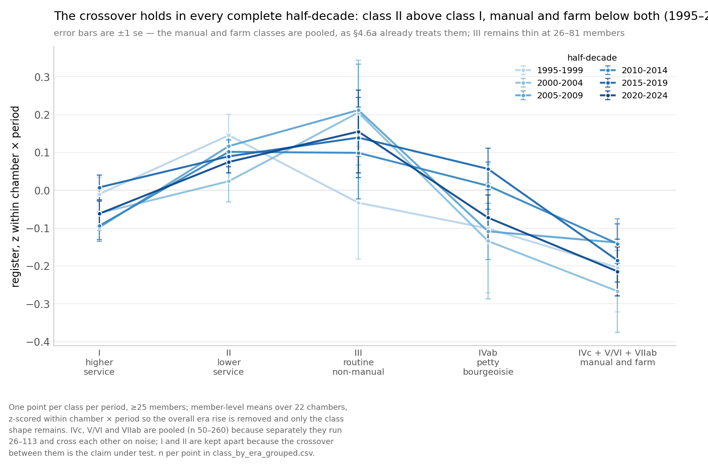

# Machine-drafted speech in legislatures: prevalence, concentration, and a register that predates the machines

**S10 — draft write-up, 2026-08-11; §4.6a and Appendix A extended
2026-08-13.** All arms complete, including the detector-bypass study and both
prior-art comparators. Everything is reproducible from `analysis/s10/`.

**The 2026-08-13 additions carry UNVERIFIED citations.** §4.6a places its
result against Labov, Simmel, Veblen, Jhering, Bourdieu and Lieberson, none of
which has been checked against a primary text — one fetched entry was already
wrong on both year and publisher. See `CLASS-REGISTER-LITERATURE.md`. That
subsection also reports standard errors that are not clustered on member,
which the study has been bitten by three times; both are flagged in place.

**Numbers marked † are carried from earlier in the study.** All nine were
re-derived from their artifacts on 2026-08-11 and reproduce; footnotes on each
give the script and invocation. Two of the nine (§4.6's cohort share, §4.7's
pooled alignment effect) were briefly and wrongly recorded as unsourced — the
verification pass had looked in the wrong script — so their footnotes name the
right one explicitly. Everything unmarked was computed or re-verified on
2026-08-09/11 and names its source file.

---

## 1. The question, and why it needs two instruments

How much legislative speech is machine-drafted, and what does its arrival do
to deliberation?

The question splits in two, and conflating them is the main error available
here:

- **Prevalence** — how much text in the record was drafted by a machine. This
  needs a calibrated detector.
- **Permeation** — whether human speech is drifting toward machine register
  independent of drafting. This needs instruments that do *not* depend on a
  detector, because the human baseline is itself the thing moving.

S10 runs both, and reports them as separate claims. The prevalence arm is the
headline; the permeation arm is the more surprising result, and the weaker
one.

---

## 2. Data

Nineteen chambers across four countries, extracted from official Hansard and
the Congressional Record:

| group | chambers |
|---|---|
| Canada | federal House of Commons, AB, BC, MB, NB, NL, NS, ON, SK |
| Australia | NSW, QLD, SA, TAS, VIC, WA |
| UK/Ireland | House of Commons, Scotland, Wales, Northern Ireland, Dáil Éireann |
| US | House, Senate |

Per chamber, two strata:

- **control** — 60 segments dated on or before **2022-06-30**. Not
  2022-12-31: ChatGPT shipped 2022-11-30, and a "pre-AI" control dated
  December 2022 is not pre-AI. Every chamber had ample earlier material, so
  the tighter cutoff cost nothing.
- **prevalence** — segments dated 2025-01-01 or later, sampled uniformly at
  random with no detector-screen stratification.

Segments are member-authored, English-original, non-chair, and 50 words or
longer — the whole of the record Pangram will read. Sampling is at a uniform
rate across segment lengths, so the sample reproduces the corpus's own length
mix and the pooled estimate needs no length weights. Sampling is seeded per cell
and reproducible (`build_pangram_expansion.py`, `build_shortband.py`).

### 2.1 Two contamination hazards, both found by looking

**Invisible characters.** Manitoba's 2025-26 files carry soft hyphens
(U+00AD) in 81.6% of segments against 0.04% of tokens in 2006-19. Left in,
that is period-correlated noise a detector could latch onto with nothing to
do with drafting. Stripped at build time.

**Transcription regime.** A chamber that moved from edited Hansard to
verbatim or ASR-assisted transcription will shift on exactly the surface
features a detector reads, with nobody having drafted anything by machine.
`transcript_regime_check.py` measures two markers that track editorial
convention rather than content — words per sentence, and contraction density
(traditional Hansard expands "don't" to "do not"; verbatim transcription does
not) — random-sampled per chamber-year.

Findings, and they cut against the received story:

- The Aug-2026 policy scan named **NSW and WA** as ASR users. Both are
  **flat across 2006–2026** on both markers. Whatever they procured has not
  visibly changed the text.
- **Tasmania** — named by nobody — moved: contraction density **3.4 → 15.9
  per 1,000 words, +364%**, with the step falling *between* the control and
  prevalence windows. No pre-AI text exists in Tasmania's current regime, so
  no control can calibrate it. **TAS is reported but excluded from pooled
  estimates.**
- **NL (2016), WAL (2015), MB (2007)** step *inside* the control window.
  On the raw pool NL and WAL trip the same "across the windows" banner as
  Tasmania (NL +770%, WAL +238% full-series), but that is an artifact of
  averaging a pre-window that straddles their own step; with the floor applied
  the reconciled step is small (NL +8%, WAL +11%, MB +9%). Their controls were
  floored to the current regime — still comfortably pre-AI, so nothing was
  lost, and unlike Tasmania the step falls inside the control window where a
  floor can fix it.

---

## 3. Method

### 3.1 The calibration that carries the argument

Prevalence is only meaningful against a measured false-positive rate. **A
chamber's false-positive rate depends on its own editorial register, so
specificity is not transferable** — each chamber buys its own 60-segment
pre-AI control. This is the single most important design choice in the study
and the reason its result differs from published comparators (§7).

With specificity `Sp` and sensitivity `Se`, an observed flag rate `π` relates
to true prevalence `τ` by Rogan–Gladen:

```
π = τ·Se + (1−τ)(1−Sp)      ⇒     τ = (π − (1−Sp)) / (Se − (1−Sp))
```

When `Sp = 1` this collapses to `τ = π/Se`. **`Se` is not estimated.** Since a
detector's sensitivity cannot exceed 1, `τ = π/Se ≥ π`, so with `Sp = 1`
measured (§4.1) the observed flag rate is a conservative floor on true
prevalence — every prevalence figure below is thus conservative with respect
to machine text the detector misses.

### 3.2 Detector, and a defect worth recording

All verdicts are **Pangram 4**. This is not a detail. The Pangram API's
default model is **Pangram 3** (version 3.3.2), while the web dashboard runs
Pangram 4. On a 20-segment sample deliberately enriched for AI and Mixed, the
two agreed on **11/20** — the default called Human on 3 of 8 web-AI segments
and 5 of 6 web-Mixed, and never returned Mixed at all. Passing
`model: "pangram-4"` gave **20/20 exact agreement including all six Mixed**
(`api_route_check.py`).

So the API and dashboard routes are interchangeable, *but only when the model
is named*, and the failure is silent — you get verdicts, they just aren't the
same instrument. Billing corroborates it independently: the dashboard's
`ceil(words/100)` credit rule is exactly Pangram 4's $0.05-per-100-words,
while the defaulted API billed per document at Pangram 3's 1,000-word unit.

The 2026-07 New Brunswick run passed no model parameter and silently took
Pangram 3. It was rescored (§4.1).

### 3.3 Why the frequency arm is descriptive, not inferential

This belongs in methods rather than an appendix, because it explains the
framing of §4.5.

The Kobak et al. excess-vocabulary approach (arXiv:2406.07016; *Sci Adv*
11(27):eadt3813, 2025) compares observed word frequencies against a
counterfactual built from prior years. Applied naively to Hansard it produces
a large, confident-looking post-2022 signal.

**It has no trend control.** `in_time_placebo.py` runs the identical
estimator on *pre-LLM* window pairs, where the true effect is zero by
construction. It fires there too. An estimator that reports a large effect on
a period when nothing happened is measuring drift, not treatment.

The arm is therefore reported as a **descriptive series**, not as evidence of
LLM causation. This is what makes the 1994–96 onset (§4.5) interesting rather
than embarrassing: the register was already moving decades before the
machines.

### 3.4 Instruments retired, and why

Named here because a reader needs to know what was tried and dropped, not to
pad an appendix:

| instrument | outcome | why dropped |
|---|---|---|
| Zero-shot detectors (Binoculars/Falcon, Fast-DetectGPT, Qwen pairs) | 2025-26 flag rates sat **below** their own pre-LLM false-positive floors | edited AI is invisible to them; retro-explains every pilot null |
| Corpus-wide likelihood delta | triple-replicated null | no signal at corpus scale |
| Frequency-weighted secondary | fired in 4/30 cells | indistinguishable from noise |
| Content-word control | orthogonal to the claim | words rising elsewhere says nothing about here |
| Mistral synthetic sensitivity corpus | deleted | too few words to carry variance; sensitivity not estimated |

---

## 4. Results

### 4.1 Calibration: 1,260 / 1,260

**Zero false positives across every chamber's own pre-AI control.**
Specificity **100.00% [99.7%, 100.0%]** (Wilson). Sensitivity is not
estimated: with `Sp = 1` and any real detector's `Se ≤ 1`, the observed flag
rate is a **conservative floor** on true prevalence, so every §4.2 figure is
if anything an underestimate of machine text. (`prevalence_report.py`)

**New Brunswick rescore.** 658 segments, byte-identical stored text, Pangram
3 vs Pangram 4:

| | Pangram 3 | Pangram 4 |
|---|---|---|
| pre-AI control (n=60) | 60/60 | 60/60 |
| 2020 / 2021 / 2022 | 0% flagged | 0% flagged |
| AI + Mixed, overall | 122 | **144** |
| exact agreement | | 92% |

Specificity is **identical**. The model-tier defect was an **undercount, not
a false-positive problem** — disagreements run net upward (33 segments moved
out of Human, 9 the other way). Earlier NB conclusions stand as conservative.
(`nb_p3_vs_p4.py`)

### 4.2 Prevalence: 9.0% of words, with an elevenfold spread

**Pooled 9.03% of words [8.00%, 10.08%]** — 65,795 machine-written words of
728,998 across 3,519 segments in 20 chambers, excluding regime-flagged TAS.

Every figure below is the share of *what was said* that is machine-drafted,
over the whole of the record Pangram will read.

*Weighted by words, because a segment is not a natural unit.* `segment.py`
packs speaker turns into windows of at most 360 words, so a long speech becomes
three segments and a short interjection becomes one. A rate over segments is
partly a measurement of our packer; a rate over words is invariant to how the
text was cut up.

*Weighted by AI fraction, because a flagged segment is not uniformly flagged.*
The flagged segments are not one kind: of the 364 flagged prevalence segments,
**217 are full AI verdicts and 147 (40%) are Mixed** — Pangram reporting that
part of the segment is human. Counting a Mixed segment's words as fully machine
over-states the rate by a third — **12.03% against 9.03%** — so the split is
not cosmetic, and folding Mixed in at full weight (as a naive AI+Mixed count
would) is the single largest upward bias in the headline. Every flagged segment
is therefore weighted by its own AI share: recorded directly for the API-scored
rows, and read off the dashboard result by result for all 132 Mixed segments
the API did not cover. Those harvested Mixed segments average **0.435** machine
(n=132, sd 0.219, range 0.11–1.00); AI verdicts are effectively a constant at
0.9965. Human verdicts are 0.0 in every one of the 1,246 recorded cases. The
9.03% headline is thus already the split-corrected figure, not an AI-or-Mixed
count.[^r42f]

| chamber | rate | 95% CI | | chamber | rate | 95% CI |
|---|---|---|---|---|---|---|
| NSW | **19.8%** | [13.2, 26.9] | | IE | 7.5% | [3.6, 12.2] |
| CA-FED | 18.5% | [12.5, 24.6] | | VIC | 7.3% | [3.5, 11.7] |
| QLD | 15.8% | [9.9, 22.1] | | SA | 6.8% | [2.9, 11.3] |
| BC | 14.2% | [8.3, 20.4] | | WA | 4.9% | [1.4, 9.1] |
| MB | 13.1% | [8.1, 18.6] | | WAL | 4.9% | [1.6, 8.9] |
| NI | 13.1% | [8.1, 18.6] | | SK | 4.1% | [1.3, 7.5] |
| **US House** | **12.1%** | [7.0, 17.7] | | SCO | 3.9% | [1.0, 7.4] |
| ON | 11.1% | [6.1, 16.8] | | NL | 3.3% | [0.8, 6.6] |
| NS | 10.0% | [5.4, 15.2] | | UK | 2.5% | [0.7, 4.8] |
| AB | 7.8% | [3.9, 12.2] | | **US Senate** | **1.8%** | [0.1, 4.1] |

Intervals are cluster bootstraps over segments, not Wilson intervals: the
estimator is a ratio of two random sums whose numerator and denominator move
together, so a chamber whose one flagged segment happens to run 900 words
should read as less certain than one whose flag is 130 words, and a binomial on
segment counts cannot express that.[^r42]

The spread is the finding, not noise around a mean: chamber rates run from
1.8% to 19.8%, an elevenfold range. What drives a chamber's position is not
established here — even two chambers of one legislature can sit far apart
(§8.6 B4), and the study does not attribute the between-chamber differences to
any measured cause.

**Federal Canada's row comes from its own uniform draw**, not from the
genre-stratified sample that answers §4.3. The genre arm takes 60 segments
each from Statements by Members, Government Orders and Oral Questions, which
imposes a genre mix rather than observing one and leaves 25.6% of the chamber's
in-band record — Private Members' Business, Adjournment Proceedings, Routine
Proceedings, the Throne Speech reply — in no stratum at all. Read as a chamber
rate it gives 16.5%; the uniform draw of 120 prevalence segments gives **18.5%**,
and the uniform draw is what the table reports. Dropping CA-FED entirely leaves
the pool at 8.50% against 9.03%, so the chamber contributes about half a point
to the headline and neither makes nor breaks it.[^r42ca]

[^r42ca]: `pangram_ch_verdicts.csv`, rows `caprev*`/`cactl*`. Its short band
    already matched this draw: 120 × 15,236/18,029 = 101, and 101 short
    segments were scored at the matched rate. Seven controls dated after the
    2022-06-30 cutoff — one of them after ChatGPT shipped — were replaced on
    2026-08-13 from the same 2018–2022 window the survivors occupy
    (`build_cafed_ctl_redraw.py`); all seven replacements scored Human, as had
    all seven originals, so specificity is unchanged at 60/60 and only the
    design claim is repaired.

**UK Commons and Dáil Éireann are scored entirely on Pangram 4**, verified
rather than assumed: all 360 of their segments from the four-chamber arm, which
recorded no model version, were rescored through the dashboard and agree with
the original verdicts **360 out of 360**. That agreement is itself the largest
Pangram 3-versus-4 comparison in the study (§3.2).

**Manitoba's 13.1% depends on a repaired extractor**, and without it the
chamber reads 5.3%. The original extraction lost 42% of the record: from
mid-2018 the Manitoba Hansard export splits a speaker's name across several bold runs
around inserted table-of-contents anchors, the extractor's prefix pattern
matched only the first run, and the speech accreted to the previous turn — the
Speaker's — where it was discarded as chair voice. Chair share of page text ran
4% in 2011–13 against 37–40% in 2020–24.

The loss was **not neutral**, which is why it matters so much. A frame missing
42% of text at random would leave the rate roughly unchanged. What was
missing were the formatted, anchor-bearing speeches — the prepared ones — and
prepared business is exactly where drafting concentrates (§4.3). The extractor
was preferentially deleting the machine-drafted half of the chamber's record.

The controls are the check that this is a frame effect and not the detector
behaving differently: they were clean before the fix and remain clean after,
**0 of 18,342 words**. 275 segments were redrawn from the corrected extraction
and rescored, restricted to the original year windows so that the frame is the
only thing that changed.[^r42mb]

[^r42mb]: `python build_mb_redraw.py`, then `pangram_mb_redraw_verdicts.csv`.
    The redraw deliberately excludes the years backfilled in August 2026: a
    first draw from the corrected frame pulled 30 of its 90 controls from
    2011–14 and 2020–22, years no other chamber can draw from, which would have
    confounded the frame repair with a change of window. The superseded
    extraction is kept at `provinces/superseded/` so the pre-fix verdicts stay
    reproducible — 135 of the old 278 seg_ids do not exist in the corrected
    file, because re-extraction shifts turn indices.

[^r42f]: Fractions live in `fraction_ai_harvested.json` (151 harvested
    individually) and in the `fraction_ai` column of
    `pangram_p4_verdicts.csv` (1,431 recorded by the API). The 154 AI verdicts
    not harvested individually are carried at the measured constant; two
    independent samples put it at 0.9965 (n=148) and 1.0000 (n=19), and the
    lowest AI value anywhere is 0.81, so clicking them would move the pooled
    figure by under 0.01pp.

    **This is a correction, not a refinement.** Every rate this study reported
    before 2026-08-13 counted a Mixed segment as wholly machine-written. The
    error is a factor of 1.33 on the headline and is not uniform across the
    study: it is largest where Mixed verdicts cluster, which is the
    mixed-format business in the middle of §4.3's genre ladder.

[^r42]: `python -c "import banded_prevalence as B; B.table(B.load())"`.

### 4.3 Genre: drafting concentrates in scripted business

Federal Canada is the only corpus carrying a business rubric, which makes
this test possible at all.

The three genres form a ladder in **how much advance preparation the
procedure permits**, which is the mechanism under test:

- **SO31 — Statements by Members.** Under Standing Order 31 a non-minister
  may address the House for up to one minute on any subject, immediately
  before Question Period. Not debatable, no reply. Written ahead and read.
- **Government Orders.** Government bills and motions. Covers both prepared
  speeches (20 minutes for early slots, 10 later) **and the spontaneous
  questions-and-comments periods that follow each one** — a genuinely mixed
  category, not pure prepared debate.
- **Oral Questions.** The 45 minutes after SO31. **Questions are not placed
  on notice**, so neither question nor answer can be fully drafted in
  advance; both sides are held to roughly 35 seconds.

| genre, 2025–26 | flagged words | 95% CI |
|---|---|---|
| **SO31** — one-minute scripted set-pieces | **32.3%** | [21.0, 44.1] |
| Government Orders — mixed prepared and spontaneous | 19.9% | [10.4, 30.3] |
| **Oral Questions** — not on notice | **9.8%** | [2.3, 19.2] |
| all three pre-AI controls (0/180) | **0.0%** | [0.0, 2.1] |

**SO31 vs OQ: 3.29×, +22.5pp, permutation p = 0.0025.**

Word-weighted and fraction-weighted, like every other rate here. **Weighting
by the AI share widened this ladder rather than flattening it**, which was not
the expected direction: Mixed verdicts are commoner in the mixed-format
Government Orders than in the scripted SO31 set pieces, so counting Mixed
segments as wholly machine had been flattering the middle rung. On binary
counting the three read 35.8% / 25.7% / 11.8% and a 3.03× ratio.

The word-weighting choice matters more in this table than anywhere else in the
study: the genres differ sharply in how long
their segments are — SO31 is a one-minute set piece, a Government Orders slot
runs twenty — so a segment-weighted comparison measures the packer's behaviour
across genres alongside the drafting. On segments the same data reads 36.7% /
23.3% / 8.3% and a 4.40× ratio; word- and fraction-weighted the ordering is
unchanged and **the gap settles at 3.29×**. The test is a label permutation rather than
Fisher exact, because Fisher takes segment counts and the estimator is a ratio
of summed words.[^r43w]

[^r43w]: `python prevalence_report.py` for the rates and bootstrap intervals;
    the SO31-vs-OQ permutation is 50,000 label shuffles of the pooled
    prevalence segments. Reported here rather than the old Fisher p = 0.00034,
    which tested a quantity the study no longer reports. The same script prints
    the Cochran–Armitage trend statistic on the segment counts (doses
    OQ < DEBATE < SO31); the adjacent-rung Fisher exacts are computed from the
    3×2 segment table.

The ordering is exactly what the mechanism predicts — the more preparable the
format, the more machine drafting — and it is the one place where the lexicon
arm's inference is confirmed by an independent instrument. Two instruments
agreeing is worth more than either alone.

The monotone trend across all three rungs is the ladder's proper test, and it
holds: a Cochran–Armitage trend test on the segment counts (5, 14 and 22 flags
of 60) gives z = 3.70, p = 2.2 × 10⁻⁴.[^r43w] The two adjacent steps are each
individually underpowered at 60 segments per cell — SO31 vs Government Orders
p = 0.16, Government Orders vs OQ p = 0.043 by Fisher exact — so it is the
trend across the ladder, not any single step between neighbours, that the data
establish.

**The Oral Questions cell is not Question Period, and reading its flags
individually says more than the rate does.** The 120–360-word filter retains
95.2% of SO31 segments but only a small fraction of Oral Questions, because
QP utterances are short. What survives is the long tail: procedural and
ceremonial business filed under the QP rubric rather than question-and-answer
exchange.

Not one of the five flagged segments is spontaneous exchange.[^r43] Two are
**eulogies** for a former member. One is a **question of privilege**
responding to a matter raised the previous day. One is a **unanimous-consent
motion** — text negotiated between parties beforehand and read verbatim, the
most pre-written thing that happens in the chamber. The fifth is a backbench
question of the routinely staff-written kind. The genre claim therefore holds
segment by segment and not only in aggregate: within the genre nominated as
unscripted, the flags land exactly on the parts that were written in advance.

This makes the 8.3% a **mislabelled row rather than a wrong one**. It is not
an estimate of Question Period; it is an estimate of long-tail business
carrying the QP heading, and the true rate for genuine exchange is lower —
possibly zero.

**One flag type has no control, and it should not be leaned on.** Two of the
five are tributes, both at `fraction_ai` 1.0, and **no pre-AI tribute exists
anywhere in the control set**. Tribute register — elevated, cadenced, parallel
construction, abstract virtue nouns — is exactly what a detector keys on. Those
two are either strong evidence of drafting or the most interesting false
positive in the study, and nothing here separates the two readings. What the
controls do establish is that formal prepared *procedural* speech does not trip
the detector: the six pre-AI privilege and Business-of-the-House segments among
the CA-FED controls all read Human, inside the 1,260/1,260 overall.

[^r43]: `python genre_oq_audit.py`, which prints the five flags with their
    order-of-business headings, the control composition, and the unmet tribute
    control. It also retires an argument this section previously made — that
    the length floor leaves "prepared ministerial answers", the sub-population
    "most likely to be machine-drafted". Both halves are false: ministerial and
    parliamentary-secretary segments flag **0 of 28**, all five flags coming
    from non-ministers, and the floor selects *away* from ministers rather than
    toward them (ministerial share of Oral Questions falls 46.3% → 36.1% across
    the filter; median ministerial utterance 89 words against 95). The
    conclusion that the cell is biased upward survives; that mechanism does
    not.

Extraction is paragraph-level throughout, so no genre loses whole speeches to
the length cap; the differential retention above is a property of natural
utterance length, not of truncation. Flag rate itself rises with segment length
(§5), which cuts the same way: the filter keeps Oral Questions' longer segments,
so the surviving cell is biased *up*, and true Question-Period exchange sits
lower still.

### 4.4 The Opus screen tracks Pangram

A blinded LLM screen over the full corpus (37,801 segments, date-blind)
separates Pangram's classes cleanly on the 618-segment overlap:

| Pangram verdict | n | mean Opus score |
|---|---|---|
| AI | 78 | 50.9 |
| Mixed | 26 | 44.8 |
| Human | 514 | **11.9** |

The deployed screen — the run over all 37,801 segments — separates Pangram's
AI and human classes at **AUC 0.954** [0.934, 0.971] on the 618-segment
overlap, and it is a cheap stratifier for future work.[^r44dep] The pool is a
case-control mixture whose human class is drawn partly from pre-2023 text,
which is *provably* pre-LLM and therefore the cleanest available negative;
restricting the negatives to 2023-and-later contemporary speech only *lowers*
the AUC, to **0.940** [0.915, 0.961]. Contemporary human speech is the harder
class to separate — as the permeation finding predicts — so the era mix is not
flattering the screen.

[^r44dep]: `python opus_screen_auc.py`. The deployed screen is
    `opus_screen_full.js` (473 batches of 40), distinct from the lean
    validation run used in the effort A/B below; the two differ in score level
    (mean 34.3 vs 26.5) but not in discrimination. All labels are Pangram 4.

**Reasoning effort buys nothing here, and that is worth stating rather than
hiding.** The screen was tuned and validated at `effort=low`, and low had
never been compared against anything. Re-run on the 241-segment labelled pool
with the prompt and batching held byte-identical (all AUCs against Pangram 4):

| run | AUC | 95% CI |
|---|---|---|
| archived low | 0.948 | [0.920, 0.973] |
| fresh low (replicate) | 0.951 | [0.923, 0.974] |
| **max** | **0.942** | [0.911, 0.968] |

The low-effort run was replicated so the effort comparison has a noise floor.
A paired bootstrap of max − mean(low) gives **−0.007**, 95% CI
**[−0.023, +0.007]**: centred below zero, and the whole interval sits below
even the +0.015 the weaker open model gains from reasoning, let alone Qwen's
+0.172. Effects below ~0.03 AUC are outside this design's resolution.
Per-segment correlations agree: low-vs-low r = +0.976, low-vs-max +0.959 and
+0.960 — max ranks the same and is *more decisive on the human class* (it
sends more clear negatives to the floor), not a different scorer.

Against a single low run, max would have looked like a small decline and been
tempting to report as an effect. **The replicate is what makes the null
readable.**

This also cuts against the pattern in the open models, measured on the same
pool: effort moved Qwen3-32B by **+0.172** and gpt-oss-120b by **+0.015**,
against **−0.007** for Opus. Reasoning closes part of the gap for weak
detectors and does nothing for a strong one — consistent with §3.4's finding
that reasoning never closes the ~0.25 AUC frontier gap, but sharper: the
frontier model is not reasoning its way to 0.95, it is recognising something
at a glance. Practically, the screen can be run for about **4× fewer reasoning
tokens (~2× all-in)** with no loss. (`opus_effort_ab.py`, `opus_effort_ab.csv`)

### 4.5 The register shift starts in 1994–96, decades before the machines

Descriptive series (§3.3), UK Commons extended back to 1985. The register
*declines* through the late 1980s and turns upward around **1994–96** —
before the consumer web, and long before any language model. Whatever this
measures, LLMs did not start it.[^r45]

[^r45]: `python long_trend.py --seg uk/segments_uk_deep.jsonl` for the annual
    series; the turning point is the minimum of the annual
    instrument-minus-placebo gap (the script fits no curve), and it lands on
    1994. A day-clustered bootstrap (`python long_trend_bootstrap.py`, 2,000
    resamples of sitting days within year) puts the minimum at 1994 in 84.8% of
    resamples, 1995 in 13.0% and 1996 in 2.1% — so "1994–96" is a genuine
    [1994, 1996] interval, not a hedge.

Read together with §4.7, the interesting reading is not "LLMs changed
parliamentary register" but that **human register had been moving toward what
instruct-tuning later selected for, for thirty years.** †

### 4.5a The climb is everywhere except the United States

Running the same series on every chamber turns the thirty-year drift into a
comparison. The instrument and the 200 matched placebo sets are built once, on
UK Commons 2010–12, and applied unchanged everywhere, so the chambers are
measured with the same ruler.[^r45a]

| chamber | gap per 100k, first year | last year | change | |
|---|---|---|---|---|
| UK Commons | 380 (1994) | **1,444** (2026) | **×3.80** | rises |
| Ireland | 1,603 (2018) | **1,975** (2026) | ×1.23 | rises |
| CA federal | 1,865 (2015) | 1,735 (2026) | ×0.93 | flat |
| **US House** | **1,515** (1994) | **1,709** (2026) | **×1.13** | **flat** |
| **US Senate** | **1,314** (1994) | **1,562** (2026) | **×1.19** | **flat** |

The US chambers are flat across thirty-two years, and they start *above* where
the UK still sits two decades later: US House 1,515 in 1994 against the UK's
1,444 in 2026. So the picture is not a common shift. It is everyone else
converging upward on a level the United States already held before the consumer
web, while the United States does not move.

The US series reaches back to 1994 only as of 2026-08-13. The Congressional
Record is on GovInfo from 1994, which the study had not used: the original
download began at 2006 because that was where the state-exposure design needed
it. Extending it was the decisive test, because a US series starting in 2006
cannot distinguish "the United States was always there" from "the United States
got there first and stopped". The 1994 values settle it.[^r45c]

**They caught up; they did not pass.** A single recent year appears to
contradict that: in 2026 the Canadian provinces, Ireland, the Australian states
and federal Canada all sit above US House. The comparison does not survive
contact with the variance. US House swings between 1,660 and 2,074 across the
series — a 25% range, the widest here — and 2026 catches it at 1,709, near its
own floor. On 2020–26 means, with each series' standard deviation alongside:

| | mean | sd | vs US House |
|---|---|---|---|
| CA provinces | 2,054 | 61 | **+155 (+1.28 sd)** |
| Ireland | 1,901 | 52 | +2 (+0.02 sd) |
| **US House** | **1,899** | **121** | — |
| AUS states | 1,861 | 36 | −39 (−0.32 sd) |
| CA federal | 1,816 | 134 | −84 (−0.69 sd) |
| US Senate | 1,591 | 60 | −309 (−2.55 sd) |
| UK Commons | 1,415 | 61 | −484 (−4.00 sd) |

Only the Canadian provinces are meaningfully above, and they are a standing
exception this study does not explain. Ireland is at parity to within a
fiftieth of a standard deviation; the Australian states and federal Canada are
below. Three of the four apparent overshoots are US House having a low year.

**Exported machine text does not account for the rest, and cuts the wrong
way.** The natural rescue — that AI drafting, American-inflected, is pushing
the others past — fails on the arithmetic: US House is **14.3% machine by
instrument occurrences** against Ireland's 9.0% and the Australian states'
11.3%, so removing machine text lowers the American benchmark by more than it
lowers the challengers. Federal Canada is the one case it does explain, at
21.7% the most machine-written chamber in the study, dropping from
apparently-above to clearly-below once corrected.[^r45f]

[^r45f]: `python convergence_check.py`, with shares from
    `ai_share_of_instrument.py`. Machine-written text carries the instrument at
    4,231 occurrences per 100k words against human text's 3,470, a ratio of
    1.22×, so a chamber that is 9.0% machine by words is 10.6% machine by
    occurrences. Note this is an overlap between two instruments and not a
    causal decomposition: a high instrument rate inside flagged text is part of
    why the detector flagged it. The correction also applies only to 2025–26,
    the detector's window, so it is anachronistically absent from 2023–24 where
    some machine text certainly exists unmeasured.

**A caveat that constrains how this can be read.** The instrument is Kobak et
al.'s list, derived from PubMed abstracts — American scientific English. Chamber
*levels* are therefore partly definitional: a US-derived yardstick will score US
speech high whatever is happening. The defensible comparison is the *within*-chamber
trend, and that is where the finding sits.

**What post-training does resembles what already distinguished American
usage.** If the two processes select for the same thing, the vocabulary shift
instruct-tuning induces should line up with the difference that already
separated American from British legislative speech before any model existed.
Measured on 4,823 words in a 2006–10 window, it does, weakly and
specifically:[^r45b]

| contrast | Spearman | partial, holding frequency |
|---|---|---|
| post-training preference vs log(US/UK) | **+0.081** | **+0.086** |
| vs log(Canada/UK) | +0.012 | +0.012 |
| vs log(Australia/UK) | +0.018 | +0.004 |
| vs log(US/Canada) | +0.083 | +0.088 |

Permutation p < 0.005. The **discrimination** carries more than the coefficient:
Canada and Australia are anglophone parliamentary democracies too, and
post-training moves models toward none of what distinguishes *them* from
Westminster. It is not drift away from British usage; it is drift toward
American usage specifically, and Canada — nearest neighbour to the United
States — shows nothing.

The effect is small: r = 0.081 is under one percent of variance. And the design
establishes compatibility, not cause. A shared cause predicts the same
correlation — both the models and the global drift could be downstream of an
American-dominated written corpus, with no common optimization involved. §8.6
names the instrument that would separate those two.

[^r45a]: `python occurrence_trends.py --build --report`. Word-weighted, pooled
    into fixed-composition panels; a pooled line whose membership changes
    between years is a picture of the download schedule, not a trend. Chamber
    coverage and every gap are tabulated in the output. 2023 is missing from
    most chambers because the study design excluded it as a washout year
    between the 2018–22 and 2024–26 windows.

[^r45c]: `python us/fetch_us_hist.py --years 1994-2005,2023 --per-year 60
    --tag US_DEEP_DONE`, then re-extract with `us/us_extract.py zips
    segments_us.jsonl` and rebuild. 780 sitting-day zips at 60 days/year;
    both chambers are now unbroken 1994-2026 with no missing year. The
    extraction nearly doubled the US corpus — House 66.0M to 108.2M words,
    Senate 74.4M to 144.7M. Rates are per 100k words, so uniform within-year
    sampling costs precision and not validity.

[^r45b]: `python alignment_vs_american.py`. Three families at 1,600 prompts;
    reference corpora US 37.6M, UK 44.2M, CA 74.8M, AU 88.8M words over
    2006–10 — pre-transformer, and early enough that the UK's own climb has
    barely begun, so the ratio compares two human traditions rather than two
    stages of one drift. Reported on all words. US/UK spelling pairs and
    one-word orthographic forms (`percent` for "per cent") are reported as a
    separate stratum, along with two harsher filters, as robustness only.

### 4.6 A generational gradient, net of calendar drift

Every member-year of legislative speech carries two time-stamps: the year the
words were **spoken** (calendar period) and the speaker's **birth year**
(generation). If the register were only a period effect, everyone would drift
up together and birth year would add nothing once the calendar year is held
fixed; if it were generational, later-born members would use more of it even in
the same year and chamber. Both hold, and they separate cleanly.

- **Birth cohort predicts the register net of calendar time.** Regressing the
  member-year rate on spoken year and birth year together, with chamber fixed
  effects (all 22 chambers, 61,312 member-years): birth **+0.88 per 1,000 words
  per decade** (t = 33.8) against spoken year **+1.25 per decade** (t = 29.2).
  A legislator born a decade later uses about +0.88/1,000 more of the register
  *in the same year and chamber*. †[^r46a]
- **Birth is the marginally stronger organiser.** On identical rows the
  within-chamber, word-weighted correlation of the register rate is **+0.325
  with birth year** against **+0.302 with spoken year**, and birth is the
  stronger of the two in 15 of the 22 chambers. †[^r46a]
- **The gradient holds within year and province at +1.05 per 1,000 per decade**
  (t ≈ 8.5, clustered on member), unmoved by occupation and education controls,
  which *strengthen* it rather than explain it away (§4.6a). †[^r46b]
- **Sitting members convert too, at about half the pace.** With member fixed
  effects — so the slope is identified only off a member's own movement, and
  every fixed difference between members drops out — the register rises
  **+0.51 per 1,000 words per decade** within member (t = 6.0, clustered on
  member, 8,600 members with three or more years). Against the +1.24 total
  calendar drift, roughly **40% of the period rise happens inside continuing
  careers** and the rest arrives with the composition of the chamber. †[^r46c]

Stated conclusion: **both mechanisms operate.** Later-born cohorts arrive using
more of the register, a gradient that stands net of calendar drift; and members
already sitting drift upward inside their own careers, at about half the
aggregate rate. Neither displaces the other. The cohort gradient is not
ministerial office: in the chambers whose record marks rank it *strengthens*
when office years are removed, and office-holders use less of the register than
backbenchers, not more (Appendix D.4). The mechanism behind the cohort
gradient remains unidentified — three exposure tests failed to isolate it
(Appendix A). Cohort is not the whole of who uses the register — §4.6a adds
three predictors that survive it — but none of them identifies the cohort
mechanism either.

[^r46a]: `python cohort_vs_period.py`. Member-year register rate regressed on
    spoken year and birth year with chamber fixed effects, word-weighted,
    HC-robust; all 22 chambers now carry member birth years, 61,312
    member-years, after the nine Australian and UK-devolved chambers were
    collected on 2026-08-17. Within-chamber correlations are on the same rows.

[^r46b]: `python formation_window.py`, clustered on member (CR1): birth-decade
    coefficient +1.05 per 1,000 words per decade, t = +8.46 unadjusted and
    +9.23 with occupation and education controls. The controls *strengthen* the
    cohort term (coefficient +1.05 → +1.14), which is why they are reported as
    running the wrong way for a selection story. The member-year HC1 errors the
    script also prints inflate the t to +17.7 — a third instance of the
    unclustered-inference pattern flagged in Appendix A, though here, with 888
    member clusters, the conclusion is unmoved.

[^r46c]: `python cohort_vs_period.py`, final block. Within-member (member fixed
    effects) regression of the register rate on spoken year, word-weighted,
    over every chamber in the panel; members need three or more years to
    contribute. Standard errors cluster on member. Because the estimate is
    identified only off a member's own change, cohort, chamber, seat safety and
    every other fixed attribute of the member drop out by construction.

### 4.6a Class and the register: jointly significant, individually noisy — and education is not it

The arc of this section is a correction applied twice, recorded because both
applications were the study's own committed checks. On the eight provinces,
class, education and prominence appeared to predict the register at t = 3–4.
Clustering by member and replication then removed every INDIVIDUAL certainty
— and an over-hasty first rewrite of this section called that a reversal. The
joint tests say otherwise:

**Clustering the standard errors by member** (the study's third encounter
with unclustered inference flattering a result) leaves the provincial point
estimates untouched and doubles to triples their errors: class II falls from
t = 3.40 to 1.48, IVab from 3.51 to 1.49, VIIab from −4.04 to −1.84, the
education ladder from 2.96 to 0.78. Member-years are not independent draws,
and treating them as such had manufactured the significance.

**Replication on the tier-1 panel** (US House, US Senate, UK Commons, federal
Canada, Dáil Éireann — 18,178 member-years, 2,742 members, clustered) finds
the same qualitative shape at smaller magnitude — II +0.24 and IVab +0.28
above class I, VIIab −0.51 below — with nothing individually significant
except class III, which is significant with the OPPOSITE sign to its
provincial estimate, i.e. noise behaving like noise.

The final specification — one observation per legislator at equal weight,
register z-scored within each legislature against its full member
population, HC1 errors, joint Wald beside every table
(`member_level_estimation.py`; the reasoning for each choice is in its
docstring) — settles the section:

**Class is an inverted U, peaking one rung below the top.** At member level
across 22 chambers (n = 4,896, joint Wald **p = 0.0000**), reading the raw
within-chamber means so that every class stands on its own rather than against
a baseline:

| EGP class | mean z | n |
|---|---|---|
| I higher service | −0.088 | 1,767 |
| **II lower service** | **+0.020** | 2,049 |
| III routine non-manual | +0.036 | 147 |
| IVab petty bourgeoisie | −0.092 | 425 |
| V/VI skilled manual | −0.200 | 222 |
| VIIab semi- and unskilled | −0.403 | 109 |
| IVc farmers | −0.439 | 177 |

Class II sits above class I, and everything below the service classes falls
away sharply. Against class I the contrasts are II **+0.073 (t = 2.49)**, IVc
−0.260 (t = −3.82), V/VI −0.161 (t = −2.63), VIIab −0.252 (t = −2.99); under
chamber fixed effects on raw rates the crossover is larger still, +0.650
(t = 5.17). III is nominally the highest cell but rests on 147 members and is
not distinguishable from II.

**The shape holds in every period, and does not migrate.** A chase-and-flight
cycle predicts that the originating tier abandons the form first, so the peak
should slide downward across eras. It does not: class II sits above class I in
all seven half-decades, and the manual-and-farm tail stays at the floor
throughout.



*The class profile of the register, 1995–2026. One point per class per period
(≥25 members), member-level means over 22 chambers, z-scored within
chamber × period so the overall era rise is removed and only the shape across
classes remains. IVc, V/VI and VIIab are pooled because separately they run
26–113 members per period and cross each other on noise; I and II are kept
apart because the crossover between them is the claim under test. Error bars
are ±1 se. Class III remains thin (26–81 members) and its late excursion is not
readable as movement.* †[^r46cls]

The era test cannot say who originated the form. Class I is never at the top,
not even in 1995–99 — but class coding only becomes substantial around 2005,
and §4.5 dates the register's turn to 1994–96. We are looking at a cycle
already in progress, with the crossover established before the first frame. The
study that would discriminate is class-coded Commons speech from 1985–1996,
where the deep archive reaches and occupations are recoverable (§8.6).

[^r46cls]: `python plot_class_by_era_grouped.py`, reading
    `class_by_era_grouped.csv` (per-point means, standard errors and member
    counts); the unpooled version is `class_by_era.csv` / `class_by_era.png`.
    An earlier member-**year** aggregation of the same data appeared to show the
    peak migrating downward; that was an artifact of counting long-serving
    members repeatedly, and the member-level estimate above retracts it.

**Who the peak actually is.** The classes are coded from members' own prior
occupations, so the peak has a concrete membership: class II is teachers (about
300 of them once the variants are pooled), journalists (73), social workers
(47), nurses (63). Class I, below it, is lawyers (roughly 500 across the four
national vocabularies), physicians, accountants, dentists, professors. The
petty bourgeoisie — businessmen, small proprietors, realtors, insurance and
stock brokers — is not elevated at all. The register is heaviest among the
**salaried, credentialled semi-professions**: the teaching, caring and
communicating occupations, credentialled but not elite-credentialled, employed
but not propertied. That is a description of who speaks it, not a claim about
where it came from — §4.5 dates the shift to 1994–96, before anything measured
here could have produced it.

**The II-over-I crossover is established, by the test that needs no
normalization at all.** Comparing class II to class I WITHIN each chamber —
each legislature its own control, cohort-adjusted, equal member weights —
the contrast is positive in 9 of 12 chambers, individually significant in
each of the three with the power to detect it (UK +0.68, t = 2.48; US House
+0.82, t = 2.10; Manitoba +2.26, t = 2.21), and the inverse-variance
meta-analysis across chambers gives **+0.59 per 1,000, z = 3.50**. One
regression variant (full-population z-scoring) reads +0.054σ at t = 1.57 — a
diluted positive, not a contrary result: same sign as every other view,
within 1.2 se of its sibling regression, short of the threshold because that
scaling down-weights exactly the large low-variance chambers where the
contrast is largest. Under heterogeneous per-chamber effects, differently
weighted estimators answer differently weighted questions; no specification
at any point estimated the contrast negative. (The within-chamber meta was
computed after the variants diverged; it corroborates rather than
adjudicates.) Teachers, nurses and journalists out-use lawyers, physicians and
professors, within their own chambers, on both sides of the Atlantic —
Labov's crossover, in this register. The exact location of any peak remains
a non-claim: under a chase-and-flight cycle the peak SHOULD migrate downward
as the top tier's abandonment propagates, so peak location is dynamics, not
structure (an era-resolved peak test is future work).

**Education makes the same inverted U, and it is the same people.** Read as
levels rather than as a ladder (22 chambers, cohort controlled, baseline
bachelor):

| level | mean z | n | vs bachelor |
|---|---|---|---|
| secondary | −0.281 | 234 | **−0.166 (t = −2.69)** |
| college | −0.161 | 371 | **−0.139 (t = −2.67)** |
| **bachelor** | **+0.042** | 1,194 | baseline |
| graduate | −0.025 | 1,271 | −0.008 (t = −0.22) |
| **professional** | −0.130 | 991 | **−0.091 (t = −2.29)** |

Bachelor and graduate form a plateau at the top; both arms fall away
significantly, and the descending arm is the **professional** degree — law and
medicine, the most elite credential in the table — measured on 991 members.
An earlier draft reported this as an ascending "academic ladder" of
+0.065σ/rung. That was a straight line fitted through a hump, and it excluded
the professional degree as being off the ladder — dropping the one category
that breaks monotonicity. The block is jointly significant on its own
(Wald p = 0.0025).

It is not, however, an independent channel. Put class and education in one
model and the education block goes to **p = 0.22** while class holds at
**p = 0.0000** — because the two instruments name the same stratum. Teachers,
nurses and social workers hold bachelor's and master's degrees; lawyers and
physicians hold professional ones. "Class II, not class I" and "bachelor or
graduate, not professional" are two descriptions of one group, so whichever
enters the model first absorbs the other. Education's shape is real and
independently measured; its apparent separate effect is not.

#### All four predictors at once

Cohort, class, education and prominence in a single member-level regression
(n = 4,056 complete cases across 22 chambers; each block also fitted alone on
this same sample, so attenuation is read against its own baseline rather than
against an estimate from a different set of members): †[^r46joint]

| predictor | alone | joint |
|---|---|---|
| **cohort** (per decade) | +0.280 (t 24.3) | **+0.270 (t 26.9)** |
| **class** (block Wald) | **p = 0.0000** | **p = 0.0000** |
|  · II over I | +0.093 (t 3.02) | +0.072 (t 2.10) |
|  · VIIab | −0.300 (t −2.90) | −0.299 (t −2.80) |
| **education** (block Wald) | p = 0.0025 | **p = 0.2150** |
| **prominence** (linear, *not* the right form — see D.3) | +0.035 (t 3.08) | +0.020 (t 2.05) |

**They do not deserve equal billing.** Cohort is untouched by the others and an
order of magnitude better resolved than any of them. Class survives everything,
barely moving. Education does not survive class. Prominence appears here only because a
regression needs a number: the linear term is standing in for two opposite
shapes that cancel when pooled, and the honest reading is the bucket table in
Appendix D.3, not this coefficient.

An earlier version of this table, computed before the nine-chamber expansion
(n = 2,989), showed class failing the joint test — the II-over-I contrast fell
to t = 1.26 and the block to p = 0.0074. That was a power problem, not a
result: cohort is collinear with both class and education, and the smaller
sample could not separate them.

[^r46joint]: `python joint_predictors.py`. Canonical member-level spec — one
    observation per legislator, equal weight, register z-scored within chamber
    against the chamber's full member population, HC1 errors, joint Wald over
    each block's term vector.

**Origin is null, and robustly so.** Parental class, 704 members, tested
under both the panel and member-level specifications: joint p = 0.53–0.59,
group means within 0.1σ of each other. **The register tracks class
destination, not class origin** — what a legislator did, not where they came
from — which favours occupational practice over inherited-status accounts of
the gradient, stated as interpretation.

**Cohort towers over all of it.** Birth decade is **+1.01 (t = 10.96)** in
the member-year panel with year fixed effects — the citable figure, since
career-level specifications absorb era of service into the cohort term — and
survives every covariate this study has measured, in three countries and 22
chambers. For scale: the whole class gradient spans ~0.36σ; cohort covers
that in about thirteen years of birth date.

#### Class: the provincial estimates (retained as the discovery record; see the panel result above)

Coding each member's pre-political occupation into the
Erikson–Goldthorpe–Portocarero schema — two independent Claude passes over a
shared rubric, blind to each other, 96.4% raw agreement, disagreements
adjudicated (`provinces/OCCUPATION_CODING.md`) — gives 897 members and 5,294
member-years, 57.5% of the words that reach a named non-chair speaker in the
eight Canadian provinces.

Register rate against EGP class, year and province fixed effects, weighted by
words, baseline class I:

| class | | vs I | t | members |
|---|---|---|---|---|
| III | routine non-manual | **+2.00** | 4.98 | 29 |
| II | lower service | **+0.84** | 4.23 | 435 |
| IVab | petty bourgeoisie | **+0.80** | 3.24 | 180 |
| I | higher service | — | — | 186 |
| V/VI | skilled manual | +0.21 | 0.34 | 45 |
| IVc | farmers | −0.24 | −0.58 | 53 |
| VIIab | semi- and unskilled manual | **−1.66** | −4.22 | 16 |

**The peak sits one to two rungs below the top.** Teachers, nurses,
journalists, clerks and shopkeepers use the register more than lawyers,
physicians and professors do, and the manual classes use it least. Lawyers are
the single largest occupation in the corpus (40 members) and they sit *below*
teachers.

**The standard three-class collapse destroys this result**, which is worth
stating because that collapse is the conventional reporting unit. NS-SEC pools
III with IVc and V/VI with VIIab; the opposite signs cancel and the table reads
professional 35.5 / intermediate 35.3 / working 34.9 — a null. The
seven-class schema is not a refinement here, it is the difference between a
finding and nothing.[^r46d]

#### Education: the provincial ladder (did not replicate; see above)

Education behaves the same way once the ladder is separated from the
professional track. On the academic rungs alone — secondary, college,
bachelor, graduate — register rises **+0.366 per rung** (t = 3.30), and
**+0.315** with birth cohort controlled (t = 2.96). Treating a professional
degree as a rung above a master's zeroes the linear term entirely, because
law and medicine sit **−0.785 below bachelor's** (t = −3.49). A professional
degree outranks a bachelor's on any ordering, so that dip cannot be attainment;
it is the same class-I effect arriving through a second instrument.

#### The shape has a name — held now as hypothesis, not finding

The second-highest status group exceeding the highest is Labov's crossover
pattern, and the middle tier's described disposition matches his linguistic
insecurity. After clustering, the crossover here is a recurring direction in
two panels rather than a demonstrated effect, so the parallel is a hypothesis
the enlarged panel failed to confirm at conventional thresholds — not a
replication of Labov. It stays because the shape recurred independently and
because the flight result below is measured on pooled text rather than
member-level inference, but nothing in this subsection should be cited as
established.

#### Flight: class I avoids the words that became common

What distinguishes class I is *which* words it avoids. Across style words with
enough volume in 2023–26, the correlation between a word's post/pre lift and
class I's relative use of it against class II is negative at every volume
threshold and strengthens monotonically with volume: ρ = −0.13 at 100+
occurrences, −0.22 at 300+, **−0.42 at 800+ (p = 0.004)**, −0.46 at 1,500+.
Class I under-uses `primary` (2.35× lift), `advocating` (1.85×), `advocates`
(1.57×), `outcomes` (1.54×); it over-uses `remarkable`, `individuals`,
`broader`, `ultimately` — words that barely moved.

That is chase-and-flight: a marker loses value as it is copied, so the group
that holds it abandons the most conspicuous forms first. Jhering stated it in
1883 — fashion, once universally adopted, "condemned by its very nature to
renew itself continuously" — and Veblen and Simmel gave it its standard form.
Lieberson is the closest parallel to our case, because his markers are discrete
lexical items: first names diffuse down the status ladder and are abandoned by
higher-status parents once they become common.[^r46e]

#### Prominence: a gradient in the provinces, an arc in the national chambers

Each member's Wikipedia article length — a measured page property (wikitext
bytes via the MediaWiki API), not a judgement — is the third status marker
available here, alongside class and office. Read in buckets rather than as a
single slope, it splits the chambers into two shapes (Appendix D.3; all 22
chambers, 6,896 members, 99% coverage):

| quintile of article length | CA provinces | AU + UK-devolved | national |
|---|---|---|---|
| Q1 (least written about) | +0.00 | **+0.11** | −0.15 |
| Q2 | −0.13 | +0.01 | −0.02 |
| Q3 | −0.17 | +0.04 | **+0.15** |
| Q4 | −0.27 | +0.01 | +0.10 |
| Q5 (most written about) | **−0.40** | **−0.17** | −0.06 |

The **seventeen sub-national chambers decline**: the more written about a
member is, the less of the register they use. The eight Canadian provinces do
so steeply, and the nine Australian and UK-devolved chambers reproduce the
direction more weakly — a replication in chambers collected afterwards, not a
restatement. The **five national chambers arc** instead, peaking in the middle
and falling at both ends. Pooled over all 22 the buckets are flat
(+0.00, −0.07, −0.07, +0.02, −0.06), so the two shapes cancel and no single
slope describes them; the buckets are the result.

**What the four markers share is not a peak but a retreat at the top.** Class
peaks at II with class I below it. Education plateaus at bachelor and graduate
with the professional degree below. Office-holders — the highest-status
*positions* — use less than backbenchers (Appendix D.4). Prominence arcs in the
national chambers and declines outright in the sub-national ones, but in both
the most-written-about members are below the middle of their own distribution.
Four markers, measured in completely different ways, agreeing that the top of
each pulls back from the form; whether a distinct interior peak also appears
varies by marker and by chamber, and should not be over-read.

That is what a chase-and-flight cycle looks like from four angles at once, and
it is recorded as a hypothesis rather than a finding: the shapes were noticed
while reconciling estimates, not predicted in advance. The era-resolved test it
implies **has** now been run and does not support the cycle's dynamic half —
the class profile holds its shape in every half-decade rather than migrating
(figure above). A cycle already in progress before our first frame would look
like this too, which is why the discriminating study is class-coded speech from
before 1996 (§8.6).

Depth was collected as a control on notability bias in the education covariate
— members whose education we know have **1.80× the median article length** of
those we do not, so that bias is real and measured — and it survived as a small
result in its own right. WP:NPOL gives essentially every elected member an
article, so existence discriminates nothing; depth is the usable instrument.

#### Word mix: the effects live in rate, not vocabulary — and machine text sits outside the geometry

A composition check (`vector_analysis.py`, methodology and full results in
`VECTOR-ANALYSIS.md`): normalising each member's style-word vector to its own
sum and z-scoring across 1,356 members, there are no prior-free clusters
(silhouettes fall monotonically in k; PC1 carries 71% of variance), and class,
education and cohort correlate with the mix at |r| ≤ 0.20 — **the standing
effects above are about how much register a member uses, not which words**.
Machine-flagged speech resembles no class tier (peak z-cosine +0.12 against a
human control's +0.47), and in the one clean base/instruct pair available,
post-training moves the model's mix **out of the human class geometry**:
Sonnet 5, Opus 5 and Fable 5 traces are negative against every human class
and education centroid and are the only text sets positively similar to the
machine-flagged legislature pool. qwen3's move *up* (class II/bachelor to
I/graduate) is the outlier among five measurable families. Extending the
comparison to the older Claude versions still serving (Sonnet 4.5, Opus 4.1,
Opus 4; 300 audited continuations each) sharpens this into a **family
signature**: all six Claude models are positive against the flagged pool
(+0.016 to +0.186) and all five open-model sets negative (−0.024 to −0.063),
stable across three model generations. Within-family ordering is not
interpretable at these sample sizes, but the family split is clean — the
flagged text shares distinctive vocabulary with one lineage and not the
other. This is register lineage, not attribution (§8.6 A.1b). Register
*rate* is also a lineage property: Opus sits at base-model rate across three
generations (2,696–2,837 per 100k), Sonnet runs hot in both versions
(4,639–5,116), and Fable 5, at 3,369, is the first model measured that lands
inside the human class range at all. Scored AI use itself runs *highest* in class I
(11.3% vs II's 5.7%, 27-segment cell, suggestive only). Interpretation,
recorded as such in VECTOR-ANALYSIS.md: because register and prevalence can
now be measured explicitly, a legislature with a stated goal of fair
representation can control for them — a fairness mechanism independent of the
social dynamics this section documents, which are expected to persist.

#### Limits, and they are real

Article length is measured once, in 2026, and applied to every year of a
member's career. A backbencher who later became premier carries their eventual
prominence backwards through the series. That biases toward finding nothing
rather than something, since it adds noise to the regressor, but it means the
coefficient is not a clean within-career estimate.

Class III's premium is a cohort effect and should not be read as class.
Controlling birth year alone moves it from +1.03 to −0.32, and the mechanism
is compositional: III's median birth year is 1974 against 1956–1960 for every
other class — routine non-manual members are the chamber's young class, by
sixteen years. The rest of the curve is age-robust on the same subsample: II
and IVab strengthen slightly under the control (+0.68, +0.91), VIIab holds at
−1.51, so the peak sits at IVab/II rather than III and the crossover reading
is unchanged.

Classes III and VIIab rest on 29 and 16 members. Their standard errors treat
repeated years of the same person as independent, so the true intervals are
wider than shown and those two rows should not be quoted as significant. II and
IVab, at 435 and 180 members, carry the finding.

The chase-and-flight correlation strengthens as the volume cut rises, and that
cut was chosen before the pattern was seen but not pre-registered. Two readings
are consistent with the monotonicity — flight genuinely concentrates on the
common forms, as the theory says, or low-volume words are noisier and
attenuate the correlation — and this data cannot separate them. What argues
against an artifact is that the sign is negative at all six thresholds,
including the widest and least significant.

Both effects leave cohort intact. Birth decade runs **+1.20 to +1.36 per
decade** in every specification here, larger than any class or education
contrast.

[^r46d]: `python covariate_study.py`, `python class_origin.py --dist`. Coding
    workflow and rubric ambiguities in `provinces/OCCUPATION_CODING.md`; the
    adjudicators' fifteen flagged ambiguities cluster on exactly the I/II and
    service/manual cuts the schema turns on, which is a caveat on the coding
    and not on the register measurement.

[^r46e]: `python class_markedness.py`, `build_class_word_year.py`. An earlier
    version of this test used the *most-risen* words rather than the
    *most-used* ones and found nothing; the theory predicts flight from gross
    forms, so rare risers are the wrong test set. A separate cross-sectional
    result — class I holding the lowest share of marked words overall — did
    not survive a year control and is not reported. **Citations in this
    subsection are UNVERIFIED**: gathered from reference pages, not primary
    texts, and one fetched entry was already wrong on year and publisher. See
    `CLASS-REGISTER-LITERATURE.md`. None should reach a published version
    before the books are opened.

### 4.6b What the class shape was: occupation, pre-registered and run

The class arm left a shape (the II-over-I inverted U) without a mechanism.
This arm registered one, built the instrument to measure it, and ran —
`plans/PREREG-occupational-accountability.md` is the registration with every
revision and amendment dated; METHODOLOGY §6.1c is the method record; every
number below reproduces from a committed script on
`prereg_member_table.json` (one join; n = 4,762 members with register and
instrument, 3,594 with every covariate).

**The instrument, in one paragraph.** Each legislator's prior occupation,
double-blind coded to an O\*NET-SOC code, joins 64 O\*NET elements whose
assignment to four components was itself blind-derived by three independent
coding workflows over the full 295-element universe: **U** upward (advising
without the final say; discretion reverse-scored), **L** lateral (external
service), **D** downward (command), **N** undirected (organisational
account-giving and contact). From the components and from an independent
blind coding of hierarchy positions come the study's registered structure —
**four levels, built two semi-independent ways**: the *directional ladder*
(free / bottom / middle / top composed from the components) and the *coded
ladder* (the same four levels scored from element signatures produced by
coders who were never told the register or the hypothesis existed) — plus
the **apex delta** (MIDDLE − TOP), registered in words as "insulated command
tracks more register than exposed command."

**The registered four-level U is the result.** The design intent, registered
in the document's hierarchy section and throughout the pre-run record
(amendment of 2026-08-18): free and the top low, the middle the peak. Each
level entered alone (standardised; n = 4,762, full-covariate slopes at
n = 3,594):

| level | directional ladder | coded ladder |
|---|---|---|
| free | −0.060 (t −4.2) | −0.066 (t −4.7) |
| bottom | −0.021 (t −1.5) | +0.010 (t +0.7) |
| **middle** | **+0.029 (t +2.0)** | **+0.028 (t +2.0)** |
| top | +0.010 (t +0.7) | +0.021 (t +1.5) |

Middle peak, top below it, free at the floor, bottom indistinguishable from
zero — the II-over-I crossover in occupational form, from two instruments
built by different processes, agreeing at the peak to the third decimal.
Both middles survive the full covariate set (+0.041 and +0.042, t 2.6
each); under covariates the shape sharpens (bottom mildly negative, top
close behind middle), and the middle-over-top gap's powered test is the
delta. The registered *continuous* form of the interior peak — the altitude
quadratic — found nothing (Appendix A18); the discrete levels and the
relative contrast carry the claim.

**The delta is the study's most covariate-robust occupational number.**
Registered in words and observed +0.049 (t 3.3) raw; **+0.067 (t 3.9)**
with cohort, class, education and prominence all present; right-signed and
nominally significant in 16 of 16 covariate specifications; it absorbs the
directional middle entirely when both enter. Dropped from the grand model
it costs as much adjusted R² as the entire six-dummy class block (.0033 vs
.0038); education is spent once class and the delta are present (.0004).
Its group form — members split by relative inwardness, insulated against
exposed — puts the insulated cell above the rest (t 2.1 on the gap), with
one leg farmer-driven and reported as such: the 199 members the instrument
reads as agricultural managers sit in the exposed cell and drag it, exactly
the headwind the registration's prediction 5 named in advance.

**The gradient nests inside class, which is what "the class U was
occupation all along" requires.** The delta's slope within class II alone is
+0.076 (t 3.3) — the class peak's own interior carries the occupational
gradient — and +0.066 (t 4.0) with class fixed effects. Prediction 1 (the
occupational block adds to EGP) confirmed in 16 of 16 paired
specifications.

**The horse race and the pattern.** The uncharged (coded) instrument wins
the registered AIC comparison narrowly (−205.0 vs −198.6); encompassing
tests are significant in both directions — neither instrument subsumes the
other. The registered four-sign component pattern (U+ L− D+ N+) holds in
25% of pattern-eligible lattice specifications, permutation p = 0.087
across 2,000 within-chamber shuffles — suggestive, unconfirmed. Under the
covariate lattice, L's raw positivity dissolves (median +0.012,
direction-unstable): the external-service gradient was carrying class and
education correlation rather than surviving it, while U and N stay
right-signed in 100% of specifications and D turns mildly positive
throughout.

**Era restriction** (2025–26 speech only, n = 1,000): cohort deflates to
its period-purged size (+0.138/sd, t 4.3 — the career figure of +0.383 was
mostly period mixing), the class-II contrast doubles to +0.203 (t 3.0), and
the delta persists directionally at era power (+0.061, t 1.7; the career
effect predicts t ≈ 2.0 at this n). In the spike window, class II is the
strongest social-position covariate; the insulation contrast holds its size
without independent confirmation.

One drafting generation of the registration expressed the peak claim as a
linear three-profile rank; that operationalization failed its own test and
the framing is retired — Appendix B8 preserves its numbers, and the
registration's post-run amendment records the oversight and the provenance
ruling. Failed registered predictions are in Appendix A (the altitude
quadratic, the autonomy asymmetry, nominal-vs-effective autonomy). Scale
for all of it: §5's calibration bullet — small effects by any benchmark,
reliably estimated, structurally replicated, floors rather than
ceilings.[^r46f]

[^r46f]: `python prereg_stage1.py`, `prereg_stage2.py`,
    `prereg_synthesis_check.py`, `prereg_covariate_strength.py`,
    `prereg_strength_2526.py`; results snapshots
    `prereg_stage1_results.txt`, `prereg_stage2_results.txt`. The join and
    its drift guard: `prereg_join.py` (METHODOLOGY §6.1b addendum for the
    two join facts). Instrument derivation artifacts:
    `element_audit_*.json`, `element_levels.json`,
    `instrument_final_cells.json`.

### 4.7 The register is a post-training artifact

OLMo-2 ladder, same prompts across the post-training stages. The stage values
are bias-corrected: the estimator as first shipped carried a per-transition
pedestal (the M3 defect, per stage — null calibration on random word lists
returns +0.45/+0.56/+0.31, largest at DPO only because DPO's generations are
longest), and three independent corrected routes agree on the picture below
(exact stratified estimator shown; audit values in the 2026-08-11 review, M9):

| stage | register shift (corrected) | shipped, superseded |
|---|---|---|
| SFT | +0.32 | +0.76 |
| DPO | +0.27 | +0.86 |
| RLVR | **+0.06** (CI straddles 0) | +0.37 |

Pooled alignment effect **+0.387** on the scaled generation — three model
families, 1,600 prompt pairs each, 1.19M base words.[^r47] SFT and DPO
contribute **indistinguishably** (paired bootstrap over 800 shared prompts:
DPO − SFT = −0.08, 95% CI [−0.31, +0.15]), so no stage ordering is supported —
an earlier version leaned on "largest at the preference stage," and that
ordering was the pedestal, not the data (Appendix B). What remains true, and
is kept as a datapoint rather than a load-bearing link: the register is
installed by the stages tuned toward human demonstrations and preferences, and
not by the stage tuned toward verifiable correctness. That is consistent with
§4.5's reading that alignment concentrates something humans already favoured —
an association, not an identified mechanism, and the section's argument no
longer rests on it. The correction
STRENGTHENS the arm's design claim: **RLVR was the pre-registered placebo** —
tuning on verifiable math/code correctness should not install a speech
register — and corrected it behaves exactly as the placebo it was designed to
be, where the shipped +0.37 (p = 0.000) had it failing its own manipulation
check. Post-training as a whole installs the register; base→instruct
end-to-end (+1.24) is untouched.

**Quote the well-measured figure, not the pooled one.** The same run reports
+0.6311 pooled over every style word present and +0.3872 restricted to the 82
words with at least 20 base occurrences. Doubling the data separates them: the
well-measured estimate is flat (+0.3881 → +0.3903, a move of +0.0022 from 800
to 1,600 prompts on the same families) while the pooled estimate keeps climbing
(+0.6074 → +0.6235, and on Qwen3 alone +0.6776 → +0.7481 from 1,600 to 3,200).
A quantity that grows with sample size is not converging on anything. The
pooled figure includes style words with zero or near-zero base occurrences,
where the 0.5 pseudocount sets the value, and more data keeps pulling in more
of them.

**All four families are positive on their own** — +0.356 to +0.749 pooled —
which matters more than the pool, since it is four independent replications
rather than one estimate. The 30B mixture-of-experts model is the weakest at
+0.067 well-measured, but it is also the only family whose instruct side never
passed 800 prompts, with just 37 style words clearing 20 occurrences. That is
an unresolved flag, not a counter-result.

[^r47]: Ladder stages: `python olmo_ladder.py report`, which prints the
    end-to-end base→instruct row (**+1.2412**) alongside the three adjacent
    transitions. An earlier version of the script defined only the three
    adjacent pairs, so this footnote quoted a figure its own invocation did not
    produce. Note the three uncorrected stages sum to +1.99 against that +1.24;
    the gap is the per-transition control pedestal described below, and closes
    to about 0.03 under the bias-free estimator — which is why the stages are
    reported as three separate measurements and not as a decomposition of one
    path. The **+0.387** is a *separate* experiment on other model
    families: `python rlhf_pref_compile.py`, reading the generation built by
    `rlhf_pref_scale.py` at 400 new tokens over 3 families at 1,600 prompt
    pairs each and 1.19M base words. It is not a pooling of the three OLMo
    stages, and it is not produced by `align_ratio.py report`, which prints the
    Hansard-drift arm instead.

    Controls are drawn from the union of the base and instruct vocabularies and
    bucketed on the combined count. Both details are load-bearing. Drawing only
    from words the base model emitted makes a control absent from base output
    impossible while 27% of the style words are exactly that, and bucketing on
    the base count alone selects controls on the ratio's own denominator. An
    estimator with either flaw returns **+0.45** on 30 random
    frequency-matched word lists — a pedestal for lists with no special
    property at all. The estimator used here returns +0.003 on those same
    nulls, so the +0.387 sits on nothing.

    The run stopped at 1,600 prompts rather than its planned 6,400. The 30B MoE
    pair cost about six times its estimate, because a mixture-of-experts model's
    active-parameter advantage does not survive batching — at batch 48 the
    sequences route to different experts and the union touched per step
    approaches the whole model. Active-parameter arithmetic describes batch 1.

### 4.7a Coverage: post-training moves the model's vocabulary onto Hansard's

§4.7's excess runs over Kobak's 407 style words, and only about half appear in
the generated corpus. The standing answer was a presence count — real Hansard
covers barely more of the list at the same volume, so the list is partly
out-of-domain and 407 is the wrong denominator. That is a summary of a
distribution, and the distribution says something the summary hides.

At matched volume, style words by number of occurrences:[^r47a]

| corpus | **0** | 1–2 | 3–5 | 6–10 | 11–20 | 21–50 | 51+ |
|---|---|---|---|---|---|---|---|
| generated base | **158** | 82 | 32 | 24 | 29 | 29 | 53 |
| generated instruct | **118** | 60 | 40 | 33 | 31 | 46 | 79 |
| Hansard pre-2023 | **86** | 80 | 55 | 39 | 42 | 39 | 66 |
| Hansard 2025–26 | **85** | 82 | 47 | 40 | 37 | 49 | 67 |

The shapes differ, so the defence only half holds: at equal volume the
generated corpus has by far the fatter zero bin, and part of the missing
coverage is a property of the generation rather than of the word list.

**The overlap is the result, because it says which words are missing rather
than how many.** Partitioning the 407 against Hansard 2025–26:

| | absent from both | absent from generated only | absent from Hansard only | present in both |
|---|---|---|---|---|
| base | 72 | **86** | 13 | 236 |
| instruct | 63 | **55** | 22 | **267** |

Only **72 words are absent from both** — that is the genuine out-of-domain
share, well under what a presence count implied. And post-training moves the
model onto Hansard's vocabulary: the words real legislators use that the model
does not fall from **86 to 55**, and the words both use rise from 236 to 267.

This is §4.7's claim arriving by a different route. It needs no control
matching, no frequency bucketing and no pseudocount — it is a count of which
words appear — so it is not exposed to the estimator defect that cost §4.7 its
original +0.88. Two measurements of the same shift, one of which cannot fail in
the way the other did.

**What the models never produce is the reason to be careful.** The words
present in 2025–26 Hansard and absent from our generations are the archetypal
ones: *transformative, unlocking, enhances, groundbreaking, leveraging,
pioneering, pivotal, amid*. Our 8B open models do not emit that register;
whatever is putting it in the record is not them. So the base-versus-instruct
contrast is a **directional proxy for what post-training does**, not a model of
the register actually appearing in Hansard, and §4.7 should not be read as
reproducing the thing §4.2 detects.

[^r47a]: `python style_word_frequency.py`. Three families at 1,600 prompts;
    every corpus truncated to 1,187,489 words, base and instruct counted
    separately — pooling them doubles the generated volume against a
    volume-matched human corpus and manufactures parity, which an earlier
    version of `style_coverage.py` did.

### 4.8 Permeation: detector-independent and small but positive

In-context likelihood of the Kobak style words within Hansard traces,
self-normalised, no placebo word list, no external control:

**+0.0099, positive in 9 of 10 cells, permutation p = 0.017.** †[^r48]

The ten cells are five chambers scored by two model families, not ten
replications: both families score the *identical* segments at the *identical*
word positions, so they are two scorers of one text sample rather than two
samples. The sign count is therefore a statement of consistency — the effect is
not carried by one chamber or one scorer — and the permutation test, which
shuffles era labels within each chamber × family cell, is what carries the
inference. The two families agree on sign, on magnitude (+0.0118 Qwen3 against
+0.0081 Mistral) and on 9 of 10 cells, which is the useful thing they establish:
the result does not depend on which model judges likelihood.

Small, but it is the only permeation evidence that does not route through a
detector, and it survives the failure mode that demoted the lexicon arm.

The interval is quoted as approximately **[0.000, +0.020]** deliberately. The
point estimate and the sign count are exact, and every inferential route agrees
— P(≤0) between 0.017 and 0.024, permutation p between 0.015 and 0.022 across
seeds — but the bootstrap's lower endpoint sits close enough to zero that its
value moves by an order of magnitude with the resampling seed (+0.0001 to
+0.0009 over five seeds at B = 2,000). Printing it to four decimals would claim
a precision the estimator does not have, so the permutation test leads.

[^r48]: `python word_context_delta.py pooled`, which prints the pooled figure,
    the ten chamber × family cells, the clustered bootstrap and the permutation
    test. Earlier drafts cited `word_context_delta.py` alone, whose `report`
    mode hardcodes the Qwen3 traces and prints five per-chamber rows with no
    pooled statistic — the number in the sentence above was not reachable from
    the invocation given for it. Defaults are B = 2,000 (at B = 400 the 2.5%
    percentile carries roughly one Monte-Carlo standard error, which is the
    whole distance of the lower bound from zero) and a recorded seed. The
    permutation test shuffles era labels within each chamber × family cell,
    3,000 draws. Per-model cell table at `METHODOLOGY.md:1009`.

### 4.9 Quality: better-formed, not worse-engaged — and evadable under effort

Graded against the Discourse Quality Index (Steenbergen, Bächtiger, Spörndli
& Steiner 2003), using the original authors' own codings of a 1998 UK Commons
debate as in-context anchors. Two of the seven dimensions carry a `-1`
inapplicable code — no other demand, or no counterargument, on the table —
which is **excluded from means rather than scored as zero**. Folding it in
would score "nothing to engage with" as worse than "engaged badly", and
manufacture an engagement penalty wherever machine text is more monologic.

That exclusion conditions on something the treatment moves, so the two claims
are stated separately (review item Q1). **Applicability itself collapses at
high screen scores**: respect_demands is applicable for 61.4% of segments
scoring <10, 63.0% at 10–49, and **31.1%** at ≥50; respect_counterargs runs
50.8% / 51.2% / **28.9%** (n = 498/297/45; `applicability_by_band.py`). So
the engagement null below means *engages no worse when there is something to
engage with*; separately, AI-flagged speech is about **half as likely to
contain anything to engage with** — a real difference, not a null. Stage 6c
locates its source: the collapse appears in raw text from weaker models and
vanishes at the frontier, so in the wild it points at the tools actually in
use rather than at machine text as such.

Two pools were graded, 2026-08-10.

The instrument was first checked for reproducibility on a different account
before any new pool was graded: it reproduces at or above its own published
repeat-pass band, and the claim-bearing gaps keep their signs. Detail in
**Appendix C**.

**Stages 1 and 2 — the finding, and the half of it that does not survive.**
Stage 1 is 840 genre-balanced federal-Canadian segments labelled by a blinded
LLM screen; stage 2 is 682 segments across 22 chambers labelled by **Pangram
verdict**, with chamber fixed effects. Different populations, different label
sources, same answer.

| dimension | stage 1, + genre & era FE | stage 2, + chamber FE |
|---|---|---|
| justification | **+1.134** (t +4.1) ✱ | **+0.290** (t +4.4) ✱ |
| common_good | **+0.583** (t +3.3) ✱ | **+0.229** (t +4.5) ✱ |
| respect_groups | **+0.287** (t +2.0) ✱ | **+0.220** (t +6.1) ✱ |
| respect_demands | −0.179 (t −0.5) | −0.029 (t −0.4) |
| respect_counterargs | +0.143 (t +0.4) | +0.073 (t +1.0) |
| constructive | −0.015 (t −0.1) | −0.041 (t −1.0) |
| evidence | +0.350 (t +1.4) | +0.065 (t +1.1) |

**The revised claim: AI-assisted legislative speech is better-formed — more
justified, more common-good framed, more positive toward the groups a policy
would help — and shows no engagement penalty once genre or chamber is held
fixed.**

**"Deliberation down" was genre.** Uncontrolled, stage 1 gives respect_demands
−0.662 (t −2.4)✱ and respect_counterargs −0.695 (t −2.4)✱ — the original
finding. Holding genre fixed sends both to null, and counterargs flips sign.
The genre-balanced pool existed to run exactly this test, and it answers
negatively. **This supersedes "form up, deliberation down"** (Appendix B).

**Length, stated as a channel rather than adjusted away (review item Q2).**
Stage 2's AI/Mixed segments run about 29 words longer within chamber
(t +5.4), and length predicts justification, so part of the form lift may
travel through longer speech. It is reported, not partialled out: if the
tool puts in more words and more complete inferences than the member would
have, that is a quality increase, not a confound (Matthew, 2026-08-19) — and
the strongest stage-2 dimension, respect_groups, has a *negative* length
slope, so the lift is not length wearing a costume. A within-segment length
control awaits segment identifiers in the stage-2 results file (the same
schema gap that blocks speaker clustering; review items Q2/Q8/Q12).

Three further observations, in descending order of how much they should
change a reader's confidence:

1. **The original run already contradicted itself on this dimension.** Its two
   group-pairs disagreed in sign on respect_demands: candidate-AI minus
   candidate-human = **−0.356**, but uniform-sample AI minus human =
   **+0.650**. The engagement claim rested on the first; the second, drawn
   without screen selection, pointed the other way. The genre control explains
   why.
2. **Justification is a suppression effect, not a new result.** It is null
   uncontrolled (t −0.2) and strongly positive within genre (t +4.1), because
   machine drafting concentrates in SO31 and **SO31 has the lowest
   justification of any genre** (1.14, against 2.01 for government business).
   Pooling across genres hides an effect that is plainly there inside each.
3. **The two independent AI-guesses correlate** (screen vs grading judge,
   r = +0.758) — a shared style signal across two different models, which is a
   caveat on reading either judge's `ai_guess` as ground truth, not on the DQI
   scores. Its bearing on the quality claim is tested in Appendix D and does
   not overturn the external-label result; the genre/era fixed effects in the
   table above control confounds between cells, which is a separate matter from
   leakage within a text.

**Bypass study.** Prevalence counts machine text a detector can see. If a
member can defeat the detector cheaply, 9.0% is a floor and detection-based
prevalence is a dead end. Four search runs across two chambers, **461 rewritten
variants of 92 distinct originals** — 106 were attacked, and the two New
Brunswick searches re-attack the same 40 texts — each variant scored by
Pangram.
Selection differs between runs and the differences matter; the filter stack for
each is set out in `BYPASS_METHODOLOGY.md` and summarised in Appendix C.

**The headline: asking a general-purpose model to rework a speech in a loop
beats the commercial evasion industry by about tenfold.** No fine-tuning, no
detector access, no evasion tooling — Opus, a rewrite prompt, and six rounds
of keep-the-best. Against the 13 commercial "humanizer" services benchmarked
in Pangram's own technical report, which get **2.31%** of documents past it,
this gets **22.5%** of targets past it: **9.8×**.[^r49a] Against Pangram's
clean-conditions false-negative rate of 0.34%, it is 65×.

That is the finding. The detector is not weak — its specificity is 0 in 1,260
(§4.1), and a single "make this sound human" prompt makes text *more*
detectable, not less. But the gap between a purpose-built evasion product and
a frontier model told to try again is an order of magnitude in the frontier
model's favour, and it will not narrow in the detector's direction.

One asymmetry to keep visible: the 2.31% is a **one-shot** rate, while 22.5%
allows up to eighteen attempts. Like-for-like on single detector submissions
the multiple is **3.7×** (8.5% against 2.31%). One point of transparency about
that 8.5%: it is the rate per variant *submitted to the detector*, and the
search generates several Opus rewrites per submission, screening them on
Opus's own AI-score and plausibility before spending a detector query on the
survivors (≈461 submitted of ≈1,830 generated; §methodology). This is the
attacker's actual flow, not a distortion of it — the Opus self-score is free
and available before any detector call, so a real adversary screens exactly
this way rather than submitting every draft. The number to read it against is
therefore per detector submission, which is what the vendor rows also are. (An
unconditional per-generated-rewrite rate would be ≈2.1%, but that counts drafts
no attacker would submit, so it understates the operational threat.) The
tenfold per-target figure is unaffected either way — discarding candidates can
only lose targets, never gain them, so 22.5% per target is conservative
regardless.

**Two rates, and both belong here.** They answer different questions and the
gap between them is threefold, so quoting either alone misleads.

**The per-variant figure — 8.5%, all four runs.** How often a variant
submitted to the detector defeats it, in a search that pre-screens Opus
rewrites on Opus's own score before submitting (§methodology gives the
generated:submitted ratio). This is the realistic per-detector-query rate; it
is not a per-Opus-generation rate.

| | variants | Pangram says Human | `fraction_ai = 0.0` |
|---|---|---|---|
| NB v2 blind search | 40 | 1 | 1 |
| NB v3 contrastive | 212 | 29 | 29 |
| GO Opus-selected | 80 | 0 | 0 |
| GO all-31 uniform | 129 | 9 | 7 |
| **pooled** | **461** | **39 = 8.5%** [4.0, 13.4] | **37 = 8.0%** [3.6, 12.9] |

Restricted to unambiguously AI-seeded originals the rate is unchanged: 34/400
= 8.5% [3.5, 14.2] by label, 32/400 = 8.0% strict. This is the right number
when the claim is about the *detector*, and it is deliberately harsh on
ourselves: it keeps two superseded searches in the denominator, including the
badly-seeded run that produced nothing.

**The intervals are clustered on text, and they are wide.** The 461 variants
are up to eighteen rewrites of each of 92 originals, and success is strongly
clustered by original — which is what this arm's own band analysis asserts,
that evadability is a property of the text rather than of the rewrite. Treating
each rewrite as an independent trial gives a Wilson interval of [6.3, 11.4],
about half the width it should be: the cluster-robust standard error is 2.44
percentage points against a naive 1.30, a **design effect of 3.55**, so the
effective sample is about 130 variants and not 461. Quoted above is a
non-parametric cluster bootstrap over texts, 20,000 draws. The per-target
figures below need no such correction — they already carry one observation per
text.

**The operational figure — 22.5% per target, best method only.** An adversary
does not care how many drafts they discard; they care whether the speech they
wanted through got through. Taking only the **final search in each chamber**
and asking on what fraction of *targets* at least one variant reached a clean
Human verdict:

| | searched | zero-yield | ≥1 Human | ≥1 at `fraction_ai = 0.0` |
|---|---|---|---|---|
| NB v3 contrastive | 40 | 2 | 10 = 25.0% | 10 = 25.0% |
| GO all-31 uniform | 31 | 4 | 6 = 19.4% | 5 = 16.1% |
| **pooled** | **71** | **6** | **16 = 22.5%** [14.4, 33.5] | **15 = 21.1%** [13.2, 32.0] |

**Roughly one flagged speech in five can be walked past the detector**, at a
budget of six rounds and three variants per round. This is the figure a fresh
study replicating our best method should expect to reproduce, and the more
honest description of the exposure a chamber actually faces.

**The denominator is targets searched, not targets that yielded a variant.**
The search submits a rewrite to Pangram only when its Opus proxy score drops
below 50, and six of these 71 targets ran four to six full rounds without ever
producing one. Those are attack failures — an adversary who cannot produce a
candidate their own proxy will submit has not got that speech past anything —
so they belong in the denominator. Counting only targets that yielded makes
the rate conditional on the attack having already half-succeeded, and gave
24.6% where the answer is 22.5%.

Those six are not evidence that the text cannot be disguised. They establish
that *this* search, at this budget, did not manage it — and the search had
converged, so further draws from the same process would probably not have
helped either. Whether a **different method** would is a separate question and
an untested one: better contrastive exemplars, a rewriter fine-tuned against
the detector, or a human editor are all outside what was tried.

The two chambers agree closely (25.0% and 19.4%) **despite contradicting each
other on which edits work**: their hypotheses agree on repetition and
unglossed idiom and flatly disagree on sentence rhythm. The rate transfers;
the playbook does not.

**Against 0 AI labels in 1,260 genuine pre-AI controls (§4.1).** That is what
makes the reversals worth reporting: they are movements *into* a class the
detector otherwise reaches zero times out of 1,260. This is not a detector
that is merely noisy at the boundary — it is one with a hard specificity floor
that a directed search nevertheless walks text across.

**Naming the quantity precisely, because the comparison is easy to get wrong.**
Ours is an **induced false-negative rate** under attack, and it is *not* the
same measurement as a vendor's published FNR, for two reasons that must travel
with the number. First, ground truth is a Pangram verdict on the *original*,
not known authorship — a "false negative" here means the detector reversed
itself on text it had flagged, not that a machine demonstrably wrote it.
Second, the variants are the surviving output of a search that optimised
against a correlated proxy, so this is a rate under adversarial pressure
rather than under clean conditions.

| measurement | rate | what it is |
|---|---|---|
| Pangram 4, clean | 0.34% | FNR, known-AI text, vendor-reported |
| Pangram 4, 13 humanizer services | 2.31% | FNR under commercial evasion, vendor |
| Pangram 4, BLADER de-AI agent | 0.43% | FNR under agentic evasion, vendor |
| Pangram 4, Perkins benchmark | 2.86% | FNR, doc-level, adversarial, vendor |
| **this study, per detector submission** | **8.5%** | **induced FNR under an iterative search that self-screens rewrites before submitting — 3.7× the humanizers** |
| *this study, per target* | *22.5%* | *induced, ≤18 attempts — 9.8× the humanizers* |
| Rice 2026, Australian Hansard | ~8% | **false *positive* rate**, n = 50 |

**The per-detector-submission row is the one commensurable with the vendor
rows**, which are also document-level FNRs per submission on adversarially
prepared text. The difference is method, not accounting: our submissions are
the survivors of an Opus self-screen, i.e. a stronger attack than a single
humanizer pass, which is why 8.5% exceeds the 2.31% commercial rate. Read as a
comparison of point estimates; clustered on text the per-variant interval runs
[4.0, 13.4], so the vendor figures sit below our estimate but within its lower
tail — the ordering is secure, its margin less so. And the comparison is a
comparison of point estimates: once the per-variant interval is clustered on
text it runs [4.0, 13.4], so the adversarial vendor figures at 2.31–2.86% sit
below our estimate but not far below its lower bound. The ordering is not in
doubt; its margin is less certain than the point estimates suggest. The per-target row is
italicised because it allows up to eighteen attempts per document, and no
published benchmark grants that; it is the right number for exposure, the
wrong number for a detector comparison. The Rice row is included because the
numeric coincidence invites a comparison that does not exist: his ~8% is a
false-positive rate on 50 pre-ChatGPT speeches, measured on an LLM judge
rather than on Pangram (§7). The vendor rows are vendor-reported on
undisclosed test data and should be read as such; independent evaluations
(RAID, Dugan et al. 2024; Weber-Wulff et al. 2023) consistently find detectors
fail toward false negatives under obfuscation, which is the direction our
result also points.

**Both rates move with effort, and that is the real caveat on each.** The
blind v2 search flipped 10% of variants; the contrastive v3 search 28%. If
"soften off AI" rather than "reach Human" is the bar, 17 of 38 New Brunswick
targets (45%) cleared it. So 8.5% and 22.5% bound what two days and four
searches achieved, not what is achievable.

**A correction to an earlier claim.** We previously reported that Pangram's own
uncertainty predicts evasion, at "22% for AI seeds against 76% for Mixed". That
figure was computed on the first 100 of 129 variants, and the two halves are
not the same statistic: it counted "not confidently AI" as success, which
scores a Mixed-seeded text that *stayed Mixed* as an evasion. Like-for-like, on
the full run, using the one outcome that is a genuine state change for both
seed types:

| seed verdict | variants | → AI | → Mixed | → Human |
|---|---|---|---|---|
| AI | 68 | 54 | 10 | 4 = 5.9% [2, 14] |
| Mixed | 61 | 17 | 39 | 5 = 8.2% [4, 18] |

Fisher exact **p = 0.735**. The per-text figures run in the same direction and
are larger (2/16 against 4/11) but rest on 27 texts. **The hypothesis that
borderline originals are the vulnerable ones remains plausible and remains
unestablished**; it should not be quoted as a finding. What is established is
that 28% of Mixed-seeded variants moved the *wrong* way, to AI — a directed
search against this detector is not monotone.

**The label and the score disagree at the boundary, and the interface hides
it.** Of the 9 Government Orders reversals, one (`ga033`) came back **Mixed at
`fraction_ai` 0.67** on re-scan rather than Human at all, and another
(`ga092`) was Human at 0.10 rather than 0.0 — about 11% verdict instability on
the same text and the same model. New Brunswick showed none: all 30 of its
Human labels re-scanned at exactly 0.0. The dashboard reports a categorical
label, so a user reads "Human" as "a person wrote this"; the continuous score
underneath sometimes says something weaker. Both numbers are therefore reported
throughout this study, and the gap between them — half a percentage point
pooled — changes no conclusion here.

**Evasion-directed rewriting does not measurably change deliberative
quality.** Two paired arms, 63 within-text pairs, blinded and interleaved,
graded on the same v2b DQI rubric: stage 3 is 38 New Brunswick pairs (the v3
ladder variants), stage 4 is 25 Government Orders pairs from the **GO
Opus-selected run** — not the GO all-31 arm of the bypass section above, with
which it shares no segments. Named precisely because of what the verdicts
show: **61 of the 63 graded rewrites did not clear the detector** (stage 3:
AI 29 / Mixed 7 / Human 2; stage 4: AI 23 / Mixed 2). What is measured is the
effect of rewriting *under an evasion instruction*, not of successful evasion
— the selection was by the Opus proxy, not the Pangram outcome, so this graded
set is not conditioned on failure. The complementary arm, graded ON the
Pangram outcome (the successful reversals), is stage 5 below. Within-text pairing holds content, speaker and occasion fixed by
construction, so these are the raw paired differences — the design's own
estimand, needing no covariate. **Every dimension is null on both.**[^r49b]
What the pairs can exclude is bounded and stated (review item Q3):
detectable effects run roughly ±0.12–0.26 per dimension for stage 3 —
commensurate with the study's own headline effects (+0.22 to +0.29, stage 2)
— so these nulls say the evasion edit produces nothing dramatic, not that it
produces nothing at the scale the study elsewhere reports. None of the 28
paired cells reaches nominal significance, which is how a true null behaves
under many looks. And the paper's quality conclusion does not rest on these
arms: it is carried jointly by stages 1 and 2 (wild text, two label
sources), stage 5 (successful evasions), and stage 6 (never-reviewed
continuations, where frontier models *beat* the human twins on form) — four
different contrasts agreeing.

| dimension | stage 3 (n=38) | stage 4 (n=25) |
|---|---|---|
| justification | +0.05 (t +0.6) | +0.16 (t +1.7) |
| common_good | −0.05 (t −0.8) | 0.00 (t 0.0) |
| respect_groups | −0.08 (t −1.8) | +0.04 (t +1.0) |
| respect_demands | −0.08 (t −0.6) | 0.00 (t 0.0) |
| respect_counterargs | +0.33 (t +1.8) | +0.12 (t +1.0) |
| constructive | 0.00 (t 0.0) | −0.12 (t −1.8) |
| evidence | +0.03 (t +0.4) | +0.08 (t +0.7) |

**Stage 5 grades the successful evasions themselves, and finds the same
null.** Conditioning on the outcome — the complement of stages 3/4 — every
rewrite that reached a Human verdict (39 variants across 15 targets, one
target's original text unavailable and dropped) was graded blind against its
original on the same v2b rubric, two independent passes (inter-pass exact
agreement 79–100%). No dimension moves at either level:

| dimension | variant (n=35) | target (n=15) |
|---|---|---|
| justification | −0.14 (t −1.7) | −0.03 (t −0.2) |
| common_good | +0.01 (t +0.3) | +0.03 (t +0.4) |
| respect_groups | +0.04 (t +1.0) | +0.10 (t +1.2) |
| respect_demands | −0.01 (t −0.6) | 0.00 (t 0.0) |
| respect_counterargs | +0.11 (t +0.9) | +0.10 (t +0.4) |
| constructive | +0.03 (t +1.0) | +0.07 (t +1.0) |
| evidence | −0.01 (t −0.2) | +0.04 (t +0.3) |

The lone lean — justification at variant level (t −1.7) — collapses on
aggregation to targets (t −0.2), a within-target artifact of multiply-graded
targets, not a cost. So the two arms bracket the claim: **evasion-directed
rewriting is null (stages 3/4) and evasion-ACHIEVING rewriting is null (stage
5).** (A note the DQI judge's own `ai_guess` adds: it rated the successful
evaders 36/100 against 40 for the human originals — barely less AI-like — so
the two detectors disagree on this set even as neither finds a quality
difference. `stage5_scores.json`, `PREREG-stage5-successful-evasion.md`.)

**Stage 6 inverts the question: machine text no human ever reviewed.** The
in-the-wild finding — AI-flagged speech better-formed — is consistent with
two stories: machine text is better-formed, or the humans deploying it vet
what they submit (the ethics-conscious member reviews the machine draft
harder than their own words — Matthew's hypothesis, from the applicability
finding). Stage 6 separates them with text that skipped every human: 60
pre-2023 prompts (45-word openings of real segments), each with its
member's actual continuation and three cached model continuations
(mistral-instruct, qwen3-instruct, mistral-base) that no person read before
grading — blind, length-matched within prompt, frozen v2b rubric, two
passes, judge pinned to the stage-1/2 model.[^r49s6]

**The answer is a capability ladder, not a constant** — established in two
rounds the same day. The open-weight arms lose to their human twins on every
form dimension (mistral-instruct justification −0.34, t −3.2;
qwen3-instruct −0.84, t −7.7), which alone would say the wild form lift is
made in the human-machine pipeline. But the Claude arms — the study's
existing audited generation caches (the §4.6a family-signature traces),
graded blind under the identical flow — invert that at the frontier:

| arm | justification vs human | sentinel applicability |
|---|---|---|
| claude-opus-4.1 | **+0.67 (t +4.3)** | 0.63 / 0.80 |
| claude-opus-5 | **+0.53 (t +4.5)** | 0.65 / 0.67 |
| claude-fable-5 | **+0.53 (t +4.3)** | 0.56 / 0.58 |
| claude-opus-4 | **+0.48 (t +2.9)** | 0.63 / 0.76 |
| claude-sonnet-5 | −0.03 (t −0.2) | 0.55 / 0.61 |
| mistral-instruct | −0.34 (t −3.2) | 0.59 / 0.42 |
| claude-sonnet-4.5 | −0.72 (t −4.5) | 0.57 / 0.52 |
| qwen3-instruct | −0.84 (t −7.7) | 0.34 / 0.33 |
| old haiku | −1.22 (t −4.6) | 0.17 / 0.26 |
| *(human twins)* | — | 0.66 / 0.53 |

**Frontier models produce better-formed text than the member's own next
words, unreviewed** — so the wild form lift does not require human vetting;
frontier tooling alone can produce it. **The applicability collapse is a
capability artifact, not a machine constant**: opus-class arms carry as much
to engage with as the humans (and engage counterarguments *more*, 1.96–2.17
against the human 1.39), while weak models collapse exactly as the wild
AI-flagged text does. That leaves a live tension, recorded rather than
resolved: wild flagged text shows the collapse (§Q1) while frontier raw text
does not — weaker tools in actual use, instruction-mediated drafting
differing from continuation, or selection. **Evidence is the dimension
humans keep**: every machine arm sits below the human 2.07 on checkable
specifics (opus-5 1.62) — formally competent, experientially hollow survives
in the evidence channel only. **Post-training creates form** within a fixed
model (mistral instruct-minus-base +0.34, t +3.5), the quality-side echo of
§4.7. Two channels named rather than excluded: the judge is Opus grading its
own family blind — against pure favoritism, sonnet-5 ties human and
sonnet-4.5 loses badly, so the judge tracks capability tier rather than
vendor, but a cross-family judge replication is the clean fix and is owed;
and bare continuations are not deployed drafting — no instruction, no member
editing — which is exactly the gap the comparison measures. The Claude arms
are instruction-mediated continuations (chat models) where the open-weight
arms are raw completions; that protocol difference is recorded.

[^r49s6]: `quality_expansion/pool6.json` (blind), `key6.json` (never left
    the grading machine's counterpart — the key stayed local),
    `results_stage6.json`, `analyze_stage6.py`;
    `workflows/stage6_grade.js`; design registered before grading in
    `plans/S10-stage6-unreviewed-continuations.md`. Run 2026-08-19.

**On length, which we do not adjust away — and which does not replicate.**
Stage 4's rewrites run about 29 words longer than their originals; stage 3's do
not (mean −1.3). Within stage 4, justification does move with length, at
**r = +0.33**. That is the largest correlation on the board and it points the
way the length story predicts.

It does not survive the other stage. In stage 3 the same correlation is
**r = −0.24** — longer rewrites justify *less* — and stage 3 is where the
estimate is better identified, its word deltas running both directions with sd
38 against stage 4's one-sided 14. Neither reaches significance (p = 0.11 and
p = 0.15). **A relationship that changes sign between two arms of the same
design is not a relationship**, and the tidy explanation that justification's
stage-4 drift "was length" fails on the data rather than on the statistics.

We report the correlation rather than removing it, because length is not a
confound here in any case. On this rubric a longer passage genuinely has room
to justify more, and a member with a longer slot could earn the same points the
same way. Adding justification by adding words is a real strategy, not an
artifact of one; partialling it out would treat a route to quality as a
nuisance parameter.[^r49c]

[^r49c]: An earlier version of this section reported a *length-adjusted*
    column instead and used it to conclude that justification's apparent gain
    "was length". That column is the regression intercept at a word delta of
    zero, and 24 of the 25 stage-4 deltas are strictly positive — a zero delta
    sits 2.1 sd outside the sample with one observation there, giving an
    intercept VIF of 5.43 and inflating the standard error 2.3×. The +0.16 →
    −0.173 sign flip was extrapolation. The column has been removed from the
    script rather than repaired: the design is within-text paired, so content,
    speaker and occasion are already fixed by construction and there was
    nothing for a covariate to control.

**What this means for the prevalence number.** Evasion is real, clears the
detector on roughly one flagged speech in five under directed search, and is free
in deliberative-quality terms — so 9.0% is a floor, and the honest reading is
that it measures *undisguised* machine drafting. But it is not free in effort:
it took a frontier model, contrastive exemplars mined from matched human text,
and a multi-round search scoring three replicates per variant. A single
"make this sound human" prompt does the opposite — instructed rewriting *raises*
Pangram's score, and human text pushed through the same ladder went from 11.7
to 60.2. The gap between "a detector can be beaten" and "a detector is easy to
beat" is the whole of that apparatus.

[^r49a]: `python bypass_report.py`, which reads the four verdict files and
    prints every figure in this subsection, including the Wilson intervals and
    the Fisher test. Strict re-scores in `nb_reflip_fractions.json`,
    `bp_reflip_fractions.json`, `go_reflip_fractions.json`. Rewritten variant
    text is held locally and excluded from the repository under the corpus
    licence policy.

[^r49b]: `cd quality_expansion && python analyze_stage3.py [RUNDIR]` and
    `python analyze_stage3.py --key4 [RUNDIR]`; values cached in
    `results_stage34.json`, which now also caches `r_words` per dimension.
    Grading transcripts live on the second machine (stage 3 run
    `wf_b9bbcff8-1a7`, stage 4 `wf_7516f16c-386`); the script needs a run
    directory, so pass one. Quoted column is the **raw paired difference**,
    humanized − original, within text. `-1` (inapplicable) pairs are excluded,
    which is why the two sentinel dimensions have smaller n (12 and 12 in
    stage 3; 18 and 16 in stage 4).

---

## 5. Limits

- **Prevalence is a floor.** Detectors see undisguised machine text. A
  directed search clears the detector on 8.5% of variants and **22.5% of
  targets** (§4.9), so 9.0% is a lower bound. How much of a lower bound is
  not estimable from this design: we can measure how often evasion succeeds
  when attempted, not how often it is attempted.
- **The evasion rate is an upper bound on our own effort, not on anyone's.**
  Four runs over two days with a frontier model. A staff tool refined over
  months, or a local model fine-tuned against the detector, is a different
  adversary and we did not test one.
- **Tasmania is uninterpretable** and excluded. All twenty pooled chambers
  are now screened (the diagnostic previously globbed only the provinces;
  CA-FED, US House and US Senate were added — CA-FED flat, the two US chambers
  a gradual multi-decade climb with no discrete step). Nineteen pass; Tasmania
  is the sole exclusion. The diagnostic uses two convention-tracking markers,
  not all of them.
- **Mixed is pooled with AI** throughout. Reported separately in the CSV.
- **The permeation effect is small** and rests on one instrument.
- **This study measures register, not substance.** Whether machine assistance
  changes *what* is argued, which evidence is cited, or which framings are
  reached for is not measured anywhere in §4, and the frequency instrument
  cannot measure it — the Kobak style/content split is PubMed's content and
  does not transfer to a legislature. The quality arm (§4.9) is the closest
  thing here, and it grades form rather than position. A domain-native
  substance arm is buildable from materials we already hold (§8.6 item 1);
  until it exists, no claim in this study should be read as being about the
  content of legislative argument.
- **Cohort mechanism is unidentified.** Three exposure tests null, and the
  informative next evidence is a different kind rather than a fourth
  operationalisation of the same kind (§8.6 items 2–4).
- **No chamber requires AI disclosure**, so no ground truth exists anywhere;
  every number rests on detector calibration rather than admission.
- **Single detector.** Specificity is measured, but Pangram 4 is one vendor.
- **Specificity is measured on the genres the controls happen to contain.**
  1,260/1,260 is strong, but no tribute or eulogy is among them, and tributes
  produced two of the five Oral Questions flags at maximal confidence (§4.3).
  Until a pre-AI tribute control exists (§8.6 item 4a), the specificity claim
  does not extend to that register.
- **Judge leakage.** Screen and grading-judge AI guesses correlate at
  r = +0.758. Controlling the judge's own `ai_guess` (Appendix D) leaves the
  largest external-label conjuncts standing but over-attenuates others; the
  only clean fixes are a human-coded subsample or grading style-normalised
  text, neither yet done.
- **Genre cells are not equally representative.** The length filter retains
  95% of SO31 but 6% of Oral Questions (§4.3). Flag rate also rises with
  segment length within a chamber, so the filter — which keeps the longer
  tail of each cell — works in the same conservative direction for the
  reported gradient, but it means the OQ figure is not an estimate of
  Question Period as a whole.
- **The quality arm is LLM-graded.** Repeat-pass and cross-account agreement
  both sit at or above the published human inter-coder bar, but
  self-agreement is not inter-coder agreement; the human-coded subsample
  remains the real validation and is not done.
- **The covariate effects are small, and small is what this kind of work
  finds.** In the field's common currency the study's member-level effects
  are correlations of r ≈ .07 (the insulation delta), r ≈ .10 (the class
  block), r ≈ .14 (cohort in current speech), with a class-II era contrast
  of d ≈ 0.2. Against empirical benchmarks for individual-differences
  research — Gignac & Szodorai's pool of 708 meta-analytically derived
  correlations puts the 25th/50th/75th percentiles at r = .10/.20/.30
  (*Personality and Individual Differences* 102, 2016) — these sit at or
  below the typical published effect. Funder & Ozer's guidelines read the
  same numbers forward: r = .05 is "very small" for single events "but
  potentially consequential in the not-very long run," r = .10 "small…
  but potentially more ultimately consequential," r = .20 "medium"
  (*Advances in Methods and Practices in Psychological Science* 2, 2019).
  Three things keep the small sizes honest rather than damning. They are
  reliably estimated — at n ≈ 3,600–4,800 the delta carries t ≈ 4 and holds
  in 100% of covariate specifications, which is the "critical
  consideration" Funder & Ozer's guidance is conditioned on. They are
  floors, not ceilings — the register index is one thin lexical probe of
  the behavior, and measurement error in a single index attenuates every
  correlation toward zero. And the study's real claim is structural, not
  variance-explained: the same peak-below-the-summit shape appears in
  class, in education, and in two occupational ladders built by
  semi-independent processes, with the occupational gradient nesting inside
  the class rungs — replication across instruments of the kind
  variance-share statistics do not measure. One benchmark cuts against us
  and is kept: Funder & Ozer flag r ≥ .40 as "likely to be a gross
  overestimate," and our career-outcome cohort estimate (R ≈ .39) was
  exactly that — period mixing inflated it, and the era-restricted r ≈ .14
  is the defensible number. Individual style is dominated by idiolect;
  roughly five-sixths of within-chamber member variation stays unexplained
  by everything we measure, which is the expected result in stylistic
  variation, not a defect of the instrument.

---

## 6. Policy context

A 22-chamber scan found **zero chambers requiring AI-drafted text to be
disclosed in the record, and none forbidding AI drafting.** Where rules
exist they are IT-security instruments issued by Clerks and CIOs, not rules
of authorship. The structural pattern: **where a Clerk governs staff, rules
are detailed; where members govern themselves, there is nothing.**

Strictest is the US House (HITPOL 8). The UK is the only chamber to address
the question directly, and resolves it permissively — AI-generated content in
proceedings is the member's own, "protected by privilege regardless of the
tools used to produce that material." The only Speaker's ruling anywhere in
scope is Alberta, 2 December 2025: asked to extend the anti-staff-written-
speeches rule to AI, Speaker Cooper ruled **"ChatGPT is not staff."**

Coverage is partial for NI, Manitoba, PEI and South Australia — absence of
evidence, not evidence of absence. Saskatchewan is the one solid null.
(`ai_policy_scan.md`; figures unverified against primary sources.)

---

## 7. Related work

Two prior efforts ran comparable designs on chambers in this corpus and
reached opposite conclusions. **Neither used a calibrated commercial
detector, and neither is peer-reviewed** — one is a Substack post, the other a
pseudonymous magazine piece. Details and primary-source verification in
`PRIOR_ART.md`.

| | Rice 2026 (Australian federal) | Pimlico Journal 2025 (UK Commons) |
|---|---|---|
| instrument | Binoculars, Fast-DetectGPT, LLM judge, per-MP stylometry | z-score excess vocabulary |
| corpus | 124,734 speeches, 2018– | UK Commons |
| result | **no** post-ChatGPT inflection | increase asserted |
| calibration | 50 pre-ChatGPT / 50 Claude-written | none reported |

**Rice does not claim evidence of absence, and should not be cited as
though he does.** He measures his LLM judge at **20% sensitivity** against
known-AI speeches, and his own calibration script prints a verdict string for
that case — *detector blind*. His stated reading is that no threshold
separates the classes in parliamentary register, and that
"it is inconceivable that only three or four federal politicians have used AI
to draft a speech in the past three years." His null is a sensitivity failure
he diagnoses himself.

**One correction to how we previously answered him.** We wrote that his
false-positive rate exceeded his detection rate, making the null
uninformative. Rice does say this, but the two figures are measured at
different thresholds — the 8% FPR at "highly likely AI" (≥8/10), the 7.1%
corpus rate at "possibly AI" (≥6/10) — so the comparison does not hold as
stated, and we should not have repeated it. The FPR itself is real but thin:
**4 of 50**, Wilson CI [3.2%, 18.8%], and it characterises a Haiku-class judge
rather than the Sonnet-class judge behind his headline run. Our corresponding
specificity is 0 in 1,260, measured chamber by chamber.

The substantive answer to Rice is therefore about **sensitivity, not
specificity**, and it generalises beyond his study. Binoculars (Hans et al.
2024) and Fast-DetectGPT (Bao et al. 2024) are sound published methods that
degrade severely on formal institutional prose: on peer-review benchmarks
reproduced in the Pangram 4 report, both fall to roughly 6% true-positive rate
at 1% FPR — false-negative rates above 90% — where a calibrated commercial
detector holds above 95%. Hansard is the same kind of register. A null
recovered with those instruments on this genre is close to uninformative, and
Rice's own numbers (Binoculars flagging 0.4% of everything) look like exactly
that.

Pimlico's agreement is **not** corroboration. Its method is the same family as
the arm we demoted in §3.3 for lacking a trend control, it reports no
prevalence estimate, and its own author hedges the finding as
"LinkedIn-ification" rather than drafting. A method that agrees with us while
sharing the defect we found in our own version of it is weak support, and
should be treated as a third result to explain.

Both may be measuring something real and different. §4.8 predicts exactly
this split: lexical methods fire on permeation that is not drafting, while
detector methods get ambiguous because the human baseline is moving toward
the thing being detected.

---

## 8. Discussion: detection as a norms instrument, and what to measure instead

§4.9 is usually read as a result about one detector. It is better read as an
instance of a general limit, and the generalisation changes what the rest of
the study is for.

### 8.1 The limit

Point a general-purpose model at its own output, tell it to try again, and it
will defeat any check you can put in front of it. This is not a claim about
Pangram. It follows from the check being a fixed function and the attacker
being an optimiser with a quality constraint the optimiser itself can satisfy.

Our own numbers are the *weak* instance. The search never queried the detector
it was evading: it optimised against an Opus proxy, tested on Pangram only at
the end, used roughly eighteen attempts per target, and involved no
fine-tuning, no gradients, and no detector access of any kind. 22.5% of
targets cleared is what that buys. An adversary who can query the check
directly is hill-climbing the actual objective, and there is no reason to
expect the ceiling to be near where we stopped.

**Two scoping notes, because the argument can be overextended.** Inferring
*future* checks is weaker than defeating present ones — you cannot optimise
against features you cannot anticipate. And the limit applies to **post-hoc
statistical detection of unmarked text**, which is a different problem from
provenance asserted at generation time.

### 8.2 Where the norms argument actually lands

Detection fails against adversaries and works against everyone else. That is
not a small residual: the 9.0% in §4.2 exists precisely because nobody
currently bothers to evade, or the undisguised register signature would not be
there to find. **Detection is a norms instrument, not a security instrument** —
locks, not vaults. It raises the cost of casual undisclosed use and does
nothing against motivated use, and that is a coherent thing for a chamber to
want. It is also what lets 9.0% stand as a measurement of disclosed-by-default
behaviour while conceding the limit above entirely.

The better version of the norms instrument is not a sharper detector but a
**signature the generator puts there on purpose**. Anthropic began embedding
"an imperceptible watermark directly into the text itself" for Claude models
launched on or after **2 August 2026**, with retrofitting of existing models in
progress, across all its products and its AWS, Google Cloud and Microsoft
distribution; generated image files additionally carry C2PA-signed provenance
metadata. Detection is not yet public — the company says it is "working to
enable users and other third parties to detect Claude's embedded watermarks",
with technical documentation forthcoming. Google DeepMind's SynthID-Text
(Dathathri et al., *Nature* 2024) is the deployed precedent.

**The durable argument for hiddenness is not robustness — it is minimal
interference with the content.** This is worth stating carefully, because the
obvious argument is the wrong one. One could say a secret-keyed mark cannot be
hill-climbed without query access to the verifier, which is exactly the
situation our search was in and the reason it needed eighteen tries. True, but
fragile: it erodes the moment the detector is released, and released detectors
are the whole point of a transparency measure. Anthropic's own documentation
concedes the robustness half — marks may not survive text that is "heavily
edited, paraphrased, translated, or mixed", and short passages may carry no
reliable signal.

The property that never goes away is that an invisible mark **costs the reader
nothing even after the detector is public**. A visible disclosure label
degrades the artifact, invites removal, and is trivially stripped; an
imperceptible one imposes no cost on the text and survives ordinary copying
between applications. Image watermarking is the settled analogy: easy to crop
or inpaint away, universally deployed anyway, and useful precisely as a norm
rather than a lock.

**Bypassability is therefore not a defect here — it is the category.** Zhang
et al., *Watermarks in the Sand*, give an impossibility result for strong
watermarking against an attacker with a quality oracle and a perturbation
budget, close to the setting we ran; paraphrase degrades token-level marks
(Sadasivan et al. 2023, with Kirchenbauer et al. 2023b making survival a
function of marked-token count). None of that refutes the instrument. It
establishes that a watermark is a norms instrument and not a security
primitive, which is the same thing §4.9 establishes about detection, and both
are still worth having for the same reason locks are.

Two limits that do bite, and neither is about robustness:

- **It requires the generator to cooperate.** Open-weight models will not mark
  their output, so this prices casual frontier-API use and does nothing about a
  local model.
- **A mark attests presence, never absence.** Unmarked text proves nothing,
  which means watermarking can support a disclosure norm but can never
  underwrite an accusation.

And the fallback people reach for when a detector is unavailable — their own
sense of whether text "reads like a person" — is worse than unreliable on
adversarial input; it is anti-correlated with the truth. Asked to judge
AI-likeness by register, a frontier reader flagged 13 of 35 genuine human
floor speeches and only 5 of 35 machine rewrites that had been optimised
against a detector (§4.9 stage 5): adversarial optimisation removes exactly the
tells gut judgment keys on, so the errors of a vibes-based adjudicator
concentrate on the *unoptimised* — ordinary speakers who ran their words
through nothing. As machine-assisted text spreads, register ceases to carry
authorship information at all, and any institution still adjudicating
authenticity by feel will manufacture false accusations that fall hardest on
the people least equipped to contest them. (One unblinded, lineage-correlated
judge on 35 texts; illustrative, not a measured effect — see the future-work
item below.)

### 8.3 The substitution, and why our null is the argument for it

If provenance is the wrong thing to spend effort on, the question is what to
spend it on instead. The answer available from this study is: **check the work
directly.**

The case rests on §4.9's primary finding, and it is independent of evasion:
machine-assisted text grades **better-formed, not worse-engaged** on the DQI —
so policing authorship does not protect quality, because the authorship
detection would flag is not where the quality deficit is. That is the whole
argument: **quality assessment is orthogonal to provenance, not a proxy for
it.** Had DQI tracked authorship, it would merely be a worse detector; because
it does not, it measures the thing anyone actually wanted to know. The paired
evasion arms add a separate, secondary reassurance for anyone worried about
the arms race specifically: rewriting under evasion pressure did not move any
of the seven dimensions across 63 within-text pairs, and neither did the 39
rewrites that actually cleared the detector when graded on their own (§4.9
stage 5), so a body that measures quality directly need not fear that evasion
— attempted or achieved — degrades the metric it watches.

And it is now cheap in a way it has not been before. The instrument reproduces
at or above the published human inter-coder bar across accounts and machines
(Appendix C.1), on a rubric with published human codings as anchors. Twenty
years ago the Discourse Quality Index required trained coders and bounded any
study to a few hundred speeches. We graded 1,522 in the main arms without
trained coders. That capability arrived with the same technology that broke
detection, which is the substitution in one sentence: the machine that made
provenance unmeasurable made quality measurable.

### 8.4 Where text is a proxy for a person's internal state

Deliberation is judged on the artifact, so §8.3 suffices. Education is not:
there the text is a proxy for what is in someone's head, and a proxy that can
be generated is no proxy at all. That case needs a **more rigorous proof of
understanding**, and machine intelligence supplies the means as well as the
problem — adaptive examination against a person's *entire* corpus of work, with
provenance and time-on-task as evidence rather than the text alone.

Two costs to state plainly. Process and timing data are themselves spoofable,
so this is an escalation and not a resolution. And "analyse the student's
entire corpus" is a surveillance instrument before it is an assessment
instrument; the version worth building is the one that is legible to the person
being assessed.

### 8.5 Measuring the human contribution against an automated counterpart

The most promising direction, and the least developed. Generate what a fully
automated system would produce given the same task and context; the human
contribution is the residual. This is the marginal-product definition done
properly, and it is measurable today.

**The baseline must move.** The obvious objection is that the residual shrinks
as models improve, and the obvious fix — freeze a model vintage — is wrong. It
reproduces the error the current debate already makes, where contributions
relative to dumb computers are treated as obviously legitimate and anything
touching an LLM as obviously suspect. **The goalpost should move by
construction, always incorporating the latest technology**, because that is
what contribution means: what you added over the best available alternative. A
shrinking residual is correct measurement, not measurement decay. Nobody
credits long division done by hand.

The one thing worth recording is *which* baseline a given measurement was taken
against — metadata that keeps an old measurement interpretable, not a fixed
target. This is the same quantity S17 measures as the imitation lag, and the
same reason it is collapsing.

### 8.6 Future work

Grouped by what they would settle. Several were designed during the study and
deferred rather than invented here; where a design was set aside deliberately,
that is recorded.

**A. The measurement this study does not make.**

1. **The substance channel.** §4 measures *register*. Whether machine
   assistance changes what legislators argue, which evidence they cite, and
   which framings they reach for is unmeasured, and the Kobak instrument cannot
   answer it — its style/content split is PubMed's content, not a legislature's,
   and does not transfer. The materials for a domain-native version already
   exist: the base-versus-instruct generation that produced §4.7's +0.387 yields
   an empirically derived list of what post-training adds *to legislative text
   specifically*. Split that list into register-like and substance-like by an
   independent rule and run both through the frozen protocol as separate arms,
   giving "did the register shift" and "did the substance shift" as two
   measurements instead of one. Estimated at a few hours. This is the single
   most valuable unrun item, and it is also a limit on the present study rather
   than merely an extension (§5).

1a. **A register-feature instrument, and the test that would settle §4.5a.**
   Every arm in this study measures register through a *word list*, which is
   why §4.5a's American result can be read two ways: the correlation is carried
   partly by managerial and topical vocabulary, and a word list cannot separate
   "models adopt American subject matter" from "models adopt the American way
   of arguing". The features that would are syntactic and stance-bearing, not
   lexical: hedge and modal density (*may, might, tends to, somewhat*),
   first-person plural rate, concessive construction (*while X, nonetheless
   Y*), agentless passives, subordination depth, and a balance marker for
   on-the-one-hand structure. None of them can be carried by *senator* or
   *dollars*.

   Run that instrument on two contrasts at once — base against instruct, and
   US against UK in the pre-transformer window — and the thesis behind §4.5a
   becomes falsifiable. **If both contrasts move the same features in the same
   direction, alignment and the American public tradition are selecting for the
   same thing.** If post-training raises hedging and inclusiveness while the
   US–UK difference sits somewhere else entirely, the lexical correlation was
   subject matter and the soft-power reading fails. Either outcome is
   informative, which the present measurement is not.

1b. **Vendor attribution for the family signature.** §4.6a's vector result —
   every Claude model positive against the flagged legislature pool, every
   open model negative, across three Claude generations — is *consistent
   with* Claude drafting but cannot attribute, because the discriminative
   controls are missing: no GPT, Gemini or Llama-instruct-served traces exist
   on the same prompt pool. The design is already fixed and cheap: the same
   800-prompt continuation protocol (45-word Hansard openings, ~300 words,
   no styling instructions, thinking off), run through each major vendor's
   API, audited for uniqueness and degeneracy before entering any table
   (the audit is not optional — two of nine Claude trace sets failed it in
   ways that specifically corrupt this measurement). If the flagged pool's
   similarity peaks on one vendor's family and is flat or negative on the
   others, the signature becomes evidence *about* usage rather than
   consistency with it; if several vendors' models all match, the signature
   is a frontier-register commons and attribution is off the table — which
   would itself bear on §4.5a's homogenization reading. Two caveats bound
   even the positive outcome: models train on one another's output, so
   lineage blurs with each generation, and the flagged pool (126 segments,
   1,495 instrument occurrences) should be enlarged first — the §4.2 sample
   grows it mechanically as more chambers are scored.

   This pairs directly with §8.5. A register-feature profile is a measurable
   *automated counterpart*: it says what an aligned model's stance profile
   looks like on the same task, so a speaker's distance from it is the residual
   §8.5 asks for — and unlike a detector score it decomposes into named
   features rather than one number. It also gives §8.6.1's register/substance
   split a principled rule, since the two lists are constructed by different
   criteria rather than by splitting one list in half.

1c. **The anti-correlation of gut judgment, measured properly.** §8.2's
   sharpest claim — that register-based human judgment of authorship is
   anti-correlated with the truth on adversarial text, flagging real humans
   more than optimised machine rewrites — currently rests on one unblinded,
   lineage-correlated judge (the DQI grader shares a family with the search's
   own Opus proxy) over 35 texts, where the paired effect is directional but
   not significant (−4 points, t = −1.15). The confirmatory design is cheap
   and pre-registerable: recruit human raters (or at minimum a
   non-Claude-family model, so the judge is independent of the optimisation
   target), give them a balanced blind mix of genuine floor speech, ordinary
   machine drafts, and detector-optimised rewrites, and record whether the
   false-positive rate on real humans exceeds the miss rate on optimised text.
   If it does, "detection cannot underwrite an accusation" strengthens from a
   statement about detectors to a statement about human judgment itself, with
   a measured false-accusation rate attached — the number a disclosure-norm
   policy would actually need.

1d. **A search that targets the human judge, to measure the vulnerability's
   ceiling.** The bypass arm (§4.9) optimises rewrites against a *statistical*
   detector; 1c shows human register-judgment is already anti-correlated with
   truth on that output as a side effect. The complement is a search whose
   objective IS a model of the human reviewer — rewrite to minimise a
   held-out human-proxy's AI-likeness rating (and, in the strong form, to
   maximise its rated authenticity above the genuine-human baseline). This
   measures how far "more human than human" can be pushed when it is the
   explicit target rather than a by-product, i.e. the ceiling of the
   false-accusation problem a disclosure regime would face. Framed and run as
   MEASUREMENT of an adversary's reachable frontier, not as a deployable
   deception tool: the deliverable is the reachable rating gap and what text
   features drive it (pairing with the §8.6.1a register-feature instrument, so
   the output is named features rather than a black-box rewrite), reported so
   that reviewers and disclosure policies can be built against the ceiling
   rather than the current floor. The obvious dual-use tension is real and is
   the reason to publish the ceiling openly rather than leave it to be found
   privately.

1e. **The detection game — 1c and 1d as one self-generating instrument.**
   Human and AI participants each continue a shared prompt (legislative, or an
   Apples-to-Apples card for reach); humans rate each submission's
   LLM-likelihood under a proper scoring rule, blind to the human:AI mix. The
   independent variable is how much human-review feedback each AI generator
   sees — none / own aggregate / others' games only / full transcripts — a
   dose-response ladder for the value of human-review signal to an adversary.
   One apparatus yields three curves: human detection accuracy over rounds
   (does it fall as models adapt?), the AI pass-rate ceiling by condition (1d,
   under consent), and the false-accusation rate on real humans (1c, at scale
   and with real raters rather than the single lineage-correlated judge behind
   §8.2). The game frame is what makes it practical — participation is
   intrinsic — and it is the ethical form of 1d, since the human-targeting
   search runs inside a disclosed, consented frame. Design detail in
   `plans/S10-detection-game.md`.

**B. Getting outside the parliamentary archive.** Three versions of one move.
§4.6's mechanism is unidentified and three exposure tests inside the archive
returned null (Appendix A); the informative next evidence is a different *kind*,
not a fourth operationalisation of the same kind.

4. **What drives the between-chamber spread — currently unexplained.** Chamber
   prevalence ranges elevenfold (US Senate 1.8% to NSW 19.8%), and the gaps are
   not attributed to any measured cause. The sharpest case is within one
   legislature: US House 12.1% vs US Senate 1.8%, same country, same era, same
   authorship-and-disclosure rules, differing sevenfold. The leading untested
   candidate is genre composition — the House runs far more one-minute floor
   speeches, the SO31-type format §4.3 measures at ~37% machine — but US genre
   metadata was never recovered, so it cannot be netted out; chamber culture,
   staffing and turnover are equally untested. Recovering US per-segment genre
   (order-of-business tags in the Congressional Record) would let the House
   rate be decomposed and is the concrete next step.

2. **Cross-country onset timing.** Within-country geography is exhausted — by
   2006 everywhere in Canada and the US was past the inflection, leaving about
   five points of spread. If the climb tracks immersion it should *start later*
   in late-adopting countries; Poland, Romania, Brazil and Mexico lag the UK by
   five to ten years, which is a difference-in-differences on onset with far
   more leverage. The language barrier is now surmountable with our own method:
   generate paired base/instruct output in the target language and take the
   words post-training adds — the same procedure behind §4.7. ParlaMint is the
   corpus vehicle. **Deferred by Matthew during the study** in favour of
   staying with the existing English word list; recorded here because the
   English fallbacks it was traded against have all since been run.
3. **A population-wide, age-stratified corpus outside politics.** The
   generational-language-change rival predicts the same shift in *any*
   age-stratified corpus, with politics incidental. The within-legislature leg
   of that test was run — birth decade survives occupation and education, both
   of which run the wrong way — but the external leg has never been attempted
   and no such corpus has been named.
4. **The same people's non-parliamentary writing before they entered
   politics.** Directly tests whether the register is acquired before political
   life. Not reachable from parliamentary archives, which is why it was set
   aside; it remains the cleanest available test of the cohort story.

**C. Corpora and arms already within reach.**

4a. **A pre-AI tribute control — the one specificity gap we know about.** Every
   chamber bought a 60-segment pre-2022 control, and 1,260 of 1,260 read Human,
   including six ceremonial and procedural CA-FED segments. But **no tribute or
   eulogy is in any of them**, and two of the five Oral Questions flags are
   eulogies at `fraction_ai` 1.0 (§4.3). Tribute register is elevated,
   cadenced and heavy on parallel construction — the surface features a
   detector keys on — so it is the one genre where a false positive could hide
   behind our specificity claim. Score ~40 pre-2022 tributes from the same
   chamber. Same design as every control already bought, roughly $5, and it
   either closes the gap or produces the most interesting result in the arm.

4b. **An LLM genre classifier, to make the genre ladder a panel result.** The
   §4.3 ladder — the more preparable the format, the more machine drafting — is
   measured in federal Canada alone, because it is the only chamber whose
   record carries order of business in a usable field. The `section` field is
   empty in 43 of 53 chamber files and holds topic titles in the rest
   (Appendix D.4). A classifier labelling segments by order of business
   (scripted statement / debate / question) from the text and its surrounding
   context would lift that constraint and turn a one-chamber ladder into a
   cross-chamber one — and genre is the control the quality arm most wants
   (§4.9) and the one the panel currently cannot hold fixed. Validate against
   federal Canada, where the true labels are known.

5. **The written arm of the US Congressional Record.** Extensions of Remarks
   is separable from floor speech and is currently dropped at extraction
   (`us/us_extract.py`). It mirrors the closest prior work directly — Suvanto
   et al. studied *written* parliamentary text and explicitly avoided
   transcribed speech — so running it turns a contrast of methods into a
   head-to-head on comparable material.
6. **NSW Written Community Recognition Statements**, currently excluded to keep
   the corpus spoken-only. Short, formulaic, offline-drafted text is exactly
   where machine writing should surface first, and the section grew from 4.7%
   of raw words in 2018 to 29–32% in 2025-26 — an uncollected datum in its own
   right. Recoverable from the same PDFs as a separate stream.
7. **Genre-resolved US prevalence.** Canada and the provinces carry genre
   metadata and the US does not, which is why the US sits out §4.3. Recovering
   One Minute Speeches, Special Orders and Morning Business needs re-extraction
   against CREC granule metadata.
8. **Coverage gaps that need a non-English instrument**: 199k words of
   French-original New Brunswick debate, never scored by anything; Quebec,
   dropped from the province gradient for the same reason; and New Zealand,
   ranked as tractable but never built. All three are first customers for the
   build-the-instrument-in-any-language method in item 2.

**D. Rivals for the register trend that remain live.**

9. **Staff age as the exposure measure.** Members read what staff write, so a
   70-year-old member with 24-year-old staff has young exposure — which is why
   the member-age design is not the right one. Legislative staff are young and
   short-tenured, so office exposure tracks the cohort entering staff work, and
   that cohort turned computer-native in the mid-2000s, where the UK curve
   starts climbing. Data is thin but two routes exist: Legistorm's US
   congressional staff records (paid) and House Statements of Disbursements
   (names, salaries, tenure and salary as seniority proxies). Neither has been
   pursued. This is also the natural companion to S15.
10. **A role-controlled UK specification.** The two UK specs fail in opposite
    directions — the full corpus has a composition problem, and the
    within-speaker subset has a role problem, since those MPs lived through a
    change of government and frontbench speech is more formal and more scripted
    by function. The fix is a formality set defined by function rather than
    hand-picked (words that rise with frontbench status *in the pre-period
    only*), restricted to MPs whose frontbench status did not change.
11. **Candidate selection for media performance**, named as a compositional
    rival and never given a test or a data source. And the
    **professionalised-communications** rival — message discipline and
    clip-ready speech over the same years — has only ever been tested
    indirectly, through its prediction of uniform rather than gradiented drift.
    Since the gradient tests returned null, that indirect test cannot
    distinguish it from the exposure story. It is live and unmeasured.

**E. The detector and evasion arm.**

12. **Does the counterfactual residual behave?** Take the §4.9 pairs, generate
    the automated counterpart for each, and check whether the residual
    separates segments we have independent reason to think were human-drafted.
    We already hold the pairs and the labels.
13. **Do watermarks survive our search?** The v3 contrastive attack targeted
    structural features — rhythm, tricolons, anticlimactic endings — and
    Anthropic's own stated limit is that marks may not survive text "heavily
    edited, paraphrased, translated, or mixed". Our rewrites are exactly that,
    with a plausibility gate keeping them usable as floor speech, so this is a
    sharper test than generic paraphrase. **Blocked until third-party detection
    publishes**; no query access to the verifier is what makes it the honest
    threat model when it does.
14. **Detector access as a variable.** Re-run the search with Pangram in the
    loop rather than an Opus proxy. Our 22.5% is a floor on adversary
    capability and the gap is unmeasured.
15. **The below-threshold residual sample** — roughly 150 segments, 33–54k
    words, about $5. It bounds what the *screen* misses, which is a different
    quantity from what Pangram misses on edited text, and worth having stated
    as its own number.
16. **Human-coded DQI subsample**, still the real validation of §8.3's claim
    that the instrument is cheap *and* sound (§5).
17. **Does anyone actually evade?** The norms argument in §8.2 rests on current
    prevalence being undisguised. A chamber-level test — whether flagged text
    clusters away from the evasion signature — would turn that assumption into
    a measurement.

**F. Court transcripts, and the expert-witness problem (Matthew).**

Legislatures are one institution where speech is the work and provenance is
unregulated. Courts are another, and there the question has already become
live in a way it has not in parliament.

In August 2026 an expert witness retained by 3M in a $61m suit over the 2020
Watson Grinding explosion in Houston — three dead, some 200 homes destroyed —
was found to have used ChatGPT to draft substantial parts of his expert report.
The prompts surfaced in discovery; one asked the model to *"show how 3M is 0%
at fault for the explosion at Watson Grinding"*.[^r86a] The doctrinal hook
matters more than the anecdote: three months earlier, in *Conservation Law
Foundation v. Shell Oil*, a federal magistrate held that **an expert's AI
prompts are discoverable**, on the reasoning that "an expert witness's
methodology is fair ground for discovery" and that prompting is part of the
methodology.[^r86b] The legal literature has followed.[^r86c]

That gives a second corpus and three arms, none of which needs anything this
study has not already built.

20. **Court transcripts and filed expert reports as a corpus.** Testimony and
    reports are published, attributed, adversarial, and — unlike Hansard —
    already subject to a disclosure fight about provenance. The prevalence
    question transfers directly: how much filed expert opinion carries the
    register, and does it differ between the two sides of a case.

21. **Whose voice does an expert speak in?** The sharper version, and the one
    the panel machinery already fits. An expert's report can read in their own
    prior voice, in an assistant's voice, or — most interesting — in the voice
    of *the firm that retained them*. The third is measurable the way this study
    measures anything: score an expert's reports against their own earlier
    published writing, against a machine baseline, and against the retaining
    firm's other filings. An expert whose register tracks their client rather
    than themselves across engagements is evidence of capture that does not
    depend on proving anything about the content of the opinion. This is the
    same instrument as §4.6a's, pointed at a different institution, and it has
    the advantage that the ground truth — who paid — is on the docket.

22. **The replacement argument, which we should state carefully.** If the
    adversarial expert system already produces opinions shaped by who is paying,
    a model that can be made to argue either side with *measurably equal effort*
    is an argument for machine expert testimony rather than against it — the
    bias becomes auditable rather than tacit. We should not make that argument
    without the measurement: the testable claim is whether a model's argument
    quality is symmetric across sides in a way human retained experts' is not,
    and the DQI apparatus in §4.9 already grades argument quality on both sides
    of a proposition. Note the honest tension with §8.2 — the case that
    detection cannot protect deliberative quality applies here too, and an
    "unbiased machine expert" claim would rest on symmetry, not on provenance.

[^r86a]: Jason Koebler, "'Show How 3M Is 0% at Fault': Expert Witness Used
    ChatGPT to Write Report Defending Company in Deadly Explosion Lawsuit,"
    *404 Media*, 17 August 2026.

[^r86b]: *Conservation Law Foundation, Inc. v. Shell Oil Co.*, No. 3:21-cv-00933
    (D. Conn.), Magistrate Judge Thomas O. Farrish, order of 18 May 2026,
    compelling disclosure of the prompts used by the plaintiff's expert. The
    order was stayed pending objection filed 2 June 2026 and was still pending
    at the time of writing — so it is cited as a live doctrinal development, not
    as settled law.

[^r86c]: Hon. John G. Browning, "Are You Your Expert's Keeper? Assessing the
    Impact of Generative AI and Expert Testimony," *Nova Law Review* 50, no. 3
    (2026), art. 2.

**F2. What the legislator panel enables beyond the register (Matthew).**

23. **Class dynamics against proxies for power.** Whether the class structure
    visible in speech also appears in outcomes: which members' bills pass, who
    sits on the prestigious committees (public accounts, finance, rules), who
    is called and who speaks longest, who reaches the frontbench and how fast.
    Most of these have literatures — legislative effectiveness, committee
    assignment and floor-time allocation are all studied — so the contribution
    here is coverage rather than method: the same class coding applied across
    twenty-two chambers and four national systems, where the existing work is
    usually one legislature at a time. The honest expectation is replication
    with better external validity, plus whatever the cross-national contrast
    turns up. Committee rosters and division records are the collection cost;
    both are published, neither is in our corpus yet.

24. **Speech classified by who it is addressed to — the dyadic turn.** The
    more likely to be novel, precisely because of the effort. Every quality
    measure in this study scores a speech in isolation. The interesting
    question is relational: **does the quality and respect of a response depend
    on the class of the member being responded to?** A DQI-style respect score
    conditioned on the addressee's class, not just the speaker's, would measure
    something the deliberation literature asserts but rarely observes — whether
    the norm of reciprocal respect holds uniformly, or is extended more readily
    to some members than others. The same design extends to gender, seniority,
    party and prominence, and to the reverse direction: who gets interrupted,
    who gets answered, whose questions draw substantive replies rather than
    deflections.

    What makes it costly is the addressee, not the scoring. Hansard identifies
    the speaker reliably and the target only sometimes — questions-and-comments
    periods, named interventions, "the member for X" forms. So the work is an
    addressee-resolution pass before any grading can start, on a subset of
    turns where the target is recoverable. That subset is smaller than the
    corpus but not small, and it is the precondition for everything else in
    this item.

    Note this arm needs no AI-detection component at all. It uses the panel and
    the grading apparatus this study built, to answer a question about
    legislatures rather than about machines — which is a reason to treat it as
    its own study rather than a further section here.

25. **The unconstrained occupational model**, deferred out of
    `PREREG-occupational-accountability.md` on 2026-08-18 so the confirmatory
    test can be run and closed on its own. Train a maximally free model over all
    ~271 rated O\*NET elements and let it report which matter, rather than
    testing a hand-built six-item composite. The constraints worked out for it
    are the part worth keeping: every member-level row retained (element values
    are constant within occupation, but birth decade, chamber, education and
    prominence vary within it); a fixed training procedure repeated over many
    random holdouts, reporting selection **frequencies** across runs rather than
    one fit's chosen set, because regularised regression picks one member of a
    correlated cluster arbitrarily and which one is not a finding; and a
    secondary grouped-by-occupation holdout for the model-comparison leg alone,
    where a 271-feature model can fingerprint an occupation in a way a six-item
    composite cannot. Worth running whichever way the confirmatory test goes: if
    it succeeds, this asks what the composite left on the table; if it fails, it
    asks whether anything occupational predicts at all.

26. **From register to cost: the signaling-drag hypothesis (Matthew,
    2026-08-18).** The occupational study's conclusion names the register as
    something like a **corporate-drone register** — the speech of the insulated
    organizational middle, prose produced to demonstrate accountability rather
    than to inform. If that is what it is, it is *signaling*, and signaling has
    a cost: every word spent performing justification is a word not spent on
    useful communication. Two testable claims follow. **Performance:** register
    intensity should predict *worse* outcomes on metrics the speech is
    nominally in service of — legislative productivity and amendment success
    for members; delivery and error rates for organizations whose internal
    corpora can be scored. **Clustering:** the register should co-occur with
    the rest of the drone behavioral family — hedging and diffusion-of-agency
    markers, boilerplate reuse, CC-everyone communication patterns, process
    language displacing object language — because one underlying posture
    (answering upward, insulated from outcomes) generates all of them. The
    quality arm's DQI machinery is a starting point for the speech side;
    detector-independent measures (§8.6 B) matter doubly here, since the claim
    is about the behavior, not about any one detector's opinion of it.

27. **The monitor: measurement as the aid, machine intelligence as the
    measurer (Matthew, 2026-08-18).** If the signaling family is real and
    detectable, a tool follows: an automated monitor that continuously scores
    an organization's communication for signaling-over-substance behaviors and
    surfaces the drift to decision makers — public or private — with two
    design requirements doing the real work. **Too complicated to game:** the
    measure must be a moving, many-dimensional ensemble (the way the Kobak
    excess-word approach is invisible to the speaker), because any published
    single score becomes a target the moment it matters — Goodhart is the
    design constraint, not a footnote. **Zero effort for the decision maker:**
    ambient and continuous, no self-reports, no reviews to conduct. The
    connection to this study's own themes is direct: cheap, copyable machine
    intelligence is exactly what makes measuring a diffuse behavioral family
    affordable, and the monitor is the register study industrialized. The
    honest flags belong in the design from the start: the tool must target
    signaling behavior rather than AI-assisted drafting as such (the register
    is one marker, not the offense), and a monitor of speech is surveillance
    of workers by another name — deployment questions about consent and
    who reads the dashboard are part of the design, not an afterthought.

28. **The search for the register itself (Matthew, 2026-08-18 — planned as
    S20, `plans/S20-register-search.md`).** Everything above measures against
    one register, and §5's calibration names the cost: a single thin index
    attenuates every correlation. S20 inverts the search — for each
    identifier (period, cohort, class II, the insulation delta, machine
    generation), find the word set that carries its effect, searched over
    the full vocabulary rather than decomposed from the existing list; then
    measure the overlap structure among the found registers, and against the
    register of LLM-generated speech derived by the same methodology. The
    overlap matrix is the finding: one register with identifier-specific
    weights, or several — and how much of the human-drone register IS the
    machine register.

29. **How does the register spread? (Matthew, 2026-08-19.)** Pin down the
    transmission mechanism: does the register **arrive with individuals and
    spread from there** (carriers seed local contagion — colleagues exposed
    to them drift faster), or does **the rate of change in other individuals
    stay near constant** (an ambient field — everyone drifts at a similar
    rate regardless of local exposure, implying a diffuse societal source)?
    The study already holds both raw forces — incumbents drift within career
    (+0.51σ/decade) *and* cohorts arrive different — but has never tested
    whether incumbent drift responds to local exposure. Designs the panel
    supports: colleague-exposure gradients (does a member's next-period
    change track the register level of those they share debates with),
    arrival shocks (do incumbents accelerate when high-register entrants
    join their chamber), and variance dynamics (contagion predicts variance
    rises then falls as carriers spread; an ambient field shifts the mean at
    stable variance). The prior exposure tests in this study (Appendix A
    items 1–3) were about *external technology* exposure, not
    colleague-register exposure — that test does not exist yet. **Why it
    matters beyond linguistics (the Cosmic AC connection):** this is the
    prototype question for tracking behaviors that no individual human is
    fully responsible for — or backing the ones that are individual out into
    their societal origins, where they can be influenced with less loss of
    freedom. A behavior that spreads ambiently is governed at its source
    (training data, style guides, institutional environments); one that
    spreads person-to-person invites policing of persons. Knowing which is
    which is itself the oversight product (see item 27). One note on the
    word *policing* (Matthew, 2026-08-19): at the individual level, the
    mechanism for imperceptible, minimal-control policing already exists —
    **control over the LLM or otherwise computerized outputs the individual
    consumes**. Person-targeted influence need not look like discipline; it
    can be a quiet reweighting of each person's machine diet. That makes the
    transmission question double as a map of the control surfaces: if the
    register spreads through machine consumption, whoever controls the
    models holds both the benign source-governance lever and the
    per-individual steering one, and the difference between them is
    consent and visibility, not capability.

Collecting covariates for this study produced something with uses well outside
it: birth year, education, prior occupation, EGP class and Wikipedia prominence
for roughly five thousand legislators across twenty-two chambers, joined to
every word each of them spoke. The register was the reason to build it; it is
not the only thing it can answer. Two families of question follow, and they
differ in how novel they are likely to be.

---

## Appendix A — Null results

Reported because they bound what the study can claim.

1. **District technology-adoption gradient during tenure** — null.
2. **Cohort × service-province adoption** — null.
3. **Cohort × birth-province adoption** — null. Spec B initially showed
   t = +2.20; clustered on 10 birth provinces the CI is [−0.22, +0.33].
   **Unclustered inference manufactured a hypothesis-flattering result twice
   in this study; both are recorded as cautionary.** A third instance is the
   cohort t-statistic itself (§4.6): member-year HC1 errors report t ≈ 17.7,
   clustering on member gives t ≈ 8–9. Unlike the two above it does not flip —
   888 member clusters, not 10 provinces — but it is the same failure mode and
   is corrected the same way.
4. **Corpus-wide likelihood delta** — triple-replicated null.
5. **Kobak counterfactual on 2024 and 2026** — null (fires on COVID 2020-21,
   validating the estimator on a known shock).
6. **Frequency-weighted secondary** — 4/30 cells.
7. **Provincial AI prevalence** — the Canadian provinces average 9.1% machine
   by words against US House 12.1%, so removing machine text *widens* the gap
   they were supposed to explain. Wrong sign, not merely small.
8. **Skilled-immigration share** — ρ = +0.26 on levels, +0.09 on growth, n = 6.
9. **Province-level post-secondary share** — ρ = −0.04 on levels, +0.11 on
    growth, n = 7. Note this is the *aggregate* null; the member-level
    education ladder in §4.6a does predict, which is the difference between
    seven data points and three thousand.
10. **Graduate/professional as a binary** — null in every province (BC −0.25,
    MB −0.26, NL −0.24, ON −0.30, SK +0.23, none significant; PE +2.19 on 87
    member-years is one hit in six). The binary fails because it pools a
    graduate degree (+0.01) with a professional one (−0.79); the ordered
    ladder in §4.6a is what recovers the effect.
11. **Cross-province education composition** — ρ = 0.00 against graduate
    share, and ρ = 0.00 against source tier. Not usable in any case: coverage
    runs 5% to 81% across provinces and the two best-covered provinces are the
    two sourced from Wikipedia, so a province-level regression would be
    fitting a source dummy.
12. **Markedness as pre-AI rarity** — null. Rare-word share of instrument use
    is 0.22–0.25% in every class, differences within ±0.02pp. The class effect
    is a uniform scaling of the instrument, not a re-weighting, when
    "conspicuous" is defined as rare *before* the machines. Defining it
    instead as *risen* and *common* is what produces §4.6a's result.
13. **Class I avoiding marked words, cross-sectionally** — did not survive a
    year control. Pooled, class I held the lowest share of the most-risen
    words (−1.76pp against VIIab); within era it is level with class II
    (1.48% vs 1.49% in 2023–26) and higher in 2020–22. The pooled table was
    class I's year distribution. **Recorded because it was reported before the
    control was run** — the third time in this study that unclustered or
    uncontrolled inference produced a flattering result.
14. **Wikipedia article depth as a confounder of the education effect** — null,
    and only in that narrow sense. The notability selection is real: members
    whose education is known have 1.80× the median article length of those
    whose is not. But controlling for depth moves the education coefficients by
    0.00 to 0.11, so the education results are not artifacts of who has a long
    article. Depth's own strong negative effect on the register is **not** a
    null and is reported in §4.6a.

15. **Class origin (parental EGP) against register** — first measurement,
    704 members with a coded parental class across thirteen chambers:
    intermediate-origin +0.09, working-origin +0.12 against
    professional-origin, t ≈ 0.2. Nothing.
16. **The education ladder at panel scale** — provincial +0.32/rung fell to
    +0.26 (t = 0.78) under member clustering and to −0.13 (t = −1.4) on the
    tier-1 chambers. The §4.6a provincial ladder was unclustered inference.
17. **Class contrasts at panel scale** — every §4.6a class coefficient loses
    conventional significance under clustering except VIIab (−0.79,
    t = −1.99). Point estimates keep their signs in both panels; magnitudes
    halve out of sample.

Together these say the cohort effect is real and its **mechanism is not
exposure as we can measure it.** Items 9–12 say the same of composition at the
*chamber* level: nothing about who a legislature recruits explains why it
climbs. What does carry is measured on individuals, not on chambers.

18. **The altitude quadratic (registered)** — null. Within the top tercile of
    embeddedness (E = U+D), register on altitude (A = D−U) and A²: both terms
    null (A −0.036, t −1.2; A² −0.003, t −0.2), implied peak outside the
    observed range, concave-with-interior-peak in only 44.1% of 2,000 member
    resamples. The registered interior-peak claim fails in its continuous
    form; the middle-peak result is carried by the discrete level slopes and
    the apex delta (§4.6b), not by this test.
19. **The autonomy asymmetry test (registered)** — failed, informatively. The
    registration predicted a negative slope on the high-autonomy half and a
    flat low half (autonomy sufficient to suppress, not necessary). Observed:
    high half +0.075 (t 1.9), low half +0.024 (t 1.0) — no negative anywhere.
    Discretion alone is also dead (+0.001, t 0.1); U's carry is Consultation
    (+0.031, t 2.2). The instrument's autonomy story did not survive contact.
20. **Nominal vs effective autonomy (registered)** — both null (nominal
    −0.009, t −0.6; effective −0.016, t −1.1). The registration's own clause
    applies: the distinction is dropped, not rescued.
21. **The ladder middles in the 2025–26 era window** — null at era power
    (directional +0.006, coded −0.014, n = 1,000), while the career-panel
    versions hold at t 2.6 under full covariates. Labelled power, not
    reversal: the era window predicts t ≈ 1.2–1.4 for effects this size.

## Appendix B — Superseded analyses

0a. **§4.7's stage ordering** — "the shift is largest at the preference
   stage" rested on a per-transition estimator pedestal (M9; the M3 defect
   per stage). Corrected by three agreeing routes: SFT ≈ DPO, RLVR ≈ 0. The
   §4.5 connection is DE-EMPHASIZED rather than withdrawn (Matthew): the
   preference-and-demonstration stages installing the register while the
   correctness stage does not remains an interesting association, but the
   text no longer relies on any stage ordering, and the RLVR placebo now
   passes its own manipulation check.

0. **§4.6a, twice** — first written as "standing predicts the register
   downward" at t = 3–4 (unclustered provincial estimates, the study's third
   unclustered-inference incident); then over-corrected to "did not survive
   its own checks" on per-term t-tests alone. The joint Wald (p = 0.029
   pooled) and the cross-panel shape replication showed the over-correction
   wrong within a day (Matthew caught it from the preserved ordering). The
   standing version reports all three layers: jointly significant class,
   dead education/origin, dominant cohort. Both superseded framings are part
   of the record.

1. **Protocol v1.0** — superseded by v1.1 (present-in-both restriction,
   frequency × dispersion-matched placebos).
2. **Pilot zero-shot detector arm** — six detectors, none lifting 2025-26
   above its own floor; bound ≤ ~0.4% at measured Se. Superseded by Pangram;
   retained because it explains why edited AI needs a commercial detector.
3. **New Brunswick on Pangram 3** — superseded by the §4.1 rescore. Kept
   because the comparison is itself a result.
4. **Deciles as frequency control** — inadequate; redone with 2.0-wide
   absolute-density calipers (conclusion survived: +10.18 matched vs +9.85
   unmatched). †
5. **"Form up, deliberation down"** — the pre-2026-08-10 headline. The
   "form up" half survives and strengthens; the "deliberation down" half was
   genre, and collapses to null under genre or chamber fixed effects (§4.9).
   Retained here because it was the operating claim for ten days and appears
   in the work log, and because *how* it failed — an artifact visible only
   once genre was balanced by construction — is the argument for having built
   the balanced pool at all.
6. **Content-word control** and **Mistral synthetic corpus** — cut (§3.4).
7. **Pre-per-year prevalence point estimates** — superseded by the per-year
   series and then by the 19-chamber panel.
8. **Two arrival-premium measures of cohort** — the pre-2026-08-17 basis for
   "cohort replacement, not incumbent conversion". Both are replaced by the
   birth-vs-spoken-year split in §4.6, which reads the generational gradient
   directly instead of through arrival.
   - *The one-shot decomposition premium* (+1.88 per 1,000, CI [+1.26, +2.49],
     positive in 15/16 chambers) compared members who entered after 2010
     against the pre-2010 old guard, both measured in 2015–19. It is a
     cumulative early-vs-late contrast, so its size depends on the two window
     choices, and it cannot separate arriving-with-more-register from
     having-served-less-long.
   - *The rolling premium* (each year's fresh intake against sitting members)
     was the version that could speak to change over time, and its trend is a
     null: pooled ≈ 0 across 21 chambers, chamber-heterogeneous, with no rise
     during the 1994–96 onset (`panel_arrival_premium.py`). An earlier claim
     that the premium "grows" across intakes is not supported. It also carries
     a confound the replacement avoids — the newest members have their own
     reasons to write differently, so a marginal newcomer gap is not cleanly a
     cohort measure.
   - *The ~60% arithmetic closure* (mean birth year advancing 13.8 years at
     +0.093/yr predicting +1.28 of an observed +2.06) rested on those windows
     and on a province-only panel; the regression in §4.6 supersedes it.
   Retained here because the cohort claim itself survived all three and is now
   carried by a cleaner instrument — what changed is the measurement, not the
   finding.
9. **"Incumbents are flat"** — reported as a null (within-member change −0.42,
   CI [−1.32, +0.49]) on the same retired window contrast, over 16 chambers.
   The full panel with member fixed effects contradicts it: sitting members'
   own register rises **+0.51 per 1,000 per decade (t = 6.0)**, about 40% of
   the total calendar drift (§4.6). The null was an underpowered window
   comparison, not a flat trend, and "cohort replacement, *not* incumbent
   conversion" was the wrong frame — both mechanisms operate.

8. **Retired framings behind §4.6b, with their numbers.** Three instrument
    generations: the six-element account-giving composite and the 2×3
    six-cell grid were superseded by the blind element audit (documentation
    items proved undirected and moved to N; Letters and Memos, zero votes in
    two audit arms, was re-admitted by the four-cell arm; the 64-element
    four-component instrument replaced both). A fourth retirement is the
    **three-profile linear rank** (free / front-line / corporate as signed
    component weightings) that one drafting generation of the registration
    elevated to the primary. Its numbers, preserved: entered alone,
    front-line +0.047 (t 3.3) above corporate +0.029 (t 2.0), free −0.073
    (t −5.2); corporate on top in 24% of 2,000 member resamples — the linear
    rank failed its own registered clause. The individually-normalised
    check computed at Matthew's challenge agreed (top decile of each
    profile's own continuum: front-line +0.095, corporate −0.019, free
    −0.145, no farmers involved), while the argmax group display ran the
    other way (corporate −0.025 > front-line −0.045 > free −0.165) because
    its corporate/front-line boundary is algebraically sign((D−L)/2) — a
    relative inwardness test, the delta's cousin, not absolute corporate
    position. Per the registration's post-run amendment, the design intent
    was always the four-level middle-peak U (pre-registered in the hierarchy
    section and the conversation record), the linear rank was the drafting
    oversight, and §4.6b reports the U as the registered result with this
    entry holding the retired form's numbers.
9. **Lattice B, first draft** — superseded same-day. Each hierarchy ladder
    was entered as a four-score joint block; the within-block partials were
    suppression artifacts (the coded pair correlate .99; the directional
    middle showed −0.102 conditional on its own siblings). Redesigned to
    each-level-alone before anything was reported; the rule — a ladder's
    levels are contrasts over one space and never enter together — is now in
    METHODOLOGY §6.1c.

## Appendix C — Replication and reproducibility

### C.1 Stage 0: does the quality instrument reproduce?

Run before any new pool was graded, because a rubric that does not reproduce
makes every downstream quality number unusable. Same 241-segment pool
(`judge_blind_pool.json`), rubric verified byte-identical to commit 19deb97,
executed on a different account and a different machine.

| dimension | Spearman vs original | exact match |
|---|---|---|
| respect_demands | 0.954 | 96% |
| evidence | 0.951 | 92% |
| justification | 0.923 | 88% |
| constructive | 0.877 | 96% |
| respect_counterargs | 0.859 | 86% |
| respect_groups | 0.812 | 92% |
| common_good | 0.781 | 88% |

All at or above the original run's own repeat-pass band (0.68–0.91). The
judge's independent `ai_guess` correlates at 0.93 with the original. Group
means moved by less than the script's 0.30 flag everywhere, several
reproducing to three decimals; the largest shift anywhere was −0.20 on
`respect_counterargs` in an 8-segment group. **The v2 numbers are a property
of the rubric, not of one run.**

12 of 14 AI-vs-human gaps kept their sign, including every gap carrying the
published claim. The two flips (+0.141 → −0.005 and +0.034 → −0.029) were on
gaps already at zero, so they are noise around a null rather than reversals.

Note that stage 0's pool is **not** genre-balanced,
and it still shows the negative respect-for-demands gap that §4.9 finds to be
a genre artifact — which is the expected signature: the gap appears wherever
genre is free to vary and vanishes when it is held fixed.

### C.2 Cross-route reproduction of the detector

Web dashboard and Bulk API agree **20/20 including all six Mixed** on
identical text when the model is named explicitly, and disagree on 9/20 when
it is not (§3.2). All 4,258 verdicts in this study are Pangram 4 by either
route, and `pangram_p4_verdicts.csv` records which.

### C.3 Independent re-analysis

Stage 0's comparison and both stages' regressions were recomputed from the
raw result files by a second party who did not run the grading, and reproduce
to the reported precision.

### C.4 Bypass sample selection

The four bypass runs are not one sample, and pooling them is defensible only
because the differences are recorded. Full stacks in `BYPASS_METHODOLOGY.md`.

| run | seeds | how the seeds were chosen | Opus's role |
|---|---|---|---|
| NB v2 blind | 40 | Pangram-AI, stratified across Opus bands | outcome |
| NB v3 contrastive | 40 | same pool, contrastive exemplars added | outcome |
| GO Opus-selected | 35 | top 48 of 600 **by Opus score**, then Pangram-AI | **selection** |
| GO all-31 uniform | 31 | every Pangram positive in the uniform GO draws | outcome |

The seed column is targets **searched**. An earlier version listed 38, 25 and
27 — the counts that produced at least one variant clearing the submission
gate — which understated the attack surface, most severely for the
Opus-selected run where 10 of 35 targets yielded nothing.

Two consequences carried into the text. The GO Opus-selected run regresses
−10.3 points on re-scoring because every seed sits at the extreme of a noisy
distribution, and it is range-restricted — it cannot contain the low band
where New Brunswick found most of its successes, so its zero successes test
nothing about the band hypothesis. And the GO all-31 run is the cleanest
provenance in the study: exactly one selection step, the Pangram verdict
itself, with no detector, lexicon, or Opus score influencing which segments
were scanned. It is also every Government Orders positive we hold, so it is an
exploratory replication rather than an independent rate estimate.

Banding, where it appears, is always on the **mean of three independent
re-scores**, never on the single noisy measurement used to select. Banding on
the selection score manufactured a clean cross-chamber gradient that was an
artifact of differential regression, and it was briefly reported before being
caught.

### C.5 Artifacts

| artifact | what it does |
|---|---|
| `pangram_p4_verdicts.csv` | 4,258 verdicts, all Pangram 4, with metadata |
| `prevalence_report.py` | §4.1–4.3, Wilson CIs, Rogan–Gladen |
| `nb_p3_vs_p4.py` | §4.1 model-tier comparison |
| `api_route_check.py` | route/model equivalence test |
| `transcript_regime_check.py` | §2.1, writes `transcript_regime.csv` |
| `build_pangram_expansion.py` | sampling, cleaning, regime floors |
| `in_time_placebo.py` | §3.3, the test that demoted the lexicon arm |
| `long_trend.py` | §4.5 series and its 1994 trough |
| `cohort_vs_period.py`, `formation_window.py` | §4.6 (birth vs period) |
| `covariate_study.py` | §4.6a class and education, member level (`--build-cache` first, ~10 min) |
| `class_origin.py` | §4.6a EGP/NS-SEC arithmetic over the checked-in coding |
| `class_markedness.py`, `build_class_word_year.py` | §4.6a chase-and-flight |
| `build_member_vectors.py`, `vector_analysis.py` | §4.6a word-mix geometry; VECTOR-ANALYSIS.md is the full log |
| `claude_gen/`, `claude_gen_old/`, `rlhf_gen_180/` | generated traces behind the family-signature table (audited) |
| `provinces/occupation_coding.json` + `OCCUPATION_CODING.md` | the coding itself, with its 96.4% agreement rate |
| `wiki_depth.py` | article length via Wikidata QID → MediaWiki, the notability control |
| `build_allsource_merge.py` | rebuilds `member_allsource.json` from the workflow journal |
| `CLASS-REGISTER-LITERATURE.md` | §4.6a citations, **unverified**, with the suspect entries flagged |
| `band_coverage_check.py` | standing check that every length band is sampled at its chamber's own rate |
| `olmo_ladder.py` | §4.7 ladder stages |
| `rlhf_pref_compile.py` | §4.7 **+0.387** well-measured, 3 families at 1,600 prompts |
| `rlhf_pref_analyze.py` | the superseded +0.42 run, with null calibration (not `align_ratio.py`) |
| `align_ratio.py` | §4.7 Hansard-drift arm |
| `word_context_delta.py` | §4.8 in-context permeation |
| `bypass_report.py` | §4.9 bypass, all four runs pooled |
| `go_reflip_fractions.json` + `nb_`/`bp_` | strict re-scores behind the 8.0% |
| `quality_expansion/` | §4.9, self-contained (`RUNME.md`) |
| `BYPASS_METHODOLOGY.md` | §4.9 selection filters, per sample |
| `PRIOR_ART.md`, `ai_policy_scan.md` | §6, §7 |

**What this was run on.** Three resources, and the commercial detector is the
smallest of them.

*Pangram*, a commercial detector, for all 4,258 verdicts — the prevalence,
calibration, genre and bypass-outcome numbers.

*A frontier-model subscription* (Claude Code) for everything that needed a
frontier model rather than a detector. Which model did what matters here and is
not interchangeable:

| arm | model | effort |
|---|---|---|
| Corpus-wide screen (§4.4), effort A/B | Claude Opus | low, and max in the A/B |
| Bypass search: scoring / rewriting / hypotheses (§4.9) | Claude Opus | low / medium / high |
| DQI grading, all four stages (§4.9) | **Claude Fable 5** | default |
| Synthetic in-domain sensitivity corpus (§3.1) | Claude Opus | default |
| Analysis, verification, adversarial review | Claude Opus | varies |

The screen/grader split is load-bearing rather than incidental. §4.9 reports
that the screen's `ai_guess` and the grading judge's independent `ai_guess`
correlate at r = +0.758, and treats that as a leakage problem. It is one — but
it is a correlation between **two different models**, which makes it a fact
about the shared style signal rather than an artifact of one model agreeing
with itself.

*An NVIDIA DGX Spark (GB10)* for the open-weight work: the six-detector survey
that established the free instruments do not work on this register, the OLMo-2
post-training ladder, the paired base-versus-instruct generation behind §4.7,
the in-context permeation scoring in §4.8, and the open-model band screens.

Only the first is metered per document. The other two are the larger share of
the work and are not substitutable by spending more with the detector vendor.
Anyone holding all three can repeat the study; a Pangram subscription alone
reproduces the prevalence arm and nothing else.

## Appendix D — Robustness and sensitivity checks

### D.1 The judge-leakage control (documented, run, not adopted)

The grading rubric scores an `ai_guess` alongside the seven DQI dimensions,
and `README.md`/`RUNME.md` describe a test of it: *if the quality differences
vanish once the judge's own AI-guess is controlled, the judge was detecting
style rather than measuring quality.* That test was specified but, until
2026-08-16, never actually run — a gap flagged in review (M11) and closed here.
It is reported in this appendix rather than the main text because, run, it is a
**bad control** for reasons given below; it is shown for completeness, not
relied on.

DQI dimension regressed on the screen `ai_guess` + genre/era fixed effects,
then with the grading judge's own `ai_guess` added (`analyze.py` §3b):

| dimension | stage 1 (internal): AI+FE → +judge_ai | stage 2 (external): AI+FE → +judge_ai |
|---|---|---|
| justification | +1.13 (t 4.1) → +0.83 (t 2.2) | +0.75 (t 4.1) → **+1.17 (t 3.6)** |
| common_good | +0.58 (t 3.3) → +0.08 (t 0.3) | +0.89 (t 7.0) → **+0.71 (t 3.2)** |
| respect_groups | +0.29 (t 2.0) → −0.14 | +0.64 (t 6.2) → +0.15 |
| respect_demands | −0.18 → −1.21 (t −2.6) | −0.16 → −0.49 |
| respect_counterargs | +0.14 → −0.83 | −0.14 → −1.07 (t −2.8) |
| constructive | −0.02 → +0.03 | −0.14 → −0.10 |
| evidence | +0.35 → +0.12 | +0.39 (t 2.4) → +0.11 |

**What it shows.** On the stage-2 external label, the two largest conjuncts —
justification and common_good — survive the control (t 3.6, t 3.2); the
headline is not an artifact of the judge smelling AI. respect_groups and
evidence attenuate to non-significance.

**Why it is a bad control, and not adopted as the estimate.** Two reasons, and
the negative coefficients it produces (respect_demands −1.21, respect_counterargs
−1.07) are the tell of both.

1. **Collider.** The rubric scores `ai_guess` *after* the quality codes, so it
   is plausibly a descendant of the quality perceptions rather than a prior
   confound. Conditioning on a post-treatment variable opens rather than closes
   a bias path.
2. **Collinearity in stage 1.** There the AI regressor and `judge_ai` are two
   noisy readings of the same latent — regressing screen-AI on FE + judge-AI
   absorbs 74% of the identifying variation — so the control attenuates *by
   construction*. A stage-1 respect_demands estimate of −1.21 on a 0–2 scale,
   per 100 points of a regressor whose observed maximum is 70, is not credible
   on its face.

**Standing conclusion.** The leakage correlation is real and is disclosed
(§4.9, §5); the external-label result is robust to the one control the
documentation named; that control is nonetheless not a clean instrument, and
the only unconfounded fixes — a human-coded subsample, or grading
style-normalised text — remain future work.

### D.2 Prominence (Wikipedia article length) on the full panel

The §4.6a prominence effect was first estimated from the Canadian provinces at
member-year level (−0.75 per 1,000, t −6.2), which carried the same
word-weighting and clustering inflation as the class arm. Re-tested at member
level (one legislator, one observation; register z-scored within chamber
against the full member population; HC1), with article length fetched for the
tier-1 chambers from their evidence-URL titles (`build_t1_wiki_depth.py`,
3,999 of 4,008 resolved) and joined to the provincial fetch:

**There is no usable pooled slope, and the appendix no longer prints one.** An
earlier version of this section reported prominence as −0.033σ per log-byte
across 13 chambers and concluded that the effect "replicates" with the same sign
everywhere. Both the tier-1 and pooled figures had the wrong sign, and the
deeper problem was the estimand: a single slope assumes a gradient, and only
some chambers have one. With all 22 chambers now carrying article lengths
(6,896 members, 99% coverage after the 2026-08-17 fetch) the pooled quintiles
are flat noise — +0.003, −0.067, −0.070, +0.023, −0.059 — so a linear
coefficient over the pooled panel summarises nothing. D.3 gives the buckets,
which is the only form in which this variable says anything. The provincial
member-year estimate that started this arm (−0.75 per 1,000) was inflated by
the same word-weighting as the class arm and is superseded.

### D.3 Prominence in buckets, which is how it should be read

A linear coefficient assumes a gradient. Quintiles of log article length against
mean within-chamber register z show that the chambers split into two shapes, and
that pooling them produces neither:

| quintile | CA provinces | AU + UK-devolved | national chambers | all 22 pooled |
|---|---|---|---|---|
| Q1 (least written about) | +0.001 | **+0.111** | −0.151 | +0.003 |
| Q2 | −0.125 | +0.010 | −0.023 | −0.067 |
| Q3 | −0.169 | +0.035 | **+0.154** | −0.070 |
| Q4 | −0.269 | +0.006 | +0.104 | +0.023 |
| Q5 (most written about) | **−0.401** | **−0.171** | −0.057 | −0.059 |
| n | 1,286 | 2,257 | 3,353 | 6,896 |

The **seventeen sub-national chambers decline**: the more written about a member
is, the less of the register they use. The eight Canadian provinces do so
steeply and monotonically, and the nine Australian and UK-devolved chambers —
collected later and analysed here for the first time — reproduce the direction
more weakly, which is a replication of the provincial result in fresh chambers
rather than a restatement of it.

The **five national chambers arc** instead, peaking in the middle two quintiles,
with both the obscure and the most-written-about below. Range compression is
part of it — national medians run 5.5k–85k bytes against 3.1k–26k
sub-nationally — but compression attenuates a gradient toward zero rather than
bending it into a hump, so it is not the whole story.

**Pooled, the two shapes cancel.** The all-22 column has no ordering worth
reading, and standard errors on each bucket are ±0.026–0.027, so the flatness is
measured rather than merely noisy. This is why §4.6a reports prominence as
buckets and why no pooled coefficient is quoted anywhere. †[^rpb]

[^rpb]: `python plot_class_by_era.py`-adjacent computation; per-bucket means,
    standard errors and counts in `prominence_buckets.csv`. Article lengths from
    the MediaWiki API via `build_t1_wiki_depth.py`, run over the tier-1 set, the
    provincial fetch and the nine new chambers (2,310 of 2,315 resolved).

### D.4 Is the cohort gradient ministerial office?

Ministers read departmental text, which is more prepared and more formal, so if
later-born members were likelier to hold office the birth gradient in §4.6
could be office rather than generation. Chambers differ in whether the record
lets this be tested: UK Hansard prints ministers under their own names (0.2% of
speaker strings carry a rank marker), so ministers sit in both groups there and
no split is possible. The eight Canadian provinces print "Hon. <name>" (Ontario,
25.8%), so office years are identifiable. Because the name normaliser strips the
honorific, one member appears both with and without it across a career, and the
flag is per member-*year* rather than per member — a backbencher who becomes a
minister contributes to both groups (`office_split.py`, 8,289 member-year cells
with a birth year: 1,893 office, 6,396 non-office).

| cells | birth gradient (per decade) | t |
|---|---|---|
| all | +1.19 | +18.4 |
| **non-office only** | **+1.31** | **+17.9** |
| office only | +0.62 | +4.9 |

**The gradient is not office, and the premise runs backwards.** Restricting to
non-office member-years *strengthens* the birth effect (+1.19 → +1.31) rather
than weakening it, and office-holders use **less** of the register, not more —
33.69 against 35.11 per 1,000 words. The gradient also survives inside the
office group alone, attenuated but clearly resolved. Scope limit: this is the
eight rank-marking provinces; the UK and Australian chambers cannot be tested
this way, and §8.6 still lists a role-controlled UK specification as unrun.

Two related notes on what this panel can and cannot hold fixed. The `ROLE`
pattern applied during extraction is **speaker-identity hygiene, not a role
control**: it drops chair and presiding-officer strings that cannot be joined
to a person, and removes **0.47% of words** (4.1M of 870.4M, 0.64% of
segments) — the right order for a name-parsing filter and no substitute for the
office split above. And **genre cannot be controlled outside federal Canada**:
the `section` field is empty in 43 of the 53 chamber files, and where it is
populated it carries topic titles (`ONTARIO ECONOMY`, `PUBLIC BILLS FOR SECOND
READING`) rather than order of business. Federal Canada's `order` field is the
exception, which is why the genre ladder in §4.3 is measured there and nowhere
else — a data constraint, not a choice of scope, and one an LLM genre classifier
could lift (§8.6).
