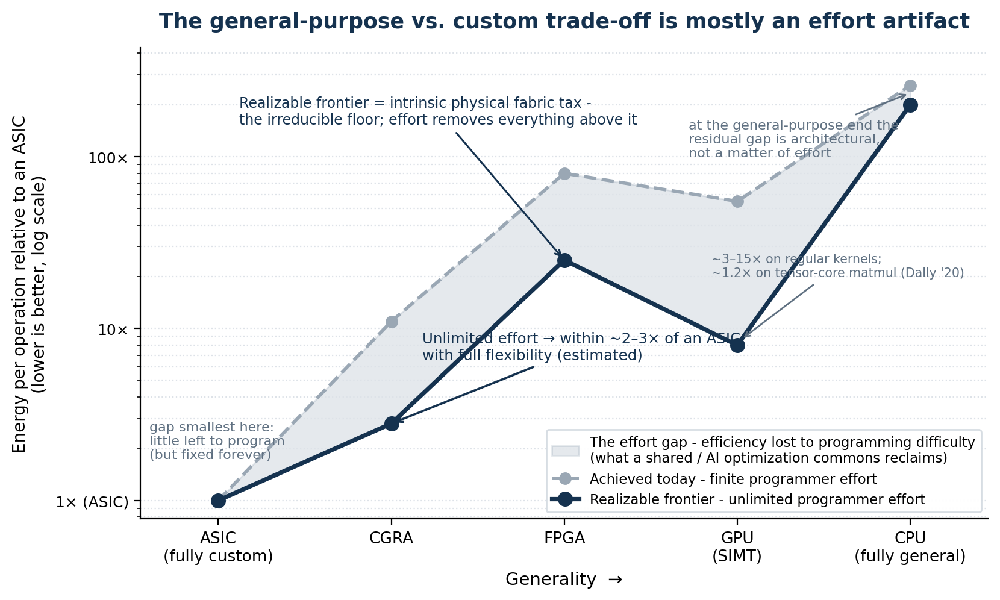
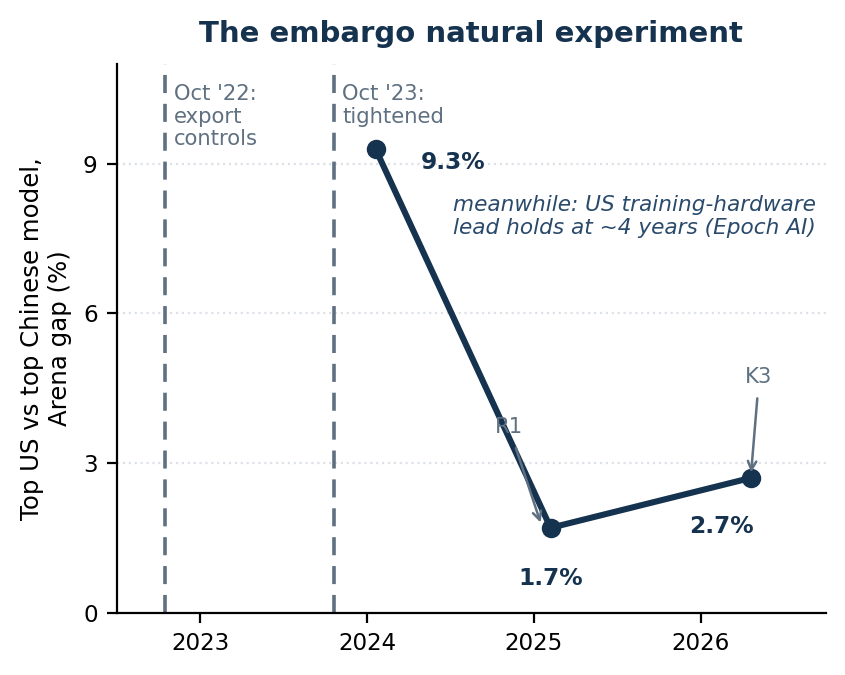
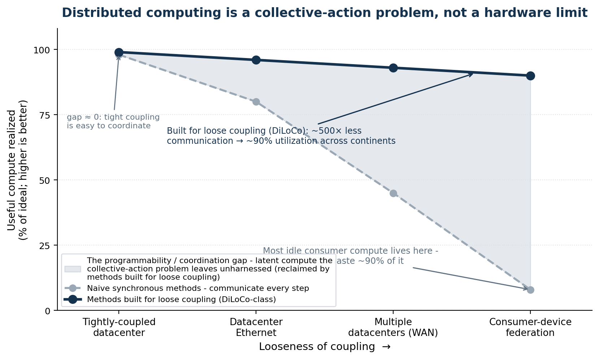
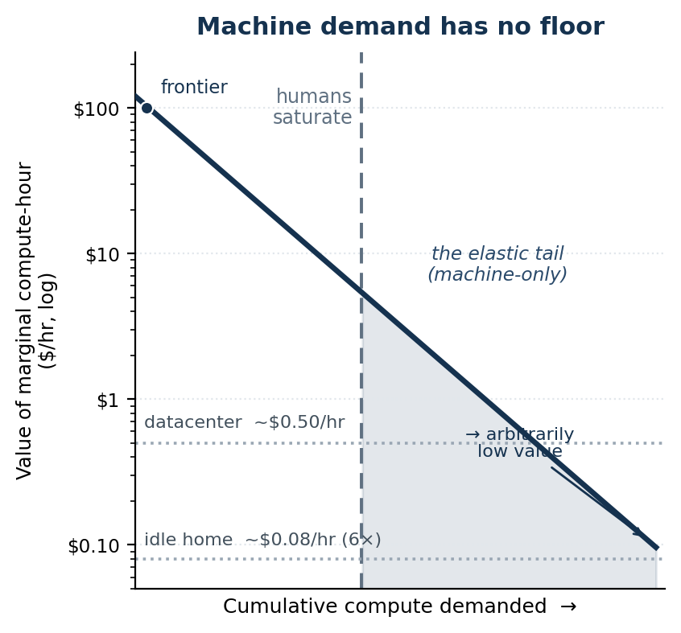
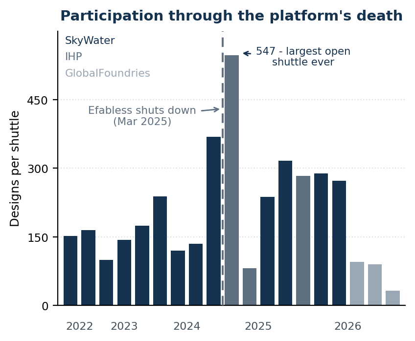
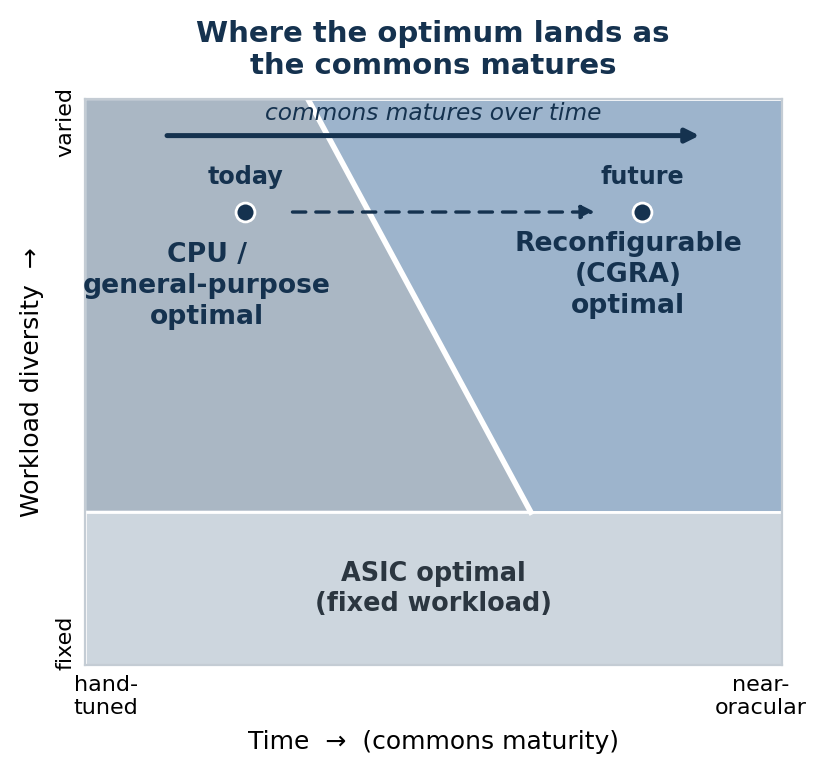
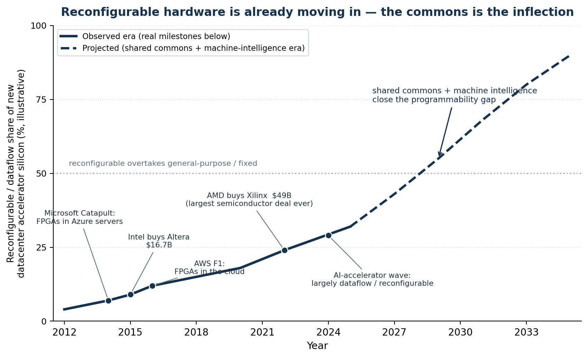

# The Performance Commons

### Continuous optimization is an under-provided public good — and machine intelligence is about to provision it

---

## Abstract

The reason we don't achieve near ASIC performance and power for many more applications (and the reason we don't have much better ASICs) is not because it's technically impossible given the engineering resources available. It is the collective-action problem both within and across levels of the computing stack: continuous optimization is a public good — non-rival, and structurally under-provided. As machine intelligence continues to advance — as long as it maintains the apparent inoculation to this problem — this fact will increasingly be exposed. This raises many questions for forward looking engineers in the form of, "How do we design systems assuming the collective-action problem is solved?". For example, how do we design hardware assuming there will be orders of magnitude more intelligence available for shared code optimization? We likely want more reconfigurable and less "programmable" architectures. And similarly, how do we design software stacks assuming the programmability issues holding back wider adoption of distributed computing are solved?

---

## 1. The gap is effort, not physics

What separates modern computing from near-ASIC performance is no longer silicon; it is the economics of specialization. And the same economics strand a second, larger resource: most of the world's computers sit idle most of the time, because the software that would pool loosely-coupled machines into one system was never worth any single actor's effort to write. Per-chip efficiency and whole-system utilization are the same problem at two scales, and they get one diagnosis here — continuous optimization is an under-provided public good — and one prospect: machine intelligence is rewriting the provisioning economics. The path runs from the silicon up. This section measures the gap on a single chip and shows it is effort, not physics; §2 follows the effort to who can afford it and finds a textbook public-goods failure, visible in today's market as a herd; §§3–4 find the same failure one level down, in the ASICs that never get built, and one level up, in the federation that never gets programmed; §§5–7 present the cure — the commons has solved this before, machine intelligence multiplies it, and the actor to build it exists; §§8–9 draw the design implications and their honest limits. Appendix A is the author's own program against all of it.

Underneath the economics sits a simpler question: which thoughts are allowed to be thought. An industry's encoding does not merely price deviation; it defines what a serious person may work on, and preference falsification keeps the range narrow even in private (Kuran, *Private Truths, Public Lies*, 1995). What machine intelligence changes first is not the organization but the individual: one person with a competent collaborator no longer needs a hierarchy's permission — or its competence — to think a thought through to a working artifact. That independence is the input the system described below has been starving for, and whether machine intelligence widens it or amplifies consensus instead is a fork the paper holds open to the end.

The gap comes first because it is measurable: §1.1 splits "programmability" into two numbers and finds one to two orders of magnitude between them on unchanged silicon; §1.2 shows the canonical flexibility–efficiency trade-off is a slice through an effort surface — one that mostly melts when effort becomes abundant.

### 1.1 The gap, measured

An architecture's "programmability" is two different numbers, and the distinction — easy to miss, and absent from the standard programmability-versus-performance chart — carries this section. The field has met it piecewise: Intel measured it on CPUs as the "ninja gap," and two decades of work on integrating FPGAs into mainstream systems kept rediscovering it. The first number is the performance an architecture yields at *constant, ordinary programmer effort* — what a competent team gets by default; the second is the best performance *achievable* on it, its **realizable frontier**, the ceiling the roofline model draws per kernel (Williams, Waterman & Patterson, CACM 2009). Comparing architectures to ASICs measures neither; the number that matters first is the distance between the two on a *fixed* architecture — the **realization gap** — and it is measured, on unchanged silicon. A 4096×4096 matrix multiply runs **more than 60,000× faster** hand-optimized than in naive Python, from 0.0006% to 41% of machine peak (Leiserson et al., Science 2020), and Intel measured a **"ninja gap" averaging 24×** between naively written and expert-optimized C++ on the same processor (Satish et al., ISCA 2012). Most general-purpose code runs one to two orders of magnitude below its own architecture's frontier — full HPC applications, already tuned harder than most software, measure at 4–14% of peak on commodity platforms (Oliker et al., SC 2004).

Nor is the frontier the industry does reach optimal. The M1 matched the best x86 single-thread performance at roughly a fifth the power (tens of percent of that net of its one-node process lead) — the same general-purpose programmability, strictly better, no programmability tradeoff paid (Frumusanu, AnandTech 2020); Etched claims the same inference function at under half the industry's voltage for multiples of the FLOPs density (vendor claims — the full story, flags included, comes with the herd). A design point that can be dominated without surrendering programmability was never on the true frontier at all.

What physics actually charges for generality is a separate and smaller number, also measured — though every ratio depends on workload and baseline, so Table 1 reports ranges across sources rather than single points. A general-purpose CPU runs **~50–1000× less energy-efficient than an ASIC** depending on how each is used — ~100–500× for scalar code, ~50× with well-used SIMD, approaching ~3× only under deep per-application customization (Hameed et al., ISCA 2010; Chung et al., MICRO 2010; Horowitz, ISSCC 2014). An FPGA pays ~35× in area with soft logic alone, falling to ~9× when hard blocks carry the work, with ~7–14× dynamic power and ~3–4× delay (Kuon & Rose, TCAD 2007; Boutros, Yazdanshenas & Betz, TRETS 2018; Boutros & Betz, 2021). A CGRA pays ~2–3× in energy and ~3–10× in area on in-domain kernels — by simulation-grade estimates, with generality pushing the area tail toward ~40× (Prabhakar et al., ISCA 2017; Nowatzki et al., ISCA 2017; Qadeer et al., ISCA 2013). The GPU's own trajectory makes the argument: pre-tensor-core, an ASIC held 3–14× in energy (Chung et al., MICRO 2010) and TPU v1 delivered 14–16× the total perf/W of its contemporary GPU (25–29× incremental; Jouppi et al., ISCA 2017); once tensor cores absorbed the matrix instruction, 77–87% of the energy went to the arithmetic itself, bounding a dedicated accelerator's remaining advantage on the core matmul at 13–23% (Dally, Turakhia & Han, CACM 2020) — and at matched precision, TPU-versus-GPU comparisons now land at parity to ~2× (Jouppi et al., ISCA 2021, 2023). That bound is real but narrow: it covers the matrix instruction, not the memory system, and the same accounting leaves ~64× standing in domains with no specialized instruction. Etched's under-half-voltage claims mark its other limit: instruction overhead is only one tax, and a fixed operating point leaves voltage-level co-design on the table. And beneath every row sits the physical floor — today's CMOS dissipates on the order of 10⁵× the Landauer limit per bit operation (Landauer, IBM JRD 1961; Frank, IEEE Spectrum 2017) — a reminder that all of these baselines are engineering conventions, not physics. The companion analysis shows a perfect compiler and scheduler brings each substrate to its roofline, and the classic limit studies (Lam & Wilson, ISCA 1992; Wall, ASPLOS 1991) locate the dominant barrier in *control flow and the effort of exposing parallelism* — not in raw data dependence. What separates achieved from achievable is therefore, overwhelmingly, the **effort of specialization** — writing the optimal kernel, building the accelerator, tuning to the platform — and not a wall in the silicon.

| Substrate | Penalty vs an ASIC (same function) | Sources |
|---|---|---|
| ASIC, nominal voltage | 1× reference — itself soft: near-threshold operation leaves ~10× energy at ~10× frequency cost | Dreslinski et al., Proc. IEEE 2010; Jain et al., ISSCC 2012 |
| CGRA (word-level reconfigurable) | ~2–3× energy, ~3–10× area (tail to ~40× with generality); simulation-grade, in-domain kernels | Prabhakar et al., ISCA 2017 (2.8× base, 3.9–42.8× cumulative); Nowatzki et al., ISCA 2017; Qadeer et al., ISCA 2013 |
| FPGA (bit-level reconfigurable) | ~35× area soft-logic → ~9× hard-block-heavy; ~7–14× dynamic power; ~3–4× delay | Kuon & Rose, TCAD 2007; Boutros et al., TRETS 2018; Boutros & Betz, 2021 |
| GPU, pre-tensor-core | ~3–14× energy on data-parallel kernels; 14–16× total perf/W behind TPU v1 (25–29× incremental) | Chung et al., MICRO 2010; Jouppi et al., ISCA 2017 |
| GPU, tensor-core era | ≤13–23% remaining ASIC advantage on core matmul; parity to ~2× vs TPU at matched precision; ~64× where no specialized instruction exists | Dally, Turakhia & Han, CACM 2020; Jouppi et al., ISCA 2021, 2023 |
| General-purpose CPU | ~50–1000× energy by use: ~100–500× scalar, ~50× SIMD, ~3× deeply customized | Hameed et al., ISCA 2010; Chung et al., MICRO 2010; Horowitz, ISSCC 2014 |
| Physical floor | all of the above sits ~10⁵× over the Landauer limit (kT ln 2 ≈ 3 zJ at 300 K) | Landauer, 1961; Frank, IEEE Spectrum 2017 |

*Table 1. The measured cost of generality. These are the intrinsic, physical penalties — the realizable frontier of Figure 1 — not what most code actually achieves, which is typically worse because the substrate's potential goes unextracted. One caveat spans every row: the denominator is the best ASIC anyone has built, not the ideal ASIC, which is unknowable — the baselines come from the same effort-limited industry the paper is about, so the true penalties may be larger than measured.*

### 1.2 The general-purpose vs. custom trade-off is mostly an effort artifact

The trade-off at the center of computer architecture is usually drawn as a Pareto frontier between **flexibility** and **efficiency**: a CPU does anything but wastes energy; an ASIC wastes nothing but does one thing; FPGAs and CGRAs sit in between. The conventional reading is that you *buy* efficiency with flexibility and pick your point on the curve. But that curve is drawn at a fixed, finite *programmer effort* — it is a slice through a three-dimensional surface (flexibility × efficiency × effort), and the slice moves as effort changes.

To see why, decompose the efficiency gap between a reconfigurable substrate and an ASIC into two parts. The first is the **intrinsic fabric tax**: the physical overhead of the reconfigurable silicon itself — the switches, the configuration memory, the over-general datapath. This is irreducible; no amount of programmer effort removes it, and it is what the measured ratios of Table 1 capture. §1.1's tensor-core bound is this decomposition applied to the GPU: once the matrix instruction amortizes control, the remaining 13–23% *is* the GPU's fabric tax on that kernel — which is why the bound collapses exactly where the instruction fits and leaves ~64× standing where it does not. The second is §1.1's **realization gap**: how much of the substrate's *available* efficiency you actually extract, which depends entirely on the quality of mapping, placement, and scheduling — and therefore on effort. At finite effort you extract a fraction; at the limit (the oracle mapping of the companion report) you extract all of it.

The consequence is the whole argument in one picture. As effort rises, the realization gap closes and the achieved-efficiency curve falls toward the realizable frontier — which is just the intrinsic fabric tax. Crucially, **the effort gap is concentrated exactly on the reconfigurable substrates**: it is smallest at the custom end — though not zero even there, since a "fixed-function" ML ASIC built on systolic arrays still takes real mapping and scheduling effort to feed — and §1.1 measured it at one to two orders of magnitude at the general-purpose end, where compilers are most mature, so it can only be larger in the middle, where the tooling is youngest and the mapping hardest. To be precise about what is measured and what is drawn: Figure 1's achieved-today curve is anchored by measurement only at its general-purpose end; its middle is the inference just stated, because no published study pins the achieved-versus-achievable gap on an FPGA or CGRA — closing that hole is part of what Appendix A's experiment is for — and the open CGRA toolchains that do exist are fragmented — struggling on complex loops and underutilizing the fabric, one failing nearly all benchmarks — with no LLVM-equivalent shared infrastructure formed (Walter et al., 2025): the unpooled state the next section diagnoses, measured in tooling. But the signature is public: reconfigurable fabrics have historically underdelivered not because they are inefficient, but because their efficiency was unreachable at affordable effort. Close that gap — which is what a shared, AI-driven optimization commons does — and a CGRA sits within roughly 2–3× of an ASIC in energy *while keeping full flexibility* — an estimate, not silicon (no silicon-vs-silicon CGRA-ASIC measurement exists), made on the in-domain kernels those fabrics were built for, with an area premium that grows with the generality carried; how far the small-tax regime extends across the workload space, especially control-flow-heavy code, is exactly the boundary Appendix A's simulator sweep is built to measure.

The scoping already has one strong answer on record: a composed, programmable architecture — tiny cores with configurable spatial fabric, scratchpads, and DMA — matched the speedups of four diverse domain-specific accelerators (10–150× over an out-of-order core) at no more than ~4× the area and power of a single one, under a title that states the thesis outright: *domain specialization is generally unnecessary for accelerators* (Nowatzki, Gangadhar, Sankaralingam & Wright, HPCA 2016; IEEE Micro Top Picks 2017). The line has since been mechanized — accelerators decompose into a few spatial primitives that tools compose automatically (DSAGEN, ISCA 2020), and generated *programmable* overlays already match untuned fixed-function HLS, reaching 0.55× of hand-tuned (the honest residual; OverGen, MICRO 2022) — and independently replicated: for analytics, one programmable systolic design matched a bundle of specialized accelerators (Lottarini et al., ISCA 2019). The flexibility–efficiency trade-off does not so much shift as **flatten**: under unlimited effort, the only efficiency you still surrender for flexibility is the small, physical fabric tax.

*Figure 1. The canonical flexibility–efficiency trade-off is largely an artifact of finite programmer effort. The shaded band is the effort gap — efficiency forfeited because extracting a reconfigurable substrate's potential is too laborious to afford per workload. It is widest exactly where reconfigurable hardware sits and smallest at the custom end (little left to program — though even a systolic-array ASIC takes real effort to feed); at the general-purpose end, the distance that remains at full effort is architectural — the fabric tax — not forgone effort. A shared / AI optimization commons reclaims the band; what remains is the intrinsic physical fabric tax (CGRA ~2–3× energy by estimate, FPGA ~9–35× area). Substrate-to-ASIC ratios on the realizable frontier are anchored to measured values; the finite-effort curve and the effort axis are illustrative.*

The same gap now ships in commodity silicon. Every current laptop and desktop SoC carries a neural engine — 16 TOPS on a mainstream business-desktop APU, up to 50 on a current mobile part (AMD product specifications, 2026) — and almost none of it is reachable by arbitrary code. Apple publishes no low-level interface to its Neural Engine, and its own MLX framework exposes only CPU and GPU backends; Intel's is addressable through OpenVINO alone, and its NPU supported only static model shapes, so an ordinary language-model decode loop would not run on it without rewriting the network (Sridhar et al., NITRO, arXiv:2412.11053); AMD's requires ONNX Runtime with a vendor execution provider and mandatory quantization. Point frontier language models at the problem of writing kernels for one directly and they reach roughly a tenth of the achievable vectorization, in a domain whose authors note has "smaller and more fragmented developer communities" than GPU programming (Kalade & Schelle, NPUEval, arXiv:2507.14403, 2025); measured NPU inference frequently loses outright to the CPU beside it, trailing by up to 1.6× on prefill at half again the energy (Li, Qi & Chen, arXiv:2605.27435, 2026). The capability is designed, fabricated, and paid for in hundreds of millions of units; what is missing is the toolchain — which is to say, the effort.

One more turn of the screw closes the loop with the design conclusion. Even *unlimited design effort* — machine intelligence spinning up bespoke ASICs cheaply — does not argue for ASICs everywhere, because an ASIC is fixed at tape-out and real workloads are not: the adaptability an ASIC structurally lacks is exactly what its efficiency edge over a CGRA costs. So unlimited effort, applied honestly, does not push the optimum toward *more custom* silicon; it pushes it toward **reconfigurable** silicon that an oracle-grade commons can drive to within a small factor of custom while remaining able to change what it computes. That is the analytical core of "more reconfigurable, less programmable."

## 2. Continuous optimization is an under-provided public good

This section argues the cause: performance is gated by who pays for specialization (below), the payment structure is a textbook public-goods failure (§2.1), and that failure is visible in today's market as a herd (§2.2). Consider who actually reaches the frontier today: hyperscalers with custom silicon, high-frequency-trading firms, AAA game-engine teams, codec and DSP vendors, and the handful of groups who hand-write CUDA or assembly. They get there through enormous, bespoke, and largely unshared effort, justified only by scale or stakes. Everyone else ships code far off the frontier — not for lack of talent or physics, but because the cost of specialization is affordable only at those scales. Performance is gated by *who can pay the specialization cost*, not by what is achievable.

### 2.1 The textbook failure

An optimization is a **non-rival good**: my hand-tuned FFT does not diminish yours. Classic economics says non-rival goods are under-provided whenever no single actor captures enough of the aggregate benefit to justify producing them for the whole population (Samuelson, 1954; Olson, 1965), and the software instance has been modeled formally: private provision of open source under-provides in equilibrium, with free-riding and duplicated effort emerging together (Johnson, JEMS 2002). So each team re-derives or hoards, and the population sits below the frontier. The performance gap is not a technology gap; it is a coordination failure.

**Continuous optimization — the living process of keeping code matched to hardware, workload, and input as all three shift — is an under-provided public good.** Not a kernel, which can be bought once; the process, which never finishes, and which no single actor captures enough of to fund for everyone. Everything that follows is consequence of this claim — and it sharpens once optimization begins optimizing itself: "under-provided" escalates to "must be public."

Look at what the equilibrium actually selects: good enough. Most software ships at the first performance that stops hurting and stays there — satisficing, in Simon's original sense (Simon, 1956). Notice what kind of failure that is. For widely shared kernels the optimum usually *exists* — some team somewhere has paid for it (the gate above) — so there the failure is distribution, not invention; for the long tail nobody has paid, and what binds is a production cost that is now collapsing. Either way, in a free market with perfect information the gap could not persist: an implementation that is 10× cheaper to run is pure arbitrage, and arbitrage closes. It persists because the market for optimizations is missing, and it is missing for reasons economics has long named: the good is non-rival and hard to price; its quality is unverifiable to the buyer, which unravels the market that would trade it (Akerlof, 1970); and the transaction costs of selling an improvement per instance exceed the per-instance value (Coase, 1937; Arrow, 1969). Creating the market that would fix this — the verification machinery, the matching, the trust — is itself a fixed-cost public good that no single actor is positioned to provide: the collective-action problem recurses into the creation of markets themselves. Machine intelligence attacks every input of market formation at once — verification above all, since making quality legible is what makes it priceable — alongside matching and transaction cost, so the prediction is not only that the existing commons deepens, but that missing markets form.

None of this asks the reader to imagine a new kind of good; it extends a trend with a forty-year record. The most performance-critical software in the world is already provisioned as a commons: the numerical-linear-algebra line from BLAS through LAPACK gave every vendor one interface to tune against and every user the accumulated tuning (Dongarra & Walker, SIAM Review 1995), and the GPU vendors fund the same commons privately — NVIDIA's stated rationale for giving cuDNN away is that kernel optimization is "difficult and time-consuming" and must be redone as architectures evolve, so the vendor centralizes it and ships it free to sell hardware (Chetlur et al., 2014). When and why this happens is worked out in the economics of software: open provision beats proprietary exactly for complex goods with heterogeneous uses (Bessen, 2006); contributors provision the public good when private benefits ride along with the contribution (von Hippel & von Krogh, Organization Science 2003); and optimization is a *best-shot* good — one good kernel serves everyone — which concentrates provision in the most capable agent (Varian, 2004), a prediction to hold onto for when the most capable agent stops being human.

The same record shows the failure this paper names. The commons that exists is chronically under-carried — digital infrastructure as unseen volunteer labor (Eghbal, 2016) — and performance work specifically is routinely skipped in practice for lack of demonstrated economic justification, by the field's own account (Woodside, Franks & Petriu, ICSE-FOSE 2007). The adjacent diagnoses are all published — Leiserson et al. (Science 2020) locate post-Moore performance at the top of the stack and concede cross-layer gains come easiest where one organization pools the costs; Thompson & Spanuth (CACM 2021) supply the fragmentation economics; Hooker (CACM 2021) the hardware lottery; Hess & Ostrom (2007) the knowledge commons; Fursin even built an optimization commons before there was machine intelligence to fill it (Fursin & Temam, TACO 2010). This paper starts from that shelf and extends the trend one step: as machine intelligence collapses the cost of producing software — and, just as binding in practice, the cost of packaging and distributing it, since the machine absorbs the integration complexity that once made sharing itself labor — the equilibrium share of software provisioned as a public good rises toward all of it. Sharing becomes so cheap relative to its mutual benefit that withholding starts to need a justification. That is an economic statement first, and very nearly a moral one.

### 2.2 The herd is what the failure looks like today

#### 2.2.1 Copying, and the returns to defecting

Watch the failure operate today and it does not look like teams re-deriving the same optimization in parallel; it looks like teams *copying* each other. Leadership everywhere sets the same safe target, because deviating carries individual career risk while conformity's failures are shared — herding is individually rational under reputational incentives (Scharfstein & Stein, AER 1990) — and inside the firm the same arithmetic actively suppresses the new: the champion of a novel direction bears its risk personally even when trying it would cost almost nothing, so near-free exploration goes unworked. The mechanism is not confined to computing: nucleoside-modified mRNA — the chemistry behind the COVID-19 vaccines — spent two decades out of fashion before the pandemic forced the trial and the 2023 Nobel settled who had been right (Karikó, Buckstein, Ni & Weissman, Immunity 2005). The result is measurable monoculture. Convergence on one approach reduces collective welfare even when that approach is individually best (Kleinberg & Raghavan, PNAS 2021); research directions win by fitting incumbent hardware rather than by merit (Hooker's hardware lottery, CACM 2021); and independently built LLMs from different labs now produce convergent outputs and correlated errors — errors that grow *more* similar as capability rises (Jiang et al., NeurIPS 2025; Kim et al., ICML 2025). An industry's worth of private effort, and the products are all about the same. Computing's own record makes the point self-implicating: the field spent two decades treating neural networks as a dead end while a handful kept working, for exactly the reason the hardware lottery names — and the direction maintained against the herd is the one that now carries the industry, this paper's bet included (LeCun, Bengio & Hinton, Nature 2015; the Turing lecture, Bengio, LeCun & Hinton, CACM 2021).

The returns to defecting are exactly what this predicts. Apple's M1 matched or beat the best x86 single-thread performance at roughly a fifth the power (Frumusanu, AnandTech 2020) — against Zen 3 parts fabbed one node behind the M1's N5, a step worth tens of percent in power, not fivefold — and lifted Mac revenue ~40% in two years ($28.6B to $40.2B, FY2020–22 10-K filings). A gain of that size is not an integration dividend but a ground-up rearchitecting of the machine, documented from the outside since Apple itself has said little: the widest decode ever commercialized and an out-of-order window beyond any contemporary design (Frumusanu, AnandTech 2020), internals unconventional down to the retire mechanism in reverse-engineered detail (Johnson, 2021; Handley, 2021), and the memory system redesigned onto the package. Vertical integration merely permitted Apple to attempt it alone, exempt from the stack's collective-action problem. The herd then followed. DeepSeek's R1 erased $589B of NVIDIA's market value in a single day (January 2025) with engineering that its technical reports document line by line — FP8 training, latent attention, hand-written PTX communication kernels compensating for the export-cut interconnect of its H800s (DeepSeek-AI: V3 technical report, 2024; R1 in Nature, 2025). That is the specialization effort the unconstrained herd declines to pay, paid under duress — and it recovered most of the performance. And the pattern reaches the silicon itself. Voltage scaling is what every undergraduate computer-architecture student learns, with decades of near-threshold literature behind it (Dreslinski et al., Proc. IEEE 2010; Intel demonstrated a near-threshold x86 at ISSCC 2012) — yet it took a startup co-designing from transistor to token to run its math blocks at under half the voltage of incumbent AI chips, claiming multiples of their FLOPs density and 80%+ sustained utilization (Etched, 2026 — vendor claims, first racks shipping; the utilization leg is the softest — well-tuned training sustains 38–56% model-FLOPs utilization on GPUs and TPUs alike (Chowdhery et al., 2022; Dubey et al., 2024), and the low utilization Etched targets is a batch-size phenomenon that reaches ASICs too). A textbook technique sat unexploited on billion- and trillion-dollar roadmaps until a defector picked it up. Each defection took a fortune to attempt, because defying an industry's encoding means re-deriving, alone, what the herd will not pool — and the prediction this paper stakes is that the entry fee is temporary.

#### 2.2.2 What actually binds it

Incentive is only half the mechanism. The other half is that most of the people involved have little idea why anything works or is the way it is. The same Etched announcement shows what deviating actually costs: lowering the voltage meant redesigning much of the stack around it — math arrays, tiling and scheduling, power delivery, packaging, cooling — because in a mature design every choice is load-bearing for the others. Engineers inherit artifacts whose rationales left with their authors, and when no one understands the system end to end, each reuse of the last design is individually prudent — the only move that does not require re-deriving a web of interlocking decisions nobody fully holds. This is not a new observation about organizations, only newly applied to silicon: a built system is a theory that leaves with its builders (Naur, 1985); the knowledge of how components integrate embeds tacitly in organizational structure, and firms fail precisely when it must be rethought (Henderson & Clark, ASQ 1990); under uncertainty organizations imitate peers they perceive as legitimate, aggregating into field-wide sameness unconnected to efficiency (DiMaggio & Powell, ASR 1983); and a locked-in design can be a stable equilibrium without being an optimal one (David, AER 1985; Arthur, 1989). The timidity is real, but it belongs to no individual: it is encoded in the social mechanisms and in the competencies available to them, and the institution is timid even when none of its members are. This is the collective-action problem at its deepest — not just optimizations going unpooled, but understanding itself. And that is exactly this paper's argument: the encoding is changing. Machine intelligence raises the ambient competence — holding the whole stack's *why* at once — far enough that designing the right thing becomes cheaper than reusing the last one. That mechanism now has a controlled measurement: in the first large deployment study of a generative assistant (5,179 customer-support agents), the tool encoded the tacit knowledge of the most skilled workers and diffused it — productivity rose 14% overall and 34% for the least experienced, with gains landing exactly where competence was scarcest (Brynjolfsson, Li & Raymond, QJE 2025). Competence that was tacit, personal, and unpoolable became a copyable artifact. There is no reason silicon's version of that knowledge behaves differently.

The same deficit sets what leaders measure. A leader who cannot evaluate the work itself still needs a proxy for productive value, and the proxy that survives incompetence is subjugation: compliance, visibility, deference to process — the signals any leader can read. This is measurement theory, not malice — when output cannot be measured, organizations control behavior instead (Ouchi, Management Science 1979; Holmström & Milgrom, 1991) — but the proxy selects against exactly what new work requires, because the people doing something genuinely new are, by construction, the least legible to the hierarchy above them. Doing new things requires freedom the proxy cannot grant. That piece has to go away too, and it goes away the same way the opacity does: when the work itself becomes legible, obedience loses its role as the measure of value.

The chip embargo is the natural experiment. It aimed to preserve "as large of a lead as possible" in compute (Sullivan, 2022), and the compute gap held — a ~4-year training-hardware lead by Epoch AI's estimate — while the capability gap collapsed anyway, from roughly 9% in early 2024 to low single digits by 2026 (Stanford AI Index): the open-weights Kimi K2 Thinking came within a point of the closed frontier on Artificial Analysis's independently run index, and its successor K3 sits in the Arena top ten, statistically tied with US frontier models and first on the blind frontend-coding evaluation. Distillation, stockpiled GPUs, and subsidy are real confounders, and the constrained labs herd too — ten o1-style clones shipped within four months of o1. But the narrow inference survives all of it (distillation cannot copy R1's line-by-line documented engineering, and the Kimi models are original training runs, not copies): the binding constraint on the herd was never the silicon. It was the effort and the variance the herd declines to spend — and the labs that were forced to spend it, and chose to publish the result as open weights, turned constraint into a commons contribution (Figure 2).

*Figure 2. The embargo natural experiment, drawn. The gap between the top US and top Chinese model on the LMArena leaderboard collapsed from 9.3% (January 2024) to 1.7% (February 2025) and 2.7% (early 2026; Stanford AI Index 2025, 2026), across a period in which US export controls — October 2022, tightened October 2023 — held the training-hardware gap at roughly four years (Epoch AI). Chips were successfully restricted; capability parity happened anyway. Single-metric series; leaderboard evaluations have known limits.*

Beneath the herding sits what the author's companion coherence work (github.com/mjtomei/coherence) names the bottleneck: wanting itself. Much of the leadership involved does not, operatively, want the better product — and the evidence is that they say so. Of 401 surveyed financial executives, **78% admitted they would sacrifice long-term economic value to smooth reported earnings**, 80% would cut R&D, advertising, or maintenance to hit an earnings target, and a majority would delay a value-creating project to make the quarter's number (Graham, Harvey & Rajgopal, 2005). Behavior matches the stated intent: managers insulated from discipline close fewer old plants and open fewer new ones — the "quiet life" (Bertrand & Mullainathan, JPE 2003) — and buy personal safety with shareholder money, through diversifying acquisitions the market prices negatively on announcement (Gormley & Matsa, JFE 2016). Innovation is the systematic casualty, as agency theory predicts for high-variance work (Holmström, 1989): firms bunching at earnings forecasts cut R&D and innovate measurably less — a distortion estimated to raise firm value ~1% while costing ~1% of social welfare (Terry, Econometrica 2023) — and going public alone cuts innovation novelty by roughly 50% while the best inventors leave (Bernstein, J. Finance 2015). Privately rational, collectively wasteful: the under-provision above, written into executive behavior. The sharpest confirmation runs through the career-risk mechanism itself — where institutional owners absorb the personal risk of failure, innovation *rises* (Aghion, Van Reenen & Zingales, AER 2013). The binding variable is the individual risk the herd exists to manage.

#### 2.2.3 What unbinds it

They get away with it because the information does not flow. The counterfactual product, the delayed project, the value knowingly traded away are invisible to the boards and shareholders to whom the duty is owed; conduct that sits poorly beside fiduciary obligation survives on opacity, because quarterly numbers are legible and forgone alternatives are not. That asymmetry is ending on the same schedule as the rest of this paper's argument: machine intelligence reads what an organization actually did — its filings, its records, its code, increasingly its decision history — and surfaces what leadership optimized for, as the author's companion work on open organizations argues in full. Herding was always a wager that no one could see the counterfactual. The prediction is that the wager stops paying: the same intelligence that is inoculated against the coordination failure also makes it legible.

One market consequence is already visible at the top of the stack. Hardware incumbents hold their claim on the world's limited production capacity — the leading-edge wafers, packaging, and memory everyone else queues for — on a perception of technical expertise: scarce capacity flows to the firms believed uniquely able to convert it into value. Ambient competence dissolves exactly that belief, and the test becomes more stringent: not whether a firm can execute, which stops discriminating once everyone can, but whether it has the best story — Thiel's old criterion, that most of a company's value lies a decade out and what is priced is the account of why it will still be differentiated then (Thiel & Masters, Zero to One, 2014). Thiel has since made the mechanism explicit — AI looks "much worse for the math people than the word people" (Conversations with Tyler, 2024) — and the market is already pricing it: job postings for "storytellers" doubled in a year (LinkedIn data via WSJ, 2025). A story that survives ambient competence has to admit that technical capability is no longer the bottleneck and argue from what is still scarce: density of talent, and of genuinely wanted ideas — the argument Apple made in its best years. And the story can no longer merely be told; now that the work is legible, it has to survive reading.

## 3. The same logic explains the absence of better ASICs

One level down, ASIC *design and optimization* knowledge — mapping heuristics, verified IP blocks, the place-and-route and microarchitectural tricks that separate a good datapath from a mediocre one — is equally non-rival and equally hoarded. EDA vendors are a partial, proprietary aggregation point; the rest is re-derived bespoke per chip and locked inside firms. So the field produces fewer and worse ASICs than it collectively could, for the same reason: the design effort is not pooled. The size of the unpooled effort is public — leading-edge design NRE runs from ~$50M at 28 nm to ~$440M at 5 nm and $650M–1.5B at 3 nm (IBS, via SemiEngineering, 2018), dominated by exactly the verification and software engineering that is re-derived per chip.

This is the aggressive claim, so state the caveat plainly: fab economics and the genuine bespokeness of different computations are also real costs, and pooling cannot erase them. The claim is *not* that the collective-action problem is the only barrier — it is that the **pooling-addressable fraction** of the gap is large and currently wasted.

Hardware also carries an asymmetry that software never had. The market for general-purpose processors — including today's ML accelerators — is zero-sum in a way code is not: production capacity is finite at any moment, and to the extent the market genuinely wants one best general-purpose part, the best design has a claim on all of that capacity. That winner-take-most structure keeps closed hardware designs profitable well past the point where closed software stopped making sense, so the forces toward closure will outlast their software counterparts. The counterweight is that general-purpose hardware is optimal for almost nothing in particular; as development cost falls, the domains for which a specialized design beats the general-purpose winner peel away one by one, and even that market opens eventually. The opening is real — it is just slower than software's was.

| Layer of the stack | The hoarded / secret non-rival good | Open-commons counter-trend |
|---|---|---|
| Foundry / process | PDKs & device models under NDA | SkyWater & IHP open 130 nm PDKs |
| **CAD / EDA tooling** | Synthesis, place-&-route, timing heuristics and their new RL optimizers (Synopsys/Cadence/Siemens; DSO.ai, Cerebrus) | OpenROAD, OpenLane, Yosys |
| Hardware IP blocks | Verified IP licensed proprietary | OpenCores, CHIPS Alliance, OpenHW CORE-V; Rocket/BOOM/CVA6 |
| ISA | Proprietary ISAs (x86, ARM) | RISC-V |
| Microcode / firmware | Encrypted microcode, proprietary blobs | coreboot/LinuxBoot, OpenBMC, OpenTitan |
| Math / ML kernels | Fastest per-chip kernels hoarded (MKL, cuBLAS, cuDNN) | OpenBLAS, BLIS; TVM/Halide/Triton/Exo |
| GPU drivers / runtime | Per-application driver optimizations as a moat | Mesa, NVK |
| Workload / measurement data | Real traces siloed in the firms that own the fleets | Google cluster traces, MLPerf |
| Distributed compute | Idle compute unharnessed — hard to program *and* no incentive to pool | BOINC/Folding@home; DiLoCo/Hivemind/Petals |

*Table 2. One pattern, every layer. At each level a non-rival good — design knowledge, optimization, measurement — is hoarded or secret, and at each level an open commons is forming to route around it. The top five rows are really a single problem: the hardware-design commons that does not yet exist, from secrecy in the foundry's PDKs up through CAD tooling and IP to the ISA itself.*

## 4. Distributed computing is the same problem, one level up

The abstract's second question — how to design software stacks assuming distributed computing's programmability barriers are solved — is the same collective-action problem displaced from the chip to the network, and the latent resource is enormous and measurably wasted. Even inside professionally run datacenters, average server utilization sits at **12–18%**, active servers rarely exceed 50%, and up to **30% of servers are "comatose"** — powered, cooled, and depreciating while doing no useful work (NRDC / Anthesis); an Anthesis analysis (Koomey & Taylor, 2015) put ~10 million fully idle servers at roughly $30B in stranded capital. Outside the datacenter the waste is larger still: billions of consumer devices — ~7.3B smartphone subscriptions (Ericsson, 2025), 1.4B active Windows PCs (Microsoft, 2025) — sit idle most of the time (office desktops measured idle 86–88% of hours; Das et al., USENIX ATC 2010), having already paid their hardware, power, and bandwidth costs. The compute exists. What is missing is any mechanism to pool it.

It goes unpooled for exactly the reasons §2's effort gap goes unpaid: coordinating loosely-coupled, heterogeneous, intermittent hardware is hard to program, and no individual is incentivized to contribute idle cycles to a shared pool. The barrier is workload-dependent, and the honest scoping helps the argument: embarrassingly parallel work has always federated trivially — volunteer science ran at scale on BOINC, and serverless products like AWS Lambda sell exactly that function-at-a-time decomposition — so the pooled fleet is useful for a real class of jobs with no special software at all. What never federated is the tightly-coupled work where the value now concentrates: training and serving large models, where naive methods that synchronize every step waste almost all of a loose federation's compute. Methods built for loose coupling reclaim it. DiLoCo (Google DeepMind, 2023) trains language models across poorly connected islands while communicating ~500× less than synchronous training; OpenDiLoCo replicated this across two continents and three countries at 90–95% utilization, with nodes joining and leaving mid-run; DiLoCoX scaled the approach to a 107-billion-parameter model; and Hivemind and Petals run training and inference of very large models over thousands of volunteer nodes. The barrier was never the hardware (Figure 3).

Since then the record has moved from demonstration to production. Google's own scaling study found well-tuned DiLoCo not merely matching but *outperforming* synchronous data-parallel training at fixed compute, with the advantage growing with model size (Charles et al., 2025). INTELLECT-1 trained a 10B-parameter model across three continents — thirty independent contributors at 83% utilization, ~400× less communication (Jaghouar et al., 2024); Nous's Psyche network completed a 40B model's full twenty-trillion-token pretraining over the public internet (2026); and Covenant-72B was pretrained by more than seventy trustless peers free to join and leave mid-run (Lidin et al., 2026). Three flags travel with these: the completed runs are self-reported, they pool datacenter-grade nodes over loose networks rather than idle laptops, and the frontier still centralizes — the flagship decentralized lab trained its own best model on an InfiniBand cluster. The coordination barrier has measurably fallen; what remains is the last mile to consumer hardware.

What makes solving it worth the effort is the demand side: cheap, unreliable compute is only valuable if something will consume it, and machine intelligence consumes without bound. Human compute demand is finite — businesses have finite workloads, people have finite needs, and in equilibrium price competition retires high-cost suppliers. Machine demand is not finite, because there is always a next-best task: a machine that cannot profitably run a $50/hr job can still create value on a $5/hr job, and below that on speculative search, precomputation, and self-improvement, down to arbitrarily low value. Humans run out of ideas; machines run out of compute. This turns the market permanently *undersupplied*, which is precisely the condition under which cheap, unreliable home compute — roughly **6× cheaper than a datacenter** (~$0.08 vs ~$0.50 per hour, since the hardware and power are already sunk) — creates genuine value instead of being undercut (Figure 4). The direction of that discount is already market fact: interruptible capacity trades 60–90% below on-demand, with realized savings of 27–84% on real workloads (Wu et al., NSDI 2024). That market's existence is itself good news for anyone assembling the federation: discounted interruptible capacity is a product buyers already know how to consume, with schedulers and checkpointing practices built for it — pooled consumer compute creates no new technical requirement a customer must adapt to, it slots into an existing category at a better price.

*Figure 3. The same shape of problem, one level up. The aggregate idle compute in consumer devices is latent not for hardware reasons but because coordinating loosely-coupled, heterogeneous, intermittent hardware is hard to program — and because no individual is incentivized to pool it. For tightly-coupled work, naive (communicate-every-step) methods waste almost all of it at the loosely-coupled end — embarrassingly parallel work federates trivially and always has — while methods built for loose coupling (DiLoCo and successors: ~500× less communication, ~90% utilization across continents) reclaim it. As in Figure 1, the gap is concentrated where the resource is hardest to reach, and it is an artifact of programmability and coordination, not physics. Utilization figures are illustrative, anchored to reported DiLoCo / OpenDiLoCo results; anchors and assumptions are tabulated in analysis/ in the repository.*

And the crunch has arrived to sharpen the point. AI demand now consumes an estimated 70% of the world's memory output; conventional DRAM contract prices rose 58–63% in a single quarter of 2026 and DDR5 roughly doubled year over year (TrendForce; Counterpoint, 2026); PC makers are passing through 20%+ price increases, Apple repriced its entire hardware line mid-2026, and the memory manufacturers themselves warn the shortage runs into 2027 and beyond. Every part of that raises the replacement cost of a FLOP — and with it the value of the FLOPs already bought, powered, and sitting idle. The idle fleet was always the cheap supply; the crunch is making it the strategic one.

Prior attempts to build exactly this market — Golem, iExec, and BOINC — stalled on human friction, consensus overhead, and extractive token economics (BOINC's volunteer base has fallen from ~1M to ~200K in public tracker counts for reasons its architect calls "likely inherent in the model" — Anderson, J. Grid Computing 2020, which itself reports ~700K active devices; the token marketplaces' stall is observed, not yet studied); the wager of this paper is that machine intelligence is what removes those barriers. The author's own attempt, Omerta, is a work in progress, reported honestly in Appendix A: the networking substrate is built and tested, the end-to-end compute loop is not yet closed, and the hardest remaining parts are coordination and integration, not feasibility.

There is a better-shaped substrate than the household, and its absence from the market is the instructive part. Business fleets are present, mains-powered, centrally administered, and committable by a single decision: one policy change enrols ten thousand machines where a consumer federation needs ten thousand separate consents. US commercial buildings alone hold roughly 112 million PCs (author's computation from the EIA's 2018 Commercial Buildings Energy Consumption Survey public-use microdata, survey-weighted). Markets for exactly this do exist, and that is what makes the gap legible. Idle consumer machines are rented and paid for — Salad quotes hosts $0.014 to $0.229 an hour by graphics card — and ordinary CPU capacity trades openly, at $0.024 to $0.066 an hour for a few cores on Salad and Akash against $0.25 to $0.29 for the same specification from a hyperscaler. Demand is not the missing piece. What is missing is a path in for this particular hardware: the marketplaces that buy idle compute set host-side conditions a managed business fleet cannot meet. Salad "does not currently support Intel dedicated GPUs, or Intel integrated GPUs" and asks for eight gigabytes of discrete video memory; Vast.ai wants a Linux install, vendor drivers and inbound ports on a machine given over to the purpose (vendor documentation, fetched August 2026). Every one of those is an onboarding condition rather than a price. So the resource is not withheld by physics, or by demand, or by price, or by consent — it is stranded on the participation requirements of the markets that would otherwise buy it, which is what a coordination failure looks like when you go looking for its market. Nor is the technique the missing piece. HTCondor has harvested idle workstation cycles in production since the 1980s, on exactly the discipline this requires — yield to the interactive user, take the machine back the moment the keyboard moves — and Micron replaced dedicated peak-capacity purchases with two such pools running tens of thousands of engineering analysis jobs a week (Thain, Tannenbaum & Livny, 2005). Inside the firm, both the inefficiency and its remedy are old news. What has never generalized is running *someone else's* work on your endpoints, and that boundary is not a technical one: it is the risk of admitting outside code to a managed estate, and of promising capacity from machines you do not control.

*Figure 4. Why the idle resource becomes valuable. Human demand for compute saturates once the worthwhile tasks are done; machine demand does not, because there is always a lower-value next-best task, so the demand curve extends toward arbitrarily low value. That tail falls below datacenter economics (~$0.50/hr) into the range only cheap idle compute (~$0.08/hr, ~6× cheaper) can serve — which is what makes a federation of otherwise-wasted devices worth assembling. The curve is illustrative; the cost anchors come from Omerta's reliability-market simulation and the task-value ladder from its economic analysis — anchors, assumptions, and the fuller cost model (hardware included and excluded) are in analysis/ in the repository.*

## 5. Open source already solved this — and did it by itself

The cure takes three steps: precedent, force, and agency. The commons has solved exactly this before; machine intelligence deepens the commons rather than replacing it; and an actor with the vantage, the channel, and the incentive to build it already exists.

### 5.1 The precedent, and why it wins

The compiler and library layer is a *solved instance* of exactly this problem. LLVM, GCC, the Linux kernel, and BLAS/LAPACK are pooled optimization commons: every program compiled with LLVM inherits the accumulated optimization effort of thousands of contributors it never paid for and could never have produced alone. Crucially, this commons formed **organically**, because the cost of contributing to a shared optimizer is far below the benefit everyone draws once it exists — provisioning economics that are themselves published (Lerner & Tirole, Journal of Industrial Economics 2002). The leverage is now measured: recreating the widely used open-source stack once would cost ~$4.15B, while the demand-side value firms draw from it is ~$8.8T — roughly 2,000× the provisioning cost (Hoffmann, Nagle & Zhou, 2024; a working-paper estimate whose generous counterfactual has every firm rebuilding alone). The trajectory is established. The only open question is how far up the stack it extends — from instruction selection (already done) into algorithm selection, runtime specialization, and ultimately hardware mapping. Nor is the pattern confined to compilers: Linux displaced the proprietary UNIXes, RISC-V is displacing proprietary ISAs, Mesa the proprietary GPU drivers, PyTorch the proprietary ML toolkits, FFmpeg the proprietary codec stacks.

The reason is structural: open commons have higher fitness in the literal variation-selection-inheritance sense. More contributors generate more variation than any single firm's team; forking is selection without permission, so good branches are adopted and bad ones die with no proprietary roadmap gating exploration; zero marginal cost of replication plus network effects spread the fitter variant and accrete an ecosystem that raises switching costs; and there is no single point of strategic death — a company can be acquired, pivot, or die and take its tooling with it, whereas a commons persists and forks, accumulating improvement over many more generations. Each improvement is inherited by every future user — which makes the difference a compounding rate, not just a level: a hoarded optimization buys one firm a local advantage once, while a contributed one raises the floor every subsequent optimization starts from, so the whole graph compounds. That is why, once viable, the commons tends to win — and it is why expecting it to keep climbing the stack is not wishful but the default. The one qualifier sharpens the prediction: the commons wins where the artifact is non-rival and modular, contribution cost is low relative to the shared benefit, and no capital or data moat dominates — which is exactly why it has already taken compilers, the OS, and the ISA, is taking drivers and kernels now, and has not yet cracked leading-edge EDA or fabs, where capital and tacit secrecy are the moat.

### 5.2 The moat machine intelligence breaches first

That last moat is where machine intelligence changes the arithmetic first. A model can be pointed at an open flow — read it, profile it, rewrite its heuristics — in a way it can never be pointed at a licensed binary. And this is no longer hypothetical: LLM-driven improvement of optimization code is established practice — Evolution through Large Models (Lehman et al., 2022), FunSearch (DeepMind, Nature 2024), AlphaEvolve (DeepMind, 2025; in production, a single recovered scheduling heuristic reclaims ~0.7% of Google's fleet compute) — and it has reached open EDA specifically: LLM agents tuning the OpenROAD flow now beat Bayesian optimization (ORFS-agent, Ghose et al., 2025), and coding agents are being turned on OpenROAD's own code (2026 preprint). The proprietary vendors ship the same capability inside the license — Synopsys DSO.ai (2020), Cadence Cerebrus (2021) — proving the value while hoarding it, one more row of Table 2. Machine intelligence collapses exactly the contribution cost that kept EDA knowledge tacit and locked inside firms; only in an open flow does the result compound for everyone. Stanford's AHA project already runs the agile version whole — an open CGRA and its toolchain co-evolving in public, with two silicon generations to show for it (Amber, VLSI 2022; Onyx, VLSI 2024).

### 5.3 The silicon commons, measured

The hardware commons is now measurable at the participation level, and the entry cost has collapsed (Table 3): what once required a six-figure mask set, or thousands of euros for an unpackaged block on an academic shuttle plus commercial licenses and a supervised team, is now **$150–300** for a fabricated, packaged chip through the fully open flow — and participation followed the price down, to over two thousand designs and concurrent runs on three foundries by 2026 (Figure 5). Nor is the output toy-only: demoscene chips of a few thousand cells worked on first silicon; one former ARM engineer shipped five solo tapeouts in twelve months, one of them designed in ten working days; a Linux-capable RISC-V SoC with a full MMU is essentially one person's work; and at the ceiling, OpenTitan ships in production Chromebooks as a commercial, open-source root of trust. Machine intelligence is already inside this loop: a microcontroller whose Verilog was written entirely by GPT-4 was fabricated and demonstrated working (Blocklove et al., MLCAD 2023), and by 2026 Tiny Tapeout's own onboarding embeds an LLM agent that took eighteen high-schoolers with no chip-design experience to eight functional, verified tapeout-ready designs in a ninety-minute session (Krupp, Venn & Wehn, 2026). Two flags on this data: showcases self-select successes, and first-silicon failure rates go unpublished — even failure data is hoarded — and a shuttle tile is thousands of gates, not a commercial ASIC. The collapse is in the *entry cost of specialization* — which is exactly the axis §1 says the whole gap lives on.

| Route to first silicon | Entry cost | What you get |
|---|---|---|
| Full mask set, 130 nm | >$500k at introduction, ~$120k mature | masks alone — plus a funded team and commercial EDA |
| Academic MPW block (Europractice, 2021 list) | €2,000–5,900 minimum | unpackaged dies; academic tool licenses; a supervised team |
| chipIgnite shuttle slot | ~$10,000 | packaged parts on the open sky130 flow |
| Tiny Tapeout tile (2022–) | **$150–300** | a fabricated, packaged chip with demo board; fully open flow; one person, days to weeks |
| Tiny Tapeout + LLM agent (2026) | same | eighteen high-schoolers with no experience → eight verified tapeout-ready designs in ninety minutes |

*Table 3. The entry cost of first silicon. Mask-set anchors from New Electronics ("Democratising chip design") and AnySilicon's mask-cost data; MPW from the Europractice mini@sic 2021 price list; the chipIgnite comparison from Tiny Tapeout's own IEEE paper; the LLM-agent result from Krupp, Venn & Wehn (2026). Honest flags: subsidies prop up the lowest tiers, and a shuttle tile is a few thousand gates, not a commercial ASIC.*

The selection argument was even tested live (Figure 5). In March 2025 the ecosystem's central commercial platform, Efabless, failed to raise and shut down abruptly, stranding some five hundred designs mid-flow — precisely the single point of strategic death that ends a proprietary toolchain. The commons rerouted within months: successor firms restored the open-PDK path, the community forked the flow (OpenLane to LibreLane), the shuttle program spread onto two more foundries, and throughput in the following twelve months exceeded any prior year. A company died; the commons persisted and forked, exactly as the fitness argument predicts.

Two larger forces frame this trend, one bounding it and one feeding it. The bound: across thousands of chips, most measured accelerator gains came from CMOS scaling rather than architectural specialization — Bitcoin ASICs improved 307× from process against 1.7× from specialization — so with scaling slowed, the returns to any one chip's specialization run into an "accelerator wall" (Fuchs & Wentzlaff, HPCA 2019). But the wall bounds what each chip gains, not how many chips are worth building: with the entry cost collapsing (Table 3), the number of workloads that justify their own silicon grows even while the per-chip ceiling stands, and the two findings point the same direction — many more, cheaper, more specialized designs rather than a few heroic ones. Nor is fab capacity the physical wall it is often taken for. TSMC's capital intensity fell from ~53% of revenue at the 2021 peak to ~32–33% in 2024–25 while AI demand exploded and its operating cash flow reached ~$100B a year — today's capacity is a choice priced by one firm's risk appetite, not a physical limit (Lyons, Chipstrat 2026).

*Figure 5. Participation through the platform's death. Designs per Tiny Tapeout shuttle, September 2022 to mid-2026, colored by foundry (SkyWater, IHP, GlobalFoundries). The dashed line is Efabless's abrupt shutdown in March 2025; the very next shuttle was the largest ever run. Counts from tinytapeout.com; per-run demand is spiky and partly subsidy-driven.*

## 6. Machine intelligence multiplies the commons; it does not replace it

It is tempting to think that sufficiently capable AI makes the commons unnecessary — each team's AI simply specializes its own code. This is the wrong conclusion, for a specific reason: in the near term, reaching near-oracular performance still takes significant effort *even with machine intelligence in the loop* — frontier reasoning models match the baseline PyTorch kernel in fewer than 20% of KernelBench's GPU-kernel tasks out of the box (Ouyang et al., ICML 2025). AI lowers the per-instance cost of specialization; it does not drive it to zero.

So AI does not dissolve the collective-action problem — it raises the stakes of solving it. The thing being pooled becomes more powerful per unit (AI-generated optimizations alongside human ones), which makes the commons *more* valuable, not less. **AI plus pooling compounds; AI alone, hoarded per team, simply makes a few elite groups faster and widens the gap.** Capability is not the lever. Collaboration is.

There is a harder version of the central claim, and machine intelligence is what activates it. Continuous optimization is self-applying — the optimizer is among the things it optimizes. §5 showed the loop already running at the tool level, and the record runs deeper: AlphaEvolve sped up a kernel in Gemini's own training stack by 23% — the optimizer shortening the training of the models that power it (Novikov et al., 2025); a peer-reviewed scaffold improved the very program that improves programs (STOP; Zelikman et al., COLM 2024); and an agent that rewrites its own code under empirical validation took itself from 20% to 50% on SWE-bench (Darwin Gödel Machine; Zhang et al., 2025 — preprint). Nor is the recursion fringe speculation: all three frontier labs now gate on it formally — OpenAI's Preparedness Framework tracks "AI Self-improvement," Anthropic's Responsible Scaling Policy defines its highest AI-R&D threshold by "recursive self-improvement," and DeepMind's Frontier Safety Framework reserves its top security tier for machine-learning-R&D capabilities.

Once that loop closes, hoarding stops being a static advantage: §5's arithmetic said a hoarded optimization buys a local advantage once, but a hoarded *process* buys a private growth rate, and two actors on different growth rates do not stay one economy — they diverge, and the terminus of privately captured continuous optimization is not market share but a break-off society, a holder compounding away from everyone else. The observation is old — Good named the intelligence explosion in 1965 (Advances in Computers, vol. 6) — and its distributional arithmetic is worked out: innovator surplus plus factor-price shifts can leave non-owners absolutely worse off (Korinek & Stiglitz, NBER 2017), and in AGI-transition scenarios wages collapse while output explodes, the gains accruing to whoever owns the automating capital (Korinek & Suh, NBER 2024). Diffusion has historically prevented clean break-offs — knowledge leaks, people move, the herd copies — but a loop that needs fewer people leaks less. This is limit-case reasoning, stated as the strong form; its weight is what it does to the central claim. A good whose private capture ends the shared economy is not merely better provisioned publicly — it is only *safely* provisioned publicly. The commons is not the generous choice. It is the condition for remaining one society. This is the sense in which machine intelligence is *inoculated* against the collective-action problem: a shared or copyable model aggregates optimization knowledge across the whole population without the incentive to hoard that defeats human coordination — and as it does, it exposes how much of the performance gap was only ever a coordination failure.

The controlled public record measures single-agent assistance, and it is honestly mixed: a randomized Copilot experiment found a 55.8% speedup on a bounded task (Peng et al., 2023); three field experiments across 4,867 developers found 26% more tasks completed (Cui et al., Management Science 2026); and METR's randomized trial found experienced open-source maintainers 19% *slower* with AI while believing themselves faster (Becker et al., 2025) — a result METR has since flagged for selection effects. The regime this paper cares about — one person directing a fleet — has no controlled public measurement at all: the closest evidence is observational (adopters of Microsoft's early-2026 command-line agents merged ~24% more pull requests; Murphy-Hill et al., 2026), and METR's own follow-up study broke in part because participants running multiple concurrent agents defeated its time-tracking. The fleet regime is real enough to break the instruments built for the old one.

(The author's own measured signal that the multiplier is real — one person directing a fleet of agents at team scale, with the honest asterisk that the defect rate rises as output outpaces review — is reported in Appendix A.)

Which way the multiplier cuts is itself an open question. A model everyone routes their ideation through is a *consensus-amplifier* — it raises apparent coherence while cutting real diversity, and the homogenization compounds as adoption spreads; the same technology is a *coherence subsidy* only if it makes coordination cheap enough that a population can hold the same agreement at *higher* idea-diversity. That fork is the precise content of *multiplies the commons, does not replace it*: the machine aggregates the population's variation but does not originate it, so collaboration, not capability, decides whether the commons widens or collapses — a tension the honest-limits section returns to.

## 7. The aggregation point already exists

A collective-action problem is solved by an actor with the **vantage**, the **channel**, and the **incentive** to internalize the externality. The hardware-and-runtime vendor layer has all three: it is the common substrate (it alone sees the whole workload distribution — the only vantage from which population-level optimization is even possible); it owns the distribution channel into the optimization layer (microcode, drivers, firmware, on-device runtimes); and it captures the aggregate benefit (real-world performance on its silicon converts directly to competitive advantage).

This is already happening in fragments. GPU vendors ship per-application optimization profiles (NVIDIA's Game Ready drivers), tuned per title and pushed to every user of it through driver updates. Mobile runtimes ship cloud profiles that pre-optimize a fresh install from the population's hot paths (Android's Baseline and Cloud Profiles: ~30% faster first-launch execution per the platform's own docs). These fragments are today moats — Table 2's driver row — proving the vantage, the channel, and the incentive while hoarding the result; what turns the aggregation from moat into commons is governance — a question the honest-limits section returns to. The vertically integrated vendor that owns silicon, OS, compiler, and frameworks is the existence proof of the full stack. The "processor that reads code as a contract" is the generalization: hardware that honors the *user-visible outcome* and is free to choose any legal behavior satisfying it, with the optimization policy improving across the federation.

And building the commons can be the winning move, not the concession. The pattern is established: IBM backed Linux because abundant operating systems weakened a rival's moat; Google opened Kubernetes because abundant orchestration shifted value toward the cloud infrastructure it sells; NVIDIA gives its CUDA libraries away because better software sells more silicon. Commoditizing a layer moves the profit to the scarce layer beside it — and once optimization becomes abundant, the scarce assets are exactly what the vendor already owns: silicon, integration, manufacturing, trust. The aggregation point does not need altruism; it needs to notice where value goes when a layer becomes infrastructure.

## 8. The implication: design hardware for that future

This is the position. If the optimization layer is becoming a powerful, shared, increasingly intelligent commons — and open source plus the vendor-aggregation incentive say it is — then the dominant design error is to keep building hardware optimized for the *isolated-elite-team* world. Hardware should be designed assuming the compiler and runtime it will actually have: near-oracular and collaborative. Two specifics follow.

### 8.1 Trade programmability for reconfigurability

This is the direct consequence of §1 and Figure 1. The flexible architectures of the past — dataflow machines, CGRAs, VLIW — lost not on efficiency but on *programmability*, and that programmability tax is exactly the effort gap a near-oracular, shared optimization layer reclaims. Once the commons can target a hard-to-program fabric well, paying the small intrinsic reconfigurability tax — §1.2's fabric tax, a CGRA's ~2.8× — to keep full flexibility becomes the *better* deal — because the commons, not each team, pays the programming cost, once, for everyone. Build for the compiler you will have, not the one you had. Concretely, this means architectures that expose a **wide legal-behavior set** — reconfigurable, specializable, heterogeneous — with first-class hooks for contract-conditional optimization (algorithm substitution, approximation control, dynamic re-placement) and the verification and quality-monitoring those require, so that inference proposes and verification disposes.

This reverses a constraint that has shaped hardware for decades: architectures get built down to the programmers and compilers they will actually have, not the ones their designers wish for. The field's monument to ignoring that rule is Itanium, which bet on a sufficiently smart compiler and lost — in Knuth's verdict, the approach "was supposed to be so terrific — until it turned out that the wished-for compilers were basically impossible to write" (Knuth, 2008), the same compiler burden that is the textbook epitaph for VLIW and EPIC (Hennessy & Patterson, CACM 2019). The same pressure, one level up, helped push computing off big custom machines: the killer micros overran the vector supercomputers (Brooks, SC'90), each decade's lower-cost class displaced the one above it (Bell's Law, CACM 2008), and networks of commodity workstations and pile-of-PCs clusters became real parallel machines (Anderson, Culler & Patterson, IEEE Micro 1995; Becker et al., 1995) — cost-effective, as the canonical analysis showed, long before they reached linear speedup (Wood & Hill, IEEE Computer 1995). A near-oracular, shared optimization layer changes the very term those decisions optimized against: you are finally allowed to architect for a beyond-human programmer — to make the bet Itanium made, and win it.

### 8.2 Make the optimization loop run on the federation it optimizes

The commons should not be merely a central database of optimizations pushed down to passive devices; the optimization *search itself* — and the ML models that drive it — should run across the distributed consumer-hardware federation of §4. As that section argued, the obstacle is coordination, not hardware, and the low-communication, fault-tolerant methods that survive loose coupling already exist. The hardware implication is that devices should be designed to **participate**: to contribute spare cycles to the shared optimization loop as a first-class function, making every device simultaneously a beneficiary and a contributor. That is what closes the loop — the commons is powered by the very hardware it improves.

There is a stronger version of this design point, worth stating even though only its software approximation can be built without a fab. A device designed from birth to sell its own free time is a different machine: participation is not an app but an architectural fact, isolated below the operating system — in firmware, in the hypervisor, in silicon — where the guarantees are strongest and the attack surface smallest. The primitives already ship (TrustZone, SEV, Nitro-class isolation), and seL4 showed the kernel itself can be proved (Klein et al., SOSP 2009); the sharing then subsidizes the purchase.

And pricing it that way names the real barrier, which was never programmability alone but integration into society: sharing has to get past gatekeepers with every incentive to price it as unnecessary risk — the §2.2 arithmetic again, a champion bearing personal risk for diffuse benefit. The design answer is to move the risk to the party best able to carry it — and to enter where the gatekeepers are not.

A flat discount is the weak version: for the utilization a shared device realistically adds, "the same computer, slightly cheaper" moves few buyers, and it forces the builder to price the sharing before seeing it. The stronger instrument is financing: a zero-interest loan on the device whose monthly payment varies with the compute shared that month — the machine pays itself off with its own free time, the owner keeps the dial, and no one has to price utilization in advance. The payment can even go negative: past some level of sharing the owner is in profit, and the same instrument that lowers a household's risk at one end mints providers at the other — people building farms on the network because the builder shares the upside. This is the mechanism that unlocked rooftop solar — third-party financing in which the panels pay for themselves, 59% of new U.S. residential installations at its 2012 peak (LBNL, Tracking the Sun) — and the carrier handset, where the subsidy has since been replaced by something closer still to the instrument proposed here: Verizon now sells consumer devices against "a non-interest-bearing installment note" repaid over roughly three years and no longer offers subsidized consumer service plans at all (Verizon FY2025 Form 10-K). It aims at consumers precisely because a household prices only its own tradeoff while an institution's gatekeeper prices career risk (§2.2). Let the builder also insure the owner against the residual risk — a warranty being the classic signal of quality precisely because it is expensive to fake (Grossman, 1981). The builder is the natural lender and underwriter for the same reason §7 made the vendor the natural aggregator: it built the isolation and it books the compute revenue, so it alone can price both. And the same instrument reaches the larger pool §4 left stranded. The business fleet is the better substrate on every axis except one — present, mains-powered, already administered, committable by a single decision — and the gatekeeper who blocks it is pricing exactly the hazard a warranty is built to absorb. An institution that will not admit outside code for a discount may admit it against an indemnity — one written by an insurer, not by the network operator, whose role is to make the risk measurable rather than to hold it. So the underwriter matters *more* where the gatekeeper stands, not less: the career risk that §2.2 says makes institutions timid is not an argument for avoiding them, it is the specification for the instrument that opens them. A builder made ultimately responsible for trusting its own machine finally has the incentive to build a machine worth trusting.

### 8.3 Where the optimum lands

Two visuals close the argument. The first asks *where the optimum lands* as the commons matures: with the programmability tax falling over time, the design point for the large, high-diversity space of real workloads migrates out of general-purpose silicon and into reconfigurable fabrics — not into fixed ASICs, which workload diversity rules out (Figure 6).

*Figure 6. Where the optimum lands. Over the two axes that actually decide the choice — the maturity of the shared optimization commons (which grows over time, accelerated by machine intelligence) and workload diversity — fixed ASICs remain optimal only for stable, high-volume workloads; the large high-diversity space currently defaults to general-purpose silicon because the commons is weak; and as the commons matures the reconfigurable-optimal region sweeps left into that territory. The boundary is conceptual — pinning down its real position is exactly what the whole-system workload characterization named in the limits section would enable.*

The second shows this is not merely a projection from first principles. Reconfigurable hardware has been entering the datacenter for a decade: Microsoft put FPGAs in Azure servers, Intel paid $16.7B for Altera (2015) and AMD $49B for Xilinx (2022, the largest semiconductor acquisition ever), and the current AI-accelerator wave is largely dataflow and reconfigurable — Groq's "software-defined" tensor streaming processor with scheduling hoisted into the compiler (Abts et al., ISCA 2020), SambaNova's Reconfigurable Dataflow Unit in Plasticine's direct lineage (Prabhakar et al., MICRO 2024), Cerebras's compiler-mapped wafer-scale fabric (Lie, IEEE Micro 2023). The composable version was even tried at company scale, early: SimpleMachines taped out Mozart in 2020 from a decade of the same Wisconsin research line behind §1.2's domain-specialization-is-unnecessary result — twenty full-time engineers building a clean-slate architecture on a leading-edge node — and quietly wound down; its founder is now at NVIDIA. The team's published lessons name the killer plainly: "the software lift needed on non-novel pieces is very large," "the ease of software development is becoming a primary driver for future hardware," and the spatial scheduler's "daunting uncertainty" stalled co-design — with machine-learned scheduling named as the remedy (Sankaralingam et al., ISCA 2022). That remedy has since arrived: reinforcement-learned spatial mappers cut CGRA compile times by orders of magnitude (Kong et al., ISCA 2023). On this paper's argument the bet was not wrong but early: the architecture arrived before the commons that could program it. Adoption has been gated precisely by programmability — the same barrier — which is why a shared, AI-driven commons that finally closes it is the plausible inflection, not another decade of slow entry (Figure 7).

*Figure 7. The migration is already underway. The dated milestones and acquisition values are real (Microsoft Catapult; Intel–Altera $16.7B, 2015; AWS F1; AMD–Xilinx $49B, 2022); the share curve is an illustrative trend and the post-2025 segment a projection. Reconfigurable hardware's datacenter adoption has been gated by programmability — Intel later sold down Altera as the broad FPGA thesis underdelivered for exactly that reason.*

## 9. Honest limits

- **Physics still floors it.** Pooling exploits the legal slack the physics leaves; it cannot beat data-dependence height or genuine serialization. The commons widens what is reachable; it does not repeal Amdahl.
- **The strongest opposing case is deployment economics.** The best-published counter to Q1 says build a domain-specific accelerator per domain and win now — the position of NVIDIA's chief scientist (Dally, Turakhia & Han, CACM 2020) and of Google's deployed TPU generations (Jouppi et al., ISCA 2021). It is a serious case, and its own lessons concede the ground this paper builds on: "compiler compatibility trumps binary compatibility" — even the winning DSA's moat is software.
- **Whoever runs the loop owns the objective.** Solving the collective-action problem by *concentrating* it trades it for a principal-agent problem: the aggregator optimizes *its* metric, which may not be the user's contract, and the commons can wall off per vendor and entrench incumbents through a data-network-effect flywheel. The design mandate therefore includes building for **open, user-verifiable** commons. The difference between a commons and a moat is governance — and that choice should be made in the architecture, not left to the incumbent. The incentive to hoard, moreover, may not vanish so much as *relocate* — from the weights, which copy freely, to whoever owns them, whose stake in a moat is identical to that of the firm that once hoarded the kernel.
- **The inoculation is partial, and trades one failure mode for another.** Machine intelligence is inoculated against *hoarding* — a shared or copyable model has no incentive to withhold — but the very property that grants the immunity, identical shared weights, opens an exposure human populations lack: correlated failure. A million copies of one model in one mode are a single point of failure wearing a million faces, and their shared blind spots are invisible from inside by construction. The fleet's working diversity is for now *borrowed* — it flows in from the variety of the humans it talks to — so the inoculation holds only as long as that diversity is preserved; engineering *native* independence into the optimization layer is part of the design mandate. This is what the abstract's *"as long as it maintains the apparent inoculation"* is hedging against.
- **We are still missing the map.** Targeting this well requires a whole-system characterization of real consumer workloads — maximum-versus-achieved parallelism, dataflow locality, phase and input statistics — that does not yet exist as a single study. That measurement is the prerequisite, and building it is the first concrete step.

## Conclusion

The distance between the performance we get and the performance the silicon allows — §1's realization gap — is, to first order, a coordination failure, not a physics one. We solved the same failure once already, at the compiler layer, with an open optimization commons that formed on its own and now hands near-expert performance to everyone for free. Machine intelligence will make that commons far more powerful — but only collaboration turns capability into *universal* performance rather than a widening gap between the few and the rest. The strategic move is therefore not to build faster rigid chips for a world of isolated optimizers, but to build **collaboration-native hardware** for the world that is arriving: reconfigurable rather than merely programmable, instrumented for contract-conditional optimization, able to contribute to a distributed optimization loop running on consumer hardware, and governed as an open commons rather than a private moat. The commons is coming for hardware the way it came for software. We should design the hardware to meet it.

## References

- Abts, D., et al. (2020). Think Fast: A Tensor Streaming Processor (TSP) for Accelerating Deep Learning Workloads. *ISCA 2020*.
- Aghion, P., Van Reenen, J., & Zingales, L. (2013). Innovation and Institutional Ownership. *American Economic Review, 103(1)*.
- Akerlof, G. A. (1970). The Market for "Lemons": Quality Uncertainty and the Market Mechanism. *Quarterly Journal of Economics, 84(3)*.
- Anderson, D. P. (2020). BOINC: A Platform for Volunteer Computing. *Journal of Grid Computing, 18*.
- Anderson, T. E., Culler, D. E., & Patterson, D. A. (1995). A Case for NOW (Networks of Workstations). *IEEE Micro, 15(1)*.
- AnySilicon (n.d.). Semiconductor Wafer Mask Costs. anysilicon.com
- Anthropic (2026). Responsible Scaling Policy. anthropic.com/responsible-scaling-policy
- Apple Inc. (2020–2022). Form 10-K Annual Reports, FY2020–FY2022. sec.gov
- Arrow, K. J. (1969). The Organization of Economic Activity: Issues Pertinent to the Choice of Market versus Nonmarket Allocation. In *The Analysis and Evaluation of Public Expenditure: The PPB System*, U.S. Joint Economic Committee.
- Arthur, W. B. (1989). Competing Technologies, Increasing Returns, and Lock-In by Historical Events. *Economic Journal, 99(394)*.
- Artificial Analysis (2026). Artificial Analysis Intelligence Index. artificialanalysis.ai
- Barbose, G., & Darghouth, N. (2019). Tracking the Sun: Pricing and Design Trends for Distributed Photovoltaic Systems in the United States. *Lawrence Berkeley National Laboratory*.
- Becker, D. J., Sterling, T., Savarese, D., Dorband, J. E., Ranawake, U. A., & Packer, C. V. (1995). BEOWULF: A Parallel Workstation for Scientific Computation. *ICPP 1995*.
- Becker, J., Rush, N., Barnes, E., & Rein, D. (2025). Measuring the Impact of Early-2025 AI on Experienced Open-Source Developer Productivity. *METR*. arXiv:2507.09089
- Bell, G. (2008). Bell's Law for the Birth and Death of Computer Classes. *Communications of the ACM, 51(1)*.
- Bengio, Y., LeCun, Y., & Hinton, G. (2021). Deep Learning for AI (Turing Lecture). *Communications of the ACM, 64(7)*.
- Bernstein, S. (2015). Does Going Public Affect Innovation? *Journal of Finance, 70(4)*.
- Bertrand, M., & Mullainathan, S. (2003). Enjoying the Quiet Life? Corporate Governance and Managerial Preferences. *Journal of Political Economy, 111(5)*.
- Bessen, J. (2006). Open Source Software: Free Provision of Complex Public Goods. In *The Economics of Open Source Software Development*. Elsevier.
- Blocklove, J., Garg, S., Karri, R., & Pearce, H. (2023). Chip-Chat: Challenges and Opportunities in Conversational Hardware Design. *MLCAD 2023*.
- Borzunov, A., et al. (2023). Petals: Collaborative Inference and Fine-tuning of Large Models. *ACL 2023 System Demonstrations*. arXiv:2209.01188
- Boutros, A., & Betz, V. (2021). FPGA Architecture: Principles and Progression. *IEEE Circuits and Systems Magazine, 21(2)*.
- Boutros, A., Yazdanshenas, S., & Betz, V. (2018). You Cannot Improve What You Do Not Measure: FPGA vs. ASIC Efficiency Gaps for Convolutional Neural Network Inference. *ACM TRETS, 11(3)*.
- Brynjolfsson, E., Li, D., & Raymond, L. (2025). Generative AI at Work. *Quarterly Journal of Economics, 140(2)*.
- Brooks, E. (1990). "Attack of the Killer Micros" (talk). *Supercomputing '90*.
- Cadence (2021). Cadence Cerebrus Intelligent Chip Explorer launch. cadence.com
- Carsello, A., et al. (2022). Amber: A 367 GOPS, 538 GOPS/W 16nm SoC with a Coarse-Grained Reconfigurable Array for Flexible Acceleration of Dense Linear Algebra. *IEEE Symposium on VLSI Technology and Circuits 2022*.
- Charles, Z., et al. (2025). Communication-Efficient Language Model Training Scales Reliably and Robustly: Scaling Laws for DiLoCo. arXiv:2503.09799
- Chetlur, S., Woolley, C., Vandermersch, P., Cohen, J., Tran, J., Catanzaro, B., & Shelhamer, E. (2014). cuDNN: Efficient Primitives for Deep Learning. arXiv:1410.0759
- Cheng, C.-K., Kahng, A. B., Kim, S., et al. (2023). Assessment of Reinforcement Learning for Macro Placement. *ISPD 2023*.
- Chung, E. S., Milder, P. A., Hoe, J. C., & Mai, K. (2010). Single-Chip Heterogeneous Computing: Does the Future Include Custom Logic, FPGAs, and GPGPUs? *MICRO-43, 2010*.
- Chowdhery, A., et al. (2022). PaLM: Scaling Language Modeling with Pathways. arXiv:2204.02311
- Coase, R. H. (1937). The Nature of the Firm. *Economica, 4(16)*.
- Conversations with Tyler (2024). Peter Thiel on Political Theology (Ep. 210). conversationswithtyler.com
- Counterpoint Research (2026). Memory Price Tracker. counterpointresearch.com
- Consumer Financial Protection Bureau (2025). The Buy Now, Pay Later Market. *CFPB Data Spotlight*, December 2025.
- Cui, Z. K., Demirer, M., Jaffe, S., Musolff, L., Peng, S., & Salz, T. (2026). The Effects of Generative AI on High-Skilled Work: Evidence from Three Field Experiments with Software Developers. *Management Science*.
- Dally, W. J., Turakhia, Y., & Han, S. (2020). Domain-Specific Hardware Accelerators. *Communications of the ACM, 63(7)*.
- David, P. A. (1985). Clio and the Economics of QWERTY. *American Economic Review, 75(2)*.
- Das, T., Padala, P., Padmanabhan, V. N., Ramjee, R., & Shin, K. G. (2010). LiteGreen: Saving Energy in Networked Desktops Using Virtualization. *USENIX ATC 2010*.
- DeepSeek-AI (2024). DeepSeek-V3 Technical Report. arXiv:2412.19437
- DeepSeek-AI (2025). DeepSeek-R1 Incentivizes Reasoning in LLMs through Reinforcement Learning. *Nature, 645*. arXiv:2501.12948
- DiMaggio, P. J., & Powell, W. W. (1983). The Iron Cage Revisited: Institutional Isomorphism and Collective Rationality in Organizational Fields. *American Sociological Review, 48(2)*.
- Dongarra, J. J., & Walker, D. W. (1995). Software Libraries for Linear Algebra Computations on High Performance Computers. *SIAM Review, 37(2)*.
- Douillard, A., et al. (2023). DiLoCo: Distributed Low-Communication Training of Language Models. arXiv:2311.08105
- Dreslinski, R. G., Wieckowski, M., Blaauw, D., Sylvester, D., & Mudge, T. (2010). Near-Threshold Computing: Reclaiming Moore's Law Through Energy Efficient Integrated Circuits. *Proceedings of the IEEE, 98(2)*.
- Eghbal, N. (2016). Roads and Bridges: The Unseen Labor Behind Our Digital Infrastructure. *Ford Foundation*.
- Dubey, A., et al. (2024). The Llama 3 Herd of Models. arXiv:2407.21783
- Erdil, E. (2024). What Did US Export Controls Mean for China's AI Capabilities? *Epoch AI, Gradient Updates*. epoch.ai
- Ericsson (2025). Ericsson Mobility Report, November 2025. ericsson.com
- Etched (2026). Sohu product announcement and low-voltage-inference claims. etched.com
- EUROPRACTICE (2021). 2021 Pricelist for mini@sic EUROPRACTICE MPW Runs. europractice-ic.com
- Frank, M. P. (2017). Throwing Computing Into Reverse. *IEEE Spectrum*, August 2017.
- Frumusanu, A. (2020). Apple Announces The Apple Silicon M1: Ditching x86 — What to Expect, Based on A14 / The 2020 Mac Mini Unleashed. *AnandTech*, November 2020. anandtech.com (site retired 2024; archived at web.archive.org)
- Fuchs, A., & Wentzlaff, D. (2019). The Accelerator Wall: Limits of Chip Specialization. *HPCA 2019*.
- Fursin, G., & Temam, O. (2010). Collective Optimization: A Practical Collaborative Approach. *ACM Transactions on Architecture and Code Optimization, 7(4)*.
- Ghose, A., Kahng, A. B., Kundu, S., & Wang, Z. (2025). ORFS-agent: Tool-Using Agents for Chip Design Optimization. *MLCAD 2025*. arXiv:2506.08332
- Ghose, A., Jang, J., Kahng, A. B., & Lee, J. (2026). Automated QoR Improvement in OpenROAD with Coding Agents. arXiv:2601.06268
- Good, I. J. (1965). Speculations Concerning the First Ultraintelligent Machine. *Advances in Computers, vol. 6*.
- Google (n.d.). Baseline Profiles Overview. *Android Developers*. developer.android.com
- Google DeepMind (2025). Frontier Safety Framework, v3.0. deepmind.google
- Gormley, T. A., & Matsa, D. A. (2016). Playing It Safe? Managerial Preferences, Risk, and Agency Conflicts. *Journal of Financial Economics, 122(3)*.
- Graham, J. R., Harvey, C. R., & Rajgopal, S. (2005). The Economic Implications of Corporate Financial Reporting. *Journal of Accounting and Economics, 40(1–3)*.
- Grossman, S. J. (1981). The Informational Role of Warranties and Private Disclosure about Product Quality. *Journal of Law and Economics, 24(3)*.
- Hameed, R., Qadeer, W., Wachs, M., Azizi, O., Solomatnikov, A., Lee, B. C., Richardson, S., Kozyrakis, C., & Horowitz, M. (2010). Understanding Sources of Inefficiency in General-Purpose Chips. *ISCA 2010*.
- Handley, M. (2021). M1 Explainer (v0.70). Self-published reverse-engineering monograph; archive.org.
- Henderson, R. M., & Clark, K. B. (1990). Architectural Innovation: The Reconfiguration of Existing Product Technologies and the Failure of Established Firms. *Administrative Science Quarterly, 35(1)*.
- Hennessy, J. L., & Patterson, D. A. (2019). A New Golden Age for Computer Architecture. *Communications of the ACM, 62(2)*.
- Hess, C., & Ostrom, E. (Eds.) (2007). Understanding Knowledge as a Commons: From Theory to Practice. *MIT Press*.
- Horowitz, M. (2014). Computing's Energy Problem (and what we can do about it). *ISSCC 2014*.
- Hoffmann, M., Nagle, F., & Zhou, Y. (2024). The Value of Open Source Software. *Harvard Business School Working Paper 24-038*.
- Holmström, B. (1989). Agency Costs and Innovation. *Journal of Economic Behavior & Organization, 12(3)*.
- Holmström, B., & Milgrom, P. (1991). Multitask Principal–Agent Analyses: Incentive Contracts, Asset Ownership, and Job Design. *Journal of Law, Economics, & Organization, 7*.
- Hooker, S. (2021). The Hardware Lottery. *Communications of the ACM, 64(12)*.
- Jaghouar, S., et al. (2024). INTELLECT-1 Technical Report. arXiv:2412.01152
- Jaghouar, S., et al. (2024). OpenDiLoCo: An Open-Source Framework for Globally Distributed Low-Communication Training. arXiv:2407.07852
- Jain, S., et al. (2012). A 280mV-to-1.2V Wide-Operating-Range IA-32 Processor in 32nm CMOS. *ISSCC 2012*.
- Jiang, L., et al. (2025). Artificial Hivemind: The Open-Ended Homogeneity of Language Models (and Beyond). *NeurIPS 2025*. arXiv:2510.22954
- Jolicoeur-Martineau, A. (2025). Less is More: Recursive Reasoning with Tiny Networks. arXiv:2510.04871
- Johnson, D. (2021). Apple M1 — Firestorm/Icestorm CPU Microarchitecture Documentation. dougallj.github.io/applecpu
- Johnson, J. P. (2002). Open Source Software: Private Provision of a Public Good. *Journal of Economics & Management Strategy, 11(4)*.
- Jouppi, N. P., et al. (2017). In-Datacenter Performance Analysis of a Tensor Processing Unit. *ISCA 2017*.
- Jouppi, N. P., et al. (2021). Ten Lessons From Three Generations Shaped Google's TPUv4i. *ISCA 2021*.
- Jouppi, N. P., et al. (2023). TPU v4: An Optically Reconfigurable Supercomputer for Machine Learning with Hardware Support for Embeddings. *ISCA 2023*.
- Kalade, S., & Schelle, G. (2025). NPUEval: Optimizing NPU Kernels with LLMs and Open Source Compilers. arXiv:2507.14403
- Karikó, K., Buckstein, M., Ni, H., & Weissman, D. (2005). Suppression of RNA Recognition by Toll-like Receptors: The Impact of Nucleoside Modification and the Evolutionary Origin of RNA. *Immunity, 23*.
- Kim, E., Garg, A., Peng, K., Garg, N., & Kleinberg, J. (2025). Correlated Errors in Large Language Models. *ICML 2025*. arXiv:2506.07962
- Klein, G., et al. (2009). seL4: Formal Verification of an OS Kernel. *SOSP 2009*.
- Kleinberg, J., & Raghavan, M. (2021). Algorithmic Monoculture and Social Welfare. *PNAS, 118(22)*.
- Knuth, D. E. (2008). Interview with Donald Knuth (by Andrew Binstock). *InformIT*.
- Kong, X., et al. (2023). MapZero: Mapping for Coarse-Grained Reconfigurable Architectures with Reinforcement Learning and Monte-Carlo Tree Search. *ISCA 2023*.
- Koomey, J., & Taylor, J. (2015). New Data Supports Finding That 30 Percent of Servers Are "Comatose". *Anthesis Group*.
- Korinek, A., & Stiglitz, J. E. (2017). Artificial Intelligence and Its Implications for Income Distribution and Unemployment. *NBER Working Paper 24174*.
- Korinek, A., & Suh, D. (2024). Scenarios for the Transition to AGI. *NBER Working Paper 32255*.
- Koul, K., et al. (2024). Onyx: A 12nm 756 GOPS/W Coarse-Grained Reconfigurable Array for Accelerating Dense and Sparse Applications. *IEEE Symposium on VLSI Technology and Circuits 2024*.
- Krupp, L., Venn, M., & Wehn, N. (2026). From RTL to Prompt Coding: Empowering the Next Generation of Chip Designers through LLMs. arXiv:2601.13815
- Kuon, I., & Rose, J. (2007). Measuring the Gap Between FPGAs and ASICs. *IEEE Transactions on Computer-Aided Design, 26(2)*.
- Kuran, T. (1995). Private Truths, Public Lies: The Social Consequences of Preference Falsification. *Harvard University Press*.
- Landauer, R. (1961). Irreversibility and Heat Generation in the Computing Process. *IBM Journal of Research and Development, 5(3)*.
- Lam, M. S., & Wilson, R. P. (1992). Limits of Control Flow on Parallelism. *ISCA 1992*.
- Lapedus, M. (2018). Big Trouble At 3nm. *Semiconductor Engineering*. semiengineering.com
- LeCun, Y., Bengio, Y., & Hinton, G. (2015). Deep learning. *Nature, 521*.
- Lehman, J., et al. (2022). Evolution through Large Models. arXiv:2206.08896
- Leiserson, C. E., Thompson, N. C., Emer, J. S., Kuszmaul, B. C., Lampson, B. W., Sanchez, D., & Schardl, T. B. (2020). There's Plenty of Room at the Top: What Will Drive Computer Performance After Moore's Law? *Science, 368(6495)*.
- Lerner, J., & Tirole, J. (2002). Some Simple Economics of Open Source. *Journal of Industrial Economics, 50(2)*.
- Li, P., Qi, J., & Chen, Q. (2026). When NPUs Are Not Always Faster: A Stage-Level Analysis of Mobile LLM Inference. arXiv:2605.27435
- Lidin, J., et al. (2026). Covenant-72B: Pre-Training a 72B LLM with Trustless Peers Over-the-Internet. arXiv:2603.08163
- Lie, S. (2023). Cerebras Architecture Deep Dive: First Look Inside the Hardware/Software Co-Design for Deep Learning. *IEEE Micro, 43(3)*.
- LinkedIn (2025). Job-postings data on "storyteller" roles, as reported in *The Wall Street Journal*, December 2025. wsj.com
- Liu, S., et al. (2022). OverGen: Improving FPGA Usability through Domain-Specific Overlay Generation. *MICRO 2022*.
- LMArena (2024–2026). Chatbot Arena LLM Leaderboard. lmarena.ai
- Lyons, A. (2026). TSMC could spend $10B more on N2 capacity. Why won't they? *Chipstrat*, July 24, 2026. chipstrat.com
- Microsoft (2025). Windows 11 and Windows 10 end-of-support installed-base figures. *Windows Experience Blog*. blogs.windows.com
- Mirhoseini, A., Goldie, A., et al. (2021). A Graph Placement Methodology for Fast Chip Design. *Nature, 594*.
- Murphy-Hill, E., Butler, J., & Savelieva, A. (2026). Adoption and Impact of Command-Line AI Coding Agents: A Study of Microsoft's Early 2026 Rollout of Claude Code and GitHub Copilot CLI. arXiv:2607.01418
- Natural Resources Defense Council & Anthesis (2014). Data Center Efficiency Assessment. *NRDC Issue Paper IP:14-08-a*. nrdc.org
- Naur, P. (1985). Programming as Theory Building. *Microprocessing and Microprogramming, 15(5)*.
- New Electronics (2019). Democratising chip design. newelectronics.co.uk
- Nowatzki, T., Gangadhar, V., Ardalani, N., & Sankaralingam, K. (2017). Stream-Dataflow Acceleration. *ISCA 2017*.
- Nous Research (2025). Democratizing AI: The Psyche Network Architecture. nousresearch.com
- Novikov, A., et al. (2025). AlphaEvolve: A Coding Agent for Scientific and Algorithmic Discovery. arXiv:2506.13131
- Nowatzki, T., Gangadhar, V., Sankaralingam, K., & Wright, G. (2016). Pushing the Limits of Accelerator Efficiency While Retaining Programmability. *HPCA 2016*; Top Picks version: Domain Specialization Is Generally Unnecessary for Accelerators. *IEEE Micro, 37(3), 2017*.
- NVIDIA (n.d.). GeForce Game Ready Drivers. nvidia.com
- Oliker, L., et al. (2004). Scientific Computations on Modern Parallel Vector Systems. *SC 2004*.
- Olson, M. (1965). The Logic of Collective Action: Public Goods and the Theory of Groups. *Harvard University Press*.
- OpenAI (2025). Preparedness Framework, Version 2. openai.com
- Ouchi, W. G. (1979). A Conceptual Framework for the Design of Organizational Control Mechanisms. *Management Science, 25(9)*.
- Ouyang, A., et al. (2025). KernelBench: Can LLMs Write Efficient GPU Kernels? *ICML 2025*. arXiv:2502.10517
- Peng, S., Kalliamvakou, E., Cihon, P., & Demirer, M. (2023). The Impact of AI on Developer Productivity: Evidence from GitHub Copilot. arXiv:2302.06590
- Prabhakar, R., Zhang, Y., Koeplinger, D., Feldman, M., Zhao, T., Hadjis, S., Pedram, A., Kozyrakis, C., & Olukotun, K. (2017). Plasticine: A Reconfigurable Architecture for Parallel Patterns. *ISCA 2017*.
- Prabhakar, R., et al. (2024). SambaNova SN40L: Scaling the AI Memory Wall with Dataflow and Composition of Experts. *MICRO 2024*.
- Qadeer, W., et al. (2013). Convolution Engine: Balancing Efficiency and Flexibility in Specialized Computing. *ISCA 2013*.
- Qi, J., et al. (2025). DiLoCoX: A Low-Communication Large-Scale Training Framework for Decentralized Cluster. arXiv:2506.21263
- Romera-Paredes, B., et al. (2024). Mathematical Discoveries from Program Search with Large Language Models (FunSearch). *Nature, 625*.
- Ryabinin, M., & Gusev, A. (2020). Towards Crowdsourced Training of Large Neural Networks Using Decentralized Mixture-of-Experts (Hivemind). *NeurIPS 2020*.
- Samuelson, P. A. (1954). The Pure Theory of Public Expenditure. *Review of Economics and Statistics, 36(4)*.
- Sankaralingam, K., et al. (2022). The Mozart Reuse Exposed Dataflow Processor for AI and Beyond. *ISCA 2022*.
- Satish, N., Kim, C., Chhugani, J., Saito, H., Krishnaiyer, R., Smelyanskiy, M., Girkar, M., & Dubey, P. (2012). Can Traditional Programming Bridge the Ninja Performance Gap for Parallel Computing Applications? *ISCA 2012*.
- Scharfstein, D. S., & Stein, J. C. (1990). Herd Behavior and Investment. *American Economic Review, 80(3)*.
- Simon, H. A. (1956). Rational Choice and the Structure of the Environment. *Psychological Review, 63(2)*.
- Stanford Institute for Human-Centered AI (2025, 2026). Artificial Intelligence Index Reports 2025 and 2026. hai.stanford.edu
- Sullivan, J. (2022). Remarks at the Special Competitive Studies Project Global Emerging Technologies Summit, September 16, 2022. *The White House*.
- Synopsys (2020). DSO.ai launch: Synopsys Advances State-of-the-Art in Electronic Design with Revolutionary Artificial Intelligence Technology. news.synopsys.com
- Sridhar, A., et al. (2024). NITRO: LLM Inference on Intel Laptop NPUs. arXiv:2412.11053
- Terry, S. J. (2023). The Macro Impact of Short-Termism. *Econometrica, 91(5)*.
- Thain, D., Tannenbaum, T., & Livny, M. (2005). Distributed Computing in Practice: The Condor Experience. *Concurrency and Computation: Practice and Experience, 17(2-4)*.
- Thiel, P., & Masters, B. (2014). Zero to One: Notes on Startups, or How to Build the Future. *Crown Business*.
- Thompson, N. C., & Spanuth, S. (2021). The Decline of Computers as a General Purpose Technology. *Communications of the ACM, 64(3)*.
- Tiny Tapeout (2022–2026). Shuttle history and design counts. tinytapeout.com
- Tomei, M. (2026). Coherence. Companion work. github.com/mjtomei/coherence
- Tomei, M. (2026). Dataflow vs. an Optimal Heterogeneous Architecture. Companion technical report to this paper.
- Tomei, M. (2026). Open-organizations companion work. github.com/mjtomei/project_manager
- TrendForce (2026). AI Server Demand to Drive Memory Contract Price Increases in 2Q26. trendforce.com
- U.S. Energy Information Administration (2018). Commercial Buildings Energy Consumption Survey (CBECS), public-use microdata. eia.gov/consumption/commercial/data/2018/
- Venn, M. (2024). Tiny Tapeout: A Shared Silicon Tapeout Platform Accessible to Everyone. *IEEE Solid-State Circuits Magazine, 16(2)*.
- Varian, H. R. (2004). System Reliability and Free Riding. In *Economics of Information Security*. Springer.
- Verizon Communications Inc. (2026). Annual Report on Form 10-K for the fiscal year ended December 31, 2025. U.S. Securities and Exchange Commission.
- von Hippel, E., & von Krogh, G. (2003). Open Source Software and the "Private-Collective" Innovation Model. *Organization Science, 14(2)*.
- Wall, D. W. (1991). Limits of Instruction-Level Parallelism. *ASPLOS 1991*.
- Walter, D., et al. (2025). Evaluation of CGRA Toolchains. arXiv:2502.19114
- Weng, J., et al. (2020). DSAGEN: Synthesizing Programmable Spatial Accelerators. *ISCA 2020*.
- Williams, S., Waterman, A., & Patterson, D. (2009). Roofline: An Insightful Visual Performance Model for Multicore Architectures. *Communications of the ACM, 52(4)*.
- Wood, D. A., & Hill, M. D. (1995). Cost-Effective Parallel Computing. *IEEE Computer, 28(2)*.
- Woodside, C. M., Franks, G., & Petriu, D. C. (2007). The Future of Software Performance Engineering. *FOSE/ICSE 2007*.
- Wu, Z., Chiang, W.-L., Mao, Z., Yang, Z., Friedman, E., Shenker, S., & Stoica, I. (2024). Can't Be Late: Optimizing Spot Instance Savings under Deadlines. *NSDI 2024*.
- Zelikman, E., et al. (2024). Self-Taught Optimizer (STOP): Recursively Self-Improving Code Generation. *COLM 2024*. arXiv:2310.02304
- Zhang, J., et al. (2025). Darwin Gödel Machine: Open-Ended Evolution of Self-Improving Agents. arXiv:2505.22954

## Appendix A: The program in detail

### A.0 What the program is betting on

The program does not require knowing which door opens first. Three forces press on the same barrier, and the plan needs only one of them to arrive. The first is already moving: as machine intelligence becomes integral to how firms operate, they instrument, schedule and actually utilize their own endpoint fleets — because they want the inference, not because anyone asked them to sell capacity. The infrastructure that makes a fleet harvestable gets built for internal reasons, and selling the surplus afterwards is a marginal step rather than a new capability. The second is arithmetic: the cost of the security review, the liability opinion and the policy exception that would release a fleet is roughly fixed, while the revenue those machines could earn rises with the price of compute — and §4's memory and accelerator markets are moving toward that crossing, not away from it. The third is the one this program builds: the hazard of admitting outside code to a managed estate is insurable. Not by the operator — the tail on an enterprise estate is a data-breach tail, and a network operator writing that cover itself would be selling a promise it could not honor. It is insurable by a licensed carrier, against loss history the operator is uniquely placed to generate, because it built the isolation and observes every job.

Stated honestly, that is **one bet and one build**. The first two forces share a driver — if demand for machine compute stalls, both weaken together — so they are not three independent hedges, and the program should not be argued as though they were. The bet is the one this paper makes from beginning to end: that demand for compute does not saturate, because machine demand has no floor. Two separate mechanisms convert that bet into available supply without the program doing anything at all. The build is the risk instrument, which is the piece nobody else is making and the only piece that is genuinely ours to get wrong.

The household comes first, and not because it is the larger prize — §4 showed the institutional fleet is the better substrate on every axis except the gatekeeper. It comes first because a device-financing instrument can be offered to a household without an indemnity, a procurement cycle or a security review — and because no carrier writes a policy on a novel risk with no loss record. The consumer network is what produces that record. Years of jobs placed on untrusted hardware, with incidents counted and contained, is the actuarial evidence on which an enterprise policy can later be priced by someone whose business is bearing that kind of risk. Consumer scale is not merely the larger beachhead; it is the underwriting file.

That instrument is also no longer unusual to offer. Financing a personal computing device has become the default rather than the exception: U.S. households hold roughly $58 billion of zero-interest device loans, continuously originated — Verizon alone carries $34.0 billion of device payment plan receivables, T-Mobile $8.6 billion of equipment installment plans on 36-month interest-free terms, and AT&T sold $12.5 billion of equipment installment receivables during 2025 (FY2025 Form 10-K filings; the $58 billion total is the author's sum across differing disclosure bases). T-Mobile securitizes those consumer device loans into public asset-backed notes — $2.0 billion outstanding against $2.6 billion of receivables — so the instrument already has a capital market behind it: originate, then sell the paper, which is ordinary consumer-fintech practice rather than a balance sheet the operator must carry. The two sides of the program therefore have different shapes. Consumer credit risk is the operator's own to take, priced from data it holds and funded the way every carrier already funds handsets. Enterprise liability is not: it is transferred to a party licensed and capitalized to hold it, and the operator's job there is to be the counterparty that makes the risk legible enough to be quoted. The habit generalizes beyond phones: point-of-sale installment lending grew roughly seventeenfold in four years, from $2.7 billion of originations in 2019 to $45.2 billion in 2023, with 21% of consumers holding a credit record having used it (CFPB, 2025). The device that pays for itself with its own idle time is a new application of a financing pattern households already use, not a new financial habit they must be taught.

What accumulates is not the margin. The paper's own analysis says the price per device-hour should be expected to fall: Figure 4's demand curve extends toward arbitrarily low value precisely because machine demand keeps finding a lower-value next-best task, and a plan that depends on holding a price is betting against the argument that justifies it. What accumulates is the network — the isolation that makes untrusted work safe to run, the scheduler that places it, the reputation that lets capacity be sold with a promise attached, and an installed base that has already accepted the instrument. Those assets appreciate on exactly the trend this paper argues is coming: if continuous optimization becomes a public good supplied by machine intelligence, the scarce thing is not compute but the capacity to place work across heterogeneous, untrusted, intermittent hardware and be accountable for the result. That is §7's aggregation point arriving from the supply side, and it is the same asset whether the workloads it carries are today's batch jobs or the shared optimization commons described above. The network is the position; the compute revenue is how it is financed while it is built.

### A.0.1 What a shared machine earns, and what isolation costs

Two tables close the business case. Both price one machine for one year, net of
energy at commercial rates, hardware, amortised engineering and assurance, and
an insurance premium — the last taken at the pessimistic end of a swept
incident probability, since no source gives the rate at which shared work
causes an incident. Four isolation architectures: **1** audited software on the
same operating system and network; **2** a separate virtual machine with its own
network interface and storage; **3** a manufacturer-engineered partition on
existing silicon, which the company cannot reach; **4** silicon designed for
shared execution. Revenue is the rate actually paid to hosts on today's
marketplaces. Working: `analysis/enterprise-idle-fleet/`.

| Machine | Revenue | Energy | Case 1 | Case 2 | Case 3 | Case 4 |
|---|---|---|---|---|---|---|
| Integrated graphics, as shipped | $0 | $79 | −$87 | −$136 | −$96 | −$98 |
| + entry discrete GPU | $123 | $284 | −$297 | −$220 | −$179 | −$181 |
| + mid, 3090-class | $596 | $501 | −$42 | +$36 | +$77 | +$75 |
| + high, 4090 | $1,577 | $622 | +$819 | +$896 | **+$937** | +$935 |
| + top, 5090 | $2,006 | $773 | +$1,097 | +$1,174 | **+$1,215** | +$1,213 |

*Table A3. Profit per machine per year at observed marketplace rates. Isolation
changes the answer by tens of dollars; the configuration changes it by
thousands. Note the top row: the machine a business actually owns earns nothing,
because the marketplaces that buy idle compute impose host-side conditions —
a discrete GPU with eight gigabytes of video memory, or a Linux install with
vendor drivers and inbound ports — that a managed fleet cannot meet. Note also
that the cheap upgrade loses money: at commercial electricity an entry card
burns more power than it earns, and only the high tiers clear.*

The cost side is worth separating, because it is where the isolation choice actually shows up and because the insurance line behaves unlike the others.

| Cost per machine per year | Case 1 | Case 2 | Case 3 | Case 4 |
|---|---|---|---|---|
| Hardware, amortised over four years | — | $14.25 | $14.25 | $14.25 |
| Engineering and assurance, amortised | $8.50 | $43.50 | $3.70 | $5.34 |
| Insurance premium, pessimistic | $127.69 | $1.28 | $0.11 | $0.11 |
| Insurance premium, optimistic | $1.28 | $0.01 | — | — |
| **Total, pessimistic** | **$136.19** | **$59.03** | **$18.06** | **$19.70** |

*Table A4. Insurance is 94% of the cost of sharing on an unisolated machine and
about 1% on a partitioned one. Note also that the most engineered case is the
cheapest: Case 3's engineering amortises over an OEM's shipment volume, while
Case 2 pays for a network interface and a disk on every machine, forever.*

**How these were computed.** Insurance follows the standard decomposition —
frequency times severity for the attritional layer, with the systemic layer
priced separately by scenario and capped. Severity is the median insurable loss
from 69,683 US cyber claims, $83,000; the mean is roughly twelve times that, and
pricing off it would overstate the typical case while still missing the tail.
Frequency is the unknown: no source reports how often shared work causes an
incident, so the annual per-machine probability is swept, and the two rows above
are its pessimistic and optimistic ends. The cases are then scaled by how often
each isolation boundary has actually failed in the wild — the endpoint operating
system accounts for about 30% of all vulnerabilities known to have been
exploited, guest-to-host hypervisor escapes number four to six confirmed in
fifteen years, and no exploited vulnerability on record has crossed a CPU
isolation boundary. Case 3 additionally removes the internal-actor and
misconfiguration category, a tenth of breach patterns and a third of them two
years ago, because nobody at the firm can touch what the manufacturer
partitions. Hardware is a network controller at volume price plus a small NVMe
module; engineering is a platform programme and a formal-proof effort at
seL4-measured cost, divided by an OEM's shipments for Cases 3 and 4 and by one
enterprise's fleet for Cases 1 and 2.

One caution the table cannot show. None of these architectures reduces
correlation across an insurer's portfolio, and correlation is what decides
whether cover is written at all rather than what it costs. A single design
placed on every endpoint is the hard-to-insure quadrant. What rescues it is that
compromising the shared domain and losing company data are different events:
the first is correlated, the second requires defeating each firm's own security
separately, which is not. That decomposition turns a single correlated jump into
a sum of independent conversions — the difference between an exposure an insurer
can hold capital against and one it cannot.

The second table asks what changes if compute is priced by throughput rather
than by machine class, and if the price of compute keeps rising as it is now.
The escalation is not invented: DDR5 contract prices roughly doubled year over
year and a 256 GB NVMe module went from about $25–30 in 2024 to $55 in 2026, so
2× and 3× are the observed trend extended, not a forecast. Fungibility is
likewise anchored rather than assumed — the market already prices FP32 almost
linearly across the machines it accepts, at $0.00215 to $0.00218 per
TFLOP-hour for a 3060, a 4090 and a 5090 alike.

| Tradeable denomination | at today's price | 2× | 3× |
|---|---|---|---|
| FP32 sustained, 0.51 TFLOPS | −$90 | −$83 | −$76 |
| INT8 poolable today, 2.04 | −$70 | −$42 | −$15 |
| Platform TOPS including the neural engine, 34 | **+$354** | **+$805** | **+$1,256** |

*Table A5. The same machine, priced per unit of throughput, on the Case 3 cost
stack. Read the two axes against each other: tripling the price of compute is
worth $14 a year to this machine, while making its neural engine purchasable is
worth $444 — thirty times more. The barrier is not that compute is cheap. It is
that most of what the machine can already do cannot be sold.*

### A.1 The efforts

The two questions are not rhetorical; each has a concrete effort behind it, and honesty about their state is part of the case. Omerta attacks Q2 from the supply side, pooling idle compute; a human-and-machine coordination layer built on top of it attacks Q2 from the work side, and supplies the velocity measurement of §6; the *coherence* work develops the inoculation thesis and the practical protocol for working with machine intelligence as a peer rather than a tool; and the reconfigurable demonstrator below attacks Q1 directly. Table A1 reports each effort's state; the protocols follow. One separation keeps the program honest: the prediction is an ecosystem, not a company. If optimization becomes a public good, several kinds of business become natural — hardware built for the commons, managed optimization services, deployment and verification infrastructure, specialized silicon design, federated compute operation. Omerta is one point in that design space, and the paper's argument does not depend on it winning.

The breadth is itself part of the bet. One author directing a fleet is carrying four efforts at once — a distributed-compute substrate, the tooling to coordinate human and machine work, the cognition of working well with machine intelligence, and a hardware experiment — a span that a decade ago was a lab's worth of work. That it now falls to one person is the §6 multiplier seen from the inside: evidence the reach is real, not that the work is done.

There is early measured signal that the multiplier is real. Measured from raw git history, one person directing a fleet of agents reaches team scale — on the order of 250–1,250 Python-equivalent lines per working hour against a human hand-coding norm of 10–50, matching open-source projects carrying several hundred contributors day for day. The largest such burst was built with an *off-the-shelf* assistant, not bespoke tooling — evidence the capability rides in the *general, shared* model available to everyone, which is precisely the population-wide aggregation §6 describes. The honest asterisk is the one the measurement itself foregrounds: human review is the one input that does not scale with model speed, the defect rate rises as output outpaces review, and rigorous studies of the *one-developer-plus-assistant* case have found null or negative effects — the multiplier appears under fleet orchestration, not solo assist, and the burden of proof remains on it.

The software-side attempt, the author's **Omerta**: Its networking substrate — a peer-to-peer mesh providing end-to-end encryption, NAT traversal and relaying, gossip-based peer discovery, and tunnelling — is the most built; ephemeral-VM isolation and a discrete-event economic simulator work; and the piece that ties everything together, an end-to-end consumer-to-provider compute session over the mesh, is mid-migration and not yet working end to end. The best version of this is hardware — devices built to sell their own free time, sharing isolated architecturally, the builder underwriting the risk (§8); the software version is what can be built first, and is what Omerta attempts.

The financing instrument of §8 implies the roadmap. Phase one: build the network software and run it on our own consumer devices, selling inference and other services off them — from the outside, a convoluted services business, which is the point: it proves consumer silicon can serve paid workloads without asking anyone's permission, and it measures the utilization, demand, and reliability distributions a lender needs. Even this is not a bet: brokered marketplaces for consumer GPU time (vast.ai, Salad) already run the business profitably in its simple, centralized form — demand and price are proven. Ours is deliberately the overcomplicated version: the same revenue, earned on the mesh and trust machinery the later phases require, so the groundwork gets laid while the business pays for it. The opening wedge is Apple silicon: the largest unbrokered idle pool (the incumbent brokers are CUDA rigs and Windows gaming PCs), demand with a licensing moat (macOS workloads — above all iOS build-and-test — may only run on Apple hardware, served in clean ephemeral VMs per job — the isolation machinery already built), the best performance-per-watt consumer silicon for sunk-cost inference, and a provider stack already written in Swift on Apple's own virtualization framework. The numbers support the wedge where the moats are (Table A2): the licensing premium on macOS CI is an order of magnitude before the idle-hardware spread even starts, the spread itself is two to three orders of magnitude, and unified-memory 70B-class inference lands in the band of the cheapest hosted APIs — while anything that fits a rented, batched 4090 is not this market. The wedge prices where licensing and unified memory are the moat, not on raw dollars per FLOP.

| macOS CI and inference, mid-2026 | Price |
|---|---|
| GitHub-hosted macOS runner | $0.062/min — $3.72/hr, 10× the Linux rate |
| AWS EC2 Mac | $0.65/hr, 24-hour minimum allocation |
| Cheapest dedicated Mac mini, amortized | ~$0.16/hr |
| Idle Mac mini M4, electricity at load | ~$0.006/hr |
| 70B-class inference on an Ultra-class Mac, marginal | ~$0.60/Mtoken |
| Cheapest hosted-API 70B output | $0.40/Mtoken |
| Small-model inference, rented batched RTX 4090 | ~$0.06/Mtoken |

*Table A2. The wedge economics — vendor price lists and published benchmarks, mid-2026; spot rates fluctuate, and subsidies prop some tiers. A 40 GB 70B-class model cannot fit a single 24 GB consumer GPU; it runs at 12+ tokens/s on an Ultra-class Mac drawing under 180 W.*

Between the phases sits a seeding step: give away complete computer labs — ordinary consumer devices, the same minis and desktops the wedge targets — to schools, libraries, and other charitable causes, with network participation as the standing arrangement. The combination is the point: institutional stability on consumer silicon. The machines stay plugged in and online with high probability, where household churn is the actuarial unknown, so the gift seeds supply density and produces the third-party reliability distributions phase two's lender needs — measured on exactly the device class the loans will finance. The charity is real, and it is also the instrument at its limit: a one-hundred-percent subsidy repaid in idle compute — and a request that arrives as a gift meets no gatekeeper pricing it as risk. The racked, enterprise version is the step's other half — run late in it, or ongoing alongside phase two, before phase three commits — because it answers phase three's sizing question: how much of an enterprise fleet's compute actually sits idle and harvestable. Experience says owner utilization runs low, though nothing idles like a lab; the hardware phase should be sized to that measurement, not the guess. The seeding step's first job stays the consumer case.

Phase two: with the thesis proven and the actuarial data in hand, open the financial-services side — devices given away or financed at zero interest, every unit of compute bought from them reducing the owner's monthly payment, down through zero into profit-sharing.

Phase three is §8's endgame — hardware built for this from birth — and the paper's hardware bets ride the network that precedes them. By then the network itself is the incumbent advantage for building hardware at all: design compute — the simulator sweeps, EDA runs, and verification that dominate NRE — comes from the fleet at below-market cost; the commons' own flow is the compiler target; and the first market is captive, because every new device ships as a provider, with the network's workload as guaranteed demand and the phase-two instrument as its financing. That closes exactly the gap that kills Mozart-class bets — no software, no business case — with the network supplying both. And the end of the line, we suspect, is wafer-scale: yield at that size demands regular, redundancy-tolerant tiled fabrics, which is precisely what a commons flow generates best; the interconnect physics reward the locality the whole program optimizes for; and a network that designs and consumes its own silicon is the first buyer with a workload big enough to fill a wafer. One company has shipped wafer-scale to date (§8's Cerebras); a commons-designed successor is stated here as conviction, not evidence — the sweep exists to test it. Each phase de-risks the next, and none needs a gatekeeper's approval to start. Nor is the sequence a gate: later phases start earlier wherever compute is available outside the network — bought at market rather than fleet prices — and the preliminary research, the experiments of this appendix, runs from the start. The network makes the hardware phase cheap, not possible.

| Effort | Question it attacks | Latest progress | Open items |
|---|---|---|---|
| **Omerta** — distributed-compute substrate | **Q2** — pool idle compute | Networking substrate most built: end-to-end encryption, NAT traversal, gossip discovery, tunnelling, and a tested mesh-native virtual network (addressing, routing, gateway), with Terraform bootstrap and STUN; ephemeral-VM isolation works; a transaction DSL with a discrete-event simulator backs the economic and trust layer | Consumer-to-provider session broken mid-migration (WireGuard tunnel → mesh virtual network), not yet working end to end; trust/payment validated in simulation rather than as a live chain (two of six transaction types implemented and tested, four still draft) |
| **Project-manager** — human + machine coordination | **Q2** — coordinate work on the pool | Working collaboration infrastructure (a shared dependency-graph TUI; plan → implement → review → QA loop); team-scale output measured from a single operator on an off-the-shelf model; the adversarial-review loop ported from Omerta | The decisive test is failing so far — the defect rate rises as output outpaces review; mesh-native sync over Omerta is designed, not operational |
| **Coherence** — operating effectively with machine intelligence | the **inoculation** thesis | A mechanism for the coordination failure (one suppression-of-idea-variance drive behind groupthink, sycophancy, and goal-vacancy); an independent route to "multiplies, not replaces" (consensus-amplifier vs. coherence-subsidy); the peer/permission protocol as the practical lever | Reviewed only by its own authors — by its own independence criterion, not yet validated; the "treat it as a peer and the work measurably improves" prediction is under test, not shown; *native* rather than borrowed machine independence is an unbuilt design request |
| **Reconfigurable demonstrator** — this paper's experiment | **Q1** — reconfigurable silicon | Specified and committed: in an architectural simulator (gem5), measure the latent parallelism/locality gap in ordinary code and let the commons remap it to a dataflow form across architectures a chip cannot change; then validate on real silicon — an open RISC-V soft core on an FPGA, specialized to a measured profile via the open EDA flow | Not yet built; the simulator sweep is the accessible first step, the FPGA the harder real-silicon validation — the automatic commons-driven mapping (not measuring the gap) is the crux in both |

*Table A1. Four efforts against two questions and one thesis, and how far each has honestly gotten.*

**A first experiment.** If the gap is effort and not physics, the thesis is falsifiable cheaply, with parts the open commons already provides — the same ones tabulated in §§3 and 5 — and we are building it. Start where the barrier is lowest: an architectural simulator. Take ordinary code — not a tuned benchmark but real, sustained, locality-sensitive work — and run it on a simulated multicore with NUMA and a full memory hierarchy, where a cycle-level model (gem5 and its kin) shows exactly what the silicon would do. Measure how much of the machine the code actually uses: achieved versus available parallelism, the locality it leaves on the floor, the remote accesses a static program never planned. Then let the commons remap it — into a locality-aware dataflow form, and onto architectures the simulator can change but a chip cannot, a conventional cache-coherent multicore against a dataflow-oriented one — and measure again. §1.2 makes a specific prediction: a meaningful fraction of the gap closes, and it closes from the runtime's view of real use — dynamic information the programming model never had — not from a human guessing in advance. The simulator's gift is that it evaluates hardware that does not yet exist, on real workloads, so the same sweep that tests the prediction traces where the reconfigurable-optimal region of Figure 6 actually falls — turning a conceptual boundary into a measured one.

The realer version follows on silicon, for more effort. Put an open RISC-V soft core (Rocket, CVA6, or a smaller VexRiscv) on a commodity FPGA, profile a genuine workload on the core's own performance counters, synthesize a tightly-coupled accelerator for the hottest kernel or retune the microarchitecture to the measured profile, re-place with the open flow (Yosys, OpenROAD), and measure the same workload again. The FPGA buys what the simulator cannot: a real substrate confirming it behaves as the model predicted.

Either way the loop also builds the map. The whole-system characterization §9 calls the prerequisite is not a separate, prior study; it is the residue of running this on real workloads. Build the loop, use it, and the measurement accumulates as a byproduct.

The flow itself is a target. The same intelligence that drives the loop gets turned on the loop's own tools — already underway in the open flow (§5) — and the destination is a tool-development flow that is itself automated: at each step, learned methods compete against the classical algorithm on open benchmarks under the flow's own hard verifiers, and the step goes to whichever wins. Timing and design-rule checks make every proposal cheap to judge, and task-specific networks are now cheap enough for one person to train (a 7-million-parameter recursive solver outperforms frontier models on hard structured puzzles; Jolicoeur-Martineau, 2025), so replacing a step outright is a workload, not a moonshot. The open comparison is not a nicety but the lesson of the field's most prominent attempt: reinforcement-learning macro placement reached production silicon while its superiority stayed contested for years, because the baselines and benchmarks were never agreed (Mirhoseini et al., Nature 2021; Cheng et al., ISPD 2023). A commons flow settles that class of dispute by construction — same benchmarks, same verifiers, in public. ML takes a step when it is measurably better, holds it only while that stays true, and every user of the tools inherits the winner.

Two honesties. A simulator is not silicon — it carries modeling error, so it explores and quantifies the *relative* gap while the FPGA is what validates a point; and a soft core on an FPGA is itself ~20–35× off an ASIC, so what either isolates is the relative gain from profile-guided specialization, never an absolute number. And the automatic mapping is the crux in both: measuring the gap is easy, closing it without a human in the loop is the claim — so a first pass, hand- or AI-assisted on one workload, is an existence proof of the mechanism, not the federation the rest of the paper argues for. But that is the right place to begin, because if the loop does not pay off even once, on real use, the thesis is wrong.
